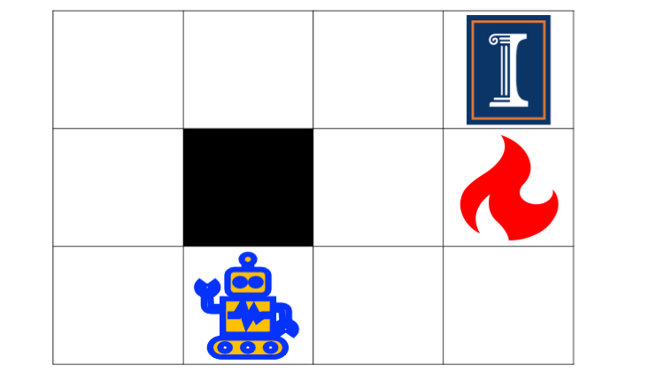
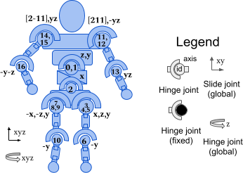
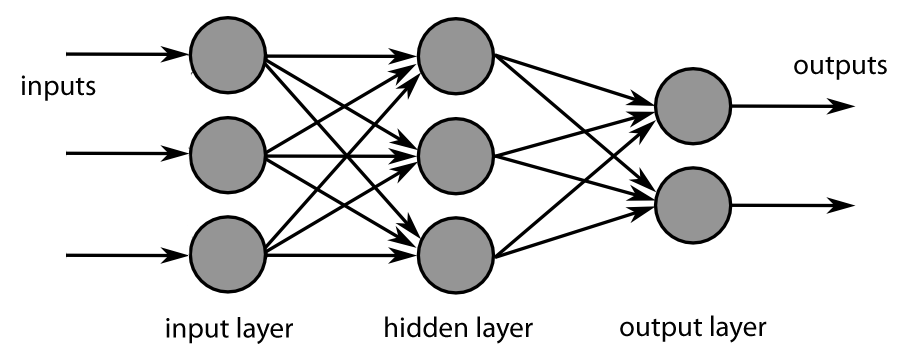

---
subtitle:    Introduction
feedback:
  deck-id:  'deeprl-intro'
...

# Who am I?

::: columns-3-7
{ width=200px  }

- Prof. Dr. Sebastian Peitz
- Chair of Safe Autonomous Systems
- JvF25, Room 124
- <https://sas.cs.tu-dortmund.de/>
:::

# The team

- Lecture: [Sebastian Peitz](https://sas.cs.tu-dortmund.de/sebastian-peitz)
- Exercise: [Konstantin Sonntag](https://sas.cs.tu-dortmund.de/team/)
- Additional [team](https://sas.cs.tu-dortmund.de/team/) members working on the exercises
  - Jannis Becktepe
  - Septimus Boshoff
  - Hans Harder
  - Christian Mugisho Zagabe
  - Stefan Weigand

------------------------------------------------------------------------------

# Contents of the Lecture

------------------------------------------------------------------------------

# Sequential decision making: Taking actions that affect our environment
::: columns-5-5

::: fragment
]](images/00-introduction/robot_pickplace.jpeg){ height=400px }
:::

::: small
::: fragment
## Option 1: Rule-based system
- manual design of actions, given some sensor input (such as a camera)
:::

::: fragment
## Option 2: Model-based control
- given some model of the dynamics, optimize for the best possible action to take
:::

::: fragment
## Option 3: Imitation learning
- collect data from experts and try to *clone the behavior*
:::

::: fragment
## Option 4: Reinforcement learning
- collect data in a *trial-and-error* fashion, improve via feedback
:::

:::
:::

# What is reinforcement learning?

::: columns-4-6
{ .embed width=600px }

::: platzhalter

::: fragment
## In words
:::

::: incremental
- An **agent** perceives the state $s$ of its environment.
- It takes an **action** $a$ according to a **policy** $\pi(a|s)$.
- The environment changes due to the action: $s \rightarrow s'$.
- The agent receives a **reward** $r$.
:::

::: fragment
## The goal 
find a policy that maximizes the **sum of future rewards**!
:::

:::
:::

# Reinforcement learning examples (1)

::: platzhalter

::: columns-3-7

<!-- ::: fragment -->
{ height=250px }
<!-- ::: -->

::: small
::: incremental
- **Environment**: The grid world
- **Agent**: The robot
- **State** $s$: The robot's position
- **Action** $a$: Move left / right / up / down
- **Dynamics** $p(s'|s,a)$: The robot's new position...
  - ...deterministically, if the robot does exactly what the action demands
  - ...stochastically, if there is some noise in the taken action
- **Reward**: $$r=\begin{cases} +1 & \text{if you reach the target field (top right)} \\ -1 & \text{if you hit the fire} \\ -0.1 & \text{otherwise} \end{cases}$$
- **Policy** $\pi$: The strategy according to which you move
:::
:::
:::
:::

# Reinforcement learning examples (2)

::: platzhalter

::: columns-2-5-3

<!-- ::: fragment -->
]](images/00-introduction/chess.gif){ height=300px }
<!-- ::: -->

::: small
::: incremental
- **Environment**: The chess board
- **Agent**: The chess player(s)
- **State** $s$: The board position
- **Action** $a$: Move one of your figures
- **Dynamics** $p(s'|s,a)$: The new board position...
  - ...after your own and your opponent's moves $\rightarrow$ your turn again
  - ...after your move; it's the other players turn $\rightarrow$ two-agent game
- **Reward**: $$r=\begin{cases} +1 & \text{if you take your opponent's king} \\ -1 & \text{if your king is taken} \\ 0 & \text{otherwise} \end{cases}$$
- **Policy** $\pi$: The strategy with which you play
:::
:::

::: fragment
![AlphaGo [@Silver2016go] [[Source](https://www.bbc.com/news/technology-35785875)]](images/00-introduction/alphago.jpg){ height=250px }
:::

:::
:::

# Reinforcement learning examples (3)

::: platzhalter

::: columns-3-7

<!-- ::: fragment -->
]](images/00-introduction/pendulum.gif){ height=250px }
<!-- ::: -->

::: small
::: incremental
- **Environment**: A pendulum under gravitational force
- **Agent**: The control system trying to perform a swing-up
- **State** $s$: $\sin$ and $\cos$ of the angle $\varphi$ (top: $\varphi=0$) and angular velocity $\omega = \frac{d\varphi}{dt}$
- **Action** $a$: the applied torque
- **Dynamics** $p(s'|s,a)$: a differential equation describing the dynamics (*Newtonian mechanics*) $\rightarrow$ deterministic system
- **Reward**: $r=-(\varphi^2 + 0.1 \cdot \omega^2 + 0.001 \cdot a^2)$
- **Policy** $\pi$: the torque realizing the swing-up
:::
:::
:::
:::

# Reinforcement learning examples (4)

::: platzhalter

::: columns-2-2-6

<!-- ::: fragment -->
]](images/00-introduction/humanoid.gif){ height=300px }
<!-- ::: -->

::: fragment
{ height=300px }
:::

::: small
::: incremental
- **Environment**: A robot moving on a planar ground
- **Agent**: The control system for actuating the robot
- **State** $s$: Positions and velocities of the components (45 in total)
- **Action** $a$: The torques applied to the 17 joints
- **Dynamics** $p(s'|s,a)$: a differential equation describing the dynamics (*Newtonian mechanics*) $\rightarrow$ deterministic system
- **Reward**: healthy reward + forward reward - control cost - contact cost
- **Policy** $\pi$: Run as far as you can!
:::
:::
:::
:::

# Reinforcement learning examples (5)

::: platzhalter

::: columns-2-2-6

<!-- ::: fragment -->
]](images/00-introduction/atari_donkeykong.gif){ height=400px }
<!-- ::: -->

::: fragment
]](images/00-introduction/atari_demon.gif){ height=400px }
:::

::: small
::: incremental
- **Environment**: Atari video games
- **Agent**: The "player"
- **State** $s$: the pixels of the screen
- **Action** $a$: the game pad (i.e., moving, firing, etc.)
- **Dynamics** $p(s'|s,a)$: the video game reacting to the player's actions
- **Reward**: achieving the game's goals (stay alive, reach a target, eliminate opponents, ...)
- **Policy** $\pi$: play such that you achieve your goal as best as possible
:::
:::
:::
:::

# Reinforcement learning in robotics

::: columns-2-2
]](images/00-introduction/atlas-gymnastics-boston-dynamics.gif){ height=400px }

]](images/00-introduction/openai-hand.gif){ height=400px }
::: 

# The key difference to supervised learning

::: columns-3-1

- **Supervised learning**: 
  - minimize error on a training dataset $\Dc=\{(x_1,y_1),\ldots,(x_K,y_k)\}$:
$$ \min_\theta \sum_{k=1}^{K} \norm{y_k - f_\theta(x_k)}_2^2 $$
  - data is generally drawn independently and identically distributed (i.i.d.):
$$ (x_k,y_k)\sim p(\Dc). $$

{ height=200px }
:::

::: fragment
::: columns-3-1
- **Reinforcement learning**:
  - no supervisor, just a *reward signal*
  - feedback is delayed, not instantaneous 
  - time really matters (sequential, non i.i.d. data)
  - agents actions affect the subsequent data it receives

![Reinforcement learning [@Sutton1998]](images/00-introduction/RL_SuttonBarto.png){ height=150px }
:::
:::

# The big questions

::: incremental
- How can we learn a good policy $\pi$ *from experience*?
- How can we address the *exploration-exploitation dilemma*?
- How do we use *deep learning* to address otherwise intractable problems?
- Which techniques can we use to facilitate *efficient and stable learning*?
- What are interesting *applications of RL*?
- What are the *open questions in RL research?*
:::

# Goal of the lecture

By the end of the course, we will

::: incremental
- understand the **theoretical basis** behind RL
- know the **landscape of RL algorithms** as well as their pros and cons
- be able to **implement RL algorithms** (using python)
- be capable to **critically assess** scientific papers as well as practical RL methods
- know how to tackle **real-world problems** using RL
:::

# Chapters

::: columns-6-4

::: platzhalter
- **Introduction**

::: fragment
- **Multi-armed bandits**
:::

::: fragment
- **Basics & tabular methods**
  - Markov Decision Processes (MDPs)
  - Dynamic Programming
  - Monte Carlo Methods
  - Temporal Difference Learning \& Q learning
:::

::: fragment
- **Deep-learning-based methods**
  - Brief introduction to deep learning
  - Deep Q learning
  - Actor-Critic algorithms
  - Advanced algorithms
:::

:::

::: platzhalter

::: fragment
- **Model-based control**
  - Planning & optimal control
  - Model-based RL
  - Exploration
:::

::: fragment
- **Advanced topics**
  - Offline RL
  - Transfer learning
  - Multi-agent RL
  - Behavior cloning
:::

:::

:::

------------------------------------------------------------------------------

# Organization

------------------------------------------------------------------------------

# Lectures \& Exercises

::: fragment
**Lectures**

- Tuesdays (10:15 - 11:45, OH16/205)
- Wednesdays (08:30 - 10:00, OH12/4.031)
:::

::: fragment
**Exercises**

- Thursdays (10:15 - 11:45, OH16/205)
- One exercise sheet per week
  - pen-and-paper exercises the cover and extend the theoretical content of the lecture
  - programming exercises (in Python) supporting the Studienleistung (next slide)
:::

# Studienleistung -- Programming tasks

::: incremental
- over the semester, we will publish four long-term programming tasks 
  - they cover 3-4 worth of content weeks
  - the programming exercises on the weekly exercise sheets cover parts of these programming tasks
  - to be accepted to the exam, **you need to pass at least 3/4**
- task evaluation
  - the tasks are pass/fail
  - we will take them into consideration in the final exam by dedicating several questions to your submissions
  - this way, they will account for $\approx \frac{1}{3}$ of your final grade
- usage of ChatGPT, Gemini, Claude, etc.
  - is allowed 😊
  - will hurt you in the exam if you don't know what you did 😢
:::

# Exam

**Format:**

- oral exam during the semester break (dates to be announced soon)
- 30 minutes per candidate

::: fragment
**Content:**

::: incremental
- all topics covered in the lectures
- all topics covered in the exercises
- in-depth questions regarding your submitted programming tasks regarding
  - your choices regarding modeling / implementation
  - your results
  - your usage (e.g. prompts) of LLMs, if applicable
  - your assessment of the results
:::
:::

# Literature

## Reinforcement learning
- [Reinforcement learning: an introduction](http://incompleteideas.net/book/RLbook2020.pdf) [@Sutton1998] 
- [David Silver's RL lecture](https://www.davidsilver.uk/teaching/) [@Silver2015RL]

## Mathematical basics
- Linear Algebra: [Stanford CS229 review material](https://cs229.stanford.edu/summer2020/cs229-linalg.pdf)
- Probability:
  - [Stanford CS229 review material](https://cs229.stanford.edu/section/cs229-prob.pdf)
  - [Introduction to Probability lecture notes](https://www.vfu.bg/en/e-Learning/Math--Bertsekas_Tsitsiklis_Introduction_to_probability.pdf) by Dimitri Bertsekas

## Programming
- Berkeley's CS285 pyTorch course ([Google Colab](https://colab.research.google.com/drive/12nQiv6aZHXNuCfAAuTjJenDWKQbIt2Mz))

# References

::: { #refs }
:::

