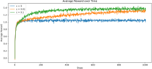
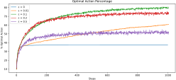
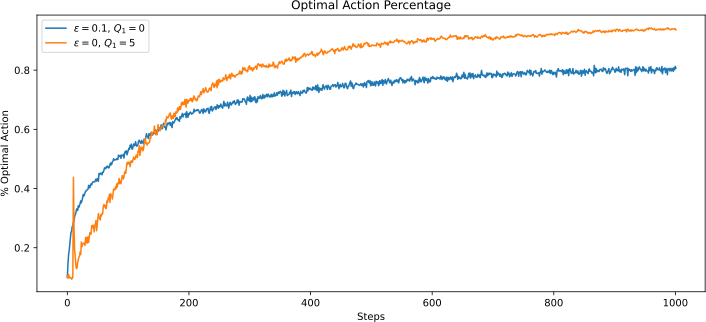

---
subtitle:    Multi-armed bandits
feedback:
  deck-id:  'deeprl-multi-armed-bandits'
...


# Example: Route planning (OH16 to Hansaplatz by car)

::: platzhalter

::: columns-7-3
 for the live version; do you get the same numbers?)](images/01-multi-armed-bandits/MapsDortmund.png){ width=900px }

::: small
::: incremental
- Let's assume we do not have access to travel time estimates
- Which route should I take to minimize my travel time?
- Let's say we can guess the time of one route fairly well
  - should we always take this one?
  - or try something else and see if we can get better?
- This is known as the **exploration-exploitation dilemma**
- The route pickig problem is one example of a **multi-armed bandit**
:::
:::

:::

:::
<!-- https://www.google.com/maps/dir/Otto-Hahn-Stra%C3%9Fe+16,+44227+Dortmund/Hansapl.,+44137+Dortmund-Innenstadt-West/@51.5005743,7.4251556,14z/data=!4m14!4m13!1m5!1m1!1s0x47b918ff9cf944b1:0x3f36034c67e5dc28!2m2!1d7.4051747!2d51.489565!1m5!1m1!1s0x47b919e1942e6f9d:0xbf57c39d87666683!2m2!1d7.4652885!2d51.512955!3e0?entry=ttu&g_ep=EgoyMDI2MDMwMi4wIKXMDSoASAFQAw%3D%3D -->

# Multi-armed bandits

::: columns-7-3

::: small
::: incremental
- Let us assume that we have a slot machine and we repeatedly can choose between $k$ different actions
- After each choice $a_t$ you receive a numerical reward $r_t$ chosen from a stationary probability distribution$^*$
- Objective: maximize the **expected total reward** over some time period (e.g., over 1000 action selections, or *time steps*)
- We refer to this as the **value**: $$ q(a) = \ExpC{r_t}{a_t=a} $$
- If we knew $q(a)$, then it would be easy to choose!
- Instead, we have to rely on estimates $Q_t(a)$ which we can iteratively update based on past experience
:::
:::

![A multi-armed bandit [@Ferreira2024mab]](images/01-multi-armed-bandits/multi-armed-bandit.png){ height=150px }
:::

::: footer
$^*$We will have a discussion on the notation and random variables in the next lecture (MDPs)
:::

# Action-value methods
::: small
::: incremental
- *action-value methods*: estimate the values of actions and then use these estimates to make action selection decisions
- What was the true value again? [$\rightarrow$ the **expected reward**]{.fragment} 
- What does that mean for a finite number of samples? 
[$\rightarrow$ we take the **mean** $$ Q_t(a) = \frac{\sum_{i=1}^{t-1} r_i \cdot \mathbb{1}_{a_i=a}}{\sum_{i=1}^{t-1} \mathbb{1}_{a_i=a}} $$]{.fragment} 
[Here, $\mathbb{1}_{x}$ denotes the random variable that is $1$ if the predicate $x$ is true and $0$ if $x$ is false.]{.fragment}
[(In other words, we're *counting* how often the action $a$ was taken)]{.fragment}
- For $\sum_{i=1}^{t-1} \mathbb{1}_{a_i=a}$ (we have never used the action $a$), we can choose a default value such as $Q_t(a) = 0$
- We call this the *sample-average method* [@Sutton1998]
:::

::: fragment
**Question**: How do we pick the action $a_t$? [$\Rightarrow$ just take the max!]{.fragment}
:::

::: fragment
$$a_t=\arg\max_a Q_t(a)$$
:::

::: fragment
(with ties broken arbitrarily)
:::

:::

# Example: The $k$-armed testbed

# The $k$-armed testbed
::: small
::: incremental
- Let's study a large number of randomly generated $k$-armed bandit problems (here: $k = 10$)
- For each bandit problem the action values $q(a)$, $a = 1, \ldots, 10$, are selected to a normal distribution: $$ q(a) \sim \Normal{0}{1} $$
- The corresponding reward is a random variable as well: $$ r_t \sim \Normal{q(a_t)}{1} $$
- One **run**: perform $T=1000$ steps. For each time step, report the average reward received until then.
- **Statistics**: repeat the above experiment $2000$ times
:::
:::

# The $k$-armed testbed: rewards

::: columns-3-6
::: platzhalter
<!-- ::: small -->
::: incremental
- First, we are going to follow a **greedy** strategy: pick the maximizing action *always*
- Then, we will compare against $\epsilon$ greedy: 
  - pick the maximizing action $1-\epsilon$ of the time
  - pick a random action $\epsilon$ of the time
:::
:::
<!-- ::: -->

{ .embed width=800px }

:::

::: fragment
::: columns-3-7

[a]{style="color: white;"}

What is $\epsilon$'s job? [$\Rightarrow$ the **exploration**]{.fragment}
:::
:::

# The $k$-armed testbed: optimal actions

{ .embed width=800px }

::: small
::: incremental
- Too little (or no) exploration is harmful
- Too much exploration is also harmful
- Should we think about a **schedule** in terms of the exploration?
:::
:::

# A simple bandit algorithm

``` python
# Initialization
for i in range(k):
  Q(a) = 0
  N(a) = 0

# Run forever
while(True):

  # exploration versus exploitation
  if rand() > epsilon:
    a = argmax(Q)        # exploitation
  else:
    a = randint(k)       # exploration

  r = bandit(a)

  # Error correction towards target r 
  N(a) = N(a) + 1
  Q(a) = Q(a) + (1/N(a)) * (r - Q(a))
```
Caption: A simple version of the $\epsilon$ greedy bandit

# Some next steps

# Computing $Q(a)$ on the fly 

::: small

Calculating $Q(a)$ anew every time appears to be expensive. [For a single action, consider that we have received a sequence of rewards $r_1,\ldots,r_{t-1}$ so far:]{.fragment}
[$$ Q_t = \frac{r_1 + r_2 + \ldots + r_{t-1}}{t-1}$$]{ .fragment }
[Wouldn't it be easier if we could just updated incrementally?]{ .fragment } [$\Rightarrow$ let's try]{ .fragment }

[$$
\begin{eqnarray*}
Q_{t+1} &=& \frac{1}{t}\sum_{i=1}^t r_i \fragment{=\frac{1}{t}\left(r_t + \sum_{i=1}^{t-1} r_i \right)} \fragment{= \frac{1}{t}\left(r_t + (t-1)\frac{1}{t-1} \sum_{i=1}^{t-1} r_i \right)}
\fragment{= \frac{1}{t}\left(r_t + (t-1)Q_t \right)}
  \fragment{= \frac{1}{t}\left(r_t + t Q_t - Q_t \right)}\\
  &=& Q_t + \frac{1}{t}\left(r_t - Q_t \right)
\end{eqnarray*}
$$]{ .math-incremental }

::: fragment
The expression *[ Target - OldEstimate ]* is an **error estimate**, used to steer us closer to the **target**
:::

::: fragment
We will see a formulae of the type $$ NewEstimate \leftarrow OldEstimate + StepSize \; [ Target - OldEstimate ] $$ frequently from now on!
:::

:::

# Non-stationary problems
::: small
::: incremental
- In reinforcement learning, problems are often *non-stationary*, meaning that processes change over time (e.g., due to updates of the **policy** $\pi$)
- Recent rewards should be more relevant than those longer in the past!
- Let's define some constant **step size** $\alpha\in(0,1]$
:::

[$$
\begin{eqnarray*}
Q_{t+1} = Q_t + \alpha [r_t - Q_t] &=&\alpha r_t + (1-\alpha) Q_t \\ 
&=& \alpha r_t + (1-\alpha) [\alpha r_{t-1} + (1-\alpha) Q_{t-1}] \fragment{= \alpha r_t + (1-\alpha) \alpha r_{t-1} + (1-\alpha)^2 Q_{t-1}} \\
&=& \alpha r_t + (1-\alpha) \alpha r_{t-1} + (1-\alpha)^2 \alpha r_{t-2} + \ldots + (1-\alpha)^t r_{1} \\
&=& (1-\alpha)^t r_{1} + \sum_{i=1}^t \alpha (1-\alpha)^{t-i}r_i
\end{eqnarray*}
$$]{ .math-incremental }

::: incremental
- This is called an *(exponential-recency) weighted average*, as $$(1-\alpha)^t + \sum_{i=1}^t \alpha (1-\alpha)^{t-i} = 1$$
- For time dependent weights $\alpha_t$, we require $\sum_{i=1}^\infty \alpha_t(a) = \infty$ and $\sum_{i=1}^\infty \alpha^2_t(a) <\infty$ to ensure convergence. Does this hold for $\alpha_t=\frac{1}{t}$ and $\alpha_t=\alpha$? [(Does it have to hold?)]{.fragment}
:::

:::

<!-- ::: footer
[For time dependent weights $\alpha_t$, we require $\sum_{i=1}^\infty \alpha_t(a) = \infty$ and $\sum_{i=1}^\infty \alpha^2_t(a) <\infty$ to ensure convergence. Does this hold for $\alpha_t=\frac{1}{t}$ and $\alpha_t=\alpha$?]{.fragment}
::: -->


# Bias in the selection of initial values
::: small
::: incremental
- All methods up to now are *biased* in the sense that they depend on the (arbitrarily selected) initial guesses $Q_1(a)$
- Can we use this to our advantage and increase exploration?
- Let us choose overly **optimistic initial values**!
- For $q(a) \sim \Normal{1}{0}$, an initial guess of $Q_1(a)$ is certainly unrealistically high.
:::
:::

::: fragment
{ .embed width=800px }
:::

# What we have not discussed

::: small
Two topics (and also many more) topics that we have not discussed:


::: incremental
- Bandits with **upper confidence bounds** (**UCCB**):
  - Along with the estimate for $Q_t$, we assign an upper confidence bound based on the number of times $N_t$ we have selected this action. 
  - The larger $N_t$, the more confident we are in our estimate.
  - We do not select our next action according to the maximal estimate of $Q_t$, but to $Q_t$ **plus** the confidence bound!
  - The less certain we are, the higher this bound will be $\Rightarrow$ improved exploration
- Gradient bandits:
  - We assign a **preference** for each bandit arm $a$ and introduce the probability $\pi_t(a)$ for choosing this arm.
  - We can then derive a gradient ascent scheme for the preferences.
:::
:::

::: footer
For details, see [@Sutton1998]
:::

# References

::: { #refs }
:::