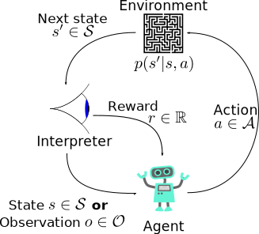

---
subtitle:    Markov Decision Processes
feedback:
  deck-id:  'deeprl-MDPs'
...

# What is reinforcement learning?

::: columns-4-6
{ .embed width=600px }

::: platzhalter

::: fragment
## In words
:::

::: incremental
- An **agent** perceives the state $s$ of its environment.
- It takes an **action** $a$ according to a **policy** $\pi(a|s)$.
- The environment changes due to the action: $s \rightarrow s'$.
- The agent receives a **reward** $r$.
:::

::: fragment
## The goal 
find a policy that maximizes the **sum of future rewards**!
:::

:::
:::

# Some remarks on stochasticity

All the pieces of our RL framework are generally subject to some ***randomness***

::: incremental
- the **policy** $\pi\agivenb{a}{s}$ is random (or, more precisely, a conditional probability)
  - given a state $s$, $\pi$ denotes the probabilities of all the actions $a$ we might take
  - if $\Ac$ is finite, then $\pi$ is a *distribution* over $\set{a_1,a_2,\ldots,a_{\abs{\Ac}}}$
  - if $\Ac$ is infinite (e.g., $a\in[0,1]$), then $\pi$ is the probability density function over $\Ac$
- the **state transition** $p\agivenb{s'}{s,a}$ is also random
- the **state observation** $o$ might be subject to noise
- the **reward** inherits this randomness, even if we were to define it deterministically
:::

::: fragment
$\Rightarrow$ we need to deal with ***random variables***
:::

# Random variables
> *Definition:* A **random variable** $X$ is a measurable function $X: \Omega \rightarrow E$ from a sample space $\Omega$ as a set of possible outcomes to a measurable space $E$ (i.e., we can assign a number to each outcome). 

::: fragment
> *Definition:* The **realization** $x$ is the value of $X(\omega)$ after a single experiment $\omega\in\Omega$.
:::

::: fragment
## Some examples
:::

::: columns-9-12

::: incremental
- we're rolling a single dice once
  - we have $\Omega = \set{1,2,3,4,5,6} = E$
  - $X$ means evaluating a dice roll
  - $\omega$ is the element from our sample space (e.g., we roll a $3$)
  - $x$ is the value tha we assign to this event (in this case, also a $3$)
:::

::: incremental
- we roll twice and want to report the maximum of these two rolls
  - $\Omega = \set{(1,1),(1,2),(1,3), \ldots,(6,4),(6,5),(6,6)}$
  - $E=\set{1,2,3,4,5,6}$
  - $\omega$ is the tuple of the two rolls (e.g., $(3,5)$)
  - $x=X(\omega)=5$ is the realization
:::

:::

# Random variables

We can now assign probability functions $p$ to random variables.
[$p(X=x)$ denotes the probability of the random variable $X$ having the realization $x$.]{.fragment} 

::: columns-5-5
::: platzhalter
::: fragment
**The max-of-two-rolls example**
:::

::: incremental
::: small
- $\Omega$ has 36 elements
- $p(X=1)=$[$\frac{1}{36}$]{.fragment} 
- $p(X=2)=$[$\frac{3}{36}$]{.fragment} 
- ...
- $p(X=6)=\frac{11}{36}$
:::
:::

::: fragment
In summary, we obtain a **probability distribution** over $X$, i.e., $p(X)$.
:::

::: fragment
$\Rightarrow$ *$X$ is distributed according to $p(X)$*: $$X\sim p(X).$$
:::

:::

::: platzhalter
::: fragment
**Simplified notation**
:::

::: fragment
- use $p(x)$ instead of $p(X=x)$
  - $p(1)=\frac{1}{36}$
  - ...
:::

::: fragment
*Note*: in the literature, people sometimes use $p(x)$ to also denote the probability distribution over all possible values of $x$!
:::

::: fragment
$\Rightarrow$ *$x$ is distributed according to $p$*: $$x\sim p \quad / \quad x\sim p(x).$$
:::

:::
:::

# The RL components in extensive notation
::: columns-3-7

![Reinforcement Learning framework [@Sutton1998]](images/RL_SuttonBarto.png){ height=250px }

::: platzhalter
In the literature, we often also find *capital letters* for state, action and reward to properly account for the probabilistic nature

::: incremental
- $p\agivenb{S_{t+1}=s'}{S_{t}=s, A_{t}=a}$ is the precise formulation for our short form $p\agivenb{s'}{s,a}$
- $\pi\agivenb{A_t=a}{S_t=s}$ is the precise formulation for our short form $\pi\agivenb{a}{s}$
<!-- - $V^\pi(s) = \ExpCsub{\sum_{k=0}^{\infty} \gamma^k R_{t+k+1} }{S_t=s}{\pi}$ -->
:::

:::
:::

# References

::: { #refs }
:::
