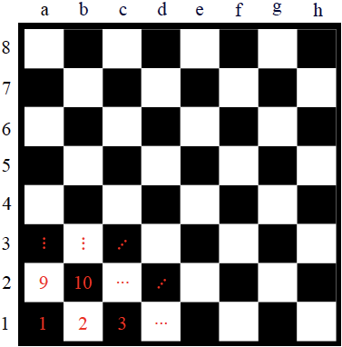
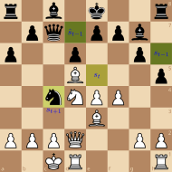
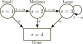
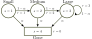
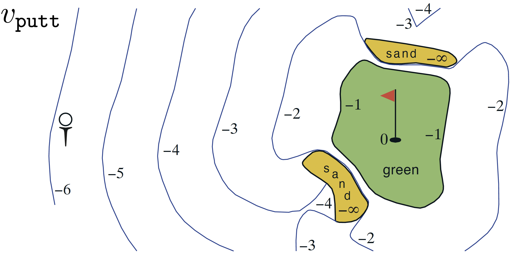
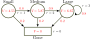
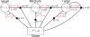

---
subtitle:    Markov Decision Processes
chapter:     2
feedback:
  deck-id:  'deeprl-MDPs'
...

# Content
- What is reinforcement learning?
- Some remarks on stochasticity
- What are MDPs?
- Finite Markov chains
- Finite Markov reward processes
  - Value function \& Bellman equation
- Markov decision processes
  - State-value functions and action-value functions
- Optimal policies and value functions

# What is reinforcement learning?

# 
::: columns-4-6
{ .embed width=600px }

::: platzhalter

::: fragment
## In words
:::

::: incremental
- An **agent** perceives the state $s$ of its environment.
- It takes an **action** $a$ according to a **policy** $\pi(a|s)$.
- The environment changes due to the action: $s \rightarrow s'$.
- The agent receives a **reward** $r$.
:::

::: fragment
## The goal 
find a policy that maximizes the **sum of future rewards**!
:::

:::
:::

# Some remarks on stochasticity

# Stochasticity in reinforcement learning

All the pieces of our RL framework are generally subject to some ***randomness***

::: incremental
- the **policy** $\pias$ is random (or, more precisely, a conditional probability)
  - given a state $s$, $\pi$ denotes the probabilities of all the actions $a$ we might take
  - if $\Ac$ is finite, then $\pi$ is a *distribution* over $\set{a_1,a_2,\ldots,a_{\abs{\Ac}}}$
  - if $\Ac$ is infinite (e.g., $a\in[0,1]$), then $\pi$ is the probability density function over $\Ac$
- the **state transition** $\psprimesa$ is also random
- the **state observation** $o$ might be subject to noise
- the **reward** inherits this randomness, even if we were to define it deterministically
:::

::: fragment
$\Rightarrow$ we need to deal with ***random variables***
:::

# Random variables

::: {.definition}
A **random variable** $X$ is a *measurable function* $X: \Omega \rightarrow E$ from a *sample space* $\Omega$ as a set of possible *outcomes* to a measurable space $E$ (i.e., we can assign a number to each outcome). 
:::

::: fragment
::: {.definition}
The **realization** $x$ is the value of $X(\omega)$ after a single experiment $\omega\in\Omega$.
:::
:::

::: fragment
## Some examples
:::

::: columns-9-12

::: incremental
- we're rolling a single dice once
  - we have $\Omega = \set{1,2,3,4,5,6} = E$
  - $X$ means evaluating a dice roll
  - $\omega$ is the element from our sample space (e.g., we roll a $3$)
  - $x$ is the value that we assign to this event (in this case, also a $3$)
:::

::: incremental
- we roll twice and want to report the maximum of these two rolls
  - $\Omega = \set{(1,1),(1,2),(1,3), \ldots,(6,4),(6,5),(6,6)}$
  - $E=\set{1,2,3,4,5,6}$
  - $\omega$ is the tuple of the two rolls (e.g., $(3,5)$)
  - $x=X(\omega)=5$ is the realization
:::

:::

# Random variables

We can now assign probability functions $p$ to random variables.
[$p(X=x)$ denotes the probability of the random variable $X$ having the realization $x$.]{.fragment} 

::: columns-5-5
::: platzhalter
::: fragment
**The max-of-two-rolls example**
:::

::: incremental
::: small
- $\Omega$ has 36 elements
- $p(X=1)=$[$\frac{1}{36}$]{.fragment} 
- $p(X=2)=$[$\frac{3}{36}$]{.fragment} 
- ...
- $p(X=6)=\frac{11}{36}$
:::
:::

::: fragment
In summary, we obtain a **probability distribution** over $X$, i.e., $p(X)$.
:::

::: fragment
$\Rightarrow$ *$X$ is distributed according to $p(X)$*: $$X\sim p(X).$$
:::

:::

::: platzhalter
::: fragment
**Simplified notation**
:::

::: fragment
- use $p(x)$ instead of $p(X=x)$
  - $p(1)=\frac{1}{36}$
  - ...
:::

::: fragment
*Note*: in the literature, people sometimes use $p(x)$ to also denote the probability distribution over all possible values of $x$!
:::

::: fragment
$\Rightarrow$ *$x$ is distributed according to $p$*: $$x\sim p \quad / \quad x\sim p(x).$$
:::

:::
:::

# Multi-armed bandit notation revisited
::: small
::: incremental
- Let us assume that we have a slot machine and we repeatedly can choose between $k$ different actions.
- After each choice $A_t$ you receive a numerical reward $R_t$ chosen from a stationary probability distribution.
- Objective: maximize the **value**: $$ Q(a) = \ExpC{R_t}{A_t=a} $$.
- We have to rely on estimates $Q_t(a)$ which we can iteratively update based on past experience.
:::
:::

# The RL components in extensive notation
::: columns-3-7

![Reinforcement Learning framework [@Sutton1998]](images/00-introduction/RL_SuttonBarto.png){ height=250px }

::: platzhalter
In the literature, we often also find *capital letters* for state, action and reward to properly account for the probabilistic nature

::: incremental
- $p\agivenb{S_{t+1}=s'}{S_{t}=s, A_{t}=a}$ is the precise formulation for our short form $\psprimesa$.
- $\pi\agivenb{A_t=a}{S_t=s}$ is the precise formulation for our short form $\pias$.
:::

:::
:::

------------------------------------------------------------------------------

# Markov Decision Processes (MDPs)

------------------------------------------------------------------------------

# What are MDPs?

::: incremental
- Markov decision processes (MDPs) are a *mathematically idealized form of RL problems*.
- They allow precise theoretical statements (e.g., on optimal solutions).
- Many real-world problems can be abstracted as MDPs.
:::

::: fragment
- In the following we’ll focus on:
  - *fully observable MDPs* (i.e., $s_t = o_t$) and
  - *finite MDPs* (i.e., finite number of states \& actions).
:::

\

::: fragment
|               | All states observable | Not all states are observable |
| :-----------: | :--------: | :------------: |
| No actions    | Markov chain     |     Hidden Markov model      |
| With actions  | Markov decision process (MDP)     | Partially observable MDP      |

Table: Classification of Markov models
:::

# Scalar and vectorial representation in finite MDPs

::: columns-7-3
<!-- ::: small -->
::: incremental
- The position of a chess piece can be represented in two ways:
  - Vectorial: $s = [s_h, s_v]^\top$, i.e., a two-element vector with horizontal and vertical information,
  - Scalar: simple enumeration of all available positions (e.g., $s = 3$).
- Both ways represent the same amount of information.
- **We will stick to the scalar representation of states and actions in finite MDPs.**
:::
<!-- ::: -->

{ width=400px }
:::

# Finite Markov chains

# Finite Markov chains

::: columns-8-3
::: platzhalter
::: {.definition}
A **finite Markov chain** is a tuple $(\Sc, p)$, where

- $\Sc$ is a finite set of discrete-time **states** $s_t\in\Sc$,
- $p\agivenb{s'}{s}$ is the **state transition probability**$^*$.

:::

::: fragment
This is a specific stochastic process.
:::

::: incremental
- It creates a **sequence of random variables** $s_t, s_{t+1}, \ldots$.
- It is **memoryless**: 
  - the next state only depends on the current state,
  - but it is *independent of past states*: $$p\agivenb{s_{t+1}}{s_t,s_{t-1},\ldots,s_0} = p\agivenb{s_{t+1}}{s_t}.$$
<!-- - In continuous time: **Markov process** (though this leads to inconsistencies with Markov decision/reard ``processes'') -->
:::
:::

:::fragment
{ .embed width=350px }
:::
:::

::: footer
$^*$ $p\agivenb{s'}{s}$ meaning $p\agivenb{S_{t+1}=s'}{S_t=s}$ in extended notation.
:::

# State transition matrix
::: {.definition}
Given a Markov state $s$ and its successor $s'$, the **state transition probability** $\forall \{s,s'\} \in \Sc\times\Sc$ is defined by the matrix
$$
  P=\begin{bmatrix} p_{1,1} & p_{1,2} & \dots & p_{1,n} \\ p_{2,1} & \ddots & \ddots & \vdots \\ \vdots & \ddots & \ddots & p_{n-1,n} \\ p_{n,1} & \dots & p_{n,n-1} & p_{n,n} \end{bmatrix}.
$$
:::

::: small
::: incremental
- Here, $p_{i,j}\in[0,1]$ is the probability to go from state $s=s_i$ to state $s'=s_j$.
- Which property does this matrix need to fulfill?
  [$$ \sum_{j=1}^n p_{i,j}=1 \quad \forall i\in\{1,\ldots,n\} \qquad \rightarrow \qquad \text{row stochastic matrix: we need to go \textit{somewhere}.}$$]{.fragment}
:::
:::

# Example of a Markov chain (1)

- At $s=1$ a small tree is planted ("starting point").
- A tree grows with probability $1-\alpha$.
- With probability $\alpha$, a natural hazard destroys the tree.
- If it reaches $s = 3$ (Large), its growth is limited.
- The state $s = 4$ is terminal ("infinite loop").

::: small

\

::: columns-5-7

::: fragment
{ .embed width=350px }
:::

::: platzhalter
::: fragment
$s\in\{1,2,3,4\}=\{\text{Small},\text{Medium},\text{Large},\text{Gone}\}$
:::

::: fragment
$$
  P = \fragment{\begin{bmatrix} 0 & 1-\alpha & 0 & \alpha \\ 0 & 0 & 1-\alpha & \alpha \\ 0 & 0 & 1-\alpha & \alpha \\ 0 & 0 & 0 & 1 \end{bmatrix}}
$$
:::
:::

:::
:::

::: footer
Source: [Oliver Wallscheid's RL course](https://github.com/upb-lea/reinforcement_learning_course_materials)
:::

# Example of a Markov chain (2)
{ width=500px }

Possible **samples** for the given Markov chain example starting at $s=1$ (small tree):

::: incremental
- Small $\rightarrow$ Gone
- Small $\rightarrow$ Medium $\rightarrow$ Gone
- Small $\rightarrow$ Medium $\rightarrow$ Large $\rightarrow$ Gone
- Small $\rightarrow$ Medium $\rightarrow$ Large $\rightarrow$ Large $\rightarrow$ $\ldots$
:::

------------------------------------------------------------------------------

# Finite Markov reward processes

------------------------------------------------------------------------------

# Finite Markov reward processes

::: {.definition}
A **finite Markov reward process** (**MRP**) is a tuple $(\Sc, p, \textcolor{red}{r}, \textcolor{red}{\gamma})$, where

- $\Sc$ is a finite set of discrete-time **states** $s_t\in\Sc$,
- $p\agivenb{s'}{s}$ is the state **transition probability**,
- [$r$ is a **reward function** (a random variable with realization $r_{t+1} \sim p\agivenb{r}{s_t}$),]{style="color: red;"}
- [$\gamma\in[0,1]$ is a **discount factor**.]{style="color: red;"}

:::

::: incremental
- Markov chain extended by rewards.
- Still an autonomous stochastic process, no inputs.
- The reward $r_{t+1}$ only depends on the state $s_t$.
:::

# Example of a finite Markov reward processes

{ width=500px }

\

::: incremental
- Growing larger trees is rewarded:
  - advantageous for the environment,
  - appreciated by hikers,
  - useful for wood production.
- Loosing a tree is unrewarded.
:::

::: footer
::: fragment
In this example, the reward is deterministic, but in general, it is a random variable
:::
:::

# Return

::: small
::: {.definition}
The **return** $g_t$ is the *discounted sum of future rewards*, starting from step $t$.

::: fragment
- For *episodic tasks* ($T<\infty$), this is the finite series $$ g_t = r_{t} + \gamma r_{t+1} + \gamma^2 r_{t+2} + \ldots  + \gamma^T r_{T+1}= \sum_{k=0}^T \gamma^k r_{t+k} .$$
:::

::: fragment
- For *continuing tasks*, we get $$ g_t = r_{t} + \gamma r_{t+1} + \gamma^2 r_{t+2} + \ldots = \sum_{k=0}^\infty \gamma^k r_{t+k} .$$
:::
:::

::: incremental
- The discount factor $\gamma$ represents the degree to which we value future rewards.
- For $\gamma=0$, only the immediate reward matters ($0^0=1$).
- For $T=\infty$, we need $\gamma < 1$. Why?
:::
:::

# Returns for the forest MRP

{ width=500px }

Exemplary samples for $g$ with $\gamma = 0.5$, starting with the planting ($s=1$):
[$$
\begin{align*}
s &= 1 \rightarrow 4, & g &= 0, \\
s &= 1 \rightarrow 2 \rightarrow 4, & g &= 0 + 0.5 \cdot 1 = 0.5, \\
s &= 1 \rightarrow 2 \rightarrow 3 \rightarrow 4, & g &= 0 + 0.5 \cdot 1 + 0.25 \cdot 2 = 1, \\
s &= 1 \rightarrow 2 \rightarrow 3 \rightarrow 3 \rightarrow 4, & g &= 0 + 0.5 \cdot 1 + 0.25 \cdot 2 + 0.125 \cdot 3 = 1.375.
\end{align*}
$$]{ .math-incremental }

# The Value function

::: {.definition}
The **state-value function** $V(s)$ (or simply **value function**) of an MRP is the expected return starting from state $s$ at time $t$: $$ V(s) = \ExpC{g_t}{s_t = s}. $$
:::

::: fragment
- Represents the expected long-term value of being in state $s$.
:::

::: fragment
{ width=500px }
:::

# The Bellman equation for MRPs (1)

::: fragment
*Challenge*: How to calculate all state values in closed form?
:::

::: fragment
*Solution*: The **Bellman equation**.
:::

[$$
\begin{align*}
V(s_t) &= \ExpC{g_t}{s_t} \\
       &= \ExpC{r_{t} + \gamma r_{t+1} + \gamma^2 r_{t+2} + \ldots}{s_t} \\
       &= \ExpC{r_{t} + \gamma \left(r_{t+1} + \gamma r_{t+1} + \ldots\right)}{s_t} \\
       &= \ExpC{r_{t} + \gamma g_{t+1}}{s_t} \\
       &= \ExpC{r_{t} + \gamma V(s_{t+1})}{s_t} \\
       &= \ExpC{r_{t}}{s_t} + \gamma\ExpC{V(s_{t+1})}{s_t}
\end{align*}
$$]{ .math-incremental }

# The Bellman equation for MRPs (2)

Assuming a known expected reward $\hat r$ for every state $s\in\Sc$,
$$ \hat r_\Sc = \begin{bmatrix} \ExpC{r}{s_1} & \ldots & \ExpC{r}{s_n} \end{bmatrix}^\top = \begin{bmatrix} \hat r_1 & \ldots & \hat r_n \end{bmatrix}^\top, $$

::: fragment
for a finite number of $n$ states states with unknown state values
$$ V_\Sc = \begin{bmatrix} V(s_1) & \ldots & V(s_n) \end{bmatrix}^\top = \begin{bmatrix} V_1 & \ldots & V_n \end{bmatrix}^\top, $$
:::

::: fragment
we can derive a linear equation system:
:::
[$$
\begin{align*}
V_\Sc &= \hat r_\Sc + \gamma P V_\Sc \\
\begin{bmatrix} V_1 \\ \vdots \\ V_n \end{bmatrix} &= \begin{bmatrix} \hat r_1 \\ \vdots \\ \hat r_n \end{bmatrix} + \gamma \begin{bmatrix} p_{1,1} & \ldots & p_{1,n} \\ \vdots & & \vdots \\ p_{n,1} & \ldots & p_{n,n}\end{bmatrix} \begin{bmatrix} V_1 \\ \vdots \\ V_n \end{bmatrix}
\end{align*}
$$]{ .math-incremental }

# Solving the Bellman equation

[$$
\begin{align*}
V_\Sc &= \hat r_\Sc + \gamma P V_\Sc \\
\Leftrightarrow \quad (I-\gamma P) V_\Sc &= \hat r_\Sc 
\end{align*}
$$]{ .math-incremental }

::: incremental
- Possible solutions:
  - direct inversion (Gaussian elimination, $\Oc(n^3)$),
  - matrix decomposition (QR, Choleskey, etc., $\Oc(n^3)$),
  - iterative solvers (e.g., Krylov methods, often better than $\Oc(n^3)$).
- Central challenges in RL: 
  - Knowledge of $P$?
  - Knowledge of $\hat r$?
  - Large dimensions!
:::

# Example: The value function for the forest MRP

Let's set the disaster probability to $\alpha = 0.2$ and the discount factor to $\gamma=0.8$.

::: columns-5-5
::: fragment
$$P = \begin{bmatrix} 0 & 0.8 & 0 & 0.2 \\ 0 & 0 & 0.8 & 0.2 \\ 0 & 0 & 0.8 & 0.2 \\ 0 & 0 & 0 & 1 \end{bmatrix}$$
:::

[$$
\begin{align*}
\hat r_1 &= 0.2 \cdot 0 + 0.8 \cdot 1 &= 0.8 \\
\hat r_2 &= 0.2 \cdot 0 + 0.8 \cdot 2 &= 1.6 \\
\hat r_3 &= 0.2 \cdot 0 + 0.8 \cdot 3 &= 2.4 \\
\hat r_4 &= 1 \cdot 0 &= 0 \\
\end{align*}
$$]{ .math-incremental }
:::

{ .embed width=500px }

------------------------------------------------------------------------------

# Markov decision processes

------------------------------------------------------------------------------

# Finite Markov decision processes
::: {.definition}
A **finite Markov decision process** (**MDP**) is a tuple $(\Sc, \textcolor{red}{\Ac}, p, r, \gamma)$, where

- $\Sc$ is a finite set of discrete-time **states** $s_t\in\Sc$,
- [$\Ac$ is a finite set of discrete-time **actions** $a_t\in\Ac$]{style="color: red;"},
- $\textcolor{red}{\psprimesa}$ is the **state transition probability**,
- $r$ is a **reward function** (a random variable with realization $\textcolor{red}{r_{t+1} \sim p\agivenb{r}{s_t,a_t}}$),
- $\gamma\in[0,1]$ is a **discount factor**.

:::

::: incremental
- Markov reward process extended by actions / decisions.
- Now, rewards also depend on action $a_t$.
:::

# Example of an MDP: Wood cutting

{ width=700px }

\

::: incremental
- Two actions possible in each state:
  - Wait $a = w$: let the tree grow.
  - Cut $a = c$: gather the wood.
- With increasing tree size the wood reward increases.
:::

# Policy (1)

::: {.definition}
In an MDP environment, a **policy** is a distribution over actions given states:
$$ \pi\agivenb{a_t}{s_t} = p\agivenb{a_t}{s_t}.^* $$

:::

::: columns-5-5
::: incremental
- In MDPs, policies depend only on the current state.
- A policy completely defines the agent’s behavior (which might be stochastic or deterministic).
:::

::: fragment
]](images/00-introduction/chess.gif){ height=300px }
:::
:::

::: footer
$^*$ In extended notation: $p\agivenb{A_t=a_t}{S_t=s_t}$.
:::

# Policy (2)

Given a finite MDP $⟨\Sc, \Ac, p, r, \gamma⟩$ and a policy $\pi$:

::: incremental
- The state sequence $s_t, s_{t+1}, \ldots$ is a *Markov chain* $\left(\Sc, p^\pi\right)$ since the state transition probability only depends on the state:
$$ p^\pi\agivenb{s'}{s} = \sum_{a\in\Ac} \pias \psprimesa $$
- Consequently, the sequence $(s_t,r_t),(s_{t+1},r_{t+1}),\ldots$ of states and rewards is a *Markov
reward process* $\left(\Sc, p^\pi, r^\pi, \gamma\right)$:
$$ r^\pi = \sum_{a\in\Ac} \pias p\agivenb{r}{s,a} $$
:::

# State-value functions and action-value functions of MDPs

::: {.definition}
The **state-value function** of an MDP is the expected return starting in $s$ following policy $\pi$:
$$\begin{equation}V^\pi(s) = \ExpCsub{g_t}{s_t=s}{\pi} = \ExpCsub{\sum_{k=0}^{\infty}\gamma^k r_{t+k}}{s_t=s}{\pi}.\label{eq:state-value-function}\end{equation}$$
:::

::: fragment
::: {.definition}
The **action-value function** of an MDP is the expected return starting in $s$, taking action $a$ and then following policy $\pi$:
$$\begin{equation}
Q^\pi(s,a) = \ExpCsub{g_t}{s_t=s, a_t=a}{\pi} = \ExpCsub{\sum_{k=0}^{\infty}\gamma^k r_{t+k}}{s_t=s,a_t=a}{\pi}.
\label{eq:action-value-function}\end{equation}$$
:::
:::

# Bellman expectation equation (1)

Analog to MRPs, the state value of an MDP can be decomposed into a Bellman notation:
$$ V^\pi(s_t) = \ExpCsub{r_{t+1}+\gamma V^\pi(s_{t+1})}{s_t}{\pi}. $$

::: fragment
In finite MDPs, the state value can be directly linked to the action value:
$$ V^\pi(s_t)\sum_{a\in\Ac} \pi\agivenb{a_t}{s_t} Q^\pi(s_t,a_t).$$
:::

# Bellman expectation equation (2)

Likewise, the action value of an MDP can be decomposed into a Bellman notation:
$$ Q^\pi(s_t, a_t) = \ExpCsub{r_{t}+\gamma Q^\pi(s_{t+1}, a_{t+1})}{s_t,a_t}{\pi}. $$

::: fragment
In finite MDPs, the action value can be directly linked to the state value:
$$\begin{equation} Q^\pi(s_t, a_t) = \Exp{p\agivenb{r}{s_t, a_t}} + \gamma \sum_{s_t\in\Sc} p\agivenb{s_{t+1}}{s_t} V^\pi(s_{t+1}). \label{eq:BellmanQ} \end{equation}$$
:::

# Bellman expectation equation \& forest tree example (1)
::: small
Let’s assume following very simple policy (’fifty-fifty’):
$$ \pi\agivenb{a=\text{cut}}{s} = 0.5, \qquad \pi\agivenb{a=\text{wait}}{s} = 0.5 \qquad \forall s\in\Sc. $$

::: fragment
Applied to the given environment behavior
[$$
\begin{align*}
p\agivenb{s'}{s,a=\text{cut}} &= \begin{bmatrix} 0 & 0 & 0 & 1 \\ 0 & 0 & 0 & 1 \\ 0 & 0 & 0 & 1 \\ 0 & 0 & 0 & 1 \end{bmatrix}, & \quad 
p\agivenb{s'}{s,a=\text{wait}} &= \begin{bmatrix} 0 & 1-\alpha & 0 & \alpha \\ 0 & 0 & 1-\alpha & \alpha \\ 0 & 0 & 1-\alpha & \alpha \\ 0 & 0 & 0 & 1 \end{bmatrix} \\
\hat r^{a=\text{cut}}&=\begin{bmatrix} 1 & 2 & 3 & 0 \end{bmatrix}^\top, & \qquad \hat r^{a=\text{wait}}&=\begin{bmatrix} 0 & 0 & 1 & 0 \end{bmatrix}^\top,
\end{align*}
$$]{ .math-incremental }
:::

::: fragment
We get
$$p^\pi\agivenb{s'}{s} = \begin{bmatrix} 0 & \frac{1-\alpha}{2} & 0 & \frac{1+\alpha}{2} \\ 0 & 0 & \frac{1-\alpha}{2} & \frac{1+\alpha}{2} \\ 0 & 0 & \frac{1-\alpha}{2} & \frac{1+\alpha}{2} \\ 0 & 0 & 0 & 1 \end{bmatrix}.$$
:::

:::

# Bellman expectation equation \& forest tree example (2)
{ width=900px }

- Discount factor: $\gamma = 0.8$
- Disaster probability: $\alpha = 0.2$

# Bellman expectation equation \& forest tree example (3)

Using the Bellman expectation from \eqref{eq:BellmanQ}, the action values can be calculated directly:
\ 

{ width=1000px }

------------------------------------------------------------------------------

# Optimal policies and value functions

------------------------------------------------------------------------------

# Optimal value functions in MDPs
::: {.definition}
The **optimal state-value function** of an MDP is the maximum state-value function over all policies:
$$
  V^*(s) = \max_\pi V^\pi(s) \qquad \forall s\in\Sc.
$$
:::

::: fragment

::: {.definition}
The **optimal state-action function** of an MDP is the maximum action-value function over all policies:
$$
  Q^*(s,a) = \max_\pi Q^\pi(s,a) \qquad \forall s\in\Sc, a\in\Ac(s).
$$
:::
:::

::: small
::: incremental
- They denote the best possible performance for a given MDP.
- A (finite) MDP can be easily solved in an optimal way if $Q^*(s,a)$ is known.
:::
:::

# Optimal policy for an MDP
Define a partial ordering over polices
$$\pi\geq\pi'\qquad \text{if} \qquad V^\pi(s) \geq V^{\pi'}(s)\quad\forall s\in\Sc.$$

::: small
::: fragment
::: {.definition}
### Theorem: Optimal policies in MDPs

For any finite MDP

::: incremental
- there exists an optimal policy $\pi^* \geq \pi$ that is better or equal to all other policies,
- all optimal policies achieve the same optimal state-value function $V^*(s)=V^{\pi^*}(s)$,
- all optimal policies achieve the same optimal action-value function $Q^*(s,a)=Q^{\pi^*}(s,a)$.
:::
:::
:::
:::

# Bellman optimality equation (1)

::: small
::: {.definition}
### Theorem: Bellman's principle of optimality [@Bellman1954]

An optimal policy has the property that whatever the initial state and initial decision are, the remaining decisions must constitute an optimal policy with regard to the state resulting from the first decision.
:::

::: incremental
- Any policy (i.e., also the optimal one) must satisfy the self-consistency condition given by the Bellman expectation equation.
- An optimal policy must deliver the maximum expected return being in a given state:
[$$
\begin{align*}
V^*(s_t) &= \max_a Q^{\pi^*}(s_t,a) \\
&= \max_a\ExpCsub{g_t}{s_t, a}{\pi^*} \\
&= \max_a\ExpCsub{r_{t} + \gamma g_{t+1}}{s_t, a}{\pi^*} \\
&= \max_a\ExpCsub{r_{t} + \gamma V^*(s_{t+1})}{s_t, a}{\pi^*}
\end{align*}
$$]{ .math-incremental }
- for a finite MDP:
$$
V^*(s_t) = \max_a \Exp{p\agivenb{r}{s_t,a}}‚ + \gamma \sum_{s_{t+1}\in\Sc} p\agivenb{s_{t+1}}{s_t,a} V^*(s_{t+1}).
$$
:::
:::

# Optimal police for wood cutting MDP: state value (1)

::: columns-7-3
::: small
Start with $V(s=4)$ and continue backwards
[$$
\begin{align*}
V^*(4) &= 0 \\
V^*(3) &= \max \begin{cases} 1 + \gamma \left[ (1-\alpha) V^*(3) + \alpha V^*(4) \right] \\ 3 + \gamma V^*(4) \end{cases} \\
&= \max \begin{cases} 1 + \gamma \left[ (1-\alpha) V^*(3)\right] \\ 3 \end{cases} \\
V^*(2) &= \max \begin{cases} 0 + \gamma \left[ (1-\alpha) V^*(3) + \alpha V^*(4) \right] \\ 2 + \gamma V^*(4) \end{cases} \\
&= \max \begin{cases} \gamma \left[ (1-\alpha) V^*(3) \right] \\ 2 \end{cases} \\
V^*(1) &= \max \begin{cases}\gamma \left[ (1-\alpha) V^*(2) \right] \\ 1 \end{cases} \\
\end{align*}
$$]{ .math-incremental }
:::

{ width=500px }

:::

# Optimal police for wood cutting MDP: state value (2)

- Possible solutions:
  - numerical optimization approach (e.g., simplex method, gradient descent,...)
  - manual case-by-case equation solving (dynamic programming, next lecture)

{ width=700px }

# Optimal police for wood cutting MDP: state value (3)

- Possible solutions:
  - numerical optimization approach (e.g., simplex method, gradient descent,...)
  - manual case-by-case equation solving (dynamic programming, next lecture)

{ width=700px }

# Challenges of direct calculation

::: incremental 
- Possible only for small action and state-space MDPs
  - "Solving" Backgammon with $\approx 10^20$ states?
- Another issue: total environment knowledge required
:::

::: fragment
## Central issues that RL addresses
:::

::: incremental
- Approximate solutions of complex decision problems.
- Learning of such approximations based on data retrieved from environment interactions $\dots$
  - $\dots$ potentially without any a priori model knowledge.
:::

# Summary / what we have learned

- Differentiate finite Markov process models with or w/o rewards and actions.
- Interpret such stochastic processes as simplified abstractions of real-world problems.
- Understand the importance of value functions to describe the agent’s performance.
- Formulate value-function equation systems by the Bellman principle.
- Recognize optimal policies.
- Set up nonlinear equation systems for retrieving optimal policies by the Bellman principle.
- Solve for different value functions in MRP/MDP by brute force optimization.

# References

::: { #refs }
:::
