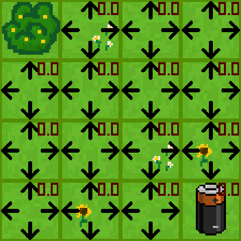
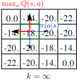
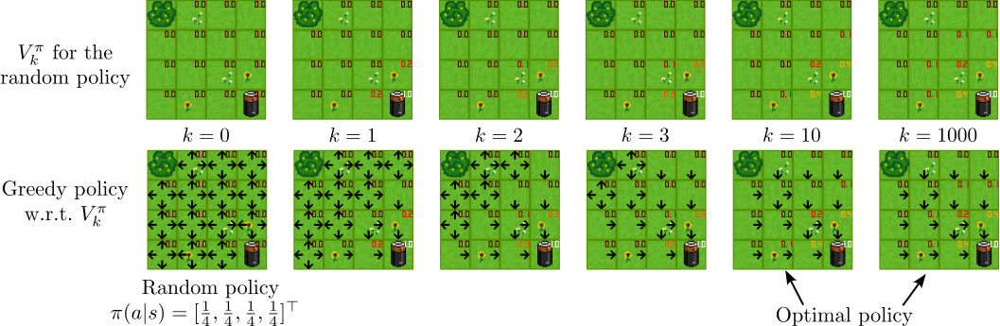
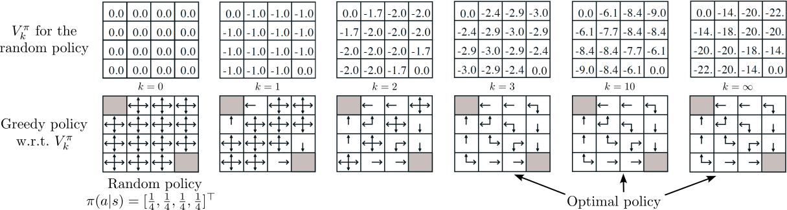

---
subtitle:    Dynamic Programming
chapter:     3
feedback:
  deck-id:  'deeprl-dynamic-programming'
...

# Content
- Policy evaluation
- Policy improvement
- Policy iteration
- Value iteration
- Asynchronous DP
- Generalized policy iteration

# What is Dynamic Programming (DP)?
::: {.definition}
**Dynamic Programming** (**DP**) refers to two central factors:

- *Dynamic*: a sequential or temporal problem structure
- *Programming*: mathematical optimization, i.e., an algorithmic / a numerical solution
:::

::: fragment
Further characteristics:
:::

::: incremental
- DP is a collection of algorithms to solve MDPs and neighboring problems.
  - We will **focus only on finite MDPs**.
  - In case of continuous action/state space: apply quantization.
- Use of value functions to organize and structure the search for an optimal policy.
- Breaks problems into subproblems and solves them.
:::

# Bellman's optimality principle (1)
We here consider finite state and action spaces $\Sc$ and $\Ac$. [In the last lecture, we have learned about the *return*, the *value function* and the *Bellman equation*]{.fragment}

::: fragment
$$
\begin{eqnarray}
g_t &=& r_{t+1} + \gamma r_{t+2} + \gamma^2 r_{t+3} + \ldots = \sum_{k=0}^\infty \gamma^k r_{t+k+1}, \notag \\
V^\pi(s_t) &=& \ExpCsub{g_t}{s_t}{\pi} = \ExpC{r_{t+1}}{s_t} + \gamma\ExpCsub{V(s_{t+1})}{s_t}{\pi}, \notag \\
V^\pi(s_t) &=& \ExpCsub{r_{t+1}+\gamma V^\pi(s_{t+1})}{s_t}{\pi}. \label{eq:BellmanV}
\end{eqnarray}
$$
:::

::: small
::: fragment
::: {.definition}
### Theorem: Bellman's principle of optimality [@Bellman1954]

An optimal policy has the property that whatever the initial state and initial decision are, the remaining decisions must constitute an optimal policy with regard to the state resulting from the first decision.
:::
:::

::: fragment
**In other/modern words**: "the tail of an optimal sequence is optimal for the tail subproblem" [@Bertsekas2019]
:::

:::

# Bellman's optimality principle (2)

From this, we derived the *Bellman optimality equation* [@Bellman1954]:
$$
\begin{align}
V^*(s) &= \max_{a\in\Ac} \ExpC{r_{t+1}+\gamma V^*(s_{t+1})}{s_t = s, a_t = a} \notag \\
 &= \max_{a\in\Ac} \sum_{s_{t+1}\in\Sc} p\agivenb{s_{t+1}}{s_t = s, a_t = a}\left[ r_{t+1} + \gamma V^*(s_{t+1}) \right].  \label{eq:BellmanVstar}
\end{align}
$$

::: fragment
Similarly, we can derive an optimal Q-function:
$$
\begin{align}
Q^*(s,a) &= \ExpC{r_{t+1}+\gamma \max_{a'\in\Ac} Q^*(s_{t+1}, a')}{s_t = s, a_t = a} \notag \\
 &= \sum_{s_{t+1}\in\Sc} p\agivenb{s_{t+1}}{s_t = s, a_t = a}\left[ r_{t+1} + \gamma \max_{a'\in\Ac} Q^*(s_{t+1}, a') \right].  \label{eq:BellmanQstar}
\end{align}
$$
:::

::: fragment
**Central idea of DP**: turn these equations into algorithmic assignments.
:::

# A DP example from production (1) [@Bertsekas2019]

::: small
::: columns-8-3
::: incremental
- to produce a certain product, four operations (denoted by $A$, $B$, $C$, and $D$) must be performed on a certain machine. 
- We assume that operation $B$ can be performed only after operation $A$ has been performed, and operation $D$ can be performed only after operation $C$ has been performed. *(Thus the sequence $CDAB$ is allowable but the sequence $CDBA$ is not.)*
- The setup cost $C_{mn}$ for passing from any operation $m$ to any other operation $n$ is given. 
- There is also an initial startup cost $S_A$ or $S_C$ for starting with operation $A$ or $C$, respectively. 
- The cost of a sequence is the sum of the setup costs associated with it; for example, the operation sequence $ACDB$ has cost $$S_A + C_{AC} +C_{CD}+C_{DB}.$$
:::

{ width=450px }

:::

::: fragment
**Question**: In this example, what is (in the context of RL)
:::

::: incremental
- the state $s$?
- the action $a$ (and action set $\Ac(s)$)?
:::

:::

# A DP example from production (2) [@Bertsekas2019]

::: small
::: columns-7-3
::: incremental
- According to the principle of optimality, the "tail" portion of an optimal schedule must be optimal. 
- For example, suppose that the optimal schedule is $CABD$. 
- Then, having scheduled first $C$ and then $A$, it must be optimal to complete the schedule with $BD$ rather than with $DB$. 
- With this in mind, we solve 
  - all possible tail subproblems of length two, 
  - then all tail subproblems of length three, 
  - and finally the original problem that has length four. 
  - *(Subproblems of length one are trivial because there is only one unscheduled operation.)*
:::

{ .embed width=450px }

:::
:::

------------------------------------------------------------------------------

# Policy evaluation

------------------------------------------------------------------------------

# The prediction problem

Let's start with the *prediction problem*: [For a given policy $\pi$, how do we compute $V^\pi$?]{.fragment}

::: fragment
Let's revisit \eqref{eq:BellmanV}:

$$
\begin{equation}
V^\pi(s) = \ExpCsub{r+\gamma V^\pi(s')}{s}{\pi} \fragment{= \sum_{a\in\Ac} \pias \sum_{s'\in\Sc} \psprimesa \left[ r + \gamma V^\pi(s') \right]} \label{eq:BellmanV2}
\end{equation}
$$
:::

::: incremental
- If the dynamics $p$ are known, \eqref{eq:BellmanV2} is a system of $\abs{S}$ linear equations in $\abs{S}$ unknowns (the $V^\pi(s)$, $s \in \Sc$) [$\Rightarrow$ Solution is straightforward, if tedious.]{.fragment}
- Iterative solution method: 
  - Consider a sequence of approximate value functions $V_0, V_1, V_2, \ldots$
  - Choose $V_0$ arbitrarily (except that the terminal state, if any, must be given value 0).
  - Each successive approximation is obtained by using the Bellman equation \eqref{eq:BellmanV2} as an update rule.
:::

::: footer
Existence and uniqueness of $V^\pi$ are guaranteed as long as either $\gamma < 1$ or eventual
termination is guaranteed from all states under the policy $\pi$.
:::

# Iterative policy evaluation

Use the Bellman equation \eqref{eq:BellmanV2} as an update rule:
$$\begin{equation}
V_{\textcolor{red}{k+1}}(s) = \ExpCsub{r+\gamma V_{\textcolor{red}{k}}(s')}{s}{\pi} = \sum_{a\in\Ac} \pias \sum_{s'\in\Sc} \psprimesa \left[ r + \gamma V_{\textcolor{red}{k}}(s') \right] \label{eq:IterativePolicyEvaluation}
\end{equation}$$

::: incremental
- $V_k = V^\pi$ is a fixed point for this update rule: \eqref{eq:IterativePolicyEvaluation} is satisfied for $V^\pi$. 
- The sequence $\set{V_k}$ converges to $V^\pi$ as $k\rightarrow\infty$ (under the same conditions guaranteeing existence of $V^\pi$). 
- This algorithm is called **iterative policy evaluation**:
  - For each state $s$, replace the old value of $s$ with a new value ...
  - ... obtained from the old values at the successor states $s'$ and the expected immediate rewards.
  - This is called an *expected update*.
- *Simplest implementation*: keep two copies of $V$ (i.e., $V_k$ and $V_{k+1}$), then sweep over $\Sc$.
:::

# In-place iterative policy evaluation

A more memory-efficient version (that tends to converge faster): [in-place updates!]{.fragment}

:::fragment
::: {.definition}
### Algorithm: In-place iterative policy evaluation for estimating $V\approx V^\pi$.

*Input*: policy $\pi$\
*Parameters*: a small threshold $\theta > 0$ determining accuracy of estimation

*Initialize*: $V(s)$ arbitrarily for $s \in \Sc$, $V(terminal) = 0$\
**while** (True):\
$\quad$ $\Delta=0$\
$\quad$ **for** $s \in \Sc$:\
$\quad\quad$ $V_{\mathsf{old}}(s) = V(s)$\
$\quad\quad$ $V(s) = \sum_{a\in\Ac} \pias \sum_{s'\in\Sc} \psprimesa \left[ r + \gamma V(s') \right]$\
$\quad\quad$ $\Delta = \max(\Delta, \abs{V_{\mathsf{old}}(s)-V(s)})$\
$\quad$ **if** $\Delta < \theta$ **then** break
:::
:::

# Example: Gridworld

::: small
::: columns-6-2-2
::: platzhalter
We have a small robot in a gridworld that wants to recharge.

[$\bullet$ Initial state $s_0$: a random valid field.]{ .fragment data-fragment-index=1 }\
[$\bullet$ Goal: reach the battery ($r=1$, otherwise $r=0$).]{ .fragment data-fragment-index=2 }\
[$\bullet$ $\Ac=\set{\uparrow, \downarrow, \leftarrow, \rightarrow}$ (*leaving* or *invalid field* $\Rightarrow$ no movement).]{ .fragment data-fragment-index=3 }\
[$\bullet$ $\pi\agivenb{\cdot}{s} = [0.25, 0.25, 0.25, 0.25]^\top ~\forall~ s\in\Sc$.]{ .fragment }\
[$\bullet$ Discount: $\gamma = 0.8$]{ .fragment }
:::

{ width=150px }

[
  { width=150px}
]{ .fragment data-fragment-index=3 }

:::

[$\bullet$ Terminal state: If the robot hits the battery, it receives $r=1$ (potentially discounted) and the episode ends.]{ .fragment }\
[$\bullet$ Optimal strategy: Move towards the battery as quickly as possible.]{ .fragment }

\

::: fragment
{ .embed }
:::
:::

<!-- # Example: $4\times 4$ gridworld [@Sutton1998]

::: columns-7-3
::: incremental
- All fields get $r=-1$, except for the terminal gray fields, where $r=0$.
- $\Ac=\set{\uparrow, \downarrow, \leftarrow, \rightarrow}$ ("leaving" $\Rightarrow$ no movement).
- $\pi\agivenb{\cdot}{s} = [0.25, 0.25, 0.25, 0.25]^\top \forall s\in\set{1,\ldots,14}$.
:::

{ width=400px }
:::

\

::: fragment
Value function for different iterates $k$:
{ .embed width=1280px }
::: -->

------------------------------------------------------------------------------

# Policy improvement

------------------------------------------------------------------------------

# Now that we can learn a policy, how do we improve it?

::: columns-8-2
::: platzhalter
::: incremental
- Assume that we have used the policy evaluation algorithm to estimate $V^\pi$.
- How can this help us for finding a better behavior?
- Choose the next action freely (that is, $a \neq \pi(s)$)
:::
:::fragment
$$\begin{align*}
Q^\pi(s,a) &= \ExpCsub{r + \gamma V^\pi(s')}{s,a}{\pi} \\ &= \sum_{s'\in\Sc} \psprimesa \left[r + \gamma V^\pi(s')\right] .
\end{align*}$$
:::
:::

{ .embed width=400 }
:::

:::fragment
$\Rightarrow$ If $Q^\pi(s,a)>V^\pi(s)$, then choosing $a$ over $\pi(s)$ in state $s$ yields a better policy.
:::
:::fragment
$\Rightarrow$ This is a special instance of the **policy improvement theorem**.
:::

::: footer
We're here using some arguments for deterministic policies (i.e., $a=\pi(s)$), but the arguments also hold in the probabilistic setting.
:::

# The policy improvement theorem
::: small
::: definition
**Theorem:** Let $\pi$ and $\pi'$ be any pair of deterministic policies such that, for all $s \in \Sc$,
$$
\sum_{a\in\Ac} \pi'\agivenb{a}{s} Q^\pi(s,a) \geq V^\pi(s).
$$
Then $V^{\pi'}(s) \geq V^\pi(s)$ for all $s \in \Sc$.
:::

::: fragment
**Proof:**
$$
\begin{equation}
V^\pi(s_t) \leq \sum_{a_t\in\Ac} \pi'\agivenb{a_t}{s_t} Q^\pi(s_t,a_t) \fragment{= \sum_{a_t\in\Ac} \pi'\agivenb{a_t}{s_t}\sum_{s_{t+1}\in\Sc} \pstplusstat \left[r_t + \gamma V^\pi(s_{t+1})\right] } \fragment{= \ExpCsub{r_t+\gamma V^\pi(s_{t+1})}{s_t}{\pi'}}\label{eq:policy_improvement_theorem_1}
\end{equation}
$$
:::

::: fragment
Since this holds for all $s\in\Sc$, we can apply the same procedure at $s_{t+1}$ $\Rightarrow$
$V^\pi(s_{t+1}) \leq \ExpCsub{r_{t+1}+\gamma V^\pi(s_{t+2})}{s_{t+1}}{\pi'}.$
:::

::: fragment
$$
\text{Substitute into \eqref{eq:policy_improvement_theorem_1}:}\qquad V^\pi(s_t) \leq \ExpCsub{r_t+\gamma \ExpCsub{r_{t+1}+\gamma V^\pi(s_{t+2})}{s_{t+1}}{\pi'}}{s_t}{\pi'}\qquad\qquad\qquad~~
$$
:::

::: fragment
Using the linearity of expectations and the law of total expectation ($\Exp{\ExpC{x}{y}} = \Exp{x}$):
$$
V^\pi(s_t) \leq \ExpCsub{r_t+\gamma r_{t+1}+\gamma^2 V^\pi(s_{t+2})}{s_t}{\pi'}.
$$
:::

::: fragment
$$
\text{Repeat infinitely often:}\qquad V^\pi(s_t) \leq \ExpCsub{r_t + \gamma r_{t+1} + \gamma^2 r_{t+2} + \gamma^3 r_{t+3} + \ldots}{s_t}{\pi'} \fragment{=V^{\pi'}(s_t) \qquad \square}
$$
:::

:::

# Greedy policy improvement
::: small
::: incremental
- Given a policy $\pi$ and its value function $V^\pi$, we can easily evaluate a change in the policy at a single state. 
- Natural extension: at each state, select the action that appears best according to $Q^\pi(s, a)$. 
- In other words, to consider the new **greedy policy** $\pi'$, given by
$$\pi'(s) = \arg\max_{a\in\Ac} Q^\pi(s, a) 
\fragment{= \arg\max_{a\in\Ac}\ExpCsub{r+\gamma V^\pi(s')}{s,a}{\pi}}
\fragment{= \arg\max_{a\in\Ac}\sum_{s'\in\Sc} \psprimesa \left[r + \gamma V^\pi(s')\right],} $$
[with ties broken arbitrarily.]{.fragment}
- Improving on a policy by making it greedy with respect to the value function $V^\pi$ is called **policy improvement**.
:::

[**When do we stop?**]{.fragment}

::: incremental
- Suppose $\pi'$ is as good as $\pi$, but not better. That is, $\pi'(s) = \pi(s)$ for all $s\in\Sc$.
- Then $\pi'$ satisfies the Bellman optimality condition \eqref{eq:BellmanVstar}:
[$$V^{\pi^\prime}(s) = \max_{a\in\Ac}\ExpCsub{r+\gamma V^{\pi^\prime}(s')}{s,a}{\pi}
\fragment{= \max_{a\in\Ac}\sum_{s'\in\Sc} \psprimesa \left[r + \gamma V^{\pi^\prime}(s')\right],} $$]{.fragment}
:::

::: fragment
::: definition
**Conclusion**: Policy improvement yields a strictly better policy, unless $\pi$ is already optimal!
:::
:::

:::

# Example: Gridworld 

{ .embed }

::: fragment
::: footer
**Note:** in the stochastic setting, each maximizing action can be given a non-zero probability in $\pias$. Any apportioning scheme is allowed as long as all submaximal actions are given zero probability.
:::
:::

<!-- # Example: $4\times 4$ gridworld [@Sutton1998]

{ .embed }

::: fragment
::: footer
**Note:** in the stochastic setting, each maximizing action can be given a non-zero probability in $\pias$. Any apportioning scheme is allowed as long as all submaximal actions are given zero probability.
:::
::: -->

------------------------------------------------------------------------------

# Policy and value iteration

------------------------------------------------------------------------------

# Policy iteration (1)

::: small
::: incremental
- Assume our policy $\pi$ has been improved using $V^\pi$ to yield a better policy $\pi'$ 
- We can compute $V^{\pi^\prime}$ and improve it again to yield an even better $\pi''$. 
- We thus obtain a sequence of monotonically improving policies and value functions:
[$$ \pi_0 \stackrel{E}{\longrightarrow} V^{\pi_0} \stackrel{I}{\longrightarrow} \pi_1 \stackrel{E}{\longrightarrow} V^{\pi_1} \ldots \stackrel{I}{\longrightarrow} \pi^* \stackrel{E}{\longrightarrow} V^*=V^{\pi^*}, $$
where $\stackrel{E}{\longrightarrow}$ denotes a policy evaluation and $\stackrel{I}{\longrightarrow}$ denotes a policy improvement.]{.fragment}
- Each policy is guaranteed to be a strict improvement over the previous one (unless it is already optimal). 
- Finite MDPs have a finite number of deterministic policies: convergence to $\pi^*$ and $V^*$ in a finite number of iterations.
:::

::: fragment
::: definition
This way of finding an optimal policy is called **policy iteration**.
:::
:::
:::

::: fragment
::: footer
**Note**: since each policy evaluation is itself an iterative computation, we start it with the value function for the previous policy. This typically results in a great increase in the speed of convergence of policy evaluation (presumably because the value
function changes little from one policy to the next).
:::
:::

# Policy iteration (2)
::: small
::: {.definition}
### Algorithm: Policy Iteration for estimating $\pi \approx \pi^*$.

::: incremental
1. **Initialization**: $V(s)\in\R$ and $\pi(s)\in\Ac$ arbitrarily for all $s\in\Sc$, $V(terminal) = 0$, small threshold $\theta > 0$\

<!-- ::: columns-5-5 -->
2. **Policy evaluation**:\
**while** (True):\
$\quad$ $\Delta = 0$\
$\quad$ **for** $s \in \Sc$:\
$\quad\quad$ $V_{\mathsf{old}} = V(s)$\
$\quad\quad$ $V(s) = \sum_{a\in\Ac} \pias \sum_{s'\in\Sc} \psprimesa \left[ r + \gamma V(s') \right]$\
$\quad\quad$ $\Delta = \max(\Delta, \abs{V_{\mathsf{old}}-V(s)})$\
$\quad$ **if** $\Delta < \theta$ **then** break

3. **Policy improvement**:\
$\mathsf{flag}_{\mathsf{stable}} = true$\
**for** $s \in \Sc$:\
$\quad$ $\pi_{\mathsf{old}}(s) = \pi(s)$\
$\quad$ $\pi(s) = \arg\max_{a\in\Ac}\sum_{s'\in\Sc} \psprimesa \left[r + \gamma V^\pi(s')\right]$\
$\quad$ **if** $\pi(s) \neq \pi_{\mathsf{old}}(s)$ **then** $\mathsf{flag}_{\mathsf{stable}} = false$\
**if** $\mathsf{flag}_{\mathsf{stable}} = true$ **then** return $V\approx V^*$ and $\pi \approx \pi^*$ **else** go back to **2. Policy evaluation**
:::
:::
:::

# Value iteration (1)

::: incremental
- What's the main drawback of policy iteration?\
[$\Rightarrow$ it's expensive to solve the policy evaluation loop in each iteration (nested loops!)]{.fragment}
- Do we have to wait until convergence of $V_k$ to $V^\pi$ every time?\
[$\Rightarrow$ the gridworld example suggested no!]{.fragment}
:::

::: fragment
{ width=900px }
:::

::: incremental
- **Value iteration**: truncate the policy evaluation after **one** step!
:::

# Value iteration (2)
::: small
Let's look at our earlier derivation of the policy evaluation procedure:

$$\begin{equation}
V_{k+1}(s) = \ExpCsub{r+\gamma V_{k}(s')}{s}{\textcolor{blue}{\pi}} = \textcolor{blue}{\sum_{a\in\Ac} \pias} \sum_{s'\in\Sc} \psprimesa \left[ r + \gamma V_{k}(s') \right] \tag{\ref{eq:IterativePolicyEvaluation}}
\end{equation}$$

::: fragment
Now, we change this to directly update the value function using the maximizing action (policy improvement step):
$$\begin{equation}
V_{k+1}(s) = \textcolor{red}{\max_{a\in\Ac}}\ExpC{r+\gamma V_{k}(s')}{s,a} = \textcolor{red}{\max_{a\in\Ac}}\sum_{s'\in\Sc} \psprimesa \left[ r + \gamma V_{k}(s') \right]
\end{equation}$$
:::

::: fragment
Let's compare this to the Bellman equation:
\begin{align}
V^*(s) = \max_{a\in\Ac} \ExpC{r+\gamma V^*(s')}{s,a} = \max_{a\in\Ac} \sum_{s'\in\Sc} \psprimesa\left[ r + \gamma V^*(s') \right].  \tag{\ref{eq:BellmanVstar}}
\end{align}
:::

[$\Rightarrow$ We have simply turned \eqref{eq:BellmanVstar} into an iterative procedure!]{.fragment}

[$\Rightarrow$ Value iteration can be shown to converge for arbitrary $V_0$]{.fragment}
:::

# Value iteration (3)
::: {.definition}
### Algorithm: Value iteration for estimating $\pi\approx \pi^*$.

*Parameters*: a small threshold $\theta > 0$ determining accuracy of estimation

*Initialize*: $V(s)$ arbitrarily for $s \in \Sc$, $V(terminal) = 0$\
**while** ($\Delta > \theta$):\
$\quad$ $\Delta=0$\
$\quad$ **for** $s \in \Sc$:\
$\quad\quad$ $V_{\mathsf{old}}(s) = V(s)$\
$\quad\quad$ $V(s) = \max_{a\in\Ac} \sum_{s'\in\Sc} \psprimesa \left[ r + \gamma V(s') \right]$\
$\quad\quad$ $\Delta = \max(\Delta, \abs{V_{\mathsf{old}}(s)-V(s)})$\
$\quad$ **if** $\Delta < \theta$ **then** break
:::

------------------------------------------------------------------------------

# Generalized policy iteration

------------------------------------------------------------------------------

# Generalized policy iteration (GPI)

::: small
::: incremental
- Almost all RL algorithms can be summarized under the GPI framework.
- Back-and-forth between two interacting processes:
  - making the value function consistent with the current policy (policy evaluation) $\Rightarrow$ $V^\pi$,  
  - greedy policy w.r.t. the current value function (policy improvement) $\Rightarrow$ $\pi = \text{greedy}(V)$.
- Convergence towards Bellman optimality
  - value function stabilizes when it's consistent with the current policy,
  - the policy stabilizes when it is greedy w.r.t. the current value function.
  - stabilization when a policy has been found that is greedy w.r.t. its own evaluation function.
:::
:::

::: fragment
![Generalized Policy Iteration (GPI) [@Sutton1998]](images/03-dynamic-programming/SuttonBarto_GPI.svg){ .embed width=800px }
:::

------------------------------------------------------------------------------

# Summary / what you have learned

------------------------------------------------------------------------------

# Summary / what you have learned

::: small
::: incremental
- **Dynamic Programming**
  - is a useful technique for solving decision making problems
  - is based on Bellman's optimality principle
  - is limited in problem size (**curse of dimensionality**)
- **Policy evaluation** \& **policy improvement** are iterative procedures to 
  - approximate the value function $V^\pi$ for a given policy $\pi$
  - make a greedy upgrade for the policy $\pi$ given a value function $V$
- **Policy iteration** alternates between policy evaluation and improvement to find an optimal policy $\pi^*$  
- **Value iteration** is an improved version where we intertwine policy evaluation \& improvement more closely
- **Generalized Policy Iteration** (**GPI**) 
  - is the general framework describing various versions of the above iterative process.
  - Almost all RL algorithms can be interpreted as versions of GPI.
:::
:::
# References

::: { #refs }
:::
