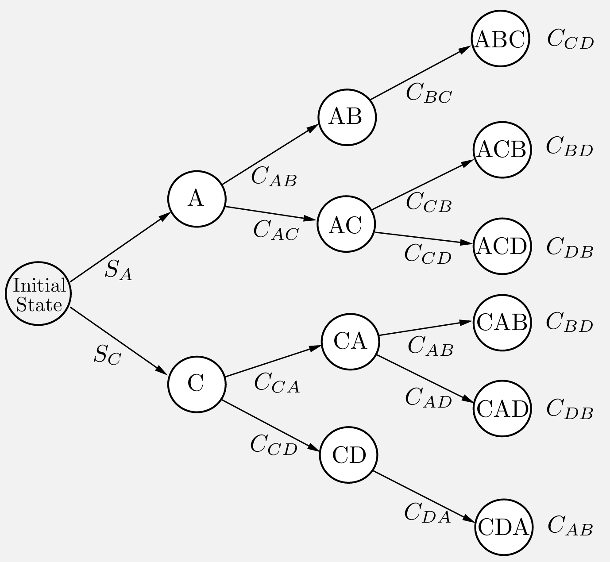
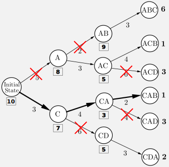
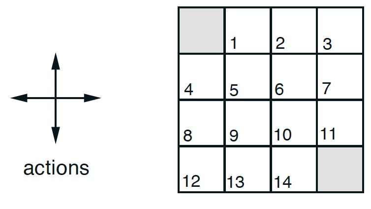
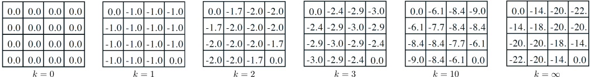

---
subtitle:    Dynamic Programming
feedback:
  deck-id:  'deeprl-dynamic-programming'
...

# Content
- Policy evaluation
- Policy improvement
- Policy iteration
- Value iteration
- Asynchronous DP
- Generalized policy iteration

# What is Dynamic Programming (DP)?
::: {.definition}
**Dynamic Programming** (**DP**) refers to two central factors:

- *Dynamic*: a sequential or temporal problem structure
- *Programming*: mathematical optimization, i.e., an algorithmic / a numerical solution
:::

::: fragment
Further characteristics:
:::

::: incremental
- DP is a collection of algorithms to solve MDPs and neighboring problems.
  - We will **focus only on finite MDPs**.
  - In case of continuous action/state space: apply quantization.
- Use of value functions to organize and structure the search for an optimal policy.
- Breaks problems into subproblems and solves them.
:::

# Bellman's optimality principle (1)
We here consider finite state and action spaces $\Sc$ and $\Ac$. [In the last lecture, we have learned about the *return*, the *value function* and the *Bellman equation*]{.fragment}

::: fragment
$$
\begin{eqnarray}
g_t &=& r_{t+1} + \gamma r_{t+2} + \gamma^2 r_{t+3} + \ldots = \sum_{k=0}^\infty \gamma^k r_{t+k+1}, \notag \\
V^\pi(s_t) &=& \ExpCsub{g_t}{s_t}{\pi} = \ExpC{r_{t+1}}{s_t} + \gamma\ExpCsub{V(s_{t+1})}{s_t}{\pi}, \notag \\
V^\pi(s_t) &=& \ExpCsub{r_{t+1}+\gamma V^\pi(s_{t+1})}{s_t}{\pi}. \label{eq:BellmannV}
\end{eqnarray}
$$
:::

::: small
::: fragment
::: {.definition}
### Theorem: Bellman's principle of optimality [@Bellman1954]

An optimal policy has the property that whatever the initial state and initial decision are, the remaining decisions must constitute an optimal policy with regard to the state resulting from the first decision.
:::
:::

::: fragment
**In other/modern words**: "the tail of an optimal sequence is optimal for the tail subproblem" [@Bertsekas2019]
:::

:::

# Bellman's optimality principle (2)

From this, we derived the *Bellman optimality equation* [@Bellman1954]:
$$
\begin{align}
V^*(s) &= \max_a \ExpC{r_{t+1}+\gamma V^*(s_{t+1})}{s_t = s, a_t = a} \notag \\
 &= \max_a \sum_{s_{t+1}\in\Sc} p\agivenb{s_{t+1}}{s_t = s, a_t = a}\left[ r_{t+1} + \gamma V^*(s_{t+1}) \right].  \label{eq:BellmanVstar}
\end{align}
$$

::: fragment
Similarly, we can derive an optimal Q-function:
$$
\begin{align}
Q^*(s,a) &= \ExpC{r_{t+1}+\gamma \max_{a'} Q^*(s_{t+1}, a')}{s_t = s, a_t = a} \notag \\
 &= \sum_{s_{t+1}\in\Sc} p\agivenb{s_{t+1}}{s_t = s, a_t = a}\left[ r_{t+1} + \gamma \max_{a'} Q^*(s_{t+1}, a') \right].  \label{eq:BellmanQstar}
\end{align}
$$
:::

::: fragment
**Central idea of DP**: turn these equations into algorithmic assignments.
:::

# A DP example from production (1) [@Bertsekas2019]

::: small
::: columns-8-3
::: incremental
- to produce a certain product, four operations (denoted by $A$, $B$, $C$, and $D$) must be performed on a certain machine. 
- We assume that operation $B$ can be performed only after operation $A$ has been performed, and operation $D$ can be performed only after operation $C$ has been performed. *(Thus the sequence $CDAB$ is allowable but the sequence $CDBA$ is not.)*
- The setup cost $C_{mn}$ for passing from any operation $m$ to any other operation $n$ is given. 
- There is also an initial startup cost $S_A$ or $S_C$ for starting with operation $A$ or $C$, respectively. 
- The cost of a sequence is the sum of the setup costs associated with it; for example, the operation sequence $ACDB$ has cost $$S_A + C_{AC} +C_{CD}+C_{DB}.$$
:::

{ width=450px }

:::

::: fragment
**Question**: In this example, what is (in the context of RL)
:::

::: incremental
- the state $s$?
- the action $a$ (and action set $\Ac(s)$)?
:::

:::

# A DP example from production (2) [@Bertsekas2019]

::: small
::: columns-7-3
::: incremental
- According to the principle of optimality, the "tail" portion of an optimal schedule must be optimal. 
- For example, suppose that the optimal schedule is $CABD$. 
- Then, having scheduled first $C$ and then $A$, it must be optimal to complete the schedule with $BD$ rather than with $DB$. 
- With this in mind, we solve 
  - all possible tail subproblems of length two, 
  - then all tail subproblems of length three, 
  - and finally the original problem that has length four. 
  - *(Subproblems of length one are trivial because there is only one unscheduled operation.)*
:::

{ .embed width=450px }

:::
:::

------------------------------------------------------------------------------

# Policy evaluation

------------------------------------------------------------------------------

# The prediction problem

Let's start with the *prediction problem*: [For a given policy $\pi$, how do we compute $V^\pi$?]{.fragment}

::: fragment
Let's revisit \eqref{eq:BellmannV}:

$$
\begin{equation}
V^\pi(s) = \ExpCsub{r+\gamma V^\pi(s')}{s}{\pi} \fragment{= \sum_{a\in\Ac} \pi\agivenb{a}{s} \sum_{s'\in\Sc} p\agivenb{s'}{s,a} \left[ r + \gamma V^\pi(s') \right]} \label{eq:BellmannV2}
\end{equation}
$$
:::

::: incremental
- If the dynamics $p$ are known, \eqref{eq:BellmannV2} is a system of $\abs{S}$ linear equations in $\abs{S}$ unknowns (the $V^\pi(s)$, $s \in \Sc$) [$\Rightarrow$ Solution is straightforward, if tedious.]{.fragment}
- Iterative solution method: 
  - Consider a sequence of approximate value functions $V_0, V_1, V_2, \ldots$
  - Choose $V_0$ arbitrarily (except that the terminal state, if any, must be given value 0).
  - Each successive approximation is obtained by using the Bellman equation \eqref{eq:BellmannV2} as an update rule.
:::

::: footer
Existence and uniqueness of $V^\pi$ are guaranteed as long as either $\gamma < 1$ or eventual
termination is guaranteed from all states under the policy $\pi$.
:::

# Iterative policy evaluation

Use the Bellman equation \eqref{eq:BellmannV2} as an update rule:
$$\begin{equation}
V_{\textcolor{red}{k+1}}(s) = \ExpCsub{r+\gamma V_{\textcolor{red}{k}}(s')}{s}{\pi} = \sum_{a\in\Ac} \pi\agivenb{a}{s} \sum_{s'\in\Sc} p\agivenb{s'}{s,a} \left[ r + \gamma V_{\textcolor{red}{k}}(s') \right] \label{eq:IterativePolicyEvaluation}
\end{equation}$$

::: incremental
- $V_k = V^\pi$ is a fixed point for this update rule: \eqref{eq:IterativePolicyEvaluation} is satisfied for $V^\pi$. 
- The sequence $\set{V_k}$ converges to $V^\pi$ as $k\rightarrow\infty$ (under the same conditions guaranteeing existence of $V^\pi$). 
- This algorithm is called **iterative policy evaluation**:
  - For each state $s$, replace the old value of $s$ with a new value ...
  - ... obtained from the old values at the successor states $s'$ and the expected immediate rewards.
  - This is called an *expected update*.
- *Simplest implementation*: keep two copies of $V$ (i.e., $V_k$ and $V_{k+1}$), then sweep over $\Sc$.
:::

# In-place iterative policy evaluation

A more memory-efficient version (that tends to converge faster): [in-place updates!]{.fragment}

:::fragment
::: {.definition}
### Algorithm: In-place iterative Policy Evaluation for estimating $V\approx V^\pi$

*Input*: policy $\pi$\
*Parameters*: a small threshold $\theta > 0$ determining accuracy of estimation

*Initialize*: $V(s)$ arbitrarily for $s \in \Sc$, $V(terminal) = 0$, $\Delta = \infty$\
While ($\Delta > \theta$):\
$\quad$ for $s \in \Sc$:\
$\quad\quad$ $v = V(s)$\
$\quad\quad$ $V(s) = \sum_{a\in\Ac} \pi\agivenb{a}{s} \sum_{s'\in\Sc} p\agivenb{s'}{s,a} \left[ r + \gamma V(s') \right]$\
$\quad\quad$ $\Delta = \max(\Delta, \abs{v-V(s)})$
:::
:::

# Example: $4\times 4$ gridworld [@Sutton1998]

::: columns-7-3
::: incremental
- All fields get $r=-1$, except for the terminal gray fields, where $r=0$.
- $\Ac=\set{\uparrow, \downarrow, \leftarrow, \rightarrow}$ ("leaving" $\Rightarrow$ no movement).
- $\pi\agivenb{\cdot}{s} = [0.25, 0.25, 0.25, 0.25]^\top \forall s\in\set{1,\ldots,14}$.
:::

{ width=400px }
:::

\

::: fragment
Value function for different iterates $k$:
{ .embed width=1280px }
:::

------------------------------------------------------------------------------

# Policy improvement

------------------------------------------------------------------------------

------------------------------------------------------------------------------

# Policy and value iteration

------------------------------------------------------------------------------

------------------------------------------------------------------------------

# Asynchronous DP

------------------------------------------------------------------------------

------------------------------------------------------------------------------

# Generalized policy iteration

------------------------------------------------------------------------------

# Summary / what you have learned

# References

::: { #refs }
:::
