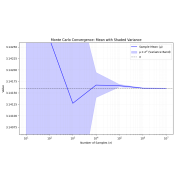
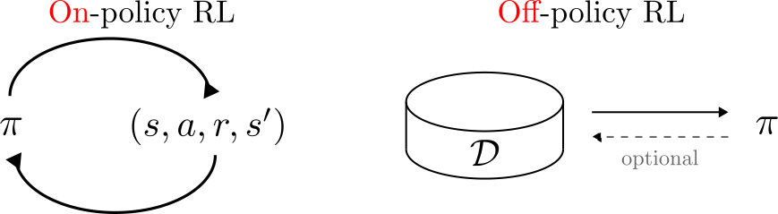

---
subtitle:    Monte Carlo Methods
chapter:     4
feedback:
  deck-id:  'deeprl-monte-carlo'
...

------------------------------------------------------------------------------

# Monte Carlo simulation

------------------------------------------------------------------------------

# What does *Monte Carlo sampling* mean?

)](images/04-Monte-Carlo/Monte_Carlo_Port.jpg){ width=500px }

::: small
::: incremental
- We're trying to estimate the expected value of function of a random variable $x=X(\omega)$:
$$\Exp{f(X)} = \sum_{\omega\in\Omega} p(x) f(x) \qquad / \qquad \Exp{f(X)} = \int_{\omega\in\Omega} p(x) f(x) \dx. $$
- Not knowing $f$ or the random variable $X$, we need to rely on *experience*.
- Monte Carlo sampling: Having no prior knowledge, we can estimate the expected value from repeated experiments.
- This lecture: **Let's use this for (episodic, i.e., $T<\infty$) RL when we don't know the MDP!**
:::
:::

# Example: Estimating the value for $\pi$

::: columns-7-4
::: platzhalter

::: small
::: incremental
- The area of a quarter circle with radius $r=1$: $$A=\frac{1}{4} \pi r^2 = \frac{\pi}{4}.$$
- Randomly and uniformly place points in the unit square: $$(x,y)\sim U([0,1]^2).$$
- Probability of landing **inside** the quarter circle is the ratio of the areas: $$ p(x^2+y^2\leq 1) = \frac{A}{1^2} = \frac{\pi}{4}.$$
- Monte Carlo estimate: $$\pi = 4 \cdot \Exp{p(x^2+y^2\leq 1)}.$$
:::
:::
:::

{ .embed width=500px }

:::

------------------------------------------------------------------------------

# Monte Carlo prediction

------------------------------------------------------------------------------

# Monte Carlo prediction

::: small
::: columns-5-6
::: platzhalter
We begin by learning $V^\pi$ for a
given policy $\pi$.

::: incremental
- Recall that $V^\pi(s)$ is the expected return (expected cumulative future discounted reward) starting from that state: 
$$ V(s) = \ExpC{g_t}{s_t = s}=\ExpC{ \sum_{k=0}^T \gamma^k r_{t+k}}{s_t = s} .$$
- Simple way to estimate from experience: average the returns observed after visits to a state $s$. 
- As more returns are observed, the average should converge to the expected value.
- Two different approaches:
  - First-visit MC: approximate the return only from the first visit to a state $s$.
  - Every-visit MC: calculate an update for the $V(s)$ estimate for every visit to a state $s$.
:::
:::

::: fragment
::: {.definition}
### Algorithm: First-visit MC prediction for estimating $V \approx V^\pi$.

**initialize**

- $V(s)$ arbitrarily for $s \in \Sc$
- $\ell(s)$: an empty list of returns for all $s \in \Sc$

**for** $j = 1, 2, \ldots, J$ episodes:\
$\quad$ $g = 0$\
$\quad$ Generate a sequence following $\pi$:
$$((s_0,a_0,r_0),(s_1,a_1,r_1),\ldots,(s_{T_j-1},a_{T_j-1},r_{T_j-1}))$$
$\quad$ **for** $t \in \{T_j-1,T_j-2,T_j-3,\ldots,0\}$:\
$\quad\quad$ $g = \gamma g+ r_t$\
$\quad\quad$ **if** $s_t \notin \{s_0,\ldots,s_{t-1}\}$: $\qquad$ ([*that's the first-visit condition*]{style="color: red;"})\
$\quad\quad\quad$ Append $g$ to $\ell(s_t)$\
$\quad\quad\quad$ $V(s_t) = \mathsf{average}(\ell(s_t))$
:::
:::
:::

::: {.definition .fragment}
**Convergence?** [Yes, for every state $s\in\Sc$ that is visited infinitely often ($\rightarrow$ exploration!)]{.fragment}
:::

:::

# Advantages of MC methods

::: incremental
1. We can learn from experience, even if we do not know the model
  - actual experience,
  - simulated experience, if we have a model (but do not necessarily know the transition probability $\psprimesa$).
2. The estimates for each state are independent of each other\
$\Rightarrow$ we are not bootstrapping, i.e., building estimates based on other estimates.
3. As a consequence, we can estimate parts of the value function that are of particular interest.
:::

# Example: Gridworld

TBD

------------------------------------------------------------------------------

# Monte Carlo estimation of action values

------------------------------------------------------------------------------

# Monte Carlo estimation of action values

::: small
Is a model available (i.e., the MDP $(\Sc, \Ac, p, r, \gamma)$ is known)?

::: incremental
- Yes $\Rightarrow$ state values plus one-step predictions deliver an optimal policy.
- No $\Rightarrow$ action values are very useful to directly obtain optimal policies.
:::

[**Estimating $Q^\pi(s,a)$ using MC**:]{.fragment}

::: incremental
- Analog to the MC prediction algorithm for $V^\pi(s)$.
- Small variation: A visit refers to a state-action pair $(s,a)$.
- First-visit and every-visit variants exist
:::

[**Possible challenges?**]{.fragment}

::: incremental
- Certain state-action pairs $(s,a)$ may never be visited.
- Missing degree of exploration (in particular for deterministic $\pi$).
- Workaraound: **exploring starts** $\Rightarrow$ start episodes in random state-action pairs $(s,a)$.
:::

:::

------------------------------------------------------------------------------

# Monte Carlo control

------------------------------------------------------------------------------

# Monte Carlo control (1)

::: small
::: columns-6-5
::: platzhalter
We learned about the Generalized policy iteration (GPI) in the last lecture.

[Let's use the same procedure here:
$$
\pi_0 \stackrel{E}{\longrightarrow} Q^{\pi_0} \stackrel{I}{\longrightarrow} \pi_1 \stackrel{E}{\longrightarrow} Q^{\pi_1} \ldots \stackrel{I}{\longrightarrow} \pi^* \stackrel{E}{\longrightarrow} Q^*=Q^{\pi^*}.
$$]{ .fragment data-fragment-index=1 }

[**Policy improvement**: Make the policy greedy w.r.t. the current value function:]{ .fragment data-fragment-index=2 }

[
Since we have the *action-value function* $Q$, we don't need a model to construct the policy:
$$ \pi(s) = \arg\max_{a\in\Ac} Q(s,a). $$
]{ .fragment data-fragment-index=3 }
:::

::: platzhalter
![GPI [@Sutton1998]](images/03-dynamic-programming/SuttonBarto_GPI.svg){ width=500px }

\ 

[
  ![GPI for MC control [@Sutton1998]](images/04-Monte-Carlo/SuttonBarto_GPI_Q.svg){ width=200px}
]{ .fragment data-fragment-index=3 }
:::
:::
:::

# Monte Carlo control (2)
::: small
Even if we're operating in an unknown MDP, the policy improvement theorem remains valid for MC-based control due to the underlying MDP structure:

::: definition
**Policy improvement theorem for MC-based control** 
[$$
\begin{align*}
  Q^{\pi_k}(s,\pi_{k+1}(s)) &= Q^{\pi_k}\left(s,\arg\max_{a\in\Ac} Q^{\pi_k}(s,a)\right) \\
  &=\max_{a\in\Ac} Q^{\pi_k}(s,a) \\
  &\geq Q^{\pi_k}(s,\pi_k(s)) \\
  &\geq V^{\pi_k}(s).
\end{align*}
$$]{.math-incremental}
:::

::: incremental
- **Policy improvement**: Construct the greedy policy $\pi_{k+1}(s)$ w.r.t. the current approximation $Q^{\pi_k}$
- **Assumptions required**:
  - The episodes have epxloring starts. $\qquad\qquad\qquad\qquad$ *(We will consider this later)*
  - We are training on an infinite number of episodes.
:::
:::

# Monte Carlo control (3)
::: small
::: columns-7-3
::: {.definition}
### Algorithm: Monte Carlo ES (Exploring Starts) for estimating $\pi \approx \pi^*$.

**initialize**

- $\pi(s)$ arbitrarily for $s \in \Sc$
- $Q(s,a)$ arbitrarily for $s \in \Sc$, $a\in\Ac$
- $\ell(s,a)$: an empty list of returns for all $s \in \Sc$, $a\in\Ac$

**for** $j = 1, 2, \ldots, J$ episodes *[(or until $\pi$ converges)]{style="color: red;"}*:\
$\quad$ $g = 0$\
$\quad$ Choose $s_0\in\Sc$ and $a_0\in\Ac$ randomly such that all pairs have probability $>0$\
$\quad$ Generate a sequence starting at $(s_0, a_0)$ and following $\pi$:
$$((s_0,a_0,r_0),(s_1,a_1,r_1),\ldots,(s_{T_j-1},a_{T_j-1},r_{T_j-1}))$$
$\quad$ **for** $t \in \{T_j-1,T_j-2,T_j-3,\ldots,0\}$:\
$\quad\quad$ $g = \gamma g+ r_t$\
$\quad\quad$ **if** $(s_t,a_t) \notin \{(s_0,a_0),\ldots,(s_{t-1},a_{t-1})\}$:\
$\quad\quad\quad$ Append $g$ to $\ell(s_t)$\
$\quad\quad\quad$ $Q(s_t,a_t) = \mathsf{average}(\ell(s_t,a_t))$\
$\quad\quad\quad$ $\pi(s_t) = \arg\max_{a\in\Ac}Q(s_t, a)$
:::

::: incremental
- It is clear that this algorithm cannot converge to a suboptimal policy
- Stability is only achieved when both $\pi$ and $Q$ are optimal
:::
:::
:::

# Incremental implementation
::: small
::: incremental
- The previous algorithm (as well as all other before where we have used averaging) is computationally inefficient!
- Instead, it is better to update the estimate for $Q$ (or $V$) incrementally.
- The sample mean $\mu_1, \mu_2, \ldots$ of an arbitrary sequence $g_1, g_2, \ldots$ is:
$$
\mu_J = \frac{1}{J}\sum_{j=1}^J g_j \fragment{= \frac{1}{J} \left[g_J + \sum_{j=1}^{J-1} g_j\right]} \fragment{= \frac{1}{J} \left[g_J + (J-1)\mu_{J-1}\right]} \fragment{= \mu_{J-1} + \frac{1}{J} \left[g_J -\mu_{J-1}\right].}
$$
- In terms of the averaging function from the algorithm before, this means that we can update $Q(s_t,a_t)$ incrementally (with $n(s_t,a_t)$ being the number of occurrences of the tuple $(s_t,a_t)$):
$$
Q(s_t,a_t) = \mathsf{average}(\ell(s_t,a_t)) \qquad\Rightarrow\qquad Q(s_t,a_t) = Q(s_t,a_t) + \frac{1}{n(s_t,a_t)} \left[g - Q(s_t,a_t)\right].
$$
:::
:::

::: fragment
::: footer
:bulb: if a problem is **non-stationary**, we can use a step size $\alpha\in(0,1]$ as in the multi-armed bandit setting: 
$Q(s_t,a_t) = Q(s_t,a_t) + \alpha \left[g - Q(s_t,a_t)\right]$.
:::
:::

# Monte Carlo control (4) -- incremental implementation
::: small
::: {.definition}
### Algorithm: Monte Carlo ES (Exploring Starts) for estimating $\pi \approx \pi^*$.

**initialize**

- $\pi(s)$ arbitrarily for $s \in \Sc$
- $Q(s,a)$ arbitrarily for $s \in \Sc$, $a\in\Ac$
- [$n(s,a)=0 ~ \forall ~ s \in \Sc$, $a\in\Ac$: a list of state-action visits]{style="color: red;"} $\qquad$(~~an empty list of returns $\ell$~~)

**for** $j = 1, 2, \ldots, J$ episodes *(or until $\pi$ converges)*:\
$\quad$ $g = 0$\
$\quad$ Choose $s_0\in\Sc$ and $a_0\in\Ac$ randomly such that all pairs have probability $>0$\
$\quad$ Generate a sequence starting at $(s_0, a_0)$ and following $\pi$:
$$((s_0,a_0,r_0),(s_1,a_1,r_1),\ldots,(s_{T_j-1},a_{T_j-1},r_{T_j-1}))$$
$\quad$ **for** $t \in \{T_j-1,T_j-2,T_j-3,\ldots,0\}$:\
$\quad\quad$ $g = \gamma g + r_t$\
$\quad\quad$ **if** $(s_t,a_t) \notin \{(s_0,a_0),\ldots,(s_{t-1},a_{t-1})\}$:\
$\quad\quad\quad$ [$n(s_t) = n(s_t) + 1$]{style="color: red;"} $\qquad\qquad\qquad\qquad\qquad\qquad\qquad$ (~~appending $g$ to the list of returns~~)\
$\quad\quad\quad$ [$Q(s_t,a_t) = Q(s_t,a_t) + \frac{1}{n(s_t,a_t)} \left[g - Q(s_t,a_t)\right]$]{style="color: red;"}$\qquad\quad$ (~~averaging over the list of returns \ell~~)\
$\quad\quad\quad$ $\pi(s_t) = \arg\max_{a\in\Ac}Q(s_t, a)$
:::
:::

# Example: Gridworld

TBD

------------------------------------------------------------------------------

# On-policy and off-policy learning

------------------------------------------------------------------------------

# On-policy versus off-policy (1)

::: small
::: columns-5-5
::: platzhalter
**On-Policy: "Learning by Doing"**

::: incremental
- The agent only learns from what it's currently doing.
- It evaluates and improves the exact same policy it is using to make decisions.
- For example,
  - if it is being cautious, it learns how to improve cautious behavior.
  - if it tries something risky and fails, it learns from that failure but can't easily "imagine" what would have happened if it had taken a different action earlier.
:::
:::

::: platzhalter
[**Off-Policy: "Learning by Observing"**]{.fragment}

::: incremental
- is more like a student watching an expert or looking at a variety of different actors once. 
- It can follow one path (the "behavior policy") while learning the best possible path (the "target policy").
- It separates "how I am acting" from "what I am learning."
- Benefit: It can learn from old data, from human demonstrations, or by watching other agents.
:::
:::
:::

\

[**Question**: Which class does the *Monte Carlo ES* algorithm belong to?]{.fragment}

[**Answer**: It is on-policy!]{.fragment}
[Each time we update our policy (the counter $j$ for the episodes), we collect the returns anew, following the current policy $\pi$.]{.fragment}

:::

::: fragment
::: footer
We will cover the topic on-policy versus off-policy in more detail later in this course.
:::
:::

# On-policy versus off-policy (2)
::: small

::: fragment
{ .embed width=800px }
:::

\

|  Feature | On-policy | Off-policy |
| :------- | :-------- | :--------- | 
| Learning Source |	Learns from its current actions only.	| Can learn from any data (past, random, or expert). |
| Exploration	| Often more stable but can get stuck in "safe" habits.	| More aggressive at finding the absolute best strategy. |
| Efficiency|	Lower. Throws away data once the policy changes.| Higher. Can "re-use" old experiences (Experience Replay). |

Table: Key differences at a glance:
:::

# $\epsilon$-greedy as an on-policy alternative (1)

::: small
**Motivating question**: How do we get rid of the restrictive (and often not achievable) requirement of *exploring starts (ES)*?

::: incremental
- We need to make sure that we visit all state-action pairs, irrespective of where we start!
- Exploration requirement: $$ \pias > 0 \quad \forall s\in\Sc,a\in\Ac. $$
- Policies of this type are called **soft**.
- The level of exploration should be tunable during the learning process.
:::

[**Where have we seen something like this before?**]{.fragment}
[$\Rightarrow$ In the multi-armed bandits lecture!]{.fragment}

::: fragment
::: definition
**$\epsilon$-greedy on-policy learning**

::: incremental
- With probability $\epsilon$, the agent’s choice (i.e., the policy output) is overwritten by a random action.
- Probability of all non-greedy actions: $\frac{\epsilon}{\abs{\Ac}}$.
- Probability of the greedy action: $1 - \epsilon + \frac{\epsilon}{\abs{\Ac}}$.
:::

:::
:::
:::

# $\epsilon$-greedy as an on-policy alternative (2)
::: small
::: {.definition}
### Algorithm: $\epsilon$-greedy on-policy first-visit MC control.

<!-- **parameter:** small $\epsilon>0$  -->

**initialize**

- $\pi(s)$ arbitrarily for $s \in \Sc$
- $Q(s,a)$ arbitrarily for $s \in \Sc$, $a\in\Ac$
- $n(s,a)=0 ~ \forall ~ s \in \Sc$, $a\in\Ac$: a list of state-action visits

**for** $j = 1, 2, \ldots, J$ episodes *(or until $\pi$ converges)*:\
$\quad$ $g = 0$\
$\quad$ Choose $s_0\in\Sc$ and $a_0\in\Ac$ randomly such that all pairs have probability $>0$\
$\quad$ Generate a sequence $\set{(s_t,a_t,r_t)}_{t=1}^{T_j}$ starting at $(s_0, a_0)$ and following $\pi$\
$\quad$ **for** $t \in \{T_j-1,T_j-2,T_j-3,\ldots,0\}$:\
$\quad\quad$ $g = \gamma g + r_t$\
$\quad\quad$ **if** $(s_t,a_t) \notin \{(s_0,a_0),\ldots,(s_{t-1},a_{t-1})\}$:\
$\quad\quad\quad$ $n(s_t) = n(s_t) + 1$\
$\quad\quad\quad$ $Q(s_t,a_t) = Q(s_t,a_t) + \frac{1}{n(s_t,a_t)} \left[g - Q(s_t,a_t)\right]$\
$\quad\quad\quad$ [$\tilde a = \arg\max_{a\in\Ac}Q(s_t, a)$]{style="color: red;"}\
$\quad\quad\quad$ [$\pi\agivenb{a}{s_t} = \begin{cases} 1-\epsilon+\epsilon/\abs{\Ac}, & a = \tilde{a} \\ \epsilon/\abs{\Ac}, & a \neq \tilde{a} \end{cases}$]{style="color: red;"}
:::
:::

# $\epsilon$-greedy policy improvement

::: small
::: definition
### Theorem: Policy improvement for $\epsilon$-greedy policies

Given an MDP, an $\epsilon$-greedy policy $\pi'$ w.r.t. $Q^\pi$ is an improvemnt over the $\epsilon$-soft policy $\pi$, i.e., $V^{\pi^\prime} > V^\pi$ for all $s\in\Sc$.
:::

**Small proof**:
[$$
\begin{align*}
V^{\pi^\prime}(s)=Q^\pi(s,\pi'(s)) &= \sum_{a\in\Ac} \pi'\agivenb{a}{s} Q^\pi(s,a) \\
&= \frac{\epsilon}{\abs{\Ac}}\left(\sum_{a\in\Ac} Q^\pi(s,a)\right) + (1-\epsilon) \max_{a\in\Ac} Q^\pi(s,a)\\
&\geq \frac{\epsilon}{\abs{\Ac}}\left(\sum_{a\in\Ac} Q^\pi(s,a)\right) + (1-\epsilon) \left( \sum_{a\in\Ac} \frac{\pias-\frac{\epsilon}{\abs{\Ac}}}{1-\epsilon} Q^\pi(s,a)\right)\\
\textit{(Last term: weighted }&\text{average over all actions. It thus has to be smaller than the max operation.)}\\
&=\frac{\epsilon}{\abs{\Ac}}\left(\sum_{a\in\Ac} Q^\pi(s,a)\right) - \frac{\epsilon}{\abs{\Ac}}\left(\sum_{a\in\Ac} Q^\pi(s,a)\right) + \sum_{a\in\Ac} \pias Q^\pi(s,a)\\
&= V^\pi(s).
\end{align*}
$$]{.math-incremental}

:::

# Example: Gridworld

TBD

------------------------------------------------------------------------------

# Off-policy Monte Carlo control

------------------------------------------------------------------------------

# Off-policy learning background

::: small
All learning control methods face a dilemma: 

::: incremental
- They seek to learn action values conditional on subsequent optimal behavior, 
- but they need to behave non-optimally in order to explore all actions. 
- The previous $\epsilon$-greedy approaches were only a compromise: learning action values for *near-optimal* policies.
:::

\

::: fragment
**The off-policy learning idea:**
:::

::: incremental
- Use two policies: 
  - **Behavior policy** $b\agivenb{a}{s}$: exploratory, used to generate behavior.
  - **Target policy** $\pias$: learns from that experience to become the optimal policy.
- Use cases:
  - Learn from observing humans or other agents/controllers.
  - Re-use experience generated from old policies ($\pi_0,\pi_1,\ldots$).
  - Learn about multiple policies while following one policy.
:::

:::

# Off-policy prediction problem statement

::: small
::: definition
### MC off-policy prediction problem statement.

- Both policies are considered fixed (that's the *prediction* assumption).
- Estimate $V^\pi$ or $Q^\pi$ while following $b\agivenb{a}{s}$.
:::

\

::: fragment
**Requirement:**
:::

::: incremental
- **Coverage**: every action taken under $\pi$ must be (at least occasionally) taken under $b$ as well.
$$ \pias > 0 \quad\Rightarrow\quad b\agivenb{a}{s}>0 \qquad \forall s\in\Sc, a\in\Ac. $$
- Consequence:
  - In any state where $b\neq \pi$, $b$ has to be a stochastic policy.
  - Nevertheless, $\pi$ may be either stochastic or deterministic.
:::
:::

# Importance sampling (1)
::: small
::: definition
### Example

::: columns-8-3
::: incremental
- We’re trying to calculate the average height of people in a city, but only have access to a guest list for a professional basketball convention. 
- Taking the average of this sample will likely lead to a too large value.
- Importance sampling: mathematical *correction* to use data from one distribution to estimate properties of another distribution.
:::

{ width=250px }
:::
:::

::: fragment
**The central concept**: re-weighting
:::

::: incremental
- We want to know the expected value under a target distribution $\pi(s)$, but only have samples from another distribution $b(s)$.
- We calculate the **importance weight**:
$$w = \frac{\pi(s)}{b(s)}$$
- If a sample is common in $\pi$ but rare in $b$, we give it a high weight (it is *important*).
- If a sample is rare in $\pi$ but common in $b$, we give it a low weight.
:::

[**Caveat:** if $\rho$ is large (distinctly different policies) the estimate’s variance is large (i.e., *uncertain* for small numbers of samples).]{.fragment}
:::

# Importance sampling (2)
::: small
Given a starting state $s_t$, the probability of the subsequent state–action trajectory $(a_t, s_{t+1},a_{t+1}, \ldots ,s_T)$ under a policy $\pi$ is
[$$
\begin{align*}
p\agivenb{a_t, s_{t+1},a_{t+1}, \ldots ,s_T}{s_t,\pi} &= \pi\agivenb{a_t}{s_t}p\agivenb{s_{t+1}}{s_t,a_t}\fragment{\pi\agivenb{a_{t+1}}{s_{t+1}}p\agivenb{s_{t+2}}{s_{t+1},a_{t+1}}}\fragment{\ldots p\agivenb{s_{T}}{s_{T-1},a_{T-1}}}\\
&= \prod_{k=t}^{T-1} \pi\agivenb{a_k}{s_k}p\agivenb{s_{k+1}}{s_{k},a_{k}}.
\end{align*}
$$]{.math-incremental}

::: fragment
::: definition
### Importance sampling ratio
The relative probability of a trajectory under the target and behavior policy, the importance sampling ratio, from sample step $k$ to $T$ is
$$
\rho_{k:T} = \frac{\prod_{k=t}^{T-1} \pi\agivenb{a_k}{s_k}p\agivenb{s_{k+1}}{s_{k},a_{k}}}{\prod_{k=t}^{T-1} b\agivenb{a_k}{s_k}p\agivenb{s_{k+1}}{s_{k},a_{k}}} 
\fragment{= \frac{\prod_{k=t}^{T-1} \pi\agivenb{a_k}{s_k}\cancel{p\agivenb{s_{k+1}}{s_{k},a_{k}}}}{\prod_{k=t}^{T-1} b\agivenb{a_k}{s_k}\cancel{p\agivenb{s_{k+1}}{s_{k},a_{k}}}}}
\fragment{= \frac{\prod_{k=t}^{T-1} \pi\agivenb{a_k}{s_k}}{\prod_{k=t}^{T-1} b\agivenb{a_k}{s_k}}.}
$$
:::
:::

::: fragment
:bulb: Although the trajectory probabilities depend on the MDP’s transition probabilities $p$ (which are generally unknown), the importance sampling ratio ends up depending only on the two policies and the sequence, not on the MDP.
:::
:::

# Importance sampling for MC prediction

::: small
::: incremental
- We wish to estimate the expected returns $g_t$ under the target policy $\pi$, but we only have $g_t$ due to the behavior policy $b$. 
- These returns have the wrong expectation: $$\ExpC{g_t}{s_t=s} = V^b(s).$$ 
- Importance sampling: $$\ExpC{\rho_{k:T}\, g_t}{s_t=s} = V^\pi(s).$$
:::

::: fragment
::: definition
### OIS: State-value estimation via Monte Carlo ordinary importance sampling

Estimating the state value $V^\pi$ following a behavior policy $b$ using **ordinary importance sampling** (**OIS**) results in scaling and averaging the sampled returns by the importance sampling ratio per episode:
$$ 
\begin{equation}
V^\pi(s) = \frac{\sum_{t\in\mathcal{T}(s)}\rho_{k:T(t)}\, g_t}{\abs{\mathcal{T}(s)}}. \tag{OIS} \label{eq:OIS}
\end{equation}
$$
*Here $\mathcal{T}(s)$ is the set of all time steps in which $s$ is visited, and $T(t) is the termination of the episode starting at $t$.*
:::
:::

:::

# Weighted importance sampling

::: small
::: incremental
- OIS can be shown to be unbiased [@Sutton1998], meaning that the expectation of \eqref{eq:OIS} is always $V^\pi$.
- On the other hand, it can be extreme.
:::

::: fragment
::: definition
### WIS: State-value estimation via Monte Carlo importance sampling

Estimating the state value $V^\pi$ following $b$ using **weighted importance sampling** (**WIS**) results in a slightly different scaling:
$$ 
\begin{equation}
V^\pi(s) = \frac{\sum_{t\in\mathcal{T}(s)}\rho_{k:T(t)}\, g_t}{\sum_{t\in\mathcal{T}(s)}\rho_{k:T(t)}}. \tag{WIS} \label{eq:WIS}
\end{equation}
$$
:::
:::

::: fragment 
Main differences between the two (first-visit) versions:
:::

::: incremental
- Bias:
  - \eqref{eq:OIS} is unbiased.
  - \eqref{eq:WIS} is biased (though it converges asymptotically to zero). 
- Variance:
  - The variance of \eqref{eq:OIS} is in general unbounded (the variance of the ratios can be unbounded). 
  - For \eqref{eq:WIS}, the largest weight on any single return is one. 
  - Assuming bounded returns, the variance of \eqref{eq:WIS} converges to zero even if the variance of the ratios themselves is infinite [@Precup2001]
  - In practice, \eqref{eq:WIS} has dramatically lower variance and is strongly preferred.
:::
:::

# WIS: incremental implementation
::: small 
If we want to perform weighted importance sampling in an in an incremental fashion, we need to keep track of all the weights in \eqref{eq:WIS}. [Let's do this exemplary for the value function $V_j$ at iteration $j$:]{.fragment}
[$$ 
V_j = \frac{\sum_{t=1}^{n} w_t g_t}{\sum_{t=1}^{n} w_t}, \qquad \text{where}\quad w_t=\rho_{k:T(t)}. 
$$]{.fragment}
[In addition to keeping track of $V_j$, we must maintain for each state the cumulative sum $c_j$ of the weights given
to the first $j$$ returns.]{.fragment} [The update rule for $V_j$ is then:]{.fragment}
[$$ 
V_{j+1} = V_j + \frac{w_j}{c_j}\left[g_j - V_j\right] \qquad \fragment{\text{and} \qquad c_{j+1} = c_j + w_{j+1},} 
$$]{.fragment}
[with $c_0=0$.]{.fragment}

:::

# Off-policy Monte Carlo control (1)

::: small
::: columns-7-4
::: definition
### Algorithm: Off-policy MC prediction (policy evaluation) for $Q\approx Q^*$.

**initialize** (for all $s \in \Sc$, $a\in\Ac$)

- $Q(s,a)$ arbitrarily
- $c(s,a)=0$

**for** $j = 1, 2, \ldots, J$ episodes *(or until $\pi$ converges)*:\
$\quad$ $g = 0$, $w=1$\
$\quad$ Generate $\set{(s_t,a_t,r_t)}_{t=0}^{T_j}$ following a *soft policy* $b$\
$\quad$ **for** $t \in \{T_j-1,T_j-2,T_j-3,\ldots,0\}$:\
$\quad\quad$ $g = \gamma g + r_t$\
$\quad\quad$ $c(s_t,a_t) = c(s_t,a_t) + w$\
$\quad\quad$ $Q(s_t,a_t) = Q(s_t,a_t) + \frac{w}{c(s_t,a_t)} \left[g - Q(s_t,a_t)\right]$\
$\quad\quad$ $w = w \frac{\pi\agivenb{a_t}{s_t}}{b\agivenb{a_t}{s_t}}$
:::

::: platzhalter
[**Variation**: On-policy]{.fragment}

::: incremental
- $b=\pi$ .
- $\frac{\pi\agivenb{a_t}{s_t}}{b\agivenb{a_t}{s_t}}=1$.
- $w=1$.
- $c(s,a)$ becomves the counter for the number of visits (i.e., $n(s,a)$).
:::
:::

:::
:::

# Off-policy Monte Carlo control (2)

::: small
We now have our final algorithm that includes everything we have learned so far

::: definition
### Algorithm: Off-policy MC control for estimating $Q\approx Q^*$ and $\pi\approx\pi^*$.

**initialize** (for all $s \in \Sc$, $a\in\Ac$)

- $Q(s,a)$ arbitrarily
- $c(s,a)=0$
- $\pi(s)=\arg\max_{a\in\Ac}Q(s,a)$ (with ties broken consistently)

**for** $j = 1, 2, \ldots, J$ episodes *(or until $\pi$ converges)*:\
$\quad$ $g = 0$, $w=1$\
$\quad$ Generate $\set{(s_t,a_t,r_t)}_{t=0}^{T_j}$ following a *soft policy* $b$\
$\quad$ **for** $t \in \{T_j-1,T_j-2,T_j-3,\ldots,0\}$:\
$\quad\quad$ $g = \gamma g + r_t$\
$\quad\quad$ $c(s_t,a_t) = c(s_t,a_t) + w$\
$\quad\quad$ $Q(s_t,a_t) = Q(s_t,a_t) + \frac{w}{c(s_t,a_t)} \left[g - Q(s_t,a_t)\right]$\
$\quad\quad$ $\pi(s_t) = \arg\max_{a\in\Ac}Q(s_t,a)$ (with ties broken consistently)\
$\quad\quad$ **if** $\pi(s_t)\neq a_t$:\
$\quad\quad\quad$ Exit inner loop and proceed to next episode\
$\quad\quad$ $w = w \frac{1}{b\agivenb{a_t}{s_t}}$
:::
:::

------------------------------------------------------------------------------

# Summary / what you have learned

------------------------------------------------------------------------------

# Summary / what you have learned

::: small
::: incremental
- MC methods allow **model-free learning of value functions and optimal policies** from experience (i.e., sampled episodes).
- Using full episodes, MC is largely **based on averaging returns**.
- MC-based control **reuses generalized policy iteration (GPI)**, i.e., mixing policy evaluation and improvement.
- Maintaining **sufficient exploration is important**:
  - *Exploring starts*: not feasible in all applications but simple.
  - *On-policy $\epsilon$-greedy learning*: trade-off between exploitation and exploration cannot be resolved easily.
  - *Off-policy learning*: agent learns about a (possibly deterministic) target policy from an exploratory, soft behavior policy.
- **Importance sampling** transforms expectations from the behavior to the target policy.
  - This estimation task comes with a bias-variance-dilemma.
  - Slow learning can result from ineffective experience usage in MC methods.
:::

:::

# References

::: { #refs }
:::
