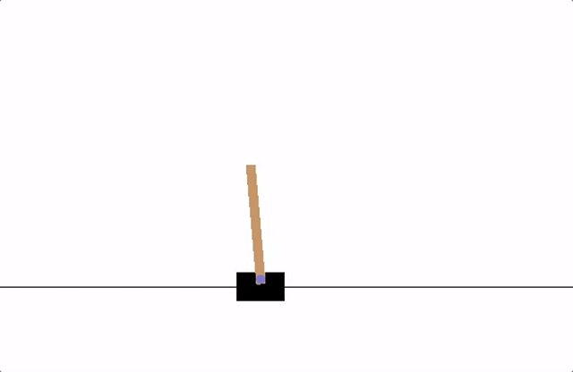

---
subtitle:    Temporal Difference Learning \& Q Learning
chapter:     5
feedback:
  deck-id:  'deeprl-td-learning'
...

# Content
- Recall GPI
- GLIE
- SARSA (on-policy)
- Q-learning (off-policy)

# Greedy in the limit with infinite exploration (GLIE)

A learning policy $\pi$ is called GLIE if it satisfies the following two properties:

- If a state is visited inifinitely often, then each action is choosen inifintely often:
$$ \lim_{i \to \infty} \pi_i(a|s) = 1 \quad \forall  \{s \in \Sc, a \in \Ac\}$$

- In the limit ($i \to \infty$) the learning policy is greedy with respect to the learned action value:
$$ \lim_{i \to \infty} \pi_i(a|s) = \pi(s) = \arg \max_{a \in \Ac} Q(s,a) \quad \forall s \in \Sc $$

# GLIE Monte Carlo control

MC-based contro using $\epsilon$-greedy exploration is GLIE, if $\epsilon$ is decreased at a rate 
$$ \epsilon_i = \frac{1}{i} $$
with $i$ being the increasing episode index. In this case,
$$ \hat Q(s,a) = Q^*(s,a) $$
follows.

# SARSA
- **S**tate-**A**ction-**R**eward-Next-**S**tate-Next-**A**ction
- on-policy

::: fragment
::: {.definition}
### Algorithm: SARSA.

**initialize**

- $Q(s,a)$ arbitrarily for $s \in \Sc, a \in \Ac$ 
- $Q($terminal-state$,\cdot) = 0$
- $\pi = \epsilon$-greedy$(Q)$

**for** $j = 1, 2, \ldots, J$ episodes:\
$\quad$ Initialize $s_t \gets s_0$, $t \gets 0$\
$\quad$ **while** $s_t$ is not terminal:\
$\quad\quad$ Take action $a_t \sim \pi(s_t)$ and observe $(r_t,s_{t+1})$\
$\quad\quad$ Select $a_{t+1} \sim \pi(s_{t+1})$\
$\quad\quad$ Update $Q$ given $(s_t,a_t,r_t,s_{t+1},a_{t+1})$:
$\quad$ $$Q(s_t,a_t) \gets Q(s_t,a_t) + \alpha \left[r_t + \gamma Q(s_{t+1},a_{t+1})- Q(s_t,a_t)\right]$$
$\quad\quad$ Update policy $\pi = \epsilon$-greedy$(Q)$\
$\quad\quad$ $t \gets t+1$\
:::
:::

# Convergence of SARSA

[Based on Marius Lindauer's lecture]

SARSA for finite-state and finite-action MDPs converges to the optimal action-value, $Q(s, a) \to  Q^*(s, a)$, under the following conditions:

1. The policy sequence $\pi_t(a \mid s)$ satisfies the condition of GLIE
2. The step-sizes $\alpha_t$ satisfy the Robbins-Munro sequence such that 
  $$ 
    \sum_{t=1}^{\infty} \alpha_t = \infty \nonumber \\
    \sum_{t=1}^{\infty} \alpha^2_t < \infty \nonumber
  $$
	
For example, $\alpha_t = \frac{1}{t}$ satisfies the above condition.

# Q-Learning
- SARSA estimates $Q$ of the current policy
- Q-learning is similar but directly estimates $Q^*$
- off-policy update, since the optimal action-value function is updated independent of a given behavior policy

::: fragment
::: {.definition}
### Algorithm: Q-Learning.

**initialize**

- $Q(s,a)$ arbitrarily for $s \in \Sc, a \in \Ac$ 
- $Q($terminal-state$,\cdot) = 0$
- $\pi = \epsilon$-greedy$(Q)$

**for** $j = 1, 2, \ldots, J$ episodes:\
$\quad$ Initialize $s_t \gets s_0$, $t \gets 0$\
$\quad$ **while** $s_t$ is not terminal:\
$\quad\quad$ Take action $a_t \sim \pi(s_t)$ and observe $(r_t,s_{t+1})$\
$\quad\quad$ Select $a_{t+1} \sim \pi(s_{t+1})$\
$\quad\quad$ Update $Q$ given $(s_t,a_t,r_t,s_{t+1},a_{t+1})$:
$\quad$ $$Q(s_t,a_t) \gets Q(s_t,a_t) + \alpha \left[r_t + \gamma \textcolor{red}{\max_a Q(s_{t+1},a)}- Q(s_t,a_t)\right]$$
$\quad\quad$ Update policy $\pi = \epsilon$-greedy$(Q)$\
$\quad\quad$ $t \gets t+1$\
:::
:::

------------------------------------------------------------------------------

# Function Approximation

------------------------------------------------------------------------------

# Motivation

- previously we were assuming that we can model everything by table loop-ups

Problems:

- real-world states can be continuous
- often we cannot see all possible states

Solution: Approximate value function, e.g. by

- linear combination of features
- decision trees
- neural networks -> DeepRL !

# Value Function Approximation
- Represent state/state-action value function with a parametrized function

# Linear Value Function Approximation

Weighted linear combination of features:
$$ \hat V^\pi(s;\boldsymbol{\theta}) = \boldsymbol{\phi}(s)^\top \boldsymbol{\theta}$$

Optimization of objective (MSE):
$$ J(\boldsymbol{\theta}) = \mathbb{E} \left[ \left(V^\pi(s) - \hat V^\pi(s;\boldsymbol{\theta}) \right)^2 \right] $$

Gradient descent:
$$ \Delta (\boldsymbol{\theta}) = - \frac{1}{2} \alpha \nabla_\boldsymbol{\theta} J(\boldsymbol{\theta}) $$

Update rule:
$$ \begin{align*} \Delta \boldsymbol{\theta} =  -\alpha \left(V^\pi(s) - \boldsymbol{\phi}(s)^\top \boldsymbol{\theta}\right) \boldsymbol{\phi}(s) \end{align*}$$

------------------------------------------------------------------------------

# Monte Carlo Value Function Approximation

------------------------------------------------------------------------------

# Monte Carlo VFA

- $G_t$ is a noisy but unbiased estimate of the true expected return $V^\pi(s_t)$

Update rule:
$$ \begin{align*} \Delta \boldsymbol{\theta} =  -\alpha \left(G_t - \boldsymbol{\phi}(s)^\top \boldsymbol{\theta}\right) \boldsymbol{\phi}(s) \end{align*}$$

# Monte Carlo VFA: Convergence

[Based on Marius Lindauer's lecture]

Based on [Tsitsiklis and Van Roy. 1997](https://ieeexplore.ieee.org/document/580874).

Define the mean squared error of a linear value function approximation for a particular policy $\pi$  relative to the true value as 
$$\text{MSVE}(\boldsymbol{\theta}) = \sum_{s \in S} d(s) (V^\pi (s) - \hat{V}^\pi(s;\boldsymbol{\theta}))^2 $$
where

- $d(s)$: stationary distribution of $\pi$ in the true decision process
- $\hat{V}^\pi(s;\boldsymbol{\theta}) = \boldsymbol{\phi}(s)^T\boldsymbol{\theta}$, a linear value function approximation

Monte Carlo policy evaluation with VFA converges to the weights $\boldsymbol{\theta}_{MC}$ which has the minimum mean squared error possible:
$$\text{MSVE}(\boldsymbol{\theta}_{MC}) = \min_{\boldsymbol{\theta}}\sum_{s \in S} d(s) (V^\pi (s) - \hat{V}^\pi(s;\boldsymbol{\theta}))^2 $$

------------------------------------------------------------------------------

# Temporal Difference Learning with Value Function Approximation

------------------------------------------------------------------------------

# TD-Learning with VFA

Compute target using bootstrapping: $$r_t + \gamma \hat V^\pi(s_{t+1};\boldsymbol{\theta}) $$
Since target is not updated, $\hat V^\pi(s_{t+1};\boldsymbol{\theta})$ is treated as a constant in the derivative.

Update rule:
$$ \begin{align*} \Delta \boldsymbol{\theta} =  -\alpha \left(r_t + \gamma \hat V^\pi(s_{t+1};\boldsymbol{\theta}) - \boldsymbol{\phi}(s)^\top \boldsymbol{\theta}\right) \boldsymbol{\phi}(s) \end{align*}$$

# TD-Learning VFA: Convergence

[Based on Marius Lindauer's lecture]

TD(0) policy evaluation with VFA converges to weights $\boldsymbol{\theta}_{TD}$ which is a constant factor of the minimum mean squared error possible:
$$\text{MSVE}(\boldsymbol{\theta}_{TD}) \leq \frac{1}{1-\gamma} \min_\boldsymbol{\theta}\sum_{s\in S} d(s) (V^\pi(s) - \hat{V}(s;\boldsymbol{\theta}))^2$$

# SARSA and Q-Learning with VFA

[Based on Marius Lindauer's lecture]

Similar to V(s), we can approximate Q(s,a):
$$ \hat Q(s,a;\boldsymbol{\theta}) = \boldsymbol{\phi}(s,a)^\top \boldsymbol{\theta}$$

Monte Carlo Update:
$$ \begin{align*} \Delta \boldsymbol{\theta} =  -\alpha \left(\textcolor{green}{G_t} - \hat Q(s,a;\boldsymbol{\theta})\right) \nabla_\boldsymbol{\theta} \hat Q(s,a;\boldsymbol{\theta}) \end{align*}$$

SARSA with TD target:
$$ \begin{align*} \Delta \boldsymbol{\theta} =  -\alpha \left(\textcolor{green}{r_t + \gamma \hat Q(s_{t+1},a_{t+1};\boldsymbol{\theta})} - \hat Q(s,a;\boldsymbol{\theta})\right) \nabla_\boldsymbol{\theta} \hat Q(s,a;\boldsymbol{\theta}) \end{align*}$$

Q-Learning with TD target:
$$ \begin{align*} \Delta \boldsymbol{\theta} =  -\alpha \left(\textcolor{green}{r_t + \gamma \max_a \hat Q(s_{t+1},a;\boldsymbol{\theta})} - \hat Q(s,a;\boldsymbol{\theta})\right) \nabla_\boldsymbol{\theta} \hat Q(s,a;\boldsymbol{\theta}) \end{align*}$$

------------------------------------------------------------------------------

# Deep Q-Learning

------------------------------------------------------------------------------

# Towards more complex learning tasks

CartPole:
{ .embed width=600px }

Atari:
{ .embed width=600px }
Credit: [Mnih et al. 2013](https://arxiv.org/pdf/1312.5602)

-> Deep Neural Networks (DNNs) as value function approximators

# Recall: Online Q-Learning with VFA

1. Take action $a_t$ and observe $(s_t, a_t, r_t, s_{t_1})$ [-> correlated! breaks i.i.d assumption of NNs]{style="color: red;"}
2. Update Q-Network:
$$ \begin{align*} \Delta \boldsymbol{\theta} =  -\alpha \left(r_t + \gamma \max_a \hat Q(s_{t+1},a;\boldsymbol{\theta}) - \textcolor{red}{\underbrace{\hat Q(s,a;\boldsymbol{\theta})}_{\text{non-stationary!}}}\right) \nabla_\boldsymbol{\theta} \hat Q(s,a;\boldsymbol{\theta}) \end{align*}$$

# Deep Q-Network (DQN)

1. Correlation -> [Replay Buffer]{style="color: green;"} from which we sample batches i.i.d.
2. [Target network]{style="color: green;"}: Copy of previous network weights used as target and updated delayed: $\boldsymbol{\theta}^-$

# Maximization Bias

- maximum in both value estimation and action selection
- leads to positive bias in Q-values

# Double DQN

- keep two q networks and toss coin which one to update

# Prioritized Experience Replay

Based on Marius Lindauer's Lecture

- Let $i$ be the index of the $i$-th tuple of experience $(s_i,a_i,r_i,s_{i+1})$
- Sample tuples for the update using priority function
- Priority of a tuple $i$ is proportional to DQN error
$$ p_i = | r_i + \gamma \max_{a' \in \Ac} Q(s_{i+1}, a'; \boldsymbol{\theta}^-) - Q(s_i,a_i;\boldsymbol{\theta}) |$$
- Update $p_i$ every update. $p_i$ for new tuples is set to the maximum value
- One method: proportional (stochastic prioritization)
$$ P(i) = \frac{p_i^\beta}{\sum_k p_k^\beta}$$
- $\beta = 0$ yields random selections 

https://arxiv.org/pdf/1511.05952

# References

::: { #refs }
:::
