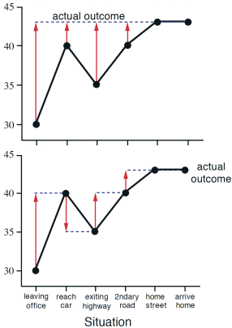
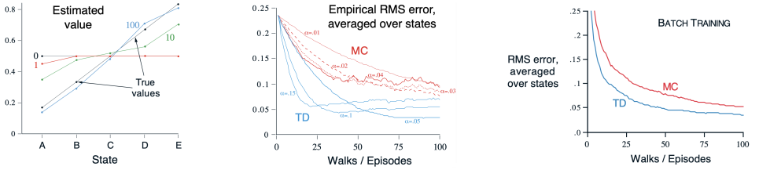
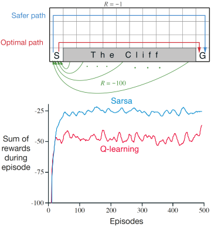
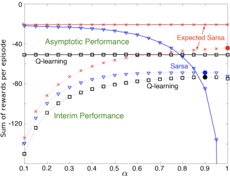

---
subtitle:    Temporal Difference Learning \& Q-learning
chapter:     5
feedback:
  deck-id:  'deeprl-td-learning'
...
------------------------------------------------------------------------------

# Content

------------------------------------------------------------------------------

# Content

- The TD learning concept
- Prediction using TD learning
- Policy improvement / control using TD learning 
  - SARSA
  - Q-learning
- Double Q-learning

------------------------------------------------------------------------------

# The TD learning concept

------------------------------------------------------------------------------

# Temporal-difference learning and the previous methods

::: small
::: columns-6-4
::: platzhalter
The main aspects of our previous two categories of methods:

::: incremental
1. Monte Carlo (MC): **learning from experience**, possibly without knowledge of a model, e.g., *MC prediction* with exploring starts:
$$Q(s_t,a_t) = Q(s_t,a_t) + \frac{1}{n(s_t,a_t)} \left[g - Q(s_t,a_t)\right].$$
2. Dynamic programming (DP): **bootstrapping** $\Rightarrow$ updating estimates based on estimates, e.g., *iterative policy evaluation*:
$$ \textcolor{red}{V(s)} = \sum_{a\in\Ac} \pias \sum_{s'\in\Sc} \psprimesa \left[ r + \gamma \textcolor{red}{V(s')} \right]. $$
:::

[The **concept of temporal difference (TD) learning** is to combine both:]{.fragment}

::: incremental
1. *Model-free* prediction and control in unknown MDPs.
2. Updates policy evaluation and improvement in an online fashion (i.e., not per episode) by *bootstrapping*.
:::

:::

::: fragment
![[@Sutton1998{}, Figure 8.11]](images/05-td-learning/Methods-DP-MC-TD.svg){ width=500px }
:::
:::

:::

::: fragment
::: footer
:bulb: We are still considering finite MDPs here.
:::
:::
------------------------------------------------------------------------------

# Prediction using TD learning

------------------------------------------------------------------------------

# The general TD prediction update
::: small
Recall the **incremental update** of the type we discussed for multi-armed bandits or for MC control\
$\Rightarrow$ $\mathsf{NewEstimate} \gets \mathsf{OldEstimate} + StepSize \; [ \mathsf{Target} - \mathsf{OldEstimate} ]$:
[$$
\begin{equation}
V(s_t) \gets V(s_t) + \alpha \left[g_t - V(s_t)\right]. \label{eq:TD_MC-update}
\end{equation}
$$]{.fragment}

::: incremental
- $\alpha \in (0,1)$ is the forget factor / step size.
- $g_t$ is the target of the incremental update rule.
- To execute \eqref{eq:TD_MC-update}, we have to wait until the end of the episode to get $g_t$.
:::

\

::: fragment
::: definition
### One-step TD / TD(0) update

$$
\begin{equation}
V(s_t) \gets V(s_t) + \alpha \left[\textcolor{red}{r_t + \gamma V(s_{t+1})} - V(s_t)\right]. \label{eq:TD_TD0-update}
\end{equation}
$$

::: incremental
- Here, the **TD target** is $\textcolor{red}{r_t + \gamma V(s_{t+1})}$.
- TD is *bootstrapping*: estimate $V(s_t)$ based on $V(s_{t+1})$.
- *Delay time of one* time step; no need to wait until the end of the episode.
:::
:::
:::
:::

# Algorithmic implementation: TD-based prediction

::: definition
### Algorithm: TD-based prediction.

*Parameters*: Step size $\alpha\in (0,1)$\

*Initialize*: $V(s)$ arbitrarily for $s \in \Sc$, $V(\mathsf{terminal}) = 0$\

**for** $k = 1, 2, \ldots, K$ episodes:\
$\quad$ **for** $t = 0,1,\ldots,T$:\
$\quad\quad$ Sample action $a_t \sim \pias$ and apply\
$\quad\quad$ Observe $s_{t+1}$ and $r_{t}$\
$\quad\quad$ $V(s_t) \gets V(s_t) + \alpha \left[r_t + \gamma V(s_{t+1}) - V(s_t)\right]$ (Eq.\ \eqref{eq:TD_TD0-update})\
$\quad\quad$ **if** $s_{t+1}$ is terminal **then** STOP
:::

::: footer
:bulb: The algorithm can directly be applied to the prediction of action-value functions.
:::

# The TD error and its relation to the MC error

::: small
Using the target, we can define the **TD error**$^*$ $\delta$ [$\Rightarrow$ the expression inside the bracket of Eq.\ \eqref{eq:TD_TD0-update} we're using to improve our estimate:
$$ \delta_t = \mathsf{target} - V(s_t) = r_t + \gamma V(s_{t+1}) - V(s_t). $$]{.fragment}

[**Batch mode**: Let's assume that the TD(0) estimate of $V(s)$ does not change within an episode, but that we apply all updates simulatenously once the episode is finished (exactly as we need to do in MC prediction):]{.fragment}
[$$
\begin{align*}
\underbrace{g_t - V(s_t)}_{\text{MC error}} &= r_{t}+\gamma g_{t+1} - V(s_t) \fragment{+\gamma V(s_{t+1}) - \gamma V(s_{t+1})}\\
&= \delta_t + \gamma (\underbrace{g_{t+1} - V(s_{t+1})}_{\text{MC error}}) \fragment{= \delta_t + \gamma \delta_{t+1} + \gamma^2(g_{t+2} - V(s_{t+2}))} \\
&= \delta_t + \gamma \delta_{t+1} + \gamma^2 \delta_{t+2} + \gamma^3(g_{t+3} - V(s_{t+3})) \fragment{= \ldots =  \sum_{k=t}^T\gamma^{k-t} \delta_k.}
\end{align*}
$$]{.math-incremental}

::: incremental
- The MC error is the discounted sum of TD errors in this case.
- If $V(s)$ is updated during an episode (as is common in TD(0)), the above identity only holds approximately.
:::

:::

::: footer
$^*$ For sufficiently small step size $\alpha$, it can be shown that the TD error conveges to zero in batch mode [@Sutton1998].
:::

# Convergence of TD(0)

::: small
::: definition
Given a finite MDP and a fixed policy $\pi$, the state-value estimate $V$ of TD(0) converges to the true $V^\pi$\
(that is, $\lim_{t\rightarrow\infty} \delta_t = 0$)

::: incremental
- in the mean for a constant but sufficiently small step-size $\alpha$ and
- with probability one if the step-size satisfies the *Robbins-Munro* condition
$$\begin{equation}
\sum_{t=1}^\infty \alpha_t = \infty \qquad \text{and}\qquad \sum_{t=1}^\infty \alpha^2_t < \infty . \label{eq:stepsize_criterion}
\end{equation}$$
:::
:::

::: incremental
- In particular, $\alpha_k = \frac{1}{k}$ meets the condition \eqref{eq:stepsize_criterion}.
- TD(0) often converges faster than MC, as we will see in the following examples. However, there is no guarantee it's faster.
- TD(0) can be more sensitive to poor initializations $V_0(s)$ compared to MC.
:::

:::

# The *driving home* example

::: small
Imagine you want to predict your time to get home after work, starting with an estimate of 30 minutes.

::: columns-7-3

::: platzhalter
| State                       | Elapsed Time (minutes) | Predicted Time to Go | Predicted Total Time | 
| :-------------------------- | :--------------------: | :------------------: | :------------------: |
| leaving office, friday at 6 | 0                      |                   30 | 30                   |
| reach car, raining          | 5                      |                   35 | 40                   |
| exiting highway             | 20                     |                   15 | 35                   | 
| 2ndary road, behind truck   | 30                     |                   10 | 40                   |
| entering home street        | 40                     |                    3 | 43                   |
| arrive home                 | 43                     |                    0 | 43                   |

Table: Overview of elapsed time and your predictions of time to go and total time [@Sutton1998{}, Example 6.1]

::: incremental
- In MC, we estimate the returns $g_t$ **after** we have reached home $\Rightarrow$ it is hard to assess where the deviation was caused.
- In TD, we can immediately shift our estimate in each time step.
- With TD, we can even learn from continuing tasks!
:::
:::

[
{ .embed width=200 }
]{.fragment data-fragment-index=1 }
:::
:::

# The batch training AB example (1)

::: small
Assume that we have an MDP with only two states: $A$ and $B$. We do not consider discounting (i.e., $\gamma=1$).

[We collect eight samples from the dynamics, and we would like to estimate the values $V(A)$ and $V(B)$:]{.fragment}

::: fragment
| Episode $k$ | 1 | 2 | 3 | 4 | 5 | 6 | 7 | 8 |
| :---: | :---: | :---: | :---: | :---: | :---: | :---: | :---: | :---: |
| Sequence ($s,r,s,r$) | A, 0, B, 0 | B, 1 | B, 1 | B, 1 | B, 1 | B, 1 | B, 1 | B, 0 |

Table: Sample of $K=8$ trajectories, including the rewards following the states.
:::

::: columns-7-3

::: platzhalter
[**Question**: What's $V(A)$ and $V(B)$ based on]{.fragment}

::: incremental
- the MC estimate?
- the TD(0) estimate?
:::

[Before approaching this, let's try to model the underlying MDP!]{.fragment}

::: incremental
- $B$ occurs eight times, follwed by $r=+1$ in six, and by $r=0$ in two cases.\
[$\Rightarrow$ $V(B)=\frac{3}{4}$.]{.fragment}
- What about $V(A)$?
  1. In our example, the only episode containing $A$ has return $g=0$ [$~\quad\Rightarrow$ $V(A)=0$.]{.fragment}
  2. On the other hand, $A$ is followed by $r=0$ and then $s=B$ [$\qquad\quad\Rightarrow$ $V(A)=V(B)=\frac{3}{4}$.]{.fragment}
:::
:::

::: fragment
![Option 2. for modeling the MDP [@Sutton1998{}, Ex.\ 6.4]](images/05-td-learning/Example-AB.svg){ width=150 }
:::
::: fragment
Answer 1. is the MC estimate, answer 2. is the TD estimate!
:::
:::
:::

# The batch training AB example (2)

::: small
Let's formally calculate the MC and TD updates:

[$$
\begin{align*}
V(s_t) &\gets V(s_t) + \alpha \left[g_t - V(s_t)\right] &&\text{(MC)} \\
V(s_t) &\gets V(s_t) + \alpha \left[r_t + \gamma V(s_{t+1}) - V(s_t)\right] \qquad\qquad &&\text{(TD)}
\end{align*}
$$]{.math-incremental}

::: fragment
Convergence: no change in the estimate:
[$$
\begin{align*}
\alpha \left[g_t - V(s_t)\right] = g_t - V(s_t) &= 0 &&\text{(MC)} \\
\alpha \left[r_t + \gamma V(s_{t+1}) - V(s_t)\right] = r_t + \gamma V(s_{t+1}) - V(s_t) &= 0 \qquad &&\text{(TD)}
\end{align*}
$$]{.math-incremental}
:::

::: fragment
Consider a batch sweep over the the $K$ episodes:
[$$
\begin{align*}
\sum_{k=1}^K g_{t,k} - V(s_{t,k}) &= 0 &&\text{(MC)} \\
\sum_{k=1}^K r_{t,k} + \gamma V(s_{t+1,k}) - V(s_{t,k}) &= 0 \qquad &&\text{(TD)}
\end{align*}
$$]{.math-incremental}
:::
:::

# The batch training AB example (3)

::: small
Apply the previous equations first to **state $B$**. Since $B$ is a terminal state, $V(s_{t+1}) = 0$ and $g_{t,k} = r_{t,k}$ apply, i.e., the MC and TD updates are identical for $B$:
[$$
\begin{align*}
&\text{MC}\big|_{s=B}~\text{:}\qquad \sum_{k=1}^K g_{t,k} - V(B) = 0 \qquad &\Leftrightarrow \qquad V(B)=\frac{1}{K} \sum_{k=1}^K r_{t,k} = \frac{6}{8} = \frac{3}{4}, \\
&\text{TD}\big|_{s=B}~\text{:}\qquad \sum_{k=1}^K r_{t,k} - V(B) = 0 \qquad &\Leftrightarrow \qquad V(B)=\frac{1}{K} \sum_{k=1}^K r_{t,k} = \frac{6}{8} = \frac{3}{4}.
\end{align*}
$$]{.math-incremental}

::: fragment
Now consider **state $A$**, where we have only one trajectory:

::: incremental
- the instantaneous reward following $A$ is zero, and the return of that episode is also zero.
- The TD bootstrap estimate of $B$ is $V(B)=\frac{3}{4}$.
:::

[$$
\begin{align*}
&\text{MC}\big|_{s=A}~\text{:}\qquad \sum_{k=1}^K g_{t,k} - V(A) = 0 \qquad &&\Leftrightarrow \qquad V(A)= 0, \\
&\text{TD}\big|_{s=A}~\text{:}\qquad \sum_{k=1}^K r_{t,k} + \gamma V(B) - V(A) =\sum_{k=1}^K \gamma V(B) - V(A) = 0 \qquad &&\Leftrightarrow \qquad V(A)= \gamma V(B) = \frac{3}{4}.
\end{align*}
$$]{.math-incremental}

:::

:::

# Certainty equivalence

::: small
Where does this difference come from? [$\Rightarrow$ Without going into a detailed derivation:]{.fragment}

::: incremental
- MC batch learning converges to the least **squares fit of the sampled returns**:
$$ \sum_{k=1}^K\sum_{t=1^T} (g_{t,k} - V(s_{t,k}))^2. $$
- TD batch learning converges to the **maximum likelihood estimate** such that $(\Sc,\Ac,p,r,\gamma)$ explains the data with highest probability:
$$ \begin{align*} 
\hat{p}\agivenb{s'}{s,a} &= \frac{1}{n(s,a)}\sum_{k=1}^K\sum_{t=1^T} \mathbb{1}\agivenb{s_{t+1,k} = s'}{s_{t,k}=s,a_{t,k}=a},\\
\hat{r} &= \frac{1}{n(s,a)}\sum_{k=1}^K\sum_{t=1^T} \mathbb{1}(s_{t,k}=s,a_{t,k}=a)r_{t,k}.
\end{align*}$$
:::

::: fragment
$\Rightarrow$ *TD assumes an MDP problem structure* and is absolutely certain that its internal model concept describes the real world perfectly (so-called **certainty equivalence**).
:::

:::

# The *random walk* example

::: small
Consider a simple Markov reward process (MRP; no actions), for which we want to estimate $V(s)$ from experience only.

{ width=750px }

::: incremental
- For all states $s$, we have $p(\leftarrow) = p(\rightarrow) = 0.5$.
- The MRP is undiscounted ($\gamma = 1$).
- The value of each state is the probability of terminating on the right: $V(A/B/C/D/E) = \frac{1}{6}$ / $\frac{1}{3}$ / $\frac{1}{2}$ / $\frac{2}{3}$ / $\frac{5}{6}$.
:::

::: fragment
{ .embed width=1280px }
:::
:::

\ 

::: footer
The example is taken from [@Sutton1998{}, Ex.\ 6.2]
:::

------------------------------------------------------------------------------

# Policy improvement / control using TD learning 

------------------------------------------------------------------------------

# Application of generalized policy iteration to TD learning

::: small
The GPI concept can directly be applied to the TD framework by replacing values with action-values, where we alternate between estimation (i.e., prediction) and improvement:
$$
\pi_0 \stackrel{E}{\longrightarrow} Q^{\pi_0} \stackrel{I}{\longrightarrow} \pi_1 \stackrel{E}{\longrightarrow} Q^{\pi_1} \ldots \stackrel{I}{\longrightarrow} \pi^* \stackrel{E}{\longrightarrow} Q^*=Q^{\pi^*}.
$$

::: fragment
::: definition
### Estimation: TD(0) update of the Q-function

$$
\begin{equation}
Q(s_t,a_t) \gets Q(s_t,a_t) + \alpha \underbrace{\big[\overbrace{r_t + \gamma Q(s_{t+1}, a_{t+1})}^{\mathsf{TD~target}} - Q(s_t, a_t)\big]}_{\mathsf{TD~error}~\delta}. \label{eq:TD_TD0-update-Q}
\end{equation}
$$
:::
:::

[**The policy**: $\epsilon$-greedy / $\epsilon$-soft$^*$.]{.fragment}

::: fragment
**Convergence** [@Sutton1998]

- towards $Q^*$ with probability one if all tuples $(s,a)$ are visited infinitely often and the step-size condition \eqref{eq:stepsize_criterion} is satisfied.
- towards $\pi^*$ if the policy is GLIE.
:::

[***Key question***: how do we select $a_{t+1}$?]{.fragment} [$\Rightarrow$ **On-policy versus off policy!**]{.fragment}

:::

::: footer
$^*$ $ π \left( a  \middle| s \right)> 0$ for all $s\in\Sc$ and $a\in\Ac$.
:::

# On-policy TD control: SARSA

$s,a,r,s',a'$: **S**tate-**A**ction-**R**eward-Next **S**tate-Next **A**ction

::: small

::: columns-7-3
::: fragment
::: {.definition}
### Algorithm: SARSA.

**initialize**

- $Q(s,a)$ arbitrarily for $s \in \Sc, a \in \Ac$ 
- $Q($terminal-state$,\cdot) = 0$
- $\pi = \epsilon$-greedy$(Q)$

**for** $k = 1, 2, \ldots, K$ episodes:\
$\quad$ Initialize $s_t \gets s_0$, $t \gets 0$\
$\quad$ **while** $s_t$ is not terminal:\
$\quad\quad$ Take action $a_t \sim \pi(s_t)$ and observe $(r_t,s_{t+1})$ $\qquad\qquad\qquad~$ \
$\quad\quad$ Select $a_{t+1} \sim \pi(s_{t+1})$\
$\quad\quad$ Update $Q$ given $(s_t,a_t,r_t,s_{t+1},a_{t+1})$:
$\quad$ $$Q(s_t,a_t) \gets Q(s_t,a_t) + \alpha \left[r_t + \gamma Q(s_{t+1},a_{t+1})- Q(s_t,a_t)\right]$$
$\quad\quad$ Update policy: $\pi = \epsilon$-greedy$(Q)$ $\qquad$ ([This is on-policy!]{style="color: red;"})\
$\quad\quad$ $t \gets t+1$\
:::
:::

::: fragment
**Convergence**: SARSA for finite-state and finite-action MDPs converges to the optimal action-value, $$Q(s, a) \to  Q^*(s, a),$$ under the following conditions:

1. The policy sequence $\pi_t\agivenb{a}{s}$ is GLIE.
2. The step-sizes $\alpha_t$ satisfy the step-size condition \eqref{eq:stepsize_criterion} (as does, e.g., $\alpha_t = \frac{1}{t}$).
:::
:::
:::

<!-- # Convergence of SARSA

[Based on Marius Lindauer's lecture]

SARSA for finite-state and finite-action MDPs converges to the optimal action-value, $Q(s, a) \to  Q^*(s, a)$, under the following conditions:

1. The policy sequence $\pi_t(a \mid s)$ satisfies the condition of GLIE
2. The step-sizes $\alpha_t$ satisfy the Robbins-Munro sequence such that 
  $$ 
    \sum_{t=1}^{\infty} \alpha_t = \infty \nonumber \\
    \sum_{t=1}^{\infty} \alpha^2_t < \infty \nonumber
  $$
	
For example, $\alpha_t = \frac{1}{t}$ satisfies the above condition. -->

# Q-Learning
::: small
::: columns-7-3

::: fragment
::: {.definition}
### Algorithm: Q-Learning.

**initialize**

- $Q(s,a)$ arbitrarily for $s \in \Sc, a \in \Ac$ 
- $Q($terminal-state$,\cdot) = 0$
- $\pi = \epsilon$-greedy$(Q)$

**for** $k = 1, 2, \ldots, K$ episodes:\
$\quad$ Initialize $s_t \gets s_0$, $t \gets 0$\
$\quad$ **while** $s_t$ is not terminal:\
$\quad\quad$ Take action $a_t \sim \pi(s_t)$ and observe $(r_t,s_{t+1})$\
$\quad\quad$ ~~Select $\cancel{a_{t+1} \sim \pi(s_{t+1})}$~~$\qquad\qquad\qquad\qquad$ ([Not needed in off-policy]{style="color: red;"}) \
$\quad\quad$ Update $Q$ given $(s_t,a_t,r_t,s_{t+1})$:
$\quad$ $$Q(s_t,a_t) \gets Q(s_t,a_t) + \alpha \left[r_t + \gamma \textcolor{red}{\max_a Q(s_{t+1},a)}- Q(s_t,a_t)\right]$$
$\quad\quad$ Update policy $\pi = \epsilon$-greedy$(Q)$\
$\quad\quad$ $t \gets t+1$\
:::
:::

::: incremental
- Q-learning is similar but directly estimates $Q^*$.
- *Off-policy update*, since the optimal action-value function is updated independent of a given behavior policy.
- The policy still determines which state–action pairs are visited and updated.
- Convergence with probability 1 to $Q^*$ [@Sutton1998] if 
  - all state-action pairs continue to be visited,
  - a variant of the usual stochastic approximation conditions on the sequence of step-size parameters holds.
:::

:::
:::

# Example: Walking along a cliff

::: small
::: columns-6-4
::: platzhalter
::: incremental
- Usual Gridworld setting.
- All rewards are -1, except 
  - the goal $G$ has $r=0$,
  - the cliff has $r=-100$ and leads back to $S$.#
- The policy is $\epsilon$-greedy with $\epsilon=0.1$
:::

[**Outcome**:]{.fragment}

::: incremental
- Q-learning learns the optimal path, close along the cliff.
- On-policy SARSA learns a much safer path. [*Why do you think that is*?]{.fragment}
- In the GLIE case (i.e., $\epsilon\to 0$), both policies will converge to the optimal path.
:::
:::

{ .embed width=400px }

:::

::: fragment
In our setting, Q-learning is worse than SARSA. [*Why do you think that is*?]{.fragment}

[$\Rightarrow$ the combination of falling off randomly and the resulting very large negative reward.]{.fragment}
:::
:::

::: footer
The example is taken from [@Sutton1998{}, Ex.\ 6.6]
:::

# Expected SARSA

::: small
::: columns-5-4
::: platzhalter
What can we do to reduce the large variance in the SARSA update 
$$Q(s_t,a_t) \gets Q(s_t,a_t) + \alpha \left[r_t + \gamma \textcolor{red}{Q(s_{t+1},a_{t+1})}- Q(s_t,a_t)\right]?$$

::: fragment
Let's take the expectation of Q $\rightarrow$ **expected SARSA**:
$$
\begin{align*}
Q(s_t,a_t) &\gets Q(s_t,a_t) + \alpha \left[r_t + \gamma \textcolor{blue}{\ExpCsub{Q(s_{t+1},a)}{s_t}{\pi}}- Q(s_t,a_t)\right] \\
&= Q(s_t,a_t) + \alpha \left[r_t + \gamma \left(\sum_{a\in\Ac} \pi\agivenb{a}{s_{t+1}}Q(s_{t+1},a)\right)- Q(s_t,a_t)\right].
\end{align*}
$$
:::

::: fragment
For comparison: Q-learning
$$Q(s_t,a_t) \gets Q(s_t,a_t) + \alpha \left[r_t + \gamma \mathbf{\max_{a\in\Ac} Q(s_{t+1},a)}- Q(s_t,a_t)\right]$$
:::
:::

::: fragment
{ width=500px }
:::

:::
:::

------------------------------------------------------------------------------

# Double Q-learning

------------------------------------------------------------------------------

# Maximization bias

::: small
All control algorithms discussed so far involve *maximization operations*:

::: incremental
- Q-learning: target policy is greedy and directly uses max operator for action-value updates.
- SARSA: typically uses an $\epsilon$-greedy framework $\rightarrow$ max updates during policy improvement.
:::

[This can lead to a significant *positive bias*:]{.fragment}

::: incremental
- Maximization over sampled values is used implicitly as an estimate of the maximum value.
- This issue is called maximization bias.
:::

[Small example:]{.fragment}

::: incremental
- Consider a single state $s$ with multiple possible actions $a$.
- The true action values are all $Q(s, a) = 0$.
- The sampled estimates $\hat{Q}(s, a)$ are uncertain, i.e., randomly distributed. Some samples are above and below zero.
- Consequence: The maximum of the estimate is positive!
:::
:::

# Double Q-learning approach

::: small
**Split the learning process**:

::: incremental
- Divide sampled experience into two sets.
- Use sets to estimate independent estimates $Q_1(s, a)$ and $Q_2(s, a)$. 
:::

[**Assign specific tasks to each estimate**:]{.fragment}

::: incremental
- Estimate the maximizing action using $Q_1$:
$$ a^* = \arg\max_{a\in\Ac} Q_1(s,a).$$
- Estimate corresponding action value using $Q_2$:
$$Q(s,a^*) \approx Q_2(s,a^*)=Q_2(s,\arg\max_{a\in\Ac} Q_1(s,a)).$$
- Since this approach is perfectly symmetric, we can repeat the process with reversed roles between $Q_1$ and $Q_2$.
:::
:::

# Double Q-learning algorithm
::: small
::: {.definition}
### Algorithm: Q-Learning.

**initialize**

- $Q_1(s,a)$ and $Q_2(s,a)$ arbitrarily for $s \in \Sc, a \in \Ac$ 
- $Q_1($terminal-state$,\cdot) = Q_2($terminal-state$,\cdot) = 0$

**for** $k = 1, 2, \ldots, K$ episodes:\
$\quad$ Initialize $s_t \gets s_0$, $t \gets 0$\
$\quad$ **while** $s_t$ is not terminal:\
$\quad\quad$ Take action $a_t$ using an $\epsilon$-greedy policy on $Q_1 + Q_2$ and observe $(r_t,s_{t+1})$ $\qquad\qquad\qquad\qquad\qquad~$ \
$\quad\quad$ **if** $\mathsf{rand()} > 0.5$:
$\quad$ $$Q_1(s_t,a_t) \gets Q_1(s_t,a_t) + \alpha \left[r_t + \gamma Q_2(s_{t+1},\arg\max_{a} Q_1(s_{t+1},a))- Q_1(s_t,a_t)\right]$$
$\quad\quad$ **else**:
$\quad$ $$Q_2(s_t,a_t) \gets Q_2(s_t,a_t) + \alpha \left[r_t + \gamma Q_1(s_{t+1},\arg\max_{a} Q_2(s_{t+1},a))- Q_2(s_t,a_t)\right]$$
$\quad\quad$ $t \gets t+1$\
:::
:::

# Maximization bias example

::: small
![Comparison of Q-learning and Double Q-learning on a simple episodic MDP [@Sutton1998{}, Ex.\ 6.7]. Q-learning initially learns to take the left action much more often than the right action, and always takes it significantly more often than the $5\%$ minimum probability enforced by $\epsilon$-greedy action selection with $\epsilon=0.1$. In contrast, Double Q-learning is essentially unaffected by maximization bias. These data are averaged over 10,000 runs. The initial action-value estimates were zero.](images/05-td-learning/Example-Maximization-Bias.svg){ width=1000px }
:::

------------------------------------------------------------------------------

# Summary / what you have learned

------------------------------------------------------------------------------

# Summary / what you have learned

::: small
::: incremental
- TD **unites two key characteristics from DP and MC**:
  - From MC: sample-based updates (i.e., operating in unknown MDPs).
  - From DP: update estimates based on other estimates (bootstrapping).
- TD allows certain **simplifications and improvements compared to MC**:
  - Updates are available after each step and not after each episode.
  - Off-policy learning comes without importance sampling.
  - Exploits MDP formalism by maximum likelihood estimates.
  - TD prediction and control exhibit a high applicability for many problems.
- **Batch training** can be used when only limited experience is available, i.e., the available samples are re-processed again and again.
- Greedy policy improvements can lead to **maximization biases** and, therefore, slow down the learning process.
- TD **requires careful tuning of learning parameters**:
  - Step size $\alpha$: how to tune convergence rate vs. uncertainty / accuracy?
  - Exploration vs. exploitation: how to visit all state-action pairs?
:::
:::

# References

::: { #refs }
:::
