---
subtitle:    Brief Introduction to Deep Learning
chapter:     6
feedback:
  deck-id:  'deeprl-deep-learning'
...

------------------------------------------------------------------------------

# Content

------------------------------------------------------------------------------

# Content

::: small
::: columns-5-5
::: platzhalter
**Content**:

- The three main learning paradigms
- Supervised learning
  - The learning diagram
  - Generalization
  - Bias \& variance
  - Cross-validation
- Deep neural networks
  - Artificial neural networks
  - Multi-layer perceptron
  - Training
  - Regularization
  - Neural network architectures
- Linear regression as a special case
:::

::: platzhalter
**Useful references**:

- Pattern recognition and machine learning [@Bishop2006prml]
- Deep learning [@bengio2017deep]
- The elements of statistical learning [@hastie2009elements]
- Learning from data: a short course [@Abu2012learning]
:::
:::
:::

------------------------------------------------------------------------------

# The three main learning paradigms

------------------------------------------------------------------------------

# The three main learning paradigms

![The three big learning paradigms [@Abdelwanis2026] (Examples: [Unsupervised](https://medium.com/analytics-vidhya/beginners-guide-to-unsupervised-learning-76a575c4e942), [Supervised](https://www.linkedin.com/pulse/what-supervised-learning-sahib-singh-ru3qc/), [RL](https://medium.com/analytics-vidhya/a-beginners-guide-to-reinforcement-learning-and-its-basic-implementation-from-scratch-2c0b5444cc49))](images/06-deep-learning/ML-paradigms.svg){ .embed width=1280px }

------------------------------------------------------------------------------

# Supervised learning

------------------------------------------------------------------------------

# The learning diagram

![The learning diagram [@Abu2012learning]](images/06-deep-learning/Learning-diagram.svg){ .embed width=800px }

# Generalization

::: small

::: incremental
- What does it mean to have a perfect model on your training dataset $\Dtrain$, i.e., $L(\theta; \Dtrain) = 0$?\
[$\Rightarrow$ we have simply memorized the data!]{.fragment}
- Learning means that we get **good predictions on unseen data**:
$$ \underbrace{L(\theta; \Dtest)}_{\text{in-sample error}} \approx \underbrace{L(\theta; \Dtrain)}_{\text{out-of-sample error}}. $$
:::

::: fragment
::: definition
### Supervised learning

Given a labeled (and probably noisy) dataset $\Dtrain=\{(x_1,y_1),\ldots,(x_N,y_N)\}$, approximate the unknown mapping $f : \Xc \to \Yc$ by a parametrizable ML model $f_\theta: \Xc \to \Yc$, such that $$ f_\theta(x_k) = \hat{y}_k \approx y_k \quad \forall ~ (x_k,y_k)\in\Dtest .$$
:::
:::

::: incremental
- **Goodness of fit** can be measured via many different metrics (e.g., mean squared error, classification accuracy, etc.).
- The dimension $d$ of model parameters $\theta \in\R^d$ is adjustable in many model families, which trades off **bias** with **variance** (among other factors, leading to so-called under- and overfitting).
- On top of $\theta$, an ML model might also have **hyperparameters** that can be optimized (e.g., number of layers in a neural network).
:::
:::

# Bias-variance tradeoff (1)

::: small
::: columns-7-4
::: platzhalter

[$\bullet$ In the ML context, **bias** denotes the error of the *average* model $\overline{f}_{\theta}$ when repeating the training with different datasets $\Dc_{\mathsf{train},1},\Dc_{\mathsf{train},2},\ldots$:
$$ \mathsf{bias} = \Expsub{\left(\overline{f}_{\theta}(x) - f(x)\right)^2}{x\sim\Dtest}. $$]{ .fragment data-fragment-index=1}

[$\bullet$ **variance** denotes the variability in between the individual training runs:
$$ \mathsf{variance} = \Expsub{\Expsub{\left(f^{(\Dc)}_{\theta}(x) - \overline{f}_{\theta}(x)\right)^2}{\Dc\sim\{\Dc_{\mathsf{train,\ell}}\}_{\ell=1}^\infty}}{x\sim\Dtest}. $$]{ .fragment data-fragment-index=2}

:::

[
$\Rightarrow$ Often a matter of model complexity.
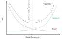{ .embed width=420px }
]{ .fragment data-fragment-index=7}

:::

::: columns-1-1-1-1
[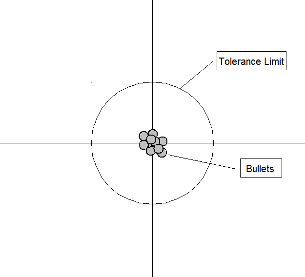{ .embed width=300px }]{ .fragment data-fragment-index=3}

[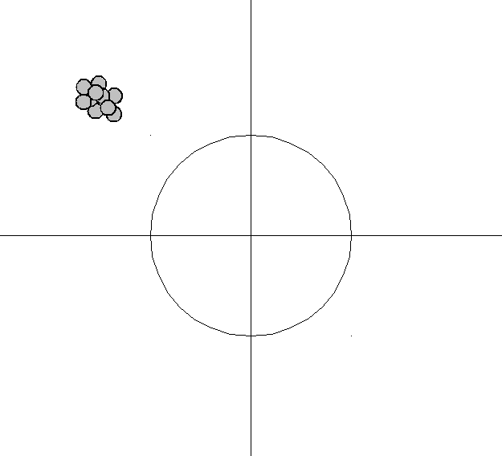{ .embed width=300px }]{.fragment data-fragment-index=4}

[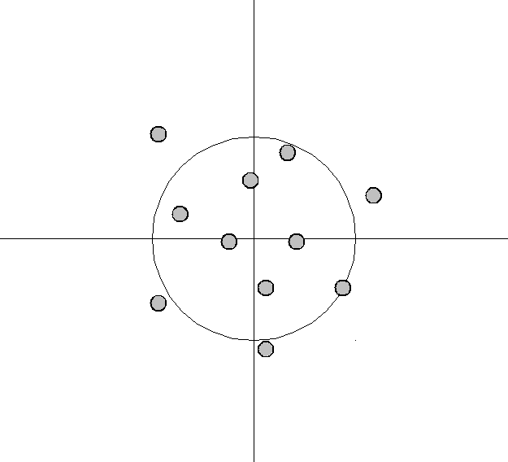{ .embed width=300px }]{.fragment data-fragment-index=5}

[]](images/06-deep-learning/BV-Truen_bad_prec_bad.png){ .embed width=300px }]{.fragment data-fragment-index=6}
:::
:::

# Bias-variance tradeoff (2)
::: small
**Example** (see [Wikipedia](https://en.wikipedia.org/wiki/Bias%E2%80%93variance_tradeoff)): Fitting a model of serveral radial basis functions to noisy trainig data: 
$$ f_\theta(x) = \sum_{k=1}^d \theta_k \exp\left(-\frac{1}{2}\frac{x-c_k}{\sigma_k^2}\right). $$

[$\bullet$ For a wide spread (i.e., large $\sigma_k$), the bias is high: the RBFs cannot fully approximate the function (especially the central dip), but the variance between different trials is low.]{ .fragment data-fragment-index=1}

[$\bullet$ As spread decreases (image 3 and 4) the bias decreases: the blue curves more closely approximate the red...]{ .fragment data-fragment-index=2}

[$\bullet$ ... but the variance between trials ($\Dc_{\mathsf{train,1}},\Dc_{\mathsf{train,2}},\ldots$) increases.]{ .fragment data-fragment-index=3}

:::

::: columns-1-1-1-1
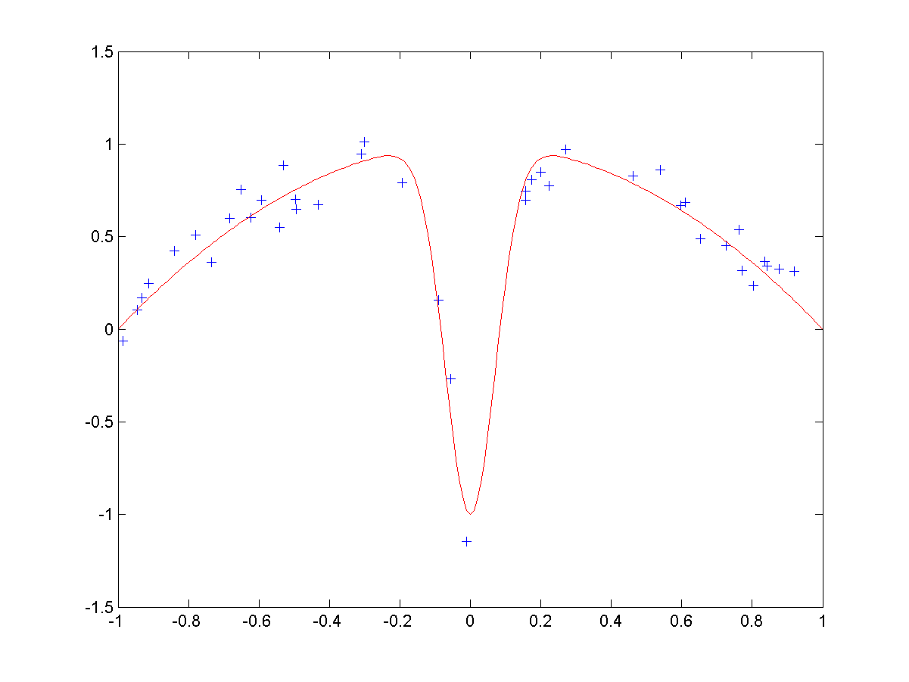{ .embed width=300px }

[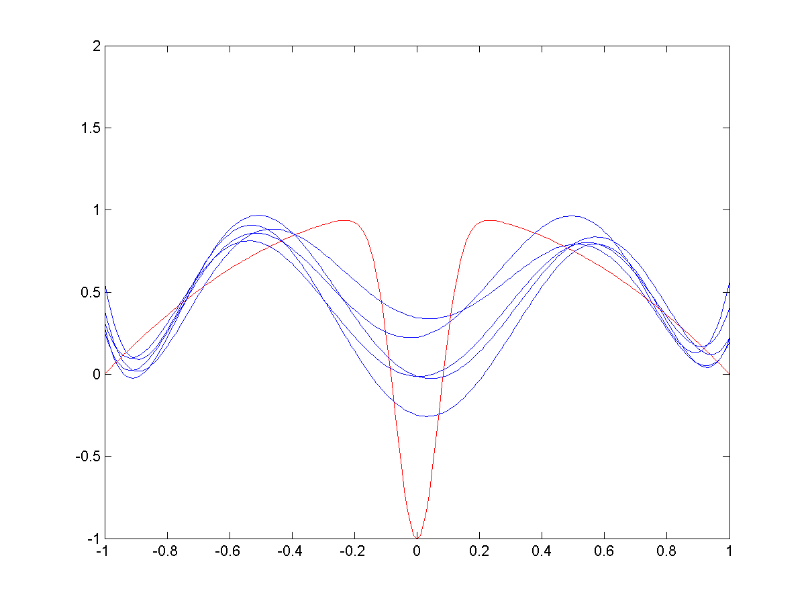{ .embed width=300px }]{.fragment  data-fragment-index=1 }

[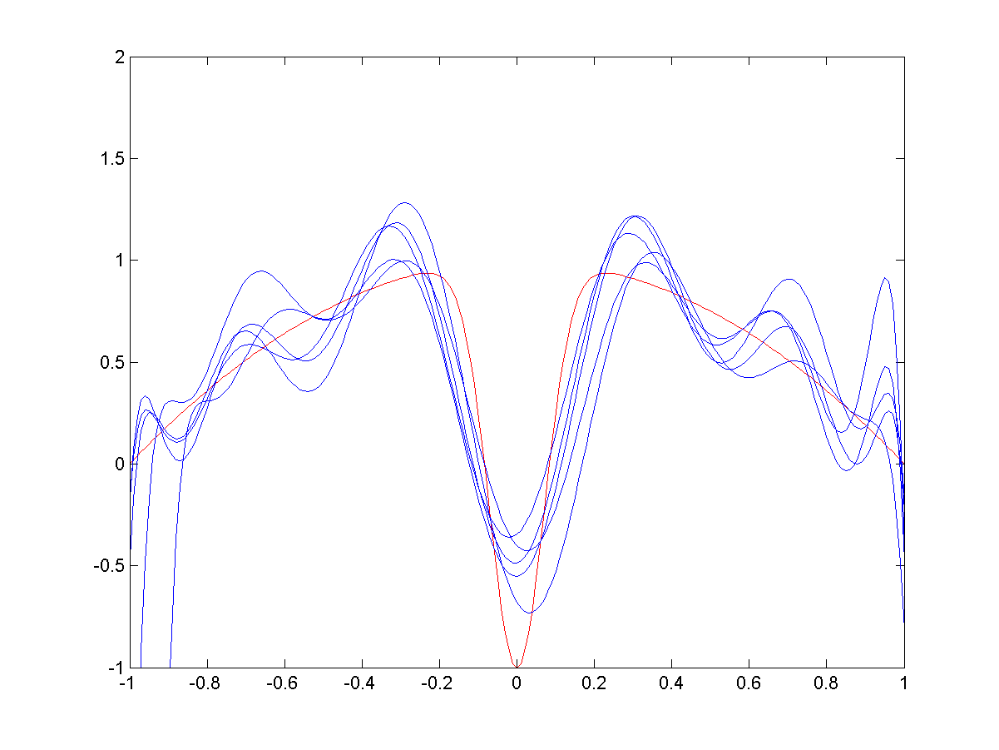{ .embed width=300px }]{.fragment  data-fragment-index=2 }

[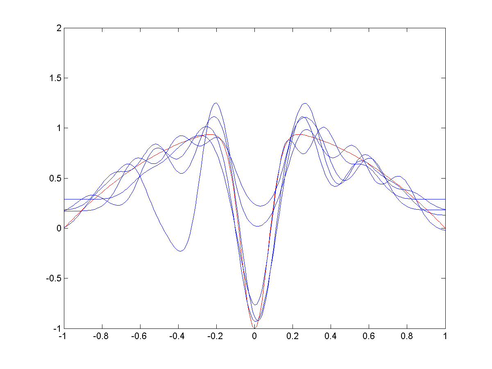{ .embed width=300px }]{.fragment  data-fragment-index=3 }
:::

# Cross-validation

::: columns-5-7

![5-fold CV example [@Abdelwanis2026].](images/06-deep-learning/cross-validation.png){ .embed width=500px }

::: incremental
- Training is repeated $k$ times with $k$ different splits of the training set.
- Each observation serves as unseen instance (blue boxes) at least once.
- The validation error is an indicator for tuning hyperparameters.
- Example of a $k$-fold Cross-validation (CV).
:::
:::

# Means to improve a supervised learning model

::: small
::: columns-7-4
::: incremental
- Collecting **more data**, i.e., increasing $N$.
- **Reducing noise** in the data.
- **Improving the distribution** within the dataset, i.e., ensuring that the data set is representative of the problem domain.
- **Choosing a more appropriate model**. A genereal rule is to select the model according to the amount of data one has, not according to the expected complexity of the funtion to approximate.
- **Optimizing hyperparameters** of the model.
- **Ensemble learning**: Averaging over several different models.
- **Including knowledge**, e.g., in the form of tailored features (feature engineering) or informed loss functions.
  - This is known as **inductive bias** in the ML literature.
:::

::: fragment
![Euclidean vs. polar coordinates/features in binary classification [@Abdelwanis2026].](images/06-deep-learning/feature-engineering-linear.svg){ .embed width=280px }
:::
:::
:::

------------------------------------------------------------------------------

# Deep neural networks

------------------------------------------------------------------------------

# Artificial neural networks

::: small
Artificial neural networks (ANNs) are nonlinear function approximators $\hat{y}=f_\theta(x)$ that

::: incremental
- are end-to-end differentiable.
- are stacks of minimal units, the **artificial neurons**.
:::

\

::: fragment
::: columns-5-5
![An artificial neuron [@Abdelwanis2026].](images/06-deep-learning/neuron.svg){ width=400px }

::: incremental
- An ANN consists of **nodes** or **neurons** in one or more layers.
- Each node transforms the weighted sum of all previous nodes (plus a potential **bias term**) through an **activation function** $\sigma$:
$$ \sigma\left( \theta_0 + \sum_{k=1}^n \theta_k x_k \right). $$
- The weighted connections are called **edges**, which represent the ANN’s parameters.
:::

:::
:::
:::

# Multi-layer perceptron

::: small
Standard model of supervised learning: **multi-layer perceptron** or **feed-forward ANN**.

\

::: fragment
::: columns-4-6
![MLP architecture [@Abdelwanis2026].](images/06-deep-learning/MLP.svg){ width=450px }

::: incremental
- Only forward-flowing edges.
- The depth $L$ and width $\iterate{H}{\ell}$ are hyperparameters.
- With $\iterate{\sigma}{\ell}$ and $\iterate{z}{\ell}$ denoting the activation function and **activation** of layer $\ell$ respectively, we get for the output in the $\th{\ell}$ layer.
$$ \iterate{x}{\ell}= \iterate{\sigma}{\ell}\big( \underbrace{\iterate{\Theta}{\ell}\iterate{x}{\ell-1} + \iterate{b}{\ell}}_{\iterate{z}{\ell}} \big) ,$$
with input $\iterate{x}{0}=x$ and output $\iterate{x}{L}=y$:
- Training:
  - Summarize the full set of parameters (i.e., weight matrices $\iterate{\Theta}{\ell}\in\R^{\iterate{H}{\ell} \times \iterate{H}{\ell-1}}$ and biases $\iterate{b}{\ell}$) under $\theta$.
  - Iteratively update the weights using gradient information.
:::
:::
:::
:::

# Activation functions

::: columns-4-1
::: incremental
- The source of nonlinearity in neural networks.$^*$
- Common choices for $\sigma(z)$ are
  - $\sigma(z) = \tanh(z)$,
  - Sigmoid: $\sigma(z) = \frac{1}{1+e^{-z}}$,
  - Rectified linear unit (ReLU): $\sigma(z) = \max(0, z)$,
:::

![Exemplary activation functions [@Abdelwanis2026].](images/06-deep-learning/activation.png){ width=370px }
:::

::: incremental
- The activation of the output layer, $\iterate{\sigma}{L}(z)$, is task-dependent. For instance, 
  - regression: $y=\iterate{\sigma}{L}(\iterate{z}{L})=\iterate{z}{L}$, i.e., $\iterate{\sigma}{L} = \mathsf{Id}$ is the identity mapping.
  - binary classification: sigmoid (i.e., probability), followed by a rounding step to either $0$ or $1$.
  - multi-class classification: $y_i=\frac{\exp(\iterate{z}{L}_i)}{\sum_j \exp(\iterate{z}{L}_j)}$ (softmax).
:::

\ 

\ 

::: footer
$^*$ Without nonlinear activation functions, every ANN collapses to a single matrix-vector multiplication $y=\hat\Theta x$: 
$$\iterate{x}{\ell+2}=\iterate{\Theta}{\ell+2}\iterate{x}{\ell+1}= \iterate{\Theta}{\ell+2}\left(\iterate{\Theta}{\ell+1}\iterate{x}{\ell}\right)  = \left(\iterate{\Theta}{\ell+2}\iterate{\Theta}{\ell+1}\right)\iterate{x}{\ell}= \hat\Theta \iterate{x}{\ell}.$$
For non-zero biases, we obtain an *affine* transformation instead.
:::

# Training (1)

::: columns-9-3
::: small
::: incremental
- Training is performed in an iterative manner: $$\theta \gets \theta + \eta \delta\theta.$$ 
  - $\eta\in\R_{>0}$ is the **step size** or **learning rate**.
  - $\delta\theta\in\R^d$ is the **update direction**, usually a gradient-based **descent direction**.
  - Numerous variants for $\delta\theta$. The strongest contain additional **momentum** terms such as the *Adam* algorithm [@kingma2014adam]. [We remember the previous update $\delta\theta^{-}$ and thereby flatten out zig-zag behavior.\
  ](images/06-deep-learning/Gradient_descent_momentum.png){ width=400px }]{.fragment}
- First, we need to define a **loss function** that we wish to minimize.
  - Regression: (root) mean square error, mean absolute error.
  - Classification: cross entropy.
  - Additional terms, e.g., regularization, physics information, ...
- Iterations over the dataset $\Dtrain$ are called **epochs**.
:::
:::

![The loss landscape of deep neural networks (with and without skip-connection) [@li2018visualizing].](images/06-deep-learning/loss-landscapes.png){ width=300px }
:::

# Training (2)

::: small
::: incremental
- The descent direction is computed by taking the derivative of the loss function w.r.t. the weight vector. In terms of the MSE:
[$$\begin{align*} 
\nabla L(\theta) &= \nabla \left(\frac{1}{N} \sum_{k=1}^N \norm{f_\theta(x_k) - y_k}_2^2 \right) \\
&= \frac{1}{N} \sum_{k=1}^N \nabla \norm{f_\theta(x_k) - y_k}_2^2 \qquad &&\text{(Linearity of the sum)}\\
&= \frac{1}{N} \sum_{k=1}^N \left(2 \norm{f_\theta(x_k) - y_k}_2  \nabla f_\theta(x_k)\right) &&\text{(Chain rule of differentiation)}
\end{align*}$$]{.math-incremental}
- This means that we need to *propagate* the error through our model $f_\theta$.
- Since a neural network is a chain of neurons, we need to apply the **chain rule** of differentiation over the layers.
- As a consequence the loss is **backpropgated** through the network to determine the individual descent directions: $\pdiff{L}{\theta_i}$.
:::

::: fragment
::: definition
This is called the **backpropagation** algorithm. We require one forward pass and one backward pass for every data tuple $(x_k,y_k)$. Taking the average gives us the average steepest-descent improvement over the dataset $\Dtrain$ for the current $\theta$.
:::
:::
:::

# Backpropagation example

::: small
Let's consider a very simple network with $x,y\in\R$ and two hidden layers with a single neuron each.

::: columns-5-7
::: platzhalter
**Symbolic**

$$ \stackrel{x}{\bigcirc} 
\underbrace{
\underbrace{\stackrel{\iterate{\theta}{1}}{\longrightarrow} \stackrel{\iterate{z}{1}}{\bigcirc} \stackrel{\sigma}{\longrightarrow}}_{\text{Hidden\\ Layer}~1} 
\stackrel{\iterate{x}{1}}{\bigcirc} 
\underbrace{\stackrel{\iterate{\theta}{2}}{\longrightarrow} \stackrel{\iterate{z}{2}}{\bigcirc} \stackrel{\sigma}{\longrightarrow}}_{\text{Hidden\\ Layer}~2} 
\stackrel{\iterate{x}{2}}{\bigcirc} 
\underbrace{\stackrel{\iterate{\theta}{3}}{\longrightarrow}}_{\text{Output\\ layer}}
}_{\hat{y}=f_\theta(x)}
\stackrel{\hat{y}}{\bigcirc} \stackrel{L}{\longrightarrow} \stackrel{\text{Loss}}{\bigcirc} $$ 
<!-- \longleftarrow \stackrel{y}{\bigcirc} $$ -->
:::

::: fragment
$\quad$**In mathematical terms**

[$$\begin{align*} \hat{y} &= \iterate{\theta}{3} \big( \iterate{x}{2} \big) \fragment{= \iterate{\theta}{3} \big( \sigma \big( \iterate{z}{2} \big) \big)} \fragment{= \iterate{\theta}{3} \big( \sigma \big( \iterate{\theta}{2} \big( \iterate{x}{1} \big) \big) \big)} \\
&= \iterate{\theta}{3} \big( \sigma \big( \iterate{\theta}{2} \big( \theta\big(\iterate{z}{1}\big) \big) \big) \big)
\fragment{= \iterate{\theta}{3} \underbrace{\sigma\big(\iterate{\theta}{2} \overbrace{\sigma\big( \iterate{\theta}{1} x \big)}^{\text{Hidden\\ Layer}~1} \big)}_{\text{Hidden\\ Layer}~2}}
 \end{align*}$$]{.math-incremental}
:::
:::

[Let's assume a single sample $(x,y)$ and the MSE loss: $L(\theta)=(\hat{y}-y)^2$.]{.fragment} [Using the chain rule, we get:]{.fragment}

::: columns-3-4-5
[$1.$ Gradient w.r.t. $\theta_3$:
$$ \pdiff{L}{\theta_3} = \textcolor{red}{\underbrace{\pdiff{L}{\hat{y}}}_{=2(\hat{y}-y)}}\pdiff{\hat{y}}{\theta_3}. $$]{.fragment}

[$2.$ Gradient w.r.t. $\theta_2$:
$$ \pdiff{L}{\theta_2} = \textcolor{red}{\pdiff{L}{\hat{y}}}\textcolor{blue}{\pdiff{\hat{y}}{\iterate{x}{2}}\underbrace{\pdiff{\iterate{x}{2}}{\iterate{z}{2}}}_{=\sigma'}}\pdiff{\iterate{z}{2}}{\theta_2}. $$]{.fragment}

[$3.$ Gradient w.r.t. $\theta_1$:
$$ \pdiff{L}{\theta_3} = \textcolor{red}{\pdiff{L}{\hat{y}}}\textcolor{blue}{\pdiff{\hat{y}}{\iterate{x}{2}}\underbrace{\pdiff{\iterate{x}{2}}{\iterate{z}{2}}}_{=\sigma'}}\textcolor{green}{\pdiff{\iterate{z}{2}}{\iterate{x}{1}}\underbrace{\pdiff{\iterate{x}{1}}{\iterate{z}{1}}}_{=\sigma'}}\pdiff{\iterate{z}{1}}{\theta_1}. $$]{.fragment}
:::

::: fragment
$\Rightarrow$ we propagate the loss **back** through the network, reusing most of the previous calculations!
:::

:::

# Stochastic gradient descent and batch learning

::: small
::: incremental
- The cost for a single gradient step scales with the dataset size $N$, which can be **very large**.
- For each sample, we need to perform one forward and one backward pass.
- **Stochastic gradient descent** (**SGD**): massive speedup by using a single sample per step insetad of the entire dataset,
$$\delta \theta = \nabla L(\theta; x_k), \qquad k\sim U(\{1,\ldots,N\}). $$
- **Mini-batch gradient descent** with $s\in\{1,\ldots,N\}$ samples per step: compromise ground between efficiency and noisiness,
$$ \delta \theta = \frac{1}{s} \sum_{k\in\mathcal{I}} \nabla L(\theta; x_k), \qquad \text{where}~\mathcal{I}~\text{is an $s$-dimensional, ranodmly drawn subset of $\{1,\ldots,N\}$}.$$
:::

].](images/06-deep-learning/GD-SGD.png){ width=500px }
:::

# Regularization

In order to mitigate overfitting (i.e., good performacne on $\Dtrain$, poor generalization), neural networks can be regularized by

::: incremental
- **Weight decay**: adding an $\ell_2$ penalty term to the weights: $L(\theta) + \lambda \norm{\theta}_2^2$
- **Layer normalization** during training: all layers’ activations are normalized separately by standard scaling,
- **Dropout**: randomly disable nodes’ contribution.
  - This helps especially in deep networks,
  - and effectively builds an ensemble of ANNs with shared edges.
:::

# Neural network architectures

].](images/06-deep-learning/NN-zoo.png){ width=1280px }

------------------------------------------------------------------------------

# Linear regression as a special case

------------------------------------------------------------------------------

# The linear model: single-layer NN with $\sigma=\mathsf{Id}$

::: small
::: incremental
- Let's assume that we only have a single layer directly mapping inputs $x\in\R^n$ to outputs $y\in\R^m$:
$$ \hat{y} = f_\Theta(x) = \Theta^\top x\qquad\text{with}\quad \Theta\in\R^{m\times n}.$$
- Let's consider the usual MSE loss: $$ L(\Theta) = \frac{1}{N} \sum_{k=1}^N \norm{\Theta^\top x_k - y_k}_2^2.$$
- We organize the data in a slightly different fashion, i.e.,
$$ X = \begin{pmatrix} - & x_1^\top & - \\ & \vdots & \\ - & x_N^\top & - \end{pmatrix}\in\R^{N\times n}, \qquad  Y = \begin{pmatrix} - & y_1^\top & - \\ & \vdots & \\ - & y_N^\top & - \end{pmatrix}\in\R^{N\times m}.$$
- Then the model can predict all $N$ samples at the same time by a matrix-matrix product: $\hat{Y} = X\Theta$.
- The associated loss function then simply is the **Frobenius norm** over the dataset $\Dtrain = (X,Y)$:
$$ L(\Theta; \Dtrain) = \frac{1}{N} \norm{X\Theta - Y}_F^2 = \frac{1}{N} (X\Theta - Y)^\top (X\Theta - Y). $$
:::
:::

# Solving the regression problem

::: small
::: incremental
- What's the necessary condition for the minimizer of a function?\
[$\Rightarrow$ The gradient has to be zero!]{.fragment}
[$$ \pdiff{L(\Theta; \Dtrain)}{\Theta} = \pdiff{}{\Theta} \left[\frac{1}{N} (X\Theta - Y)^\top (X\Theta - Y) \right] = \frac{2}{N} X^\top (X\Theta - Y) $$]{.fragment}
- Optimal solution:
[$$\begin{align*} 
\frac{2}{N} X^\top (X\Theta^* - Y) &\stackrel{!}{=} 0 \\
\Leftrightarrow \quad X^\top X \Theta^* &= X^\top Y \\
\Leftrightarrow \quad \Theta^* &= (X^\top X)^{-1} X^\top Y = X^\dagger Y,
\end{align*}$$]{.math-incremental}
[where $X^\dagger$ is the [**pseudo-inverse**](https://de.wikipedia.org/wiki/Pseudoinverse) of $X$.]{.fragment}
- Training is replaced by a simple one-step learning approach (using, e.g. `numpy.linalg.pinv`).
- Since the loss function $L$ is convex, the solution $\Theta^*$ is not a local, but the **global optimum**.
:::
:::

# Features as an additional pre-processing step

::: small
::: incremental
- If we introduce *feature functions* $\psi_i:\R^n \rightarrow \R$, $\psi_i(x) = z_i$, then we can significantly improve the performance:
$$ \psi(x) = [\psi_1(x), \ldots, \psi_q(x)]^\top.  $$
- Different ways of introducing features:
:::

::: columns-1-1-1-1
::: fragment
![Tailored [@Abdelwanis2026]](images/06-deep-learning/feature-engineering-linear.svg){ width=200px }
:::

::: fragment
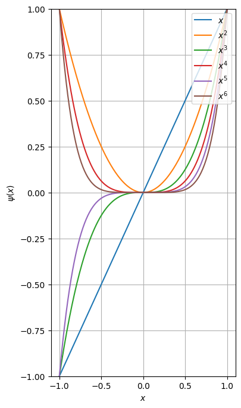{ width=230px }
:::

::: fragment
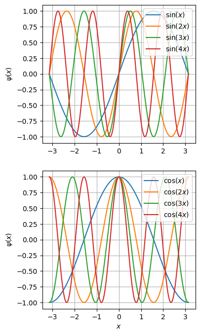{ width=230px }
:::

::: fragment
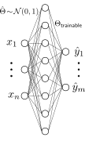{ width=230px }
:::
:::
:::

\

::: fragment
::: footer
:bulb: The layers $1$ to $L-1$ of a neural network can also be seen as a feature transform, **learned autmoatically** from data.
:::
:::

------------------------------------------------------------------------------

# Summary / what you have learned

------------------------------------------------------------------------------

# Summary / what you have learned

::: small
::: incremental
- There are **three main learning paradigms**:
  - **supervised learning** for function approximation of input-to-output mappings,
  - **unsupervised learning** for clustering, pattern detection or dimensionality reduction,
  - **reinforcement learning** for sequential decision making in dynamic envionments.
- In supervised learning, we aim to approximate an unknown function $f$ by a parametric function $f_\theta$ by adjusting $\theta$ such that a loss function $L$ is minimized over a training dataset $\Dtrain$.
  - The central goal is **generalization** beyond the training data.
  - We have to handle the **bias-variance-tradeoff**, which is often a matter of model complexity.
  - There are many techniques to improve learning such as cross-validation, regularization, inductive biases, ...
- **Deep neural networks** come in a great range of varieties.
  - They are a large network of a single unit known as the perceptron.
  - The general structure consists of linear transformations, followed by nonlinear activation functions.
  - Training is realized via **backpropagation** and **gradient descent**.
  - Various versions for the descent direction, for instance using **momentum**.
  - Improved efficiency (at the cost of noise) by using **stochastic gradient descent** or **mini-batch gradient descent**.
- Linear regression is the special case of a single linear layer.
  - Training can be realized in closed form using the **pseudo-inverse**.
  - **Features** significantly improve the performance of linear models.
:::
:::

# References

::: { #refs }
:::