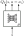
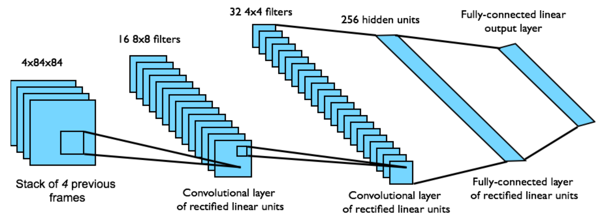
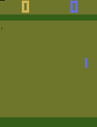
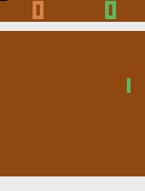
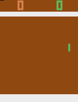
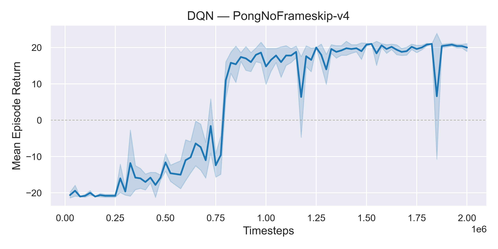
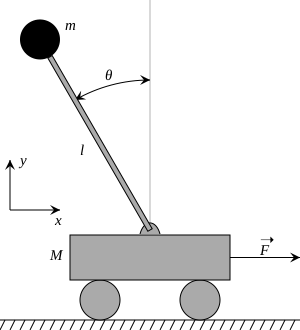
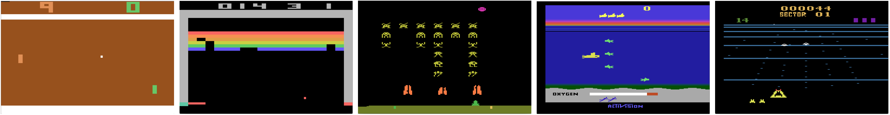

---
subtitle:    Deep Q Learning
chapter:     8
feedback:
  deck-id:  'deeprl-q-learning'
...

------------------------------------------------------------------------------

# Content

------------------------------------------------------------------------------

# Content

- On-policy control with gradients and semi-gradients
  - Introduction \& extension of existing algorithms
  - Gradient MC
  - Semi-gradient SARSA
  - Challenges (Levine: Data correlation \& semi-gradient)
- Deep Q networks
  - Replay buffers
  - Target networks \& alternative target networks (Polyak)
  - Double Q networks
  - Prioritized experience replay
  - $n$-step returns
  - Some remarks on continuous actions
- Least squares policy iteration

# Where are we?

::: small
| Chapter | Topic                                                  |                            Content  |
| :--: | :-------------------------------------------------------- | :---------------------------------- |
|      | **Basics \& tabular methods**                             |                                     |
|   1-5  | Bandits, MDPs, Dynamic Programming, Monte Carlo, TD Learning |   RL basics in finite dimensions  |
|      | **Deep-learning-based methods**                           |        |
|   6  | Brief introduction to deep learning                       |    The basics for what comes next    |
|   7  | Value function approximation                              |    Value estimation with function approximation    | 
|   [8]{style="color: red;"}  | [Deep Q-learning]{style="color: red;"}   |   [Q learning with neural networks]{style="color: red;"}     | 
|   9  | Policy gradients                                          |        | 
|  10  | Actor-critic algorithms                                   |        | 
|  11  | Advanced algorithms                                       |        | 
|      | **Model-Based Control**                                   |        |
|      | **Advanced Topics**                                       |        |

Table: Lecture contents
:::

------------------------------------------------------------------------------

# Recap: Value function approximation

------------------------------------------------------------------------------

::: small
::: incremental
- We want to **approximate the value function by parametric model** with trainable parameters $\theta\in\R^d$, i.e., $V_\theta(s) \approx V^\pi(s)$.
- For training, we need to define a **prediction objective**: 
$$\begin{equation} J(\theta) = \sum_{k=1}^N \big(V^\pi(s_k) - V_\theta(s_k)\big)^2 \approx \int_\Sc \mu(s) \big(V^\pi(s) - V_\theta(s)\big)^2 \ds = \overline{VE}(\theta). \label{eq:DQL_V_J} \end{equation}$$
- **Incremental weight updates** via
  - gradients, e.g., in the Monte Carlos setting: 
  $$\begin{equation} \theta \gets \theta + \alpha\rbracket{g - V_\theta(s)} \nablatheta V_\theta(s). \label{eq:DQL_V_update_MC} \end{equation}$$
  - semi-gradients in the bootstrapping case: we are not differentiating the target, which also depends on $V_\theta$. For TD learning, we have 
  $$\begin{equation} \theta \gets \theta + \alpha\rbracket{r + \gamma V_\theta(s') - V_\theta(s)} \nablatheta V_\theta(s). \label{eq:DQL_V_update_TD} \end{equation}$$
- **Batch updates** using $\Bc=\set{(s_i, r_i,s'_i)}_{i=1}^b \subset\Dc$ instead of a single sample as in SGD. For TD updates, we thus get
$$ \begin{equation} \theta \gets \theta + \frac{\alpha}{b} \sum_{(s_i, r_i,s'_i)\in\Bc} \rbracket{r_i + \gamma V_\theta(s'_i) - V_{\theta}(s_i)} \nablatheta V_{\theta}(s_i). \label{eq:DQL_V_update_TD_batch} \end{equation}$$
- For **linear models** (i.e., $V_{\theta}(s) = \theta^\top \psi(s) = \sum_{k=1}^d \theta_k \psi_k(s)$), training can be done in one step via linear regression:
$$ \begin{equation} \theta^* = (\Psi^\top \Psi)^{-1} \Psi^\top y = \Psi^\dagger y \qquad \Rightarrow \qquad V_{\theta^*}(s) = {\theta^*}^\top \psi(s) = \sum_{k=1}^d \theta^*_k \psi_k(s) . \label{eq:DQL_V_LSQ} \end{equation}$$
:::
:::

------------------------------------------------------------------------------

# On-policy control with gradients and semi-gradients

------------------------------------------------------------------------------

# Value-based control: Q function approximation

::: small
::: columns-5-5
::: platzhalter
Today's focus: **value-based control** $\Rightarrow$ How to transfer tabular methods to the function approximation case.

::: incremental
- The states are continuous, but the actions are (usually) still discrete.
- Central object of interest: The Q function that we wish to approximate with a parametric model (e.g., a neural net)
$$ Q_\theta (s,a) \approx Q^\pi(s,a) $$
- We can then use this in the well-known generalized policy iteration (GPI) scheme to identify optimal policies:
$$ Q_\theta(s,a) \approx Q^*(s,a) \quad \Rightarrow \quad \pi^*(s) = \arg\max_{a\in\Ac} Q_\theta(s,a) .$$
:::
:::

::: fragment
  ![Types of architectures [@Abdelwanis2026]](images/08-deep-q-learning/Model_types_action_value.svg){ .embed width=550px }
:::
:::
:::

# Gradient-based action value learning

::: small
The transfer from value function approximation is straightforward!

::: incremental
- Adaptation of \eqref{eq:DQL_V_J} to get $J(\theta)$
$$\begin{equation} J(\theta) = \sum_{k=1}^N \big(Q^\pi(s_k, a_k) - Q_\theta(s_k, a_k)\big)^2 . \label{eq:DQL_Q_J} \end{equation}$$
- Incremental update using (semi-)gradients:
$$ \begin{equation} \theta \gets \theta + \alpha\rbracket{Q^\pi(s,a) - Q_\theta(s,a)} \nablatheta Q_\theta(s,a). \label{eq:DQL_Q_update} \end{equation} $$
- Depending on the control approach, the true target $Q^\pi(s, a)$ is approximated by:
  - Monte Carlo: full episodic return $$Q^\pi(s,a) \approx g,$$
  - SARSA: one-step bootstrapped estimate $$Q^\pi(s,a) \approx r + \gamma Q_\theta(s',a'),$$
  - n-step SARSA: $$Q^\pi(s_t, a_t) \approx r_t + \gamma r_{t+1} + \ldots + \gamma^{n-1} r_{t+n-1} + \gamma^n Q_\theta(s_{t+n},a_{t+n}).$$
:::
:::

# Algorithm: Gradient MC control

::: small
::: columns-7-3
::: definition
### Algorithm: Gradient Monte Carlo algorithm for estimating $Q^\pi$ / $Q^*$

*Input*: 

- a differentiable, parameter-dependent function $Q_\theta: \Sc \times \Ac \to \R$
- learning rate $\alpha$
- **Prediction case**: a policy $\pi$
- **Improvement case**: $\epsilon$ defining the $\epsilon$-greedy policy update based on $Q_\theta$

*Initialize*: Value function weights $\theta\in\R^d$ arbitrarily\

**for** $k = 1, 2, \ldots, K$ episodes:\
$\quad$ Generate a sequence following $\pi$ (or $\epsilon$-greedy$(Q_\theta)$):
$$((s_0,a_0,r_0),(s_1,a_1,r_1),\ldots,(s_{T_k-1},a_{T_k-1},r_{T_k-1}))$$
$\quad$ Calculate the every-visit returns $g_t$\
$\quad$ **for** $t = 0,1,\ldots,T-1$:\
$\quad\quad$ $\theta \gets \theta + \alpha\rbracket{g_t - Q_\theta(s_t,a_t)} \nablatheta Q_\theta(s_t,a_t)$
:::

::: incremental
- Direct transfer from tabular case to function approximation.
- Update target becomes the sampled return $Q^\pi(s_t, a_t) \approx g_t$.
- If operating $\epsilon$-greedy on $Q_\theta$: baseline policy (given by $\iterate{\theta}{0}$) must terminate the episode!
:::
:::
:::

# Algorithm: Semi-gradient SARSA 

::: small
::: definition
### Algorithm: Semi-gradient SARSA for estimating $Q^\pi$ / $Q^*$

*Input*: 

- a differentiable, parameter-dependent function $Q_\theta: \Sc \times \Ac \to \R$
- learning rate $\alpha$
- **Prediction case**: a policy $\pi$
- **Improvement case**: $\epsilon$ defining the $\epsilon$-greedy policy update based on $Q_\theta$

*Initialize*: Value function weights $\theta\in\R^d$ arbitrarily\

**for** $k = 1, 2, \ldots, K$ episodes:\
$\quad$ Initialize $s_0$\
$\quad$ **for** $t = 0,1,\ldots,T-1$:\
$\quad\quad$ Obtain $a_t \sim \pi\agivenb{\cdot}{s_t}$ (or $a_t \sim \epsilon$-greedy$(Q_\theta(s_t,\cdot))$)\
$\quad\quad$ Observe $r_t$ and $s_{t+1}$\
$\quad\quad$ **if** $s_{t+1}$ is $\terminal$ **then**\
$\quad\quad\quad$ $\theta \gets \theta + \alpha\rbracket{r_t - Q_\theta(s_t,a_t)} \nablatheta Q_\theta(s_t,a_t)$\
$\quad\quad\quad$ Go to next episode $k+1$\
$\quad\quad$ Choose $a' \sim \pi\agivenb{\cdot}{s_{t+1}}$ (or $a' \sim \epsilon$-greedy$(Q_\theta(s_{t+1},\cdot))$)\
$\quad\quad$ $\theta \gets \theta + \alpha\rbracket{r_t + \gamma Q_\theta(s_{t+1},a') - Q_\theta(s_t,a_t)} \nablatheta Q_\theta(s_t,a_t)$
:::
:::

# Example: Mountain car (1)

::: small
::: columns-7-3

::: incremental
- Continous state $s\in\Sc=[\submin{x},\submax{x}]\times[\submin{v},\submax{v}]$ (minimal and maximal position $x$ and velocity $v$).
- Single, discrete action $a\in\Ac=\set{-1,0,1}$.
- $r = −1$ (goal is to terminate episode as quick as possible).
- Episode terminates when car reaches the flag (or max steps).
- Simplified longitudinal car physics with state constraints.
- Position initialized randomly within valley, zero initial velocity.
- Car is underpowered and requires swing-up.
:::

]](images/07-value-approximation/Mountain-car.gif){ width=400px }

:::

\ 

::: fragment
::: columns-6-4
::: platzhalter

**Approximation**: Linear model with *tile coding* features $x_i(s,a)$, where
$$ \begin{align*} 
\psi(s,a)&=\sum_{i=1}^d \theta_i x_i(s,a), \\
x_i(s,a)&=\begin{cases} 1 & (s,a)\in\text{ tile \#}i \\ 0 & \text{otherwise} \end{cases}. \end{align*} $$
:::

![Tile coding [@Sutton1998{}, Figure 9.9]](images/08-deep-q-learning/tile_coding.png){ width=550px }
:::
:::
:::

# Example: Mountain car (2)

![The Mountain Car task (upper left panel) and the cost-to-go function ($−\max_{a\in\Ac} Q_\theta(s, a,)$) learned during one run. [@Sutton1998{}, Figur 10.1]](images/08-deep-q-learning/mountain_car_results.png){ width=810px }

# Warning: a huge drawback of function approximation

::: incremental
- Recall tabular **policy improvement theorem**: guarantee to find a globally better or equally good policy in each update step.
- Parameter updates of the form \eqref{eq:DQL_Q_update} have an impact on $Q(s,a)$ for **all** $s$ and $a$, not just the one we visited!
:::

::: columns-3-7
![Generalized Policy Iteration (GPI) [@Sutton1998]](images/08-deep-q-learning/SuttonBarto_GPI.svg){ width=400px }

::: fragment
::: definition
### Loss of the policy improvement theorem

- When using function approximation, the policy improvement theorem does no longer apply.
- While improving the policy, we may impair it in other places *at the same time*.
:::
:::
:::

------------------------------------------------------------------------------

# Deep Q networks (DQN)

------------------------------------------------------------------------------

# General strategy behind DQN

::: small
::: incremental
- Introduced in the famous DeepMind paper [@Mnih2015humanlevelcontrol].
- Same off-policy strategy as in the *classical/tabular* Q learning algorithm:
$$Q(s,a) \gets Q(s,a) + \alpha \left[r + \gamma \max_{a'\in\Ac} Q(s',a')- Q(s,a)\right].$$
- Now: incremental learning using semi-gradients (Eq.\ \eqref{eq:DQL_Q_update}) and TD(0) bootstrapping:
$$ \begin{equation} \theta \gets \theta + \alpha\rbracket{r + \gamma \max_{a'\in\Ac} Q_\theta(s',a') - Q_\theta(s,a)} \nablatheta Q_\theta(s,a). \end{equation} $$
:::

::: columns-4-6
::: platzhalter
[**But with two important distinctions**]{.fragment}

::: incremental
1. An **experience replay buffer** for batch learning replaces the single-sample updates.\
 \
 \
 \
2. A **separate set of weights** $\theta'$ for the bootstrapped Q-target.
:::
:::

::: platzhalter
[**The motivation behind this**]{.fragment}

::: incremental
1. **Sample efficiency**
  - *Experience replay*: efficiently use available data.
  - *Stabilize learning* by reducing the correlation between samples\
  $\Rightarrow$ sampling from a replay buffer leads to i.i.d.-like data.
2. **Stabilization of learning**
  - targets don’t change in inner loop.
  $\Rightarrow$ well-defined learning problem.
:::
\

:::
:::
:::

# DQN working principle (1)

::: small
::: incremental
- Take actions u based on $Q_\theta(s,a)$ (e.g., $\epsilon$-greedy).
- Store observed tuples $(s,a,r,s')$ in memory buffer $\Dc$.
- Sample mini-batches $\Bc$ from $\Dc$.
- Calculate bootstrapped Q-target with a target network with weights $\theta'$:
$$ Q^\pi(s,a)\approx r + \max_{a\in\Ac}Q_{\theta'}(s,a). $$
- Optimize MSE loss between above targets and the regular approximation $Q_{\theta}(s,a)$ using $(s_i,a_i,r_i,s_i')\in\Bc$:
[$$ \begin{align*} 
L(\theta) &= \sum_{i=1}^{\abs{\Bc}} \big(\underbrace{r_i + \max_{a\in\Ac}Q_{\theta'}(s_i',a)}_{=y_i~(\target)} - Q_{\theta}(s_i,a_i)\big)^2, \\
\theta &\gets \theta + \alpha \sum_{i=1}^{\abs{\Bc}} \rbracket{y_i - Q_\theta(s_i,a_i)} \nablatheta Q_\theta(s_i,a_i).
\end{align*} $$]{.math-incremental}
- Update $\theta'$ based on $\theta$ from time to time.
:::
:::

# DQN working principle (2)

![Adapted from [@Abdelwanis2026]](images/08-deep-q-learning/DQN2.svg){ .embed width=800px }

# The DQN algorithm

::: small
::: columns-7-4
::: definition
### Algorithm: The "classic" DQN algorithm [@Mnih2015humanlevelcontrol]

*Input*: 

- a differentiable, parameter-dependent function $Q_\theta: \Sc \times \Ac \to \R$
- learning rate $\alpha$, greedy parameter $\epsilon$, update rate $N_\theta\in\N$

*Initialize*: Q function weights $\theta = \theta' \in\R^d$ arbitrarily, $\Dc=\{\}$\

**for** $k = 1, 2, \ldots, K$ episodes:\
$\quad$ Initialize $s_0$\
$\quad$ **for** $t = 0,1,\ldots,T-1$:\
$\quad\quad$ Obtain $a_t \sim \epsilon$-greedy$(Q_\theta(s_t,\cdot))$ and observe $r_t$ and $s_{t+1}$\
$\quad\quad$ Store tuple $(s_t,a_t,r_t,s_{t+1})$ in $\Dc$\
$\quad\quad$ Sample minibatch $\Bc$ from $\Dc$ (after initial *warm-up*)$\qquad\qquad\qquad$ \
$\quad\quad$ Compute targets for $(s_i,a_i,r_i,s'_i)\in\Bc$
$$y_i = r_i + \max_{a\in\Ac}Q_{\theta'}(s_i',a) \qquad\text{(or}~y_i = r_i~\text{if $s'_{i}$ is terminal)}$$
$\quad\quad$ Update $\theta$ via gradient descent on $L(\theta)$ with learning rate $\alpha$\
$\quad\quad$ **if** $t\mod{N_\theta}=0$ **then** $\theta'\gets\theta$
:::

::: fragment
**Remarks**: 

::: incremental
1. For the standard MSE loss $$L(\theta)= \sum_{i=1}^{\abs{\Bc}} \big(y_i  - Q_{\theta}(s_i,a_i)\big)^2,$$ the weight update becomes the one we have seen before:
$$\theta \gets \theta + \alpha \sum_{i=1}^{\abs{\Bc}} \rbracket{y_i - Q_\theta(s_i,a_i)} \nablatheta Q_\theta(s_i,a_i).$$
2. Apart from standard gradient descent, advanced (i.e., momentum-based) descent algorithms are possible (e.g., RMSProp, Adam, ...)
:::
:::
:::
:::

# Example: Atari game Pong (1)

::: small
::: columns-9-3
::: platzhalter
::: incremental
- Details in the [Farama Gymnasium](https://ale.farama.org/environments/pong/) description.
- State $s$:
  - $210 \times 160$ pixels with $3$ channels each (RGB) and values $s_{i}\in\{0,\ldots,255\}$,
  - stacking of multiple frames,
  - some additional preprocessing.
- Action $a$: $18$ actions in total, ($6$ buttons, some of which can be pushed at the same time).
- Architecture for $Q_\theta$ [@Mnih2015humanlevelcontrol]:\
{ width=130px }
$\qquad$
[{ width=600px }]{.fragment}
- Loss function $L(\theta)$: *Huber loss* $L_\delta(\theta) = \begin{cases} \frac{1}{2}\theta^2, & \theta \leq \delta \\ \delta(\abs{\theta} - \frac{1}{2}\theta), & \text{otherwise} \end{cases}$.
- Training: RMSProp descent algorithm.
:::
:::

::: platzhalter
{ width=190px }

\

\

)](images/08-deep-q-learning/Huber_loss.svg){ width=250px }
:::
:::
:::

# Example: Atari game Pong (2)

:::columns-1-1-1-1-1

{ width=190px }

[{ width=190px }]{.fragment}

[{ width=190px }]{.fragment}

[{ width=190px }]{.fragment}

[{ width=190px }]{.fragment}

:::

:::columns-1-1-1-2

[{ width=190px }]{.fragment}

[{ width=190px }]{.fragment}

[{ width=190px }]{.fragment}

{ width=500px }

:::

# Example: Atari games

![Human-level control [@Mnih2015humanlevelcontrol]](images/08-deep-q-learning/DQN_Atari_Results.png){ width=850px }

# Target networks \& alternative target networks (Polyak)

# Double Q networks

# Prioritized experience replay

# $n$-step returns

# Some remarks on continuous actions

------------------------------------------------------------------------------

# Least squares policy iteration

------------------------------------------------------------------------------

# Linear action-value-function estimation

::: small
::: incremental
- Recall the LSTD algorithm from last lecture: batch least squares estimation $V^\pi(s)$ with linear models:
$$ y = \begin{bmatrix} r_0 \\ \vdots \\ r_{T-1} \end{bmatrix}, \quad 
\fragment{ \Psi = \begin{bmatrix} \psi_0^\top - \gamma \psi_1^\top\\ \vdots \\ \psi_{T-1}^\top - \gamma \psi_T^\top \end{bmatrix},  \quad }
\fragment{ J(\theta) = \frac{1}{N} \norm{y - \Psi \theta }_F^2, \quad  }
\fragment{ \theta^* = (\Psi^\top \Psi)^{-1} \Psi^\top y = \Psi^\dagger y, \quad  }
\fragment{ V_{\theta^*}(s) = {\theta^*}^\top \psi(s). }$$
- Let's do the same for Q values $\Rightarrow$ **LS-SARSA** / **LSTD**$\mathbf Q$
[$$ \begin{align*} 
Q_\theta(s,a) &= \theta^\top \psi(s,a) = \sum_{i=1}^d \theta_i \psi_i(s,a) \qquad &&\text{(Linear model)} \\
Q^\pi(s,a) &\approx r + \gamma Q_\theta(s', a') \qquad &&\text{(TD(0) bootstrapping)}
\end{align*}$$]{.math-incremental}
- Loss function: 
$$ J(\theta) = \sum_{t=0}^T \big(r_t - \rbracket{\psi^\top_{t} - \gamma \psi^\top_{t+1}} \theta\big)^2 = \frac{1}{N} \norm{y - \Psi \theta }_F^2, \qquad\text{where}~\psi_t = \psi(s_t,a_t) . $$
- Same as before, only that the features depend on both states and actions: $\psi(s,a)$.
:::
:::

# On-policy and off-policy LS-SARSA

::: incremental
- Same data collection procedure as before: batch mode $\Rightarrow$ $\Psi$ and $y$.
- Regarding the data in $\Psi$, we can distinguish two cases: \fragment{the next-actions $a'$ originate from}
  - the same policy $\pi$ (*on-policy learning*),
  - an arbitrary policy $a'\sim \pi'\agivenb{\cdot}{s'}$ (*off-policy learning*).
- If we apply off-policy LS-SARSA then
  - we retrieve the flexibility to collect training samples arbitrarily,
  - at the cost of an estimation bias based on the sampling distribution.
- Possible modifications:
  - To prevent numeric instability regularization is possible, e.g., ridge regression $\theta^* = (\Psi^\top \Psi + \epsilon I)^{-1} \Psi^\top y$
  - Recursive implementation for online usage is straightforward.
:::

# Least squares policy iteration (LSPI)

::: small
::: columns-4-6
::: platzhalter
General idea:

::: incremental
- Apply general policy improvement (GPI) based on dataset $\Dc$,
- Policy evaluation by off-policy LS-SARSA,
- Policy improvement by greedy choices on predicted action values.
:::

[Some remarks:]{.fragment}

::: incremental
- LSPI is an offline and off-policy control approach.
- Exploration is required by feeding suitable sampling distributions to $\Dc$:
  - $\epsilon$-greedy choices based on $Q_\theta$.
  - Completely random samples are conceivable as well.
:::
:::

::: fragment

Example: Pendulum on a cart [@Abdelwanis2026]

::: columns-1-2
::: platzhalter

\

{ width=190px }\

\
{ width=190px }
:::

::: fragment
![Balancing steps before episode termination with a clipping of maximum 3000 steps [@Lagoudakis2003LSPI]](images/08-deep-q-learning/Inv_pendulum_results.png){ width=500px }
:::
:::
:::
:::
:::

<!-- ------------------------------------------------------------------------------

# Function Approximation

------------------------------------------------------------------------------

# Motivation

- previously we were assuming that we can model everything by table loop-ups

Problems:

- real-world states can be continuous
- often we cannot see all possible states

Solution: Approximate value function, e.g. by

- linear combination of features
- decision trees
- neural networks -> DeepRL !

# Value Function Approximation
- Represent state/state-action value function with a parametrized function

# Linear Value Function Approximation

Weighted linear combination of features:
$$ \hat V^\pi(s;\boldsymbol{\theta}) = \boldsymbol{\phi}(s)^\top \boldsymbol{\theta}$$

Optimization of objective (MSE):
$$ J(\boldsymbol{\theta}) = \mathbb{E} \left[ \left(V^\pi(s) - \hat V^\pi(s;\boldsymbol{\theta}) \right)^2 \right] $$

Gradient descent:
$$ \Delta (\boldsymbol{\theta}) = - \frac{1}{2} \alpha \nabla_\boldsymbol{\theta} J(\boldsymbol{\theta}) $$

Update rule:
$$ \begin{align*} \Delta \boldsymbol{\theta} =  -\alpha \left(V^\pi(s) - \boldsymbol{\phi}(s)^\top \boldsymbol{\theta}\right) \boldsymbol{\phi}(s) \end{align*}$$ -->

<!-- ------------------------------------------------------------------------------

# Monte Carlo Value Function Approximation

------------------------------------------------------------------------------

# Monte Carlo VFA

- $G_t$ is a noisy but unbiased estimate of the true expected return $V^\pi(s_t)$

Update rule:
$$ \begin{align*} \Delta \boldsymbol{\theta} =  -\alpha \left(G_t - \boldsymbol{\phi}(s)^\top \boldsymbol{\theta}\right) \boldsymbol{\phi}(s) \end{align*}$$

# Monte Carlo VFA: Convergence

[Based on Marius Lindauer's lecture]

Based on [Tsitsiklis and Van Roy. 1997](https://ieeexplore.ieee.org/document/580874).

Define the mean squared error of a linear value function approximation for a particular policy $\pi$  relative to the true value as 
$$\text{MSVE}(\boldsymbol{\theta}) = \sum_{s \in S} d(s) (V^\pi (s) - \hat{V}^\pi(s;\boldsymbol{\theta}))^2 $$
where

- $d(s)$: stationary distribution of $\pi$ in the true decision process
- $\hat{V}^\pi(s;\boldsymbol{\theta}) = \boldsymbol{\phi}(s)^T\boldsymbol{\theta}$, a linear value function approximation

Monte Carlo policy evaluation with VFA converges to the weights $\boldsymbol{\theta}_{MC}$ which has the minimum mean squared error possible:
$$\text{MSVE}(\boldsymbol{\theta}_{MC}) = \min_{\boldsymbol{\theta}}\sum_{s \in S} d(s) (V^\pi (s) - \hat{V}^\pi(s;\boldsymbol{\theta}))^2 $$

------------------------------------------------------------------------------

# Temporal Difference Learning with Value Function Approximation

------------------------------------------------------------------------------

# TD-Learning with VFA

Compute target using bootstrapping: $$r_t + \gamma \hat V^\pi(s_{t+1};\boldsymbol{\theta}) $$
Since target is not updated, $\hat V^\pi(s_{t+1};\boldsymbol{\theta})$ is treated as a constant in the derivative.

Update rule:
$$ \begin{align*} \Delta \boldsymbol{\theta} =  -\alpha \left(r_t + \gamma \hat V^\pi(s_{t+1};\boldsymbol{\theta}) - \boldsymbol{\phi}(s)^\top \boldsymbol{\theta}\right) \boldsymbol{\phi}(s) \end{align*}$$

# TD-Learning VFA: Convergence

[Based on Marius Lindauer's lecture]

TD(0) policy evaluation with VFA converges to weights $\boldsymbol{\theta}_{TD}$ which is a constant factor of the minimum mean squared error possible:
$$\text{MSVE}(\boldsymbol{\theta}_{TD}) \leq \frac{1}{1-\gamma} \min_\boldsymbol{\theta}\sum_{s\in S} d(s) (V^\pi(s) - \hat{V}(s;\boldsymbol{\theta}))^2$$ -->

<!-- # SARSA and Q-Learning with VFA

[Based on Marius Lindauer's lecture]

Similar to V(s), we can approximate Q(s,a):
$$ \hat Q(s,a;\boldsymbol{\theta}) = \boldsymbol{\phi}(s,a)^\top \boldsymbol{\theta}$$

Monte Carlo Update:
$$ \begin{align*} \Delta \boldsymbol{\theta} =  -\alpha \left(\textcolor{green}{G_t} - \hat Q(s,a;\boldsymbol{\theta})\right) \nabla_\boldsymbol{\theta} \hat Q(s,a;\boldsymbol{\theta}) \end{align*}$$

SARSA with TD target:
$$ \begin{align*} \Delta \boldsymbol{\theta} =  -\alpha \left(\textcolor{green}{r_t + \gamma \hat Q(s_{t+1},a_{t+1};\boldsymbol{\theta})} - \hat Q(s,a;\boldsymbol{\theta})\right) \nabla_\boldsymbol{\theta} \hat Q(s,a;\boldsymbol{\theta}) \end{align*}$$

Q-Learning with TD target:
$$ \begin{align*} \Delta \boldsymbol{\theta} =  -\alpha \left(\textcolor{green}{r_t + \gamma \max_a \hat Q(s_{t+1},a;\boldsymbol{\theta})} - \hat Q(s,a;\boldsymbol{\theta})\right) \nabla_\boldsymbol{\theta} \hat Q(s,a;\boldsymbol{\theta}) \end{align*}$$

------------------------------------------------------------------------------

# Deep Q-Learning

------------------------------------------------------------------------------

# Towards more complex learning tasks

CartPole:
{ .embed width=600px }

Atari:
{ .embed width=600px }
Credit: [Mnih et al. 2013](https://arxiv.org/pdf/1312.5602)

-> Deep Neural Networks (DNNs) as value function approximators

# Recall: Online Q-Learning with VFA

1. Take action $a_t$ and observe $(s_t, a_t, r_t, s_{t_1})$ [-> correlated! breaks i.i.d assumption of NNs]{style="color: red;"}
2. Update Q-Network:
$$ \begin{align*} \Delta \boldsymbol{\theta} =  -\alpha \left(r_t + \gamma \max_a \hat Q(s_{t+1},a;\boldsymbol{\theta}) - \textcolor{red}{\underbrace{\hat Q(s,a;\boldsymbol{\theta})}_{\text{non-stationary!}}}\right) \nabla_\boldsymbol{\theta} \hat Q(s,a;\boldsymbol{\theta}) \end{align*}$$

# Deep Q-Network (DQN)

1. Correlation -> [Replay Buffer]{style="color: green;"} from which we sample batches i.i.d.
2. [Target network]{style="color: green;"}: Copy of previous network weights used as target and updated delayed: $\boldsymbol{\theta}^-$

# Maximization Bias

- maximum in both value estimation and action selection
- leads to positive bias in Q-values

# Double DQN

- keep two q networks and toss coin which one to update

# Prioritized Experience Replay

Based on Marius Lindauer's Lecture

- Let $i$ be the index of the $i$-th tuple of experience $(s_i,a_i,r_i,s_{i+1})$
- Sample tuples for the update using priority function
- Priority of a tuple $i$ is proportional to DQN error
$$ p_i = | r_i + \gamma \max_{a' \in \Ac} Q(s_{i+1}, a'; \boldsymbol{\theta}^-) - Q(s_i,a_i;\boldsymbol{\theta}) |$$
- Update $p_i$ every update. $p_i$ for new tuples is set to the maximum value
- One method: proportional (stochastic prioritization)
$$ P(i) = \frac{p_i^\beta}{\sum_k p_k^\beta}$$
- $\beta = 0$ yields random selections 

https://arxiv.org/pdf/1511.05952 -->

# References

::: { #refs }
:::