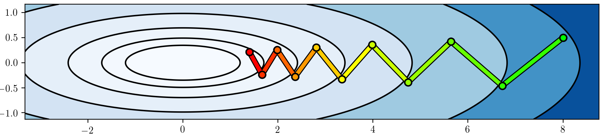
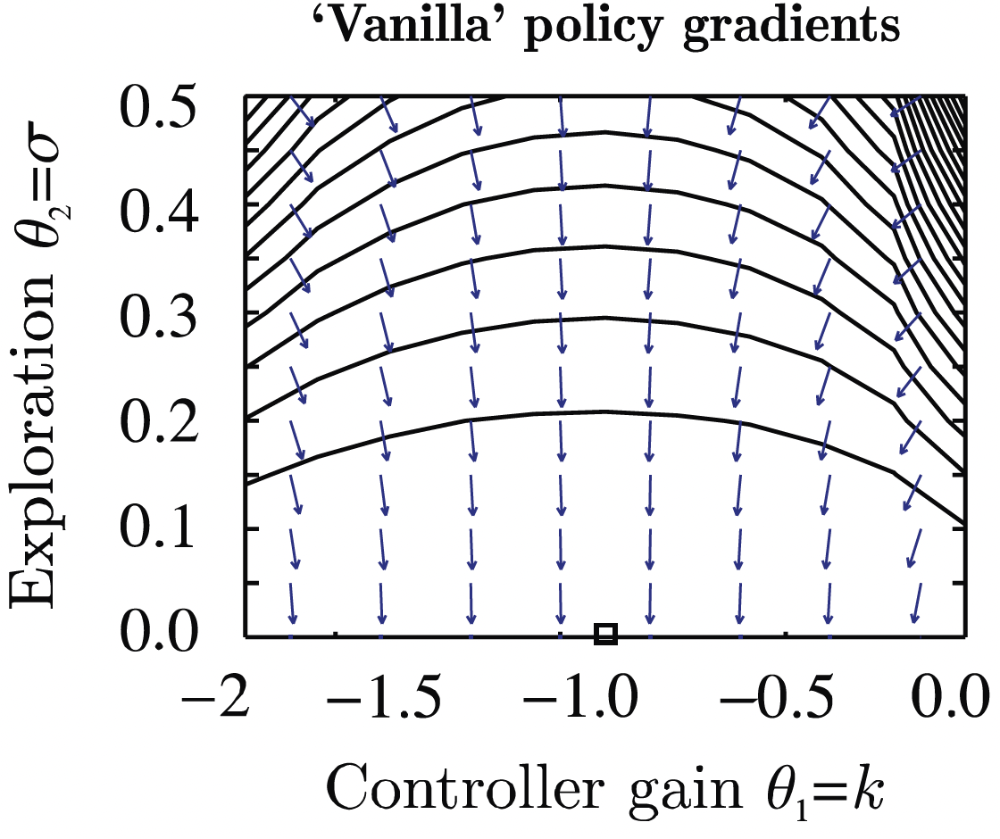
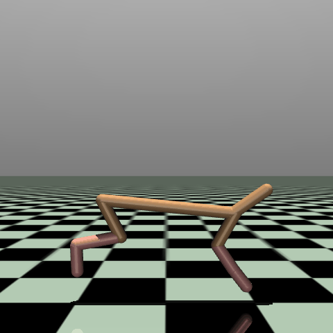
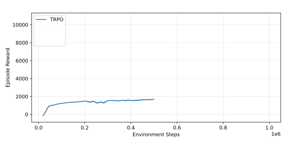

---
subtitle:    Advanced Algorithms (Part I)
chapter:     11
feedback:
  deck-id:  'deeprl-advanced-algorithms'
...


------------------------------------------------------------------------------

# Content

------------------------------------------------------------------------------

# Content

- The evolution of modern RL algorithms
- Part (I): Improving policy gradient methods
  - Natural policy gradient
  - Trust-region policy optimization (TRPO)
  - Proximal policy optimization (PPO)


# Where are we?

::: small
| Chapter | Topic                                                  |                            Content  |
| :--: | :-------------------------------------------------------- | :---------------------------------- |
|      | **Basics \& tabular methods**                             |                                     |
|   1-5  | Bandits, MDPs, Dynamic Programming, Monte Carlo, TD Learning |   RL basics in finite dimensions  |
|      | **Deep-learning-based methods**                           |        |
|   6  | Brief introduction to deep learning                       |    The basics for what comes next    |
|   7  | Value function approximation                              |    Value estimation with function approximation    | 
|   8  | Deep Q-learning                                           |   Q-learning with neural networks     | 
| 9    | Policy gradients                                          | Direct optimization of the policy      | 
|  10  | Actor-critic algorithms| Improved policy gradients via value functions | 
|  [11]{style="color: red;"}  | [Advanced algorithms (Part I): From policy gradient to PPO]{style="color: red;"} | [The evolution of modern RL algorithms]{style="color: red;"} | 
|  12  | Advanced algorithms (Part II): From $Q$-learning to Soft Actor-Critic | The evolution of moderl RL algorithms | 
|      | **Model-Based Control**                                   |        |
|      | **Advanced Topics**                                       |        |

Table: Lecture contents
:::

------------------------------------------------------------------------------

# The evolution of modern RL algorithms

------------------------------------------------------------------------------

# The evolution of modern RL algorithms

::: small
<!-- We have covered most of the foundations of RL methods. [Let's look at the **two main branches** we have seen so far.]{.fragment} -->

::: fragment
::: columns-5-5

::: platzhalter
## (I) Policy gradient methods

::: incremental
- Policy is explicitly parameterized and optimized directly: $$L(\phi)=\Expsub{r(\tau)}{\tau\sim p_\phi(\tau)}.$$
<!-- - $$\nabla_\phi L(\phi) = \Expsub{\sum_{t=0}^{T-1} \nablaphi \log \piphi\agivenb{a_t}{s_t} A^\pi(s_t, a_t)}{\tau\sim p_\phi(\tau)}.$$ -->
- Gradient descent: $\phi \gets \phi  + \alpha \nabla_\phi L(\phi)$.
- Methods are typically **on-policy**.
- **Algorithms**: REINFORCE $\rightarrow$ Actor-Critic $\rightarrow$ Natural Policy Gradient $\rightarrow$ Trust-region policy optimization (TRPO) $\rightarrow$ Proximal policy optimization (PPO).
:::
:::

::: fragment
## (II) Value-based methods

::: incremental
- Approximation of the $Q$-function:\
$$Q^*(s,a) = r + \max_{a'\in\Ac}Q^*(s',a').$$
- Extract implicit policy: $\pi(s) = \arg\max_{a\in\Ac} Q^*(s,a)$.
- Typically **off-policy**.
- **Algorithms**: Q-learning $\rightarrow$ DQN $\rightarrow$ Deep deterministic policy gradient (DDPG) $\rightarrow$ TD3 $\rightarrow$ Soft actor-critic (SAC).
:::
:::

:::
:::


::: columns-5-5

::: fragment
### [Shortcomings]{style="color: red;"}

::: incremental
- [High variance gradients.]{style="color: red;"}
- [Unstable policy updates.]{style="color: red;"}
- [Catastrophic performance collapse.]{style="color: red;"}
:::
:::

::: fragment
### [Shortcomings]{style="color: red;"}

::: incremental
- [Instability from bootstrapping.]{style="color: red;"}
- [Overestimation bias.]{style="color: red;"}
- [Maximization over actions / continuous action spaces.]{style="color: red;"}
:::
:::
:::


::: columns-5-5
::: fragment
### [Improvement strategy]{style="color: blue;"}

- [How to safely update policies.]{style="color: blue;"}
:::

::: fragment
### [Improvement strategy]{style="color: blue;"}

::: incremental
- [Stabilizing $Q$-learning with function approximation.]{style="color: blue;"}
- [Solving the continuous argmax problem.]{style="color: blue;"}
:::
:::
:::

:::

------------------------------------------------------------------------------

# Part (I): Improving policy gradient methods

------------------------------------------------------------------------------

# Ill-conditioned gradients

::: small
::: columns-5-5
::: platzhalter
.](images/11-advanced/PG-example-covariant.svg){ .embed width=600px }

[$$\begin{align*} 
r_t &= -s_t^2 - a_t^2 \\
\log\pi_\phi\agivenb{a_t}{s_t} &= -\frac{1}{2\sigma^2}(k s_t - a_t)^2 + C, \fragment{ \qquad \phi=(k,\sigma). } \\
\nablaphi\log\pi_\phi\agivenb{a_t}{s_t} &= \begin{pmatrix} -\frac{(k s_t - a_t)s_t}{\sigma^2} \\ \frac{(k s_t - a_t)^2}{\sigma^3} \end{pmatrix}
\end{align*}$$]{.math-incremental}
:::

::: fragment
![Source: [@Peters2008naturalac]](images/11-advanced/Covariant-PG-vanilla.png){ width=400px }
:::

:::

::: columns-5-5
::: incremental
- **Optimum**: $\phi^*=(-1,0)$.
- **Issue**: The gradients do not point towards the optimum for smaller $\sigma$!
  - The $\sigma^{-3}$ term blows up.
:::

::: fragment
Closely related to ill-conditioned optimization problems:
{ width=600px }
:::
:::

:::

# Constraining the ascent direction

::: small
::: columns-9-4
::: incremental
- Recall the policy gradient update: $\phi \gets \phi + \alpha \nablaphi L(\phi)$.
- A natural idea: **Constrain the length of our update step**!
  - Linearization of our optimization problem around $\phi$ using [Taylor series expansion](https://en.wikipedia.org/wiki/Taylor_series):
  [$$\begin{align*} 
  L(\phi') &= L(\phi) + \sum_{i=1}^n \pdiff{L}{\phi_i} (\phi'_i - \phi_i) + \Oc((\phi' - \phi)^2) \\
  &= L(\phi) + (\phi' - \phi)^\top \nablaphi L(\phi).
  \end{align*}$$]{.math-incremental}
  - Constrained optimization of $\phi'$ along the steepest ascent direction:
  $$\phi' \gets \arg\max_{\phi'} (\phi' - \phi)^\top \nablaphi L(\phi) \qquad \fragment{ \text{subject to}\qquad \norm{\phi' - \phi}^2\leq \epsilon. } $$
- **But**: We just saw that some parameters change probabilities *a lot more than others*! 
:::

[![Source: [@Peters2008naturalac]](images/11-advanced/Covariant-PG-vanilla.png){ width=350px }]{.fragment}
:::

::: incremental
- **Alternative**: Rescale the gradient so that this does not happen!
- A better way to constrain the update distance: The **change in distribution** via the [**Kullback-Leibler (KL) divergence**](https://en.wikipedia.org/wiki/Kullback%E2%80%93Leibler_divergence)!
$$ \KLdiv{\pi_\phi}{\pi_\phi'}. $$
:::

:::

------------------------------------------------------------------------------

# Aside: KL-divergence and Fisher information matrix

------------------------------------------------------------------------------


# Kullback-Leibler divergence {style="background-color: aliceblue;"}

::: small
::: columns-7-3
::: incremental
- The **Kullback-Leibler divergence** (or **KL divergence**) measures the "distance" between two distributions (e.g., $p(x)$ and $q(x)$)
$$ \KLdiv{p}{q}= \begin{cases} \sum_{x\in\Xc} p(x) \log\cbracket{\frac{p(x)}{q(x)}} & \text{if}~\Xc~\text{is finite} \\ \int{\Xc} p(x) \log\cbracket{\frac{p(x)}{q(x)}}\dx & \text{if}~\Xc~\text{is continuous} \end{cases}. $$
  - It is zero if and only if $p(x) = q(x)$.
- **Intuition**: Imagine you have two different maps of the exact same city.
  - Map A is completely accurate. Every street, etc., is exactly where it should be.
  - Map B was drawn from memory by a friend. It's mostly right with some minor flaws.
  - If you use Map B to navigate the city, you are going to make some mistakes.
  - The KL divergence answers the question: "How much extra 'gas' (or information) will I waste if I use Map B instead of Map A?"
:::

].](images/11-advanced/KLdivergence-example.png){ width=450px}
:::

::: incremental
- KL Divergence measures the *surprise* or *unfair penalty* you get when you use $q$ to predict something that actually follows $p$. If $q$ is a perfect match for $p$ (i.e., $q=p$), your surprise is zero. The worse your guess ($q$) is, the higher the KL divergence.
- **Question**: What happens if our "model" $q$ is absolutely certain that something is **not** going to happen ($q(x)=0$ for some $x$)?
:::
:::

::: footer
:bulb: The KL divergence is not a real distance. For instance, it it not symmetric (i.e., $\KLdiv{p}{q} \neq \KLdiv{q}{p}$ in general), which means that it also does not satisfy the triangle inequality. Still, it gives us a measure of how far two distributions are apart.
:::

# Fisher information matrix {style="background-color: aliceblue;"}

::: small
::: columns-5-4
::: incremental
- The **Fisher information matrix** (**FIM**) measures how much information an observable random variable $x$ carries about an unknown parameter $\phi$ (e.g., the weights of a neural network).
- Mathematically, if we have a log-likelihood function $\log p(x|\phi)$, the FIM (denoted as $F$) is the variance of its gradient (the "*score*"):
$$\begin{equation} F = \Exp{\cbracket{\nablaphi \log\, \pC{x}{\phi}} \cbracket{\nablaphi \log\, \pC{x}{\phi}}^\top}. \label{eq:Adv_Fisher_Information_Matrix} \end{equation}$$
:::

::: fragment
::: definition
**In simpler terms**: How do variations of $\phi$ influence the resulting probability distribution?

::: incremental
- High Fisher Information: Small change in $\phi$ $\Rightarrow$ large shift in the distribution.
- Low Fisher Information: Change in $\phi$ $\Rightarrow$ only small shift in the distribution.
:::
:::
:::
:::

::: fragment
### Relation to the KL divergence
:::

::: incremental
- Consider a very small change in $\phi$ by $\Delta\phi$, and study the KL divergence $\KLdiv{\pC{x}{\phi}}{\pC{x}{\phi + \Delta\phi}}$.
- If we perform a [Taylor series expansion](https://en.wikipedia.org/wiki/Taylor_series) of $D_{\mathsf{KL}}$ around $\Delta\phi=0$, then the first two terms are zero ($\KLdiv{\pC{x}{\phi}}{\pC{x}{\phi}} = 0$ and since $\Delta\phi=0$ is the minimum, the first derivative is zero as well).
- The second order term is thus the leading term! $\Rightarrow$ for small $\Delta\phi$, we have
$$\begin{equation} \KLdiv{\pC{x}{\phi}}{\pC{x}{\phi + \Delta\phi}} \approx \frac{1}{2} \Delta\phi^\top F \Delta\phi. \label{eq:Adv_KLdiv_Fisher} \end{equation}$$
:::

:::

# KL-divergence and Fisher information in RL {style="background-color: aliceblue;"}

::: small
::: incremental
- When using the KL divergence or the Fisher information matrix in RL, we often do so in terms of different policies.
- This means that we consider the difference in the **action distribution** $\KLdiv{\pi_\phi}{\pi_{\phi'}}$.
- However, this expression is incomplete or even misleading. 
- Instead, we consider either
$$ \KLdiv{\pi_\phi\agivenb{\cdot}{s}}{\pi_{\phi'}\agivenb{\cdot}{s}} = \int_{\Ac} \pi_\phi\agivenb{a}{s} \log\cbracket{\frac{\pi_\phi\agivenb{a}{s}}{\pi_{\phi'}\agivenb{a}{s}}}\dint{a}$$
for a fixed $s$, [or the expectation over the state space, i.e.,
$$\Expsub{\KLdiv{\pi_\phi\agivenb{\cdot}{s}}{\pi_{\phi'}\agivenb{\cdot}{s}}}{s \sim p_\phi}. $$]{.fragment}
- The relation between KL divergence and FIM for small changes can be derived analogously to the previous slide and reads
$$\Expsub{\KLdiv{\pi_\phi}{\pi_{\phi'}}}{s \sim p_\phi} \approx \frac{1}{2} \Delta\phi^\top \big( \underbrace{\Expsub{F(s)}{s \sim p_\phi}}_{=F} \big) \Delta\phi \fragment{ = \frac{1}{2} \Delta\phi^\top F \Delta\phi.}$$
:::
:::

------------------------------------------------------------------------------

# Natural policy gradient

------------------------------------------------------------------------------

# Back to constrained ascent directions

::: small
::: incremental
- Recall: constraining w.r.t. the parameter $\phi$ does not solve the issue of strongly different impacts of individual parameters:
$$\phi' \gets \arg\max_{\phi'} (\phi' - \phi)^\top \nablaphi L(\phi) \qquad \text{subject to}\qquad \norm{\phi' - \phi}^2\leq \epsilon.\qquad\qquad\qquad\qquad $$
- **Question**: What is a good alternative to avoid too large (and thus, harmful) steps?\
[$\Rightarrow$ the KL divergence!
$$\phi' \gets \arg\max_{\phi'} (\phi' - \phi)^\top \nablaphi L(\phi) \qquad \text{subject to}\qquad \Expsub{\KLdiv{\pi_{\phi'}\agivenb{\cdot}{s}}{\pi_{\phi}\agivenb{\cdot}{s}}}{s \sim p_\phi}\leq \epsilon. $$]{.fragment} 
  - Constraining the KL divergence means that we automatically treat different parameters differently!
  - If a change in one of the entries of $\phi$ results in large policy changes, then the constraint does not allow large changes in that entry.
- Since we want to have small updates (constrained by $\epsilon$): approximation via the Fisher information matrix,
$$\begin{align*} \phi' \gets \arg\max_{\phi'} (\phi' - \phi)^\top \nablaphi L(\phi) \qquad &\text{subject to}\qquad (\phi'-\phi)^\top F (\phi'-\phi), \\
&\text{with}\qquad F = \Expsub{\cbracket{\nablaphi \log\, \pi_{\phi}\agivenb{a}{s}} \cbracket{\nablaphi \log\, \pi_{\phi}\agivenb{a}{s}}^\top}{s \sim p_\phi, a \sim \pi_\phi\agivenb{\cdot}{s}}.
\end{align*} $$

:::
:::

# Natural policy gradient

::: small
::: columns-7-3
::: incremental
- We have now defined a policy gradient whose update length is constrained in terms of the KL divergence: 
$$\begin{equation} \phi' \gets \arg\max_{\phi'} (\phi' - \phi)^\top \nablaphi L(\phi) \quad \text{subject to}\quad (\phi'-\phi)^\top F (\phi'-\phi). \label{eq:Adv_Natural_PG} \end{equation}$$
- What remains is the question of solving \eqref{eq:Adv_Natural_PG}.
- Without going into further details (e.g., [@Kakade2001npg;@Peters2008naturalac])\
$\Rightarrow$ Solution: **scale** the policy gradient **by the inverse Fisher information matrix**,
$$\begin{equation} \phi \gets \phi + \alpha F^{-1} \nablaphi L(\phi). \label{eq:Adv_NPG} \end{equation}$$
- **Intuition** behind the inverse FIM $F^{-1}$:
  - Parameters with a high impact have high Fisher information.
  - Scaling by the inverse "normalizes" the individual impacts.
- This techinque is known as the **natural policy gradient** (also **covariant policy gradient**).
  - Preconditioning steps of this type are very common in optimization in general.
  - Drawback: $F\in\R^{d \times d}$ can be very expensive to calculate (and invert) for very large parameter vectors.
:::

::: platzhalter
[{ width=300px }]{.fragment}

\

[![Source: [@Peters2008naturalac]](images/11-advanced/Covariant-PG.png){ width=300px }]{.fragment}
:::


:::
:::

# Limitations of the natural policy gradient

::: small
::: definition
$$\begin{equation} \phi \gets \phi + \alpha F^{-1} \nablaphi L(\phi) \tag{\ref{eq:Adv_NPG}} \end{equation}$$
:::

::: columns-4-6
::: fragment 
::: {style="background-color: AliceBlue;"}
## 1. The step size $\alpha$ is hard to choose!
  - Scaling doesn't prevent the step from changing the policy too much. 
  - Large steps can collapse performance.
:::
:::

::: fragment
::: {style="background-color: LightCoral;"}
## 2. No explicit control of policy change.
  - NPG does not explicitly constrain the distance between $\subold{\pi}$ and $\subnew{\pi}$. 
  - Data for gradient estimation is sampled from $\subold{\pi}$​​. 
  - If new policy differs too much, gradient estimate becomes unreliable.
:::
:::
:::

\

::: columns-5-5
::: fragment
::: {style="background-color: DarkSeaGreen;"}
## 3. Inversion of the Fisher matrix.
  - NPG requires inversion of the Fisher Information Matrix.
  - If our network has $d$ parameters, the FIM is a $d \times d$ matrix.
  - For a modest deep learning network with 100,000 parameters, $F$ contains 10 billion elements.
  - Storing this in memory and computing its exact inverse ($\Oc(d^3)$ complexity) $\Rightarrow$ computationally impossible.
:::
:::

::: fragment
::: {style="background-color: LemonChiffon;"}
## 4. Performance guarantees require small policy changes.
  - NPG does not provide a mathematical guarantee that $\subnew{\pi}$ will actually be better than (or at least as good as) $\subold{\pi}$.
  - Theory shows that small policy updates should improve performance [@Kakade2002approximately] ...
  - ... but the basic NPG update does not enforce the required small change condition.
:::
:::
:::
:::

------------------------------------------------------------------------------

# Trust-region policy optimization

------------------------------------------------------------------------------

# Performance measures of policies

::: small
::: incremental
- Let's introduce a new (and yet *already known* quantity): the **performance measure** of a policy,
$$ \eta(\pi) = \Expsub{\sum_{t=0}^{T-1}\gamma^t r_t}{\tau\sim \pi} = \Expsub{V^\pi(s_0)}{s_0 \sim p_0}. $$ 
- Remember our reinforcement learning objective
$$ L(\phi) = \Expsub{\sum_{t=0}^{T-1}r_t}{\tau\sim p_\phi(\tau)} = \Expsub{\Vpiphi(s_0)}{s_0 \sim p_0} ? $$
- If we consider a policy parameterized by $\phi$, i.e., $\pi_\phi$, then the two equations are the same,
$$\eta(\pi_\phi) = L(\phi).$$
- The difference is more in terms of the *motivation*, not the definition:
  - We use $L(\phi)$ in policy gradients, since we want to find ascent directions for the network paraemters.
  - We use $\eta(\pi)$ as a global quantity to establish mathematical lower-bounds so that an algorithm can compute a safe step size (the trust region).
:::
:::

::: footer
:bulb: For more details on this matter, see [@Kakade2002approximately;@Schulman2015trpo].
:::

# Comparing the performance measure of two policies (1)

::: small
::: incremental
- Can we relate two policies $\subold{\pi}$ and $\subnew{\pi}$ using advantage functions?
- Let's use $\gamma=1$ for simplicity (but one can work this out with $\gamma$ as well).
- Consider the advantage function under the old policy $\subold{\pi}$,
$$ A_{\subold{\pi}}(s_t,a_t) = r_t + V^{\subold{\pi}}(s_{t+1}) - V^{\subold{\pi}}(s_{t}). $$
- Now sample a trajectory under the new policy $\subnew{\pi}$ (i.e., $(s_0,a_0) \to \ldots \to (s_{T-1},a_{T-1})$) and calculate the advantages:
[$$\begin{align*}
A_{\subold{\pi}}(s_0,a_0) &= r_0 + V^{\subold{\pi}}(s_{1}) - V^{\subold{\pi}}(s_{0}) \\
A_{\subold{\pi}}(s_1,a_1) &= r_1 + V^{\subold{\pi}}(s_{2}) - V^{\subold{\pi}}(s_{1}) \\
&~ ~ \vdots \\
A_{\subold{\pi}}(s_{T-2},a_{T-2}) &= r_{T-2} + V^{\subold{\pi}}(s_{T-1}) - V^{\subold{\pi}}(s_{T-2}) \\
A_{\subold{\pi}}(s_{T-1},a_{T-1}) &= r_{T-1} + \underbrace{V^{\subold{\pi}}(s_{T})}_{=0 \text{ (terminal)}} - V^{\subold{\pi}}(s_{T-1})
\end{align*}$$]{.math-incremental}
:::

:::

# Comparing the performance measure of two policies (2)

::: small
::: incremental
- Take the sum:
[$$\begin{align*} 
\sum_{t=0}^{T-1} A_{\subold{\pi}}(s_t,a_t) &= \underbrace{r_0 \textcolor{blue}{+ {V^{\subold{\pi}}(s_{1})}} - V^{\subold{\pi}}(s_{0})}_{=A_{\subold{\pi}}(s_0,a_0)} + \underbrace{r_1 + {V^{\subold{\pi}}(s_{2})} \textcolor{blue}{- {V^{\subold{\pi}}(s_{1})}}}_{=A_{\subold{\pi}}(s_1,a_1)} + \ldots + \underbrace{r_{T-2} \textcolor{red}{+ {V^{\subold{\pi}}(s_{T-1})}} - {V^{\subold{\pi}}(s_{T-2})}}_{=A_{\subold{\pi}}(s_{T-2},a_{T-2})} + \underbrace{r_{T-1} \textcolor{red}{- {V^{\subold{\pi}}(s_{T-1})}}}_{=A_{\subold{\pi}}(s_{T-1},a_{T-1})} \\
&= r_0 + r_1 + \ldots + r_{T-2} + r_{T-1} - V^{\subold{\pi}}(s_{0}) \fragment{ = \cbracket{\sum_{t=0}^{T-1} r_t} - V^{\subold{\pi}}(s_{0}) .}
\end{align*}$$]{.math-incremental}
- Shift around and take the expectation with respect to the new policy [(in the case of $V^{\subold{\pi}}$, this reduces to $s_0 \sim p_0$):]{.fragment}
[$$\begin{align*}
\Expsub{\cbracket{\sum_{t=0}^{T-1} r_t}}{s\sim p_{\subnew{\pi}}, a\sim\subnew{\pi}} &= \Expsub{V^{\subold{\pi}}(s_{0})}{s_0 \sim p_0} + \Expsub{\sum_{t=0}^{T-1} A_{\subold{\pi}}(s_t,a_t)}{s\sim p_{\subnew{\pi}}, a\sim\subnew{\pi}} \\
\Leftrightarrow \qquad\eta(\subnew{\pi}) &= \eta(\subold{\pi}) + \Expsub{\sum_{t=0}^{T-1} \gamma^t A_{\subold{\pi}}(s_t,a_t)}{s\sim p_{\subnew{\pi}}, a\sim\subnew{\pi}}
\end{align*}$$]{.math-incremental}
- Right now, the expectation is written over an entire lifetime trajectory ($\tau \sim \subnew{\pi}$). 
- To be useful for an optimization algorithm, we need to break it down step-by-step and look at individual states and actions.
:::
:::

# Comparing the performance measure of two policies (3)

::: small
::: incremental
- Let's consider the continual case ($T=\infty$) such that we can disect the expectation into individual steps:
[$$\begin{align*} 
\Expsub{\sum_{t=0}^{\infty} \gamma^t A_{\subold{\pi}}(s_t,a_t)}{s\sim p_{\subnew{\pi}}, a\sim\subnew{\pi}} &= \sum_{t=0}^{\infty} \gamma^t \Expsub{A_{\subold{\pi}}(s_t,a_t)}{s\sim p_{\subnew{\pi}}, a\sim\subnew{\pi}} \\
&=\sum_{t=0}^{\infty}\int_\Sc p_{\subnew{\pi}}(s) \int_\Ac \subnew{\pi}\agivenb{a}{s} A_{\subold{\pi}}(s,a) \dint{a} \dint{s}\\
&=\int_\Sc \underbrace{\cbracket{\sum_{t=0}^{\infty} \gamma^t p_{\subnew{\pi}}(s)}}_{\fragment{ =\rho_{\subnew{\pi}}(s) }} \cbracket{\int_\Ac \subnew{\pi}\agivenb{a}{s} A_{\subold{\pi}}(s,a) \dint{a}} \dint{s} \\
&= \Expsub{A_{\subold{\pi}}(s,a)}{s \sim \rho_{\subnew{\pi}}, a\sim\subnew{\pi}}.
\end{align*}$$]{.math-incremental}
- Here, we have introduced the **discounted state distribution** $\rho_{\subnew{\pi}}(s)$.
:::

::: fragment
::: definition 
### Relation between the performance measures
$$\begin{equation} \eta(\subnew{\pi}) = \eta(\subold{\pi}) + \Expsub{A_{\subold{\pi}}(s,a)}{s \sim \rho_{\subnew{\pi}}, a\sim\subnew{\pi}} \label{eq:Adv_performance_measures} \end{equation}$$
:::
:::
:::

::: fragment
::: footer
:bulb: When sampling, the data will automatically be distributed according to $\rho_{\subnew{\pi}}(s)$. See also the discussion in the actor-critic lecture.
:::
:::


# Comparing the performance measure of two policies (4)

::: small
::: definition 
### Relation between the performance measures
$$\begin{equation} \eta(\subnew{\pi}) = \eta(\subold{\pi}) + \Expsub{A_{\subold{\pi}}(s,a)}{s \sim \rho_{\subnew{\pi}}, a\sim\subnew{\pi}} \tag{\ref{eq:Adv_performance_measures}} \end{equation}$$
:::

::: fragment
### What's so surprising about this equation?
:::

::: incremental
- The Advantage function is built entirely out of the old policy's values, 
- yet when we weight it by the new policy's state distribution, 
- it perfectly calculates the new policy's total return. 
:::

::: fragment
::: definition
### Upside and downside of this identity

[$\textcolor{green}{\mathbf{+}\text{ Proof that if you can find a new policy with a positive expected advantage under the old policy, your policy will get better.}}$]{.fragment}

[$\textcolor{red}{\mathbf{-}\text{ To compute the exact value, we must sample states from the new policy (}s \sim p_{\subnew{\pi}}\text{), which we do not yet know!}}$]{.fragment}

[**Solution approach in TRPO**: "If $\subnew{\pi}$ is very close to $\subold{\pi}$ (enforced by a KL-constraint), we can swap the state distribution $p_{\subnew{\pi}}$ for $p_{\subnew{\pi}}$ and safely optimize an approximation (i.e., a *surrogate objective*)."]{.fragment}
:::
:::

:::

# How to turn this into an algorithm

::: small
::: definition 
### Relation between the performance measures
$$\begin{equation} \eta(\subnew{\pi}) = \eta(\subold{\pi}) + \Expsub{A_{\subold{\pi}}(s,a)}{s \sim \rho_{\subnew{\pi}}, a\sim\subnew{\pi}} \tag{\ref{eq:Adv_performance_measures}} \end{equation}$$
:::

Starting with \eqref{eq:Adv_performance_measures}, we need to take the several steps to arrive at an algorithm that we can actually implement.

::: incremental
1. Construct a local approximation of \eqref{eq:Adv_performance_measures} (the *surrogate loss*) which we can estimate using samples.
1. Ensure that this approximation is sufficiently accurate.
1. Turn he surrogate loss function into a practical optimization problem.
1. Make sure that it scales to large problems.
:::

::: fragment
::: definition
### Trust-region policy optimization (TRPO)

The first realization of these steps resulted in the TRPO algorithm, which was derived in [@Schulman2015trpo].
:::
:::
:::

# TRPO: The surrogate loss function

::: small
::: definition 
### Relation between the performance measures
$$\begin{equation} \eta(\subnew{\pi}) = \eta(\subold{\pi}) + \Expsub{A_{\subold{\pi}}(s,a)}{s \sim \rho_{\subnew{\pi}}, a\sim\subnew{\pi}} \tag{\ref{eq:Adv_performance_measures}} \end{equation}$$
:::

::: incremental
- In principle, this equation shows us a way to guarantee policy improvement.
- If we can ensure positive expected advantages, then we improve!
- **But**: Sampling under the new policy ($s\sim \rho_{\subnew{\pi}}, a\sim\subnew{\pi}$) is infeasible, as we do not have it yet!
:::

::: fragment
::: definition
## A surrogate loss function

::: incremental
- Simple trick: just sample the state $s$ under the *old* policy!
$$\begin{equation} L_\subold{\pi}(\pi) = \eta(\subold{\pi}) + \Expsub{A_{\subold{\pi}}(s,a)}{\textcolor{red}{s\sim \rho_{\subold{\pi}}}, a\sim\pi}. \label{eq:Adv_surrogate_loss} \end{equation}$$
- Under the assumption that $\subold{\pi}$ and $\subnew{\pi}$ do not differ too much, this is a reasonable assumption.
- In the limit case $\subold{\pi} = \subnew{\pi}$, we have equality of \eqref{eq:Adv_performance_measures} and \eqref{eq:Adv_surrogate_loss}, as well as their gradients [@Schulman2015trpo{}, Eq. (4)].
:::
:::
:::
:::

# TRPO: Approximation error

::: small
In [@Schulman2015trpo], it was shown that error between the two expressions \eqref{eq:Adv_performance_measures} and \eqref{eq:Adv_surrogate_loss} can be bounded
$$\eta(\pi) \ge L_\subold{\pi}(\pi) - C \cdot \KLdivmax{\subold{\pi}}{\pi}, \qquad \text{with}\quad\KLdivmax{\subold{\pi}}{\pi}=\max_{s\in\Sc}\KLdiv{\pi_\phi\agivenb{\cdot}{s}}{\pi_{\phi'}\agivenb{\cdot}{s}},$$
and $C$ is a constant derived from the environment's transition dynamics and the maximum bounds of the advantage function.

[**Central message**: If we maximize the right-hand side of this inequality, we are guaranteed to improve (or at least maintain) our true performance $\eta(\pi)$!]{.fragment}

::: columns-5-5
::: fragment
**Maximizing the surrogate loss** $\Rightarrow$ introducing a parametric policy $\pi_\phi$, our surrogate-based optimization problem is
$$ \max_\phi L_\subold{\pi}(\pi_\phi) - C \cdot \KLdivmax{\subold{\pi}}{\pi_\phi}, $$
or, if we consider two iterates $\phi$ and $\phi'$
$$ \max_{\phi'} L_{\pi_\phi}(\pi_{\phi'}) - C \cdot \KLdivmax{\pi_\phi}{\pi_{\phi'}}. $$
:::

::: fragment
**Challenges**:

::: incremental
1. The constant $C$ is usually large and thus restrictive\
[**Solution**: Transfer to a constraint with hyperparameter $\delta$.]{.fragment}
2. Computing the maximum KL divergence over all possible states ($\KLdivmax{\pi_{\subold{\phi}}}{\pi_{\phi}}$) is impossible.\
[**Solution**: Replace by the average KL divergence over the states that were actually observed:
$$\KLdivavg{\pi_\phi}{\pi_{\subold{\phi}}} = \Expsub{\KLdiv{\pi_{\subold{\phi}}\agivenb{\cdot}{s}}{\pi_{\phi}\agivenb{\cdot}{s}}}{s \sim \rho_{\pi_\subold{\phi}}}.$$
]{.fragment}
:::
:::
:::
:::

# TRPO: Sampling the correct expectation

::: small
Our final observation is that in our surrogate loss function $L_\subold{\pi}$ (Eq. \eqref{eq:Adv_surrogate_loss}), the "old" performance measure $\eta(\subold{\pi})$ serves as a constant [$\Rightarrow$ we can neglect it!]{.fragment}

::: incremental
- Overall, we obtain the following surrogate optimization problem:
$$
\max_{\phi} \underbrace{\Expsub{A_{\subold{\pi}}(s,a)}{s\sim \rho_{\subold{\pi}}, a\sim{\pi_\phi}}}_{=L_\subold{\pi}(\pi_\phi) - \eta(\subold{\pi})} \quad\text{subject to}\quad \underbrace{\Expsub{\KLdiv{\subold{\pi}\agivenb{\cdot}{s}}{\pi_{\phi}\agivenb{\cdot}{s}}}{s \sim \rho_{\subold{\pi}}}}_{=\KLdivavg{\subold{\pi}}{\pi_{\phi}}} \leq \delta.$$
- What's wrong with this equation?\
[$\Rightarrow$ In the loss, we're compute expectations over the new policy $\pi_\phi$, but the data was collected under $\subold{\pi}$!
$$\Expsub{A_{\subold{\pi}}(s,a)}{s\sim \rho_{\subold{\pi}}, a\sim{\pi_\phi}} = \int_\Sc \rho_{\subold{\pi}}(s) \int_\Ac \pi_\phi\agivenb{a}{s} A_{\subold{\pi}}(s,a) \dint{a} \dint{s}. $$]{.fragment}
- **Solution**: Importance sampling!
$$ \int_\Sc \rho_{\subold{\pi}}(s) \int_\Ac \subold{\pi}\agivenb{a}{s}\frac{\pi_\phi\agivenb{a}{s}}{\subold{\pi}\agivenb{a}{s}} A_{\subold{\pi}}(s,a) \dint{a} \dint{s} = \Expsub{\frac{\pi_\phi\agivenb{a}{s}}{\subold{\pi}\agivenb{a}{s}} A_{\subold{\pi}}(s,a)}{s\sim \rho_{\subold{\pi}}, a\sim\subold{\pi}}. $$
:::

:::

# TRPO: The surrogate optimization problem

::: small
::: definition
### Trust-region policy optimization (TRPO) optimization problem

$$\begin{equation}
\max_{\phi} \underbrace{\Expsub{\frac{\pi_\phi\agivenb{a}{s}}{\subold{\pi}\agivenb{a}{s}}A_{\subold{\pi}}(s,a)}{s\sim \rho_{\subold{\pi}}, a\sim\subold{\pi}}}_{=L_\mathsf{TRPO}(\phi)} \quad\text{subject to}\quad \underbrace{\Expsub{\KLdiv{\subold{\pi}\agivenb{\cdot}{s}}{\pi_{\phi}\agivenb{\cdot}{s}}}{s \sim \rho_{\subold{\pi}}}}_{=\KLdivavg{\subold{\pi}}{\pi_{\phi}}} \leq \delta. \label{eq:Adv_TRPO_Opt} 
\end{equation}$$
:::

[**Next question**: How do we solve it efficiently?]{.fragment}
[$\Rightarrow$ Let's start with the gradient!]{.fragment}

[$$
\nablaphi L_\mathsf{TRPO}(\phi) = \nablaphi \Expsub{\frac{\pi_\phi\agivenb{a}{s}}{\subold{\pi}\agivenb{a}{s}}A_{\subold{\pi}}(s,a)}{s\sim \rho_{\subold{\pi}}, a\sim\subold{\pi}} \fragment{ = \Expsub{\frac{\nablaphi \pi_\phi\agivenb{a}{s}}{\subold{\pi}\agivenb{a}{s}}A_{\subold{\pi}}(s,a)}{s\sim \rho_{\subold{\pi}}, a\sim\subold{\pi}} }
$$]{.fragment}

::: fragment
::: definition
### The Policy gradient for the TRPO surrogate loss

[$$\begin{equation} \begin{aligned}
g &= \nablaphi L_\mathsf{TRPO}(\phi) \fragment{ \Big|_{\textcolor{red}{\phi=\subold{\phi}}} } \fragment{ =\Expsub{\frac{\nablaphi \pi_{\phi}\agivenb{a}{s}\big|_{\phi=\subold{\phi}}}{\pi_\subold{\phi}\agivenb{a}{s}}A_{\pi_\subold{\phi}}(s,a)}{s\sim \rho_{\pi_\subold{\phi}}, a\sim\pi_\subold{\phi}} } \\
&=\Expsub{\nablaphi \log \pi_\phi\agivenb{a}{s}\big|_{\phi=\subold{\phi}} A_{\pi_\subold{\phi}}(s,a)}{s\sim \rho_{\pi_\subold{\phi}}, a\sim\pi_\subold{\phi}} \quad\textcolor{grey}{\text{\textit{(Log-identity trick)}}} \end{aligned}
\label{eq:Adv_TRPO_gradient}\end{equation}$$]{.math-incremental}
[is the standard policy gradient with value baseline!]{.fragment}
:::
:::

:::

# TRPO: Solving the optimization problem \eqref{eq:Adv_TRPO_Opt} {menu-title="TRPO: Solving the optimization problem"}

::: small
To solve Problem \eqref{eq:Adv_TRPO_Opt} efficiently, we need two steps:

::: incremental
1. Linearize the objective function: First-order [Taylor series expansion](https://en.wikipedia.org/wiki/Taylor_series) around $\subold{\phi}$ using the gradient $g$ (Eq. \eqref{eq:Adv_TRPO_gradient}).
$$ L_\mathsf{TRPO}(\phi) \approx L_\mathsf{TRPO}(\subold{\phi}) + g^\top(\phi - \subold{\phi}) \fragment{ = g^\top(\phi - \subold{\phi}). } $$
[(The term $L_\mathsf{TRPO}(\subold{\phi})$ drops out because it is exactly zero at $\subold{\phi}$: No advantage and sampling ratio is one.)]{.fragment}
2. Quadratic approximation of the KL constraint for small $\Delta\phi=(\phi - \subold{\phi})$ [$\Rightarrow$ Fisher information matrix (Eq. \eqref{eq:Adv_KLdiv_Fisher})!]{.fragment}
:::

::: columns-6-4
::: fragment
::: definition
## Linear-quadratic approximation of the TRPO problem \eqref{eq:Adv_TRPO_Opt}

$$\begin{equation}
\max_{\Delta\phi} g^\top\Delta\phi \quad\text{subject to}\quad \frac{1}{2}\Delta\phi^\top F \Delta\phi \leq \delta, \label{eq:Adv_TRPO_LQOpt} 
\end{equation}$$
where, according to \eqref{eq:Adv_Fisher_Information_Matrix}, $$F(\phi) = \Expsub{ \rbracket{\cbracket{\nablaphi \log\, \pi_{\phi}\agivenb{a}{s}} \cbracket{\nablaphi \log\, \pi_{\phi}\agivenb{a}{s}}^\top}_{\phi=\subold{\phi}}}{s\sim \rho_{\pi_\subold{\phi}}, a\sim\pi_\subold{\phi}}.$$
:::
:::

::: fragment
::: definition
### Solution to \eqref{eq:Adv_TRPO_LQOpt}

The solution (via [Lagrange multipliers](https://en.wikipedia.org/wiki/Lagrange_multiplier)) yields
$$\begin{equation} \Delta \phi = \sqrt{\frac{2\delta}{g^\top F^{-1} g}} F^{-1} g. \label{eq:Adv_TRPO_step} \end{equation}$$
[**Note**: This is NPG \eqref{eq:Adv_NPG} with automatic step size selection $\alpha=\sqrt{\frac{2\delta}{g^\top F^{-1} g}}$!]{.fragment}
:::
:::
:::
:::

::: fragment
::: footer
:bulb: In classical optimization, the local approximation \eqref{eq:Adv_TRPO_LQOpt} is solved repeatedly. The solution can be shown to converge to the optimum of \eqref{eq:Adv_TRPO_Opt}, which is known as **Sequential Quadratic Programming** (**SQP**). In TRPO, we solve the approximation \eqref{eq:Adv_TRPO_LQOpt} just once before collecting new data.
:::
:::


# TRPO: Avoiding matrix inversion

::: small
::: definition
$$\begin{equation} \Delta \phi = \sqrt{\frac{2\delta}{g^\top F^{-1} g}} F^{-1} g \tag{\ref{eq:Adv_TRPO_step}} \end{equation}$$
:::

::: incremental
- Matrix inversion scales cubically. [That is, for a $d$-dimensional parameter $\phi\in\R^d$, we have $\Oc(d^3)$.]{.fragment}
- Solution: Use the [conjugate gradient (CG) method](https://en.wikipedia.org/wiki/Conjugate_gradient_method) for solving linear systems of the form $F x = g$.
  - Usually, CG scales according to $\Oc(d^2)$ per iteration.
  - However, in TRPO, we can avoid calculating $F\in\R^{d\times d}$ entirely using automatic differentiation $\Rightarrow$ scales linearly with the number of weights (i.e., $\Oc(d)$).
  - This is as fast as it gets!
:::

::: fragment
### Approach
:::

::: incremental
- Compute $x = F^{-1}g$ using the CG method ($\Oc(d)$ if we use autodiff).
- Calculate the denominator in \eqref{eq:Adv_TRPO_step} (Note that $F^\top = F$, since the FIM is symmetric):
$$ \nu = g^\top F^{-1} g \fragment{ = (Fx)^\top F^{-1} Fx } \fragment{ = x^\top F^\top F^{-1} Fx } \fragment{ = x^\top F x } \fragment{ = x^\top g. } $$
- Compute the step size $\beta = \sqrt{\frac{2\delta}{\nu}} F^{-1} g$.
- Compute the update $\Delta \phi = \beta x$.
:::
:::

# TRPO: Step size selection

::: small
::: columns-5-5
::: platzhalter
::: definition
### TRPO surrogate problem

$$\begin{equation}\begin{aligned} 
\max_{\phi} L_\mathsf{TRPO}(\phi) \quad\text{s.t.}\quad \KLdivavg{\subold{\pi}}{\pi_{\phi}} \leq \delta. \end{aligned} \tag{\ref{eq:Adv_TRPO_Opt}} 
\end{equation}$$
:::
:::

::: platzhalter
::: definition
### Linear-quadratic approximation
$$\begin{equation}
\max_{\Delta\phi} g^\top\Delta\phi \quad\text{subject to}\quad \frac{1}{2}\Delta\phi^\top F \Delta\phi \leq \delta, \tag{\ref{eq:Adv_TRPO_LQOpt}} 
\end{equation}$$
:::
:::
:::

[**Issue**: Even though we have selected an optimal step size for \eqref{eq:Adv_TRPO_LQOpt} in \eqref{eq:Adv_TRPO_step}, we are not guaranteed that in \eqref{eq:Adv_TRPO_Opt}, we]{.fragment}

::: incremental
- actually get a descent in $L_\mathsf{TRPO}(\phi)$,
- satisfy the constraint $\KLdivavg{\subold{\pi}}{\pi_{\phi}} \leq \delta$.
:::

::: fragment
::: definition
**Step length selection via [backtracking](https://en.wikipedia.org/wiki/Backtracking_line_search).**
[Define a *shrinkage parameter* $\alpha\in(0,1)$ and]{.fragment}

::: incremental
1. Get $\Delta\phi$ by solving \eqref{eq:Adv_TRPO_LQOpt}.
1. Calculate candidate $\phi' = \subold{\phi} + \Delta\phi$ for the next iterate.
1. Check the following two conditions (recall that $L_\mathsf{TRPO}(\subold{\phi})=0$):
$$(I)\quad L_\mathsf{TRPO}(\phi') >0 ~ ? \qquad\text{and}\qquad (II)\quad \KLdivavg{\subold{\pi}}{\pi_{\phi'}} \leq \delta ~ ?$$
1. **if** (I) and (II) are satisfied **then** set $\subnew{\phi}=\phi'$ and $\STOP$. $\qquad$
[**else:** set $\Delta\phi \gets \alpha \Delta\phi$ and go back to 2.]{.fragment}
:::
:::
:::
:::

# TRPO: Final algorithm

::: small
::: definition

<!-- ### Algorithm: Trust-Region Policy Optimization (TRPO) -->

**Input:** Initial policy parameters $\iterate{\phi}{0}$, trust-region bound $\delta$, backtracking parameter $\alpha \in (0, 1)$, acceptance threshold $\epsilon > 0$.

For iterations $k = 0, 1, 2, \dots$ until convergence:

1. **Data collection:**
Run the current policy $\pi_{\iterate{\phi}{k}}$ in the environment to collect a batch of trajectories $\Bc = \{(s_t, a_t, r_t)\}$.
2. **Advantage estimation:**
Estimate the advantage values $A_{\iterate{\phi}{k}}(s, a)$ for all sampled steps.
3. **Compute policy gradient ($g$):**
Evaluate the standard policy gradient vector $g$ using the collected samples:
$$g = \frac{1}{\abs{\Bc}} \sum_{s,a \in \Bc} \nablaphi \log \pi_\phi\agivenb{a}{s}\Big|_{\phi=\iterate{\phi}{k}} A_{\iterate{\phi}{k}}(s,a)$$
4. **Compute Step Direction ($x$) via Truncated CG** ($10$ to $20$ iterations) to solve the linear system $Fx = g$ for $x \approx F^{-1}g$. 
<!-- (*Note: The matrix-vector product $Fx$ is computed matrix-free via automatic differentiation.*) -->
5. **Maximal step size ($\beta$):**
Compute $\beta = \sqrt{\frac{2\delta}{x^T F x}}$. Set the full proposed step direction: $\Delta \phi = \beta x$.
6. **Backtracking:**
Find largest factor $\gamma = \alpha^j$ (for $j = 0, 1, 2, \dots$) such that $\subnew{\phi} = \iterate{\phi}{k} + \gamma \Delta \phi$ satisfies:
$$L_\mathsf{TRPO}(\subnew{\phi}) >0 \qquad\text{and}\qquad \KLdivavg{\iterate{\phi}{k}}{\subnew{\phi}} \leq \delta $$
7. **Policy Update:**
Update parameters to the safe, verified step:
$\iterate{\phi}{k+1} = \iterate{\phi}{k} + \gamma \Delta \phi$ (or *reject* if no $\gamma$ can be found).
:::
:::

<!-- # TITLE

### The Big Picture Structure

```
 Collect Data ──► Compute Gradient (g) ──► CG Loop (F⁻¹g) ──► Line Search (KL ≤ δ) ──► Update θ
      ▲                                                                                     │
      └─────────────────────────────────────────────────────────────────────────────────────┘

``` -->

# Example: Half-Cheetah

::: small
::: columns-3-2-2
::: platzhalter
As an example, we study the [Half Cheetah](https://gymnasium.farama.org/environments/mujoco/half_cheetah/) example from the MuJoCo library.

- $\Sc$: 17 states.
- $\Ac$: 6 actions.
- Reward: Forward-Cost - Control-Cost.
:::

::: platzhalter
{width=350px}
:::


{width=200px}

:::
\

::: fragment
::: columns-7-3
::: platzhalter
### Results with TRPO
{width=650px}
:::

::: fragment
\

{width=300px .controls .autoplay .muted }
:::
:::

:::

:::

------------------------------------------------------------------------------

# Proximal policy optimization (PPO)

------------------------------------------------------------------------------

# Proximal policy optimization (PPO)

::: small
::: incremental
- TRPO solves $\max_\theta L(\theta)$ subject to $D_{KL}(\pi_{\subold{\theta}},\pi_\theta) \le \delta$. To do this it requires:
  - second‑order information (Fisher matrix)
  - conjugate gradient
  - a line search
  - KL constraint checks 
- Most deep learning uses first‑order optimizers (Adam, SGD). TRPO instead requires solving $F^{-1} g$, which means special optimization code rather than standard gradient descent.
- Because of the line search and constraint checks, each update is more expensive and harder to integrate into large-scale training pipelines.
Researchers wanted something that: 
  - keeps small policy updates
  - but uses simple gradient descent
:::
Two possible approaches:
::: incremental
1. Turn constraint into penalty term (tuning constant is hard).
2. Clipped objective (the one people use)
:::

# Evolution of policy gradient methods

::: small
- policy gradient
- natural policy gradient
- TRPO: maximize surrogate objectivesubject to KL trust region
- PPO: replace hard trust region with clipped objective
:::


# References

::: { #refs }
:::
