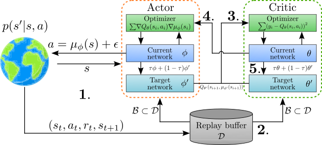
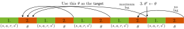
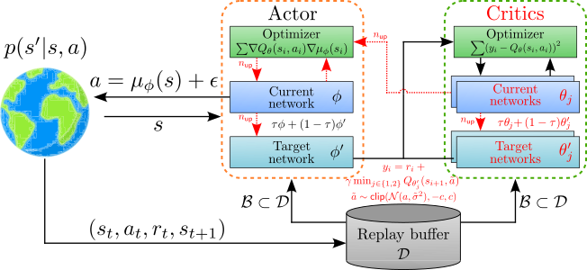
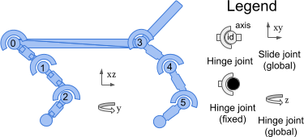
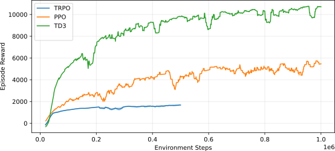
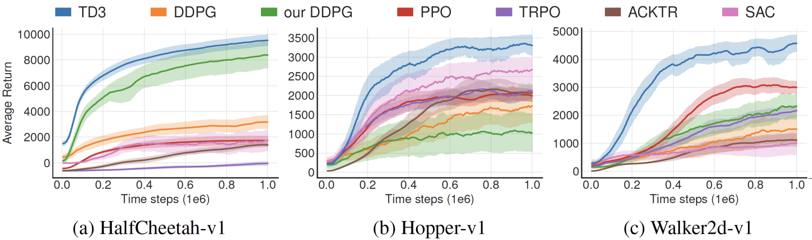

---
subtitle:    Advanced Algorithms (Part II)
chapter:     12
feedback:
deck-id:     'deeprl-advanced-algorithms-ii'
...

------------------------------------------------------------------------------

# Content

------------------------------------------------------------------------------

# Content

- The evolution of modern RL algorithms
- Part (II): Improving $Q$-learning
  - Deterministic policy gradient 
  - Deep deterministic policy gradient (DDPG)
  - TD3 
  - Soft Actor-Critic

# Where are we?

::: small
| Chapter | Topic                                                  |                            Content  |
| :--: | :-------------------------------------------------------- | :---------------------------------- |
|      | **Basics \& tabular methods**                             |                                     |
|   1-5  | Bandits, MDPs, Dynamic Programming, Monte Carlo, TD Learning |   RL basics in finite dimensions  |
|      | **Deep-learning-based methods**                           |        |
|   6  | Brief introduction to deep learning                       |    The basics for what comes next    |
|   7  | Value function approximation                              |    Value estimation with function approximation    | 
|   8  | Deep Q-learning                                           |   Q-learning with neural networks     | 
| 9    | Policy gradients                                          | Direct optimization of the policy      | 
|  10  | Actor-critic algorithms| Improved policy gradients via value functions | 
|  11  | Advanced algorithms (Part I): From policy gradient to PPO | The PG route to modern RL algorithms | 
|  [12]{style="color: red;"}  | [Advanced algorithms (Part II): From $Q$-learning to Soft Actor-Critic]{style="color: red;"} | [The AC route to modern RL algorithms]{style="color: red;"} | 
|  13  | Exploration                                  |        |
|      | **Model-Based Control**                                   |        |
|      | **Advanced Topics**                                       |        |

Table: Lecture contents
:::

------------------------------------------------------------------------------

# The evolution of modern RL algorithms

------------------------------------------------------------------------------

# The evolution of modern RL algorithms

::: small
<!-- We have covered most of the foundations of RL methods. [Let's look at the **two main branches** we have seen so far.]{.fragment} -->

::: fragment
::: columns-5-5

::: platzhalter
## (I) Policy gradient methods

::: incremental
- Policy is explicitly parameterized and optimized directly: $$L_\pi(\phi)=\Expsub{r(\tau)}{\tau\sim p_\phi(\tau)}.$$
<!-- - $$\nabla_\phi L_\pi(\phi) = \Expsub{\sum_{t=0}^{T-1} \nablaphi \log \piphi\agivenb{a_t}{s_t} A^\pi(s_t, a_t)}{\tau\sim p_\phi(\tau)}.$$ -->
- Gradient ascent: $\phi \gets \phi  + \alpha \nabla_\phi L_\pi(\phi)$.
- Methods are typically **on-policy**.
- **Algorithms**: REINFORCE $\rightarrow$ Actor-Critic $\rightarrow$ Natural Policy Gradient $\rightarrow$ Trust-region policy optimization (TRPO) $\rightarrow$ Proximal policy optimization (PPO).
:::
:::

::: fragment
## (II) Value-based methods

::: incremental
- Approximation of the $Q$-function:\
$$Q^*(s,a) = r + \max_{a'\in\Ac}Q^*(s',a').$$
- Extract implicit policy: $\pi(s) = \arg\max_{a\in\Ac} Q^*(s,a)$.
- Typically **off-policy**.
- **Algorithms**: Q-learning $\rightarrow$ DQN $\rightarrow$ Deep deterministic policy gradient (DDPG) $\rightarrow$ TD3 $\rightarrow$ Soft actor-critic (SAC).
:::
:::

:::
:::

::: columns-5-5

::: fragment
### [Shortcomings]{style="color: red;"}

::: incremental
- [High variance gradients.]{style="color: red;"}
- [Unstable policy updates.]{style="color: red;"}
- [Catastrophic performance collapse.]{style="color: red;"}
:::
:::

::: fragment
### [Shortcomings]{style="color: red;"}

::: incremental
- [Instability from bootstrapping.]{style="color: red;"}
- [Overestimation bias.]{style="color: red;"}
- [Maximization over actions / continuous action spaces.]{style="color: red;"}
:::
:::
:::

::: columns-5-5
::: fragment
### [Improvement strategy]{style="color: blue;"}

- [How to safely update policies.]{style="color: blue;"}
:::

::: fragment
### [Improvement strategy]{style="color: blue;"}

::: incremental
- [Stabilizing $Q$-learning with function approximation.]{style="color: blue;"}
- [Solving the continuous argmax problem.]{style="color: blue;"}
:::
:::
:::

:::

------------------------------------------------------------------------------

# Part (II): Improving $Q$-learning

------------------------------------------------------------------------------

# The problem of continuous actions in $Q$-learning

::: small

::: columns-7-3
::: incremental
- In a standard DQN, the optimal policy is implicit. 
- To choose the best action $a$ in a given state $s$, the agent evaluates the $Q$-values for all possible actions and picks the one that maximizes the expected return:
$$\pi(s) = \arg\max_{a} Q^*(s, a)$$
- Works well for discrete action spaces (e.g., Left, Right, Jump). 
:::

![Types of architectures [@Abdelwanis2026]](images/08-deep-q-learning/Model_types_action_value.svg){ width=400px }
:::

::: incremental
- For continuous $\Ac$ (e.g., controlling the torque of a robotic joint), we have an infinite number of possible actions.
- To find the absolute maximum of the $Q$-function in this scenario, we can pursue two options (both very expensive):
  - **Discretize the action space**. For instance, if we have $7$ joints and discretize each into just $10$ levels, we get $10^7$ possible actions.\
  $\Rightarrow$ The *"curse of dimensionality"* makes this computationally impossible to solve in real-time.
  - **Optimization**. An iterative optimization algorithm (e.g., gradient ascent) inside the environment loop to find the maximizing $a$ before each step.
:::

::: fragment
### Approach: Merging DQN and Actor-Critic

Instead of maximizing over $Q$, we introduce a function $a = \mu_\phi(s)$ such that $Q^*(s, \mu_\phi(s)) \approx \max_{a} Q^*(s, a)$.
:::

::: fragment
**Challenges**: 
:::

::: incremental
- We now have to optimize for the policy directly $\Rightarrow$ policy gradient!
- In off-policy algorithms like $Q$-learning, the variance becomes an even bigger problem!
  - Off-policy policy gradient.
  - Deterministic policies with reduced variance.
:::
:::

# Recall: Policy gradient and actor-critic

::: small
::: definition
### Policy gradient theorem -- formulation via reward trajectories ([sampling version in blue]{style="color: blue;"})
$$ \nablaphi L_\pi(\phi) = \Expsub{\sum_{t=0}^{T-1} \nablaphi \log\piphi\agivenb{a_t}{s_t}\cbracket{\sum_{t'=t}^{T-1}r_{t'}}}{\tau\sim p_\phi(\tau)} \approx \textcolor{blue}{\frac{1}{N} \sum_{i=1}^N \cbracket{\sum_{t'=t}^{T-1} \nablaphi \log\,\piphi\agivenb{a_{i,t}}{s_{i,t}}\cbracket{\sum_{t'=t}^{T-1} r_{i,t'} }}}. $$
:::

::: definition
### Policy gradient theorem -- formulation using the $Q$-function and the Actor-Critic architecture
<!-- $$ \nabla_\phi L_\pi(\phi) = \Expsub{\sum_{t=0}^{T-1} \nablaphi \log \piphi\agivenb{a_t}{s_t} \Qpiphi(s_t, a_t)}{\tau\sim p_\phi(\tau)} \fragment{ \approx\textcolor{blue}{\frac{1}{N} \sum_{i=1}^N \cbracket{\sum_{t=0}^{T-1} \nablaphi \log\,\piphi\agivenb{a_{i,t}}{s_{i,t}} \Qpiphi(s_{i,t},a_{i,t})} }. } $$ -->
$$\nabla_\phi L_\pi(\phi) = \Expsub{\sum_{t=0}^{T-1} \nablaphi \log \piphi\agivenb{a_t}{s_t} A_\theta(s_t, a_t)}{\tau\sim p_\phi(\tau)} \approx \textcolor{blue}{\frac{1}{N} \sum_{i=1}^N \cbracket{\sum_{t=0}^{T-1} \nablaphi \log\,\piphi\agivenb{a_{i,t}}{s_{i,t}} A_\theta(s_{i,t},a_{i,t})} }. $$
:::

### Main drawbacks

::: incremental
1. **High-variance** gradient.
1. **Inefficient for continuous actions**, since sampling in high-dimensional settings becomes inefficient.
1. **On-policy** $\Rightarrow$ sample-inefficient (importance sampling makes problem 1. even worse!)
:::

[**Approach**: Find a more sample-efficient and off-policy capable version]{.fragment} [$\Rightarrow$ deterministic policy!]{.fragment}

:::

# Off-policy policy gradients (1)

::: small
::: incremental
- [@Degris2012offpac] presented an alternative form for the off-policy policy gradient (for finite $\Sc$ and $\Ac$) using an approximation. [The starting point is the definition of the value function:
$$\Vpiphi = \sum_{s\in\Ac} \rho_\beta(s) \sum_{a\in\Ac} \piphi\agivenb{a}{s} \Qpiphi(s,a),$$
where $\beta$ is some behavior policy and $\rho_\beta(s) = \lim_{t\to\infty}p\agivenb{s}{s_0,\beta}$ is the limiting distribution of states when following $\beta$.]{.fragment}
- Then, taking the gradient of $\Vpiphi$ with respect to $\phi$, we get (via the product rule of differentiation):
$$ \nablaphi\Vpiphi = \nablaphi \rbracket{\sum_{s\in\Ac} \rho_\beta(s) \sum_{a\in\Ac} \piphi\agivenb{a}{s} \Qpiphi(s,a)} \fragment{ = \sum_{s\in\Ac} \rho_\beta(s) \sum_{a\in\Ac} \rbracket{\nablaphi\piphi\agivenb{a}{s} \Qpiphi(s,a) + \piphi\agivenb{a}{s} \nablaphi\Qpiphi(s,a)}. } $$
- Ignoring the second part (i.e., $\cancel{\piphi\agivenb{a}{s} \nablaphi\Qpiphi(s,a)}$; justification details in [@Degris2012offpac]), we get 
$$ \nablaphi\Vpiphi \approx \sum_{s\in\Ac} \rho_\beta(s) \sum_{a\in\Ac} \nablaphi\piphi\agivenb{a}{s} \Qpiphi(s,a) \fragment{ = \Expsub{\sum_{a\in\Ac} \nablaphi\piphi\agivenb{a}{s} \Qpiphi(s,a)}{s\sim\rho_\beta}. } $$
<!-- - [@Silver2014dpg]  -->
:::
:::

::: fragment
::: footer
:bulb: In contrast to the on-policy case (see the Actor-Critic lecture), here it is not possible to formulate a recursive formula which would allow us to find a closed-form statement for $\nablaphi\Qpiphi(s,a)$ via $\nablaphi\Vpiphi(s)$. This only works in the on-policy setting!
:::
:::

# Off-policy policy gradients (2)

::: small
$$ \nablaphi\Vpiphi \approx \sum_{s\in\Ac} \rho_\beta(s) \sum_{a\in\Ac} \nablaphi\piphi\agivenb{a}{s} \Qpiphi(s,a) = \Expsub{\sum_{a\in\Ac} \nablaphi\piphi\agivenb{a}{s} \Qpiphi(s,a)}{s\sim\rho_\beta}. $$

::: incremental
- To make this off-policy w.r.t. the actions as well, we introduce *importance sampling* for $\beta$:
[$$\begin{align*}
\nablaphi\Vpiphi &\approx \sum_{s\in\Ac} \rho_\beta(s) \sum_{a\in\Ac} \textcolor{red}{\beta\agivenb{a}{s}} \underbrace{\frac{\textcolor{blue}{\piphi\agivenb{a}{s}}}{\textcolor{red}{\beta\agivenb{a}{s}}}}_{=\kappa_\phi(s,a)} \frac{\nablaphi\piphi\agivenb{a}{s}}{\textcolor{blue}{\piphi\agivenb{a}{s}}} \Qpiphi(s,a) \fragment{ = \sum_{s\in\Ac} \rho_\beta(s) \sum_{a\in\Ac} \beta\agivenb{a}{s} \kappa_\phi(s,a) \nablaphi\log\,\piphi\agivenb{a}{s} \Qpiphi(s,a) } \\
&= \Expsub{\kappa_\phi(s,a) \nablaphi\log\,\piphi\agivenb{a}{s} \Qpiphi(s,a)}{s\sim\rho_\beta,a\sim \beta\agivenb{\cdot}{s}}.
\end{align*}$$]{.math-incremental}
- The starting point in [@Silver2014dpg] was very similar, but using continuous state and action spaces:
$$\boxed{
\nablaphi\Vpiphi \approx \int_\Sc\rho_\beta(s)\int_\Ac  \kappa_\phi(s,a) \nablaphi\log\,\piphi\agivenb{a}{s} \Qpiphi(s,a) \dint{a} \dint{s} = \Expsub{\kappa_\phi(s,a) \nablaphi\log\,\piphi\agivenb{a}{s} \Qpiphi(s,a)}{s\sim\rho_\beta,a\sim \beta\agivenb{\cdot}{s}}.
}$$
- We now have derived a simplified formula for the off-policy policy gradient.
- Aside from the approximation we just made, it's similar to the on-policy policy gradient!
- However, we still suffer from the large variance issue.
:::
:::

------------------------------------------------------------------------------

# Deterministic policy gradient

------------------------------------------------------------------------------

# Deterministic off-policy policy gradients

::: small
::: incremental
- Drop the randomness from the policy $\mu$ such that it becomes a **deterministic function**: $a = \mu_\phi(s)$.
- Reformulate $V$ via $Q$: no need for expecations (i.e., sum / integrate over $\Ac$): $V^{\mu_\phi}(s) = Q^{\mu_\phi}(s,\mu_\phi(s))$.
- Deterministic: we are incapable of exploration! [The theorem is only practically useful if we sample from off-policy data:
$$L_\pi(\phi)= \Expsub{Q^{\mu_\phi}(s,\mu_\phi(s))}{s\sim\rho_{\beta}} = \int_\Sc \rho_{\beta}(s) Q^{\mu_\phi}(s,\mu_\phi(s)) \dint{s}. $$]{.fragment}
:::

::: fragment
::: definition
## Deterministic policy gradient theorem [@Silver2014dpg]

### Exact version: on-policy ($\rho_{\beta} = \rho_{\mu_\phi}$) 

$$\begin{equation}\begin{aligned}
\nablaphi L_\pi(\phi) &= \nablaphi\rbracket{\int_\Sc \rho_{\beta}(s) Q^{\mu_\phi}(s,\mu_\phi(s)) \dint{s}} = \int_\Sc \rho_{\beta}(s) \nablaa Q^{\mu_\phi}(s,\mu_\phi(s)) \big|_{a=\mu_\phi(s)} \nablaphi \mu_\phi(s) \dint{s} \\
&= \Expsub{\nablaa Q^{\mu_\phi}(s,\mu_\phi(s)) \big|_{a=\mu_\phi(s)} \nablaphi \mu_\phi(s)}{s\sim\rho_{\beta}}. 
\end{aligned} \label{eq:Adv2_dpg} \end{equation}$$

::: fragment
**Approximate version: off-policy** ($\rho_{\beta} \neq \rho_{\mu_\phi}$, and we use the same simplification as earlier, i.e., $\cancel{\mu_\phi\agivenb{a}{s} \nablaa Q^{\mu_\phi}(s,a)}$) 

$$\begin{equation}
\nablaphi L_\pi(\phi) \approx \Expsub{\nablaa Q^{\mu_\phi}(s,\mu_\phi(s)) \big|_{a=\mu_\phi(s)} \nablaphi \mu_\phi(s)}{s\sim\rho_{\beta}}.\label{eq:Adv2_dpg_approx} 
\end{equation}$$
:::

[:bulb: \eqref{eq:Adv2_dpg} is the limit case of the stochastic policy gradient theorem (i.e., $\Var{\pi}\to 0$) [@Silver2014dpg, Theorem 2].]{.fragment}
:::
:::
:::

# On-policy deterministic actor-critic

::: small
The simplest algorithm we can derive from this: SARSA-type on-policy Actor-Critic:

::: columns-5-6
::: definition
### Algorithm: On-policy deterministic actor-critic

::: incremental
1. Sample $\set{s_i,a_i,r_i,s'_i,a'_i}_{i=1}^N$ using $a = \mu_\phi(s)$.
1. TD error: $$\delta_i = r_i + \gamma Q_\theta(s'_i,a'_i) - Q_\theta(s_i,a_i).$$
1. Semi-gradient $Q$-function update: 
$$\theta \gets \theta + \alpha_\theta \frac{1}{N} \sum_{i=1}^N \delta_i \nablatheta Q_\theta(s_i,a_i).$$
1. Update policy $\mu_\phi$ by sampling \eqref{eq:Adv2_dpg}: $$\phi \gets \phi + \alpha \frac{1}{N} \sum_{i=1}^N \nablaa Q_\theta(s_i,a_i) \nablaphi \mu_\phi(s_i).$$
:::
:::

::: fragment
### Summary of the concept

To update a deterministic policy off-policy, your algorithm does this for a batch of states from the replay buffer: 

::: incremental
1. Pass state $s$ into the actor: $a = \mu_\phi(s)$. 
1. Pass $s$ and $a$ into the critic network $Q_\theta(s, a)$.
1. Compute how the critic's output changes with respect to that action ($\nabla_a Q$).
1. Compute how the actor's weights change to produce that action change ($\nablaphi \mu_\phi$).
1. Multiply them together to update the actor. 
:::
:::
:::

:::

------------------------------------------------------------------------------

# Deep deterministic policy gradient (DDPG)

------------------------------------------------------------------------------

# Deep deterministic policy gradient (DDPG)

::: small
::: columns-4-6
::: platzhalter
## Problems with vanilla DPG

::: fragment
### The original algorithm assumed:
:::
::: incremental
- tabular / linear approximators ("Compatible Function Approximation" in [@Silver2014dpg]),
- stable $Q$ estimation.
:::

::: fragment
### When neural networks are used, several problems appear:
:::
::: incremental
- Bootstrapping instability.
- Correlated samples from trajectories.
- Targets change too quickly.
- Poor exploration due to deterministic policy.
:::
:::

::: platzhalter
::: fragment
## Deep deterministic policy gradient (DDPG) [@Lillicrap2015ddpg] 
addresses these by importing techniques from Deep Q-Networks (DQN). 
:::
\

::: fragment
### Core components:
:::

::: incremental
- Actor network $\mu_\phi(s)$
- Critic network $Q_\theta(s,a)$
- Target actor $\mu_{\bar{\phi}}$​
- Target critic $Q_{\bar{\theta}}$​
- Replay buffer
:::
:::
:::
:::

# The DDPG algorithm

::: small
::: definition
::: incremental
1. **Interact**: Sample $\set{s_t,a_t,r_t,s_{t+1}}$ using $a_t=\mu_\phi(s_t)$ (*:bulb: plus noise for exploration!*) and store in the replay buffer $\Dc$.  
1. **Sample**: Draw random mini-batch of $N$ transitions: $\Bc\subset\Dc$.
1. **Update critic**: Calculate the target $y_i$ using the target networks (*:bulb: Optimal action $\mu_{\bar{\phi}}(s)$ $\Rightarrow$ $Q$-learning!*):
$$y_i = r_i + \gamma Q_{\bar{\theta}}(s_{i+1}, \mu_{\bar{\phi}}(s_{i+1})).$$
[The *current critic* is updated by minimizing the Bellman error:
$$L_Q(\theta) = \frac{1}{N}\sum_{i} \cbracket{y_i - Q_\theta(s_i, a_i)}^2, \qquad \theta \gets \theta + \alpha_\theta \frac{2}{N} \sum_{i=1}^N \cbracket{y_i - Q_\theta(s_i, a_i)} \nablatheta Q_\theta(s_i,a_i).$$]{.fragment}
:::

::: columns-12-9
::: incremental
4. **Update actor**: The *current actor* is updated using the sampled deterministic policy gradient (Eq. \eqref{eq:Adv2_dpg}): 
$$\phi \gets \phi + \alpha \frac{1}{N} \sum_{i=1}^N \nablaa Q_\theta(s_i,a)\Big|_{a=\mu_\phi(s_i)} \nablaphi \mu_\phi(s_i).$$
<!-- $$\nablaphi L_\pi(\phi) \approx \frac{1}{N}\sum_{i} \nabla_a Q_\phi(s_i, a) \Big|_{a=\mu_\phi(s_i)} \cdot \nabla_\theta \mu_\phi(s_i)$$ -->
5. **Soft updates**: Incremental target updates ($\bar{\phi}$ / $\bar{\theta}$). 
:::

[{.embed width=570px}]{.fragment}
<!-- [{.embed width=600px}]{.fragment} -->
:::
:::
:::

# The four main changes over DPG

::: small
::: columns-5-5
::: incremental
1. **Integration of deep neural networks (CNNs)**  
2. **Introduction of the replay buffer**
  - Larger datasets to train from.
  - Allows for i.i.d. sampling / breaks the temporal correlation of data.
3. **Explicit action noise for exploration** 
- Deterministic actor in DPG: it cannot explore on its own.
- DDPG adds an explicit random process $\Nc$ directly to the action selection during environment interaction.  
- The original paper utilized [Ornstein-Uhlenbeck](https://en.wikipedia.org/wiki/Ornstein%E2%80%93Uhlenbeck_process) noise, which creates temporally correlated, mean-reverting patterns that mimic inertial drift.
:::

::: incremental
4. **Transition to "soft updates" for target networks**
- In DQN, target network weights are periodically copied exactly from the online network every few thousand steps.
- For continuous actor-critic configurations, hard updates changed the value landscape too abruptly. 
- Instead: soft update, where target networks track the online networks smoothly at every single training step using an interpolation factor $\tau \ll 1$ (e.g., $\tau = 0.001$): 
$$\bar{\theta} \leftarrow \tau \theta + (1 - \tau)\bar{\theta}, \qquad \bar{\phi} \leftarrow \tau \phi + (1 - \tau)\bar{\phi}.$$
[$\Rightarrow$ targets change slowly, providing an unmoving baseline that stabilizes the deep network's gradients.]{.fragment}
- We have seen this before under *Polyak averaging*.
:::
:::
::: fragment
{ width=850px }
:::
:::

------------------------------------------------------------------------------

# Twin Delayed Deep Deterministic Policy Gradient (TD3)

------------------------------------------------------------------------------

# Twin Delayed Deep Deterministic Policy Gradient (TD3)

::: small
**DDPG** works on many tasks, but **is highly sensitive** to hyperparameters as well as other randomness (e.g., the sampling).\
[$\Rightarrow$ In TD3 [@Fujimoto2018TD3], three main issues were identified and addressed:]{.fragment}

::: fragment
### 1. Maximization bias $\Rightarrow$ clipped double $Q$-learning
::: incremental
- Because the target uses a greedy step over actions $a = \mu_\phi(s)$, errors accumulate $\Rightarrow$ large overestimation bias.  
- Two independent critics ($Q_{\theta_1}$ / $Q_{\theta_2}$ and targets $Q_{\bar{\theta}_1}$ / $Q_{\bar{\theta}_2}$), using the minimum of their predictions to compute the target:
$$y = r + \gamma \min_{i=1,2} Q_{\bar{\theta}_i}(s', \mu_{\bar{\phi}}(s'))$$
:::
:::

::: fragment
### 2. Inaccurate critic $\Rightarrow$ delayed policy updates
::: incremental
- If the critic is highly inaccurate, updating the actor based on its gradients is counterproductive. 
- Delaying the policy updates ensures the critic has reached a reliable value before the actor uses it.
:::
[$~\Rightarrow$ Update actor ($\phi$) and targets ($\bar{\phi}$, $\bar{\theta}_1$, $\bar{\theta}_2$) less frequently than critics ($\theta_1$, $\theta_2$), e.g., every $n_\mathsf{up}=2$ steps.]{.fragment}
:::

::: fragment
### 3. Exploitation of artifacts in $Q$ $\Rightarrow$ target action smoothing
::: incremental
- Deterministic policies are prone to exploiting sharp peaks or artifacts in the $Q$-function. 
- Adding noise smooths out the value landscape, ensuring that similar actions yield similar values.
:::
[$~\Rightarrow$ TD3 adds a small amount of clipped noise (clipping constant $c$) to the target action before feeding it into the target critic:
$$\tilde{a} = \mu_{\bar{\phi}}(s) + \epsilon, \quad \epsilon \sim \mathsf{clip}(\mathcal{N}(0, \tilde{\sigma}^2), -c, c).$$]{.fragment}
:::
:::

# The TD3 algorithm

::: small
::: definition
::: incremental
1. **Interact**: Sample $\set{s_t,a_t,r_t,s_{t+1}}$ using $a_t=\mu_\phi(s_t) + \epsilon$ ($\epsilon\sim\Normal{0}{\sigma^2}$) and store in the replay buffer $\Dc$.  
1. **Sample**: Draw random mini-batch of $N$ transitions: $\Bc\subset\Dc$.
1. **Update critic**: Calculate targets $y_i$ by [minimizing over two target networks]{style="color: red;"} (:bulb: the **Twin**):
$$y_i = r_i + \gamma \min_{j\in\set{1,2}} Q_{\bar{\theta}_j}(s_{i+1}, \tilde{a}_{i+1}), \qquad\text{with \textcolor{red}{noisy action} }\tilde{a}_{i+1}=\mu_{\bar{\phi}}(s_{i+1}) + \epsilon, \quad\epsilon \sim \mathsf{clip}(\mathcal{N}(0, \tilde{\sigma}^2), -c, c).$$
[The [two critics]{style="color: red;"} are updated by minimizing the Bellman errors:
$$L_Q(\theta_j) = \frac{1}{N}\sum_{i} \cbracket{y_i - Q_{\theta_j}(s_i, a_i)}^2, \qquad \theta_j \gets \theta_j + \alpha_\theta \frac{2}{N} \sum_{i=1}^N \cbracket{y_i - Q_{\theta_j}(s_i, a_i)} \nablatheta Q_{\theta_j}(s_i,a_i).$$]{.fragment}
:::

::: columns-1-30-20
::: platzhalter

:::

::: platzhalter
[[Perform next steps only every $n_\mathsf{up}$ steps:]{style="color: red;"} (:bulb: the **Delayed**):]{.fragment}

::: incremental
4. **Update actor**: 
<!-- The *online actor* is updated using the sampled deterministic policy gradient (Eq. \eqref{eq:Adv2_dpg}):  -->
$$\phi \gets \phi + \alpha \frac{1}{N} \sum_{i=1}^N \nablaa Q_{\textcolor{red}{\theta_1}}(s_i,a)\Big|_{a=\mu_\phi(s_i)} \nablaphi \mu_\phi(s_i).$$
<!-- $$\nablaphi L_\pi(\phi) \approx \frac{1}{N}\sum_{i} \nabla_a Q_\phi(s_i, a) \Big|_{a=\mu_\phi(s_i)} \cdot \nabla_\theta \mu_\phi(s_i)$$ -->
5. **Soft updates**: Incremental target updates ($\bar{\phi}$ / $\textcolor{red}{\bar{\theta}_1}$ / $\textcolor{red}{\bar{\theta}_2}$). 
:::
:::

[{width=480px}]{.fragment}
:::

:::
:::

# Example: Half-Cheetah

::: small
::: columns-2-4
::: platzhalter
[Half Cheetah](https://gymnasium.farama.org/environments/mujoco/half_cheetah/) from the MuJoCo library.

- $\Sc$: 17 states, $\Ac$: 6 actions.
- Reward: Forward-Cost - Control-Cost.

{width=250px}
:::

{.embed width=600px}
:::

::: fragment
### Results: TRPO vs. PPO vs. TD3 (from the [RL Baselines3 Zoo](https://github.com/DLR-RM/rl-baselines3-zoo))
::: columns-1-1-1

::: platzhalter
{width=280px .controls .autoplay .muted }
:::

::: fragment
{width=280px .controls .autoplay .muted }
:::

::: fragment
{width=280px .controls .autoplay .muted }
:::
:::

:::

:::

------------------------------------------------------------------------------

# Soft actor-critic (SAC)

------------------------------------------------------------------------------

# Introducing entropy

::: small
### The limitations of both DDPG and TD3 are still quite severe.
::: columns-5-5
::: incremental
- Overestimation bias (DDPG).
- Hyperparameter sensitivity (DDPG).
:::

::: incremental
- Lack of exploration (both).
- Sample inefficiency due to Local Optima (both).
:::

:::

::: fragment
::: definition
### [Entropy](https://en.wikipedia.org/wiki/Entropy_(information_theory)) (defined by Claude Shannon in 1948).

::: incremental
- SAC [@Haarnoja2018sac] introduces an **entropy term** in the loss function.
- It describes the level of uncertainty (or unpredictability) of a random variable.
$$\begin{equation} L_\pi(\phi)=\sum_{t=0}^{T-1}\gamma^t \Expsub{r_t + \alpha \Hc(\piphi\agivenb{\cdot}{s_t})}{(s_t,a_t)\sim\rho_{\piphi}}, \quad\text{where}~ \Hc(\piphi\agivenb{\cdot}{s}) = \Expsub{-\log \piphi\agivenb{a}{s}}{a \sim \piphi\agivenb{\cdot}{s}}. \label{eq:Adv2_entropy_objective} \end{equation}$$
- $\Hc\piphi\agivenb{\cdot}{s_t}$ is the entropy, measuring how unpredictable the policy is.\
[**High entropy** $\Rightarrow$ the agent explores widely.]{.fragment}$\quad$ [**Low entropy** $\Rightarrow$ it is focused on a few actions.]{.fragment}
- The *temperature* $\alpha$ (a tunig parameter) determines how much the agent values exploration vs. exploitation.
- By rewarding the agent for being unpredictable, it 
  - naturally explores the entire environment, 
  - prevents the policy from collapsing into a single repetitive action too early, 
  - becomes more robust to environment changes.
:::
:::
:::

:::

# The entropy objective and value function

::: small
::: incremental
- Let's look at the definition of the [entropy](https://en.wikipedia.org/wiki/Entropy_(information_theory)) in Eq. \eqref{eq:Adv2_entropy_objective}:
$$ \Hc(\pi\agivenb{\cdot}{s}) = \Expsub{-\log \pias}{a \sim \pi\agivenb{\cdot}{s}}.$$ 
- Now let's expand the value function in the RL objective \eqref{eq:Adv2_entropy_objective}:
$$\begin{align} 
V^\pi(s_t) &= \Expsub{\sum_{k=0}^{\infty} \gamma^k \cbracket{r_{t+k} + \alpha \Hc(\piphi\agivenb{\cdot}{s_{t+k}})}}{(s_t,a_t)\sim\rho_{\piphi}} \notag \\
&= \Expsub{r_{t} + \alpha \Hc(\piphi\agivenb{\cdot}{s_{t}})}{a_t\sim \pi\agivenb{\cdot}{s_t}} + \Expsub{\sum_{k=1}^{\infty} \gamma^k \cbracket{r_{t+k} + \alpha \Hc(\piphi\agivenb{\cdot}{s_{t+1}})}}{(s_t,a_t)\sim\rho_{\piphi}} \notag \\
&= \Expsub{r_{t} - \alpha \log \pi\agivenb{a_t}{s_t}}{a_t\sim \pi\agivenb{\cdot}{s_t}} + \gamma \Expsub{V^\pi(s_{t+1})}{s_{t+1}\sim p(s_{t+1})} \label{eq:Adv2_entropy_value}
\end{align}$$
:::
:::

# Deriving the entropy $Q$-function {menu-title="Deriving the entropy Q-function"}

::: small
::: incremental
- As $a_t$ is already chosen, there is no entropy for the immediate action (its probability is one after selection). 
- The entropy only applies to future actions. 
- Therefore, we define the **soft $Q$-function** as the immediate reward plus the discounted future soft values:
$$\begin{equation} Q^\pi(s_t, a_t) = r_t + \gamma \Expsub{V^\pi(s_{t+1})}{s_{t+1} \sim p(s_{t+1})}. \label{eq:Adv2_entropy_Q}\end{equation}$$
- Substitute \eqref{eq:Adv2_entropy_Q} into \eqref{eq:Adv2_entropy_value}:
$$ V^\pi(s_t) = \Expsubbig{\underbrace{r_{t} + \gamma \Expsub{V^\pi(s_{t+1})}{s_{t+1}\sim p(s_{t+1})}}_{=Q^\pi(s_t, a_t)~\text{(Eq. \eqref{eq:Adv2_entropy_Q})}} - \alpha \log \pi\agivenb{a_t}{s_t}}{a_t\sim \pi\agivenb{\cdot}{s_t}} = \Expsubbig{Q^\pi(s_t, a_t) - \alpha \log \pi\agivenb{a_t}{s_t}}{a_t\sim \pi\agivenb{\cdot}{s_t}}. $$
- We thereby obtain the **soft Bellman equation**:
$$\begin{equation} Q^\pi(s_t, a_t) = r_t + \gamma \Expsub{Q^\pi(s_{t+1}, a_{t+1}) - \alpha \log \pi(a_{t+1} | s_{t+1})}{(s_{t+1}, a_{t+1}) \sim \rho_\piphi}. \label{eq:Adv2_entropy_soft_Bellman} \end{equation}$$
:::

:::

# Soft actor-critic: ingredients

::: small

### Neural networks

::: incremental
- An *actor network* $\piphi$.
- Two *critic networks* $Q_{\theta_1}$ / $Q_{\theta_2}$ and their respective *target networks* $Q_{\bar \theta_1}$ / $Q_{\bar \theta_2}$.
:::

::: fragment
### Objective functions
:::

::: incremental
- Critic updates (based on \eqref{eq:Adv2_entropy_soft_Bellman}):
$$\begin{equation} L_Q(\theta_j) = \frac{1}{N} \sum_{i=1}^N \cbracket{y_i - Q_{\theta_j}(s_i, a_i)}^2 \quad \text{with target}\quad y_i = r_i + \gamma \cbracket{\min_{j=1,2} Q_{\bar\theta_j}(s_i', a_i') - \alpha \log \piphi\agivenb{a_i'}{s_i'}}. \label{eq:Adv2_SAC_loss_Q} \end{equation}$$
- Actor updates (where we either use $\theta_1$ or the minimum of both critics):
$$\begin{equation} L_\pi(\phi) = \frac{1}{N} \sum_{i=1}^N \cbracket{\alpha \log \piphi\agivenb{a_i}{s_i} - Q_{\theta_1}(s_i,a_i)}. \label{eq:Adv2_SAC_loss_pi} \end{equation}$$
- Temperature updates:
$$\begin{equation} L(\alpha) = \frac{1}{N} \sum_{i=1}^N \cbracket{-\alpha \log \piphi\agivenb{a_i}{s_i} - \alpha \bar \Hc}. \label{eq:Adv2_SAC_loss_temp} \end{equation}$$
:::

<!-- ::: incremental
- Entropy term and temperature
- Networks for $V$ (also target), $Q$ (twin) and $\pi$
- Reparametrization trick for $\pi$ 
- Learning of $\alpha$
- Moving average for target $V$
::: -->
:::

# The actor objective (1)

::: small
::: incremental
- To see how we arrived at the objective $L_\pi$, we start from defining a target distribution over the actions.
- One way to represent the target distribution: probability of choosing an action proportional to its exponential soft $Q$-value:
$$\pi_{\mathsf{target}}\agivenb{a}{s} = \frac{\exp\cbracket{\frac{Q^\pi(s, a)}{\alpha}}}{Z^\pi(s)} \qquad \text{with}\quad Z^\pi(s) = \int \exp\cbracket{\frac{Q^\pi(s, a)}{\alpha}}\dint{a}.$$ 
- This is known as the **Boltzmann distribution** (or **Gibbs distribution**), with two useful properties:
  - Actions with higher $Q$-values have exponentially higher probabilities of being chosen.
  - The temperature $\alpha$ scales how pronounced these differences are. If $\alpha \to 0$, it becomes a sharp peak at the max $Q$-value (greedy). If $\alpha \to \infty$, it becomes a uniform distribution (pure random exploration).
- The SAC goal is thus to push the policy towards the target distribution:
[$$\begin{align*} L_\pi(\phi) &= \KLdivavg{\piphi}{\pi_{\mathsf{target}}} = \Expsub{\log\cbracket{\frac{\piphi\agivenb{a}{s}}{\pi_{\mathsf{target}}\agivenb{a}{s}}}}{s\sim \rho, a\sim\piphi} \fragment{ = \Expsub{\log\cbracket{\piphi\agivenb{a}{s}} - \log\cbracket{\frac{\exp\cbracket{\frac{Q^\pi(s, a)}{\alpha}}}{Z^\pi(s)}}}{s\sim \rho, a\sim\piphi} }\\
&= \Expsub{\log\cbracket{\piphi\agivenb{a}{s}} - \log\cbracket{\exp\cbracket{\frac{Q^\pi(s, a)}{\alpha}}} + \log\cbracket{Z^\pi(s)}}{s\sim \rho, a\sim\piphi} \\
&= \Expsub{\log\cbracket{\piphi\agivenb{a}{s}} - \frac{Q^\pi(s, a)}{\alpha} + \log\cbracket{Z^\pi(s)}}{s\sim \rho, a\sim\piphi}. 
\end{align*}$$]{.math-incremental}
:::

<!-- $$L_\pi(\phi) = \frac{1}{N} \sum_{i=1}^N \cbracket{\alpha \log \piphi\agivenb{a_i}{s_i} - Q_{\theta_1}(s_i,a_i)}.$$ -->
:::

# The actor objective (2)

::: small
$$L_\pi(\phi) = \Expsub{\log\cbracket{\piphi\agivenb{a}{s}} - \frac{Q^\pi(s, a)}{\alpha} + \log\cbracket{Z^\pi(s)}}{s\sim \rho, a\sim\piphi}.$$

::: incremental
- Multiplying by $\alpha$ and neglecting the policy-independent $Z$-term don't change the minimizer [$\Rightarrow$ Sampling version:
$$\begin{equation} L_\pi(\phi) = \frac{1}{N} \sum_{i=1}^N \cbracket{\alpha \log \piphi\agivenb{a_i}{s_i} - Q_{\theta_1}(s_i,a_i)}. \tag{\ref{eq:Adv2_SAC_loss_pi}} \end{equation}$$]{.fragment}
:::

::: fragment
::: definition
### Soft Policy Improvement Theorem [@Haarnoja2018sac2{}, Lemma 2]

If we define:
$$\subnew{\pi} = \arg\min_{\pi'} \KLdiv{ \pi'\agivenb{\cdot}{s}}{\frac{\exp\left(\frac{Q^{\subold{\pi}}\agivenb{\cdot}{s}}{\alpha}\right)}{Z^{\subold{\pi}}(s)}},$$
then the soft $Q$-value of the new policy is guaranteed to be monotonically greater than or equal to the old one for all $(s,a)$:
$$Q^{\subnew{\pi}}(s, a) \geq Q^{\subold{\pi}}(s, a) \quad \forall (s,a).$$
:::
:::

:::

# The reparametrization trick

::: small
::: incremental
- Because the action $a$ is sampled from a stochastic policy $\piphi$, we cannot backpropagate gradients from the critic through the action to the actor directly. 
- Fix in SAC $\Rightarrow$ the **reparameterization trick**: We express the action as a deterministic function of the state and an independent noise vector $\epsilon$: $$a = f_\phi(\epsilon; s) = \tanh(\mu_\phi(s) + \sigma_\phi(s) \odot \epsilon), \quad \epsilon \sim \Normal{0}{I}.$$
  - The neural network deterministically outputs the mean $\mu_\phi(s)$ and standard deviation $\sigma_\phi(s)$. 
  - The $\tanh$ function bounds the actions to a valid range (e.g., $[-1, 1]$).
- Rewriting the objective with this reparameterization allows us to rewrite the expectation over the noise $\epsilon$:
$$L_\pi(\phi) = \Expsub{\alpha \log \piphi\agivenb{f_\phi(\epsilon; s)}{s} - Q_{\phi_1}(s, f_\phi(\epsilon; s))}{s \sim \Dc, \epsilon \sim \Nc}.$$
- Now, the gradient with respect to $\phi$ can flow through $f_\phi$.
- Analogous to earlier (deterministic) policy gradients, we obtain [@Haarnoja2018sac2]:
$$\nablaphi L_\pi(\phi) = \Expsub{\nablaphi \alpha \log \piphi\agivenb{a}{s} + \cbracket{\alpha \nabla_a \log \piphi\agivenb{a}{s} - \nabla_a Q_{\theta_1}(s, a)} \nablaphi f_\phi(\epsilon; s)}{s \sim \mathcal{D}, \epsilon \sim \mathcal{N}}.$$
:::
:::
\

::: fragment
::: footer
:bulb: Because we pass the Gaussian sample through a $\tanh$ function, the log-likelihood must be corrected using the Jacobian of the transformation: $\log \pi_\theta\agivenb{a}{s} = \log \mu\agivenb{u}{s} - \sum_{i=1}^{m} \log(1 - \tanh^2(u_i))$, where $u$ is the pre-tanh action value. 
:::
:::

# The temperature objective

::: small
::: incremental
- To prevent hand-tuning the entropy coefficient $\alpha$, SAC treats it as a constrained optimization problem: maximize expected reward subject to a minimum entropy constraint $\bar{\mathcal{H}}$ (More details in [@Haarnoja2018sac2{}, Chapter 5]).
- SAC tunes $\alpha$ to match a target entropy $\bar{\Hc}$ (usually chosen as the negative action space dimension $(-m)$).
- The *dual objective function* minimized to find the optimal scaling parameter $\alpha$ is:
$$\begin{equation} L(\alpha) = \Expsub{-\alpha \log \pi_\theta(a|s) - \alpha \bar{\mathcal{H}}}{s \sim \mathcal{D}, a \sim \pi_\theta} = \Expsub{-\alpha( \log \pi_\theta(a|s) + \bar{\mathcal{H}})}{s \sim \mathcal{D}, a \sim \pi_\theta}. \tag{\ref{eq:Adv2_SAC_loss_temp}} \end{equation}$$
- Since $L(\alpha)$ is linear with respect to $\alpha$, taking the derivative is straightforward:
$$\nabla_\alpha L(\alpha) = -\Expsub{( \log \pi_\theta(a|s) + \bar{\mathcal{H}})}{s \sim \mathcal{D}, a \sim \pi_\theta}.$$
:::

::: fragment
### Intuition of the $\alpha$ Gradient
:::

::: incremental
- If the current policy's entropy is low, then $-\log \piphi\agivenb{a}{s}$ will be a large positive number. 
  - If $-\log \piphi\agivenb{a}{s} > \bar{\Hc}$, the gradient is negative, which causes $\alpha$ to increase during gradient descent ($\alpha \gets \alpha - \lambda \nabla_\alpha L(\alpha)$). 
  - Higher $\alpha$ forces the actor to prioritize exploration.
- If the policy's entropy is high, the gradient becomes positive, causing $\alpha$ to decrease, shifting priorities toward maximizing standard environmental rewards.
:::
:::

# The SAC algorithm

![[@Haarnoja2018sac2]](images/11-advanced/SAC_algorithm.png){width=1000px}

# Example: Half-Cheetah

::: small
::: columns-2-4
::: platzhalter
[Half Cheetah](https://gymnasium.farama.org/environments/mujoco/half_cheetah/) from the MuJoCo library.

- $\Sc$: 17 states, $\Ac$: 6 actions.
- Reward: Forward-Cost - Control-Cost.

{width=250px}
:::

{.embed width=600px}
:::

::: fragment
### Results: TRPO vs. PPO vs. TD3 vs. SAC (from the [RL Baselines3 Zoo](https://github.com/DLR-RM/rl-baselines3-zoo))
::: columns-1-1-1-1

::: platzhalter
{width=280px .controls .autoplay .muted }
:::

::: platzhalter
{width=280px .controls .autoplay .muted }
:::

::: platzhalter
{width=280px .controls .autoplay .muted }
:::

::: platzhalter
{width=280px .controls .autoplay .muted }
:::
:::

:::

:::

# Example: Some MuJoCo environments

:::small

:::columns-7-3
::: platzhalter
![Source: [@Fujimoto2018TD3{}, Figure 5].](images/11-advanced/SAC_MuJoCo.png){width=800px}

::: columns-1-1-1
::: fragment
{width=250px .controls .autoplay .muted }
:::

::: fragment
{width=250px .controls .autoplay .muted }
:::

::: fragment
{width=250px .controls .autoplay .muted }
:::
:::

[:bulb: Trained models from [StableBaselines3](https://huggingface.co/sb3/models).]{.fragment}

:::

::: fragment
**Notes**

::: incremental
- The SAC results *reported in the TD3 paper* [@Fujimoto2018TD3] (see left) are worse than the TD3 results.
- Reason: there were two versions of SAC in quick succession.
  1. The now-standard that we have discussed [@Haarnoja2018sac2]. It also considered some ideas from the TD3 paper such as twin $Q$ networks to avoid maximization bias.
  1. The original one [@Haarnoja2018sac] went out of fashion quickly, but appeared around the same time as TD3. It is thus likely that [@Fujimoto2018TD3] compared against this version.
:::
:::
:::
:::

------------------------------------------------------------------------------

# Comparison of the algorithms we have seen in part II

------------------------------------------------------------------------------

# Comparison of the algorithms we have seen in part II

::: small
::: incremental
- Actor-Critic.
- DDPG $\Rightarrow$ variance reduction via deterministic policy.
- TD3 $\Rightarrow$ addresses maximization bias (twin networks) and inaccurate critics (via delayed updates).
- SAC $\Rightarrow$ entropy objective for natural exploration
:::

::: fragment
| Feature | DDPG | TD3 | SAC |
| :---: | :---: | :---: | :---: |
| Policy Type | Deterministic | Deterministic | Stochastic |
| Exploration | Additive Noise (e.g., OU Noise) | Additive Noise (Gaussian) | Intrinsic (Entropy Maximization) |
| Q-Overestimation Cure | None | Clipped Double-Q | Clipped Double-Q |
| Sensitivity to Hyperparameters | Extremely High | High | Low (Very Stable) |
| Sample Efficiency | Moderate | Good | Excellent |
:::
:::

# References

::: { #refs }
:::
