---
subtitle:    Exploration
chapter:     13
feedback:
  deck-id:  'deeprl-exploration'
...


------------------------------------------------------------------------------

# Content

------------------------------------------------------------------------------

# Content

- Recap
  - Exploration-exploitation dilemma
  - Multi-armed bandits
- Advanced exploration methods for tabular approaches
  - Upper confidence bounds
  - Thompson sampling
  - Information gain
- Exploration in continuous spaces
  - The counting problem
  - Intrinsic motivation
  - Curiosity-driven exploration
  - Random network distillation

# Where are we?

::: small
| Chapter | Topic                                                  |                            Content  |
| :--: | :-------------------------------------------------------- | :---------------------------------- |
|      | **Basics \& tabular methods**                             |                                     |
|  1-5 | Bandits, MDPs, Dynamic Programming, Monte Carlo, TD Learning |   RL basics in finite dimensions  |
|      | **Deep-learning-based methods**                           |        |
|   6  | Brief introduction to deep learning                       |    The basics for what comes next    |
|   7  | Value function approximation                              |    Value estimation with function approximation    | 
|   8  | Deep Q-learning                                           |   Q-learning with neural networks     | 
|   9  | Policy gradients                                          | Direct optimization of the policy      | 
|  10  | Actor-critic algorithms| Improved policy gradients via value functions | 
|  11  | Advanced algorithms (Part I): From policy gradient to PPO | The PG route to modern RL algorithms | 
|  12  | Advanced algorithms (Part II): From $Q$-learning to Soft Actor-Critic | The AC route to modern RL algorithms| 
| [13]{style="color: red;"}  | [Exploration]{style="color: red;"}     | [How to explore in complex scenarios]{style="color: red;"} | 
|      | **Model-Based Control**                                   |        |
|      | **Advanced Topics**                                       |        |

Table: Lecture contents
:::
------------------------------------------------------------------------------

# Recap

------------------------------------------------------------------------------

# Exploration-exploitation dilemma

::: columns-7-3
 for the live version; do you get the same numbers?)](images/01-multi-armed-bandits/MapsDortmund.png){ width=900px }

::: small
::: incremental
- Let's assume we do not have access to travel time estimates
- Which route should I take to minimize my travel time?
- Let's say we can guess the time of one route fairly well
  - should we always take this one?
  - or try something else and see if we can get better?
- This is known as the **exploration-exploitation dilemma**
- The route pickig problem is one example of a **multi-armed bandit**
:::
:::

:::

# Multi-armed bandits

::: columns-7-3

::: small
::: incremental
- Let us assume that we have a slot machine and we repeatedly can choose between $k$ different actions
- After each choice $a_t$ you receive a numerical reward $r_t$ chosen from a stationary probability distribution$^*$
- Objective: maximize the **expected total reward** over some time period (e.g., over 1000 action selections, or *time steps*)
- We refer to this as the **value**: $$ q(a) = \ExpC{r_t}{a_t=a} $$
- If we knew $q(a)$, then it would be easy to choose!
- Instead, we have to rely on estimates $Q_t(a)$ which we can iteratively update based on past experience
:::
:::

![A multi-armed bandit [@Ferreira2024mab]](images/01-multi-armed-bandits/multi-armed-bandit.png){ height=150px }
:::

# A simple bandit algorithm

::: columns-4-6
::: platzhalter
``` python
# Initialization
for i in range(k):
  Q(a) = 0
  N(a) = 0

# Run forever
while(True):

  # exploration versus exploitation
  if rand() > epsilon:
    a = argmax(Q)        # exploitation
  else:
    a = randint(k)       # exploration

  r = bandit(a)

  # Error correction towards target r 
  N(a) = N(a) + 1
  Q(a) = Q(a) + (1/N(a)) * (r - Q(a))
```
Caption: A simple version of the $\epsilon$ greedy bandit.

::: small

::: incremental
- $\epsilon$-greey is a very simple approach to achieve (local) exploration! 
- Another approach: **optimistic initial values**.
  - For $q(a) \sim \Normal{1}{0}$, an initial guess of $Q_1(a)=5$ is certainly unrealistically high.
:::
:::

:::

::: platzhalter
::: fragment
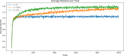{ width=600px }
:::

::: fragment
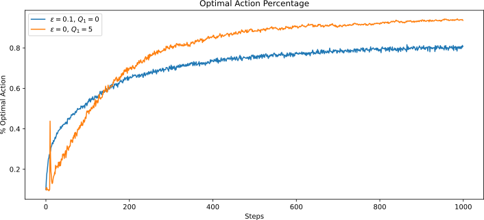{ .embed width=600px }
:::
:::
:::

# Exploration in Soft Actor Critic

::: small
::: columns-8-2
::: platzhalter
$$L_\pi(\phi)=\sum_{t=0}^{T-1}\gamma^t \Expsub{r_t + \alpha \Hc(\piphi\agivenb{\cdot}{s_t})}{(s_t,a_t)\sim\rho_{\piphi}}~\text{with entropy}~\Hc(\piphi\agivenb{\cdot}{s}) = \Expsub{-\log \piphi\agivenb{a}{s}}{a \sim \piphi\agivenb{\cdot}{s}}$$

![[@Haarnoja2018sac2]](images/11-advanced/SAC_algorithm.png){width=800px}
:::

::: platzhalter
{width=250px .controls .autoplay .muted }
{width=250px .controls .autoplay .muted }
:::
:::
:::

# The challenge with exploration

::: columns-1-1-1
::: platzhalter
::: center
**This is "easy"**
:::

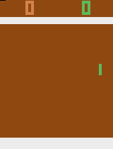{width=250px}
:::

::: fragment
::: center
**This is very hard!**
:::

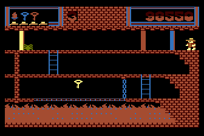{width=500px}
:::


::: small
\

::: incremental
- Getting key = reward
- Opening door = reward
- Dying = nothing (is it good? bad?)
- Finishing the game only weakly correlates with rewarding events
- We know what to do because we understand the concept!
:::
:::
:::

# Another example: The game of Mao

::: small
::: columns-1-3

).](images/13-exploration/cards.jpg){width=350px}

::: incremental
- Goal: Get rid of all the cards!
- “The only rule you may be told is this one".
- There's a penalty for breaking a rule $\Rightarrow$ Draw another card.
- You can only discover rules through trial and error.
- The rules don’t always make sense to you.
:::
:::
\

::: fragment
### Temporally extended tasks like Montezuma’s revenge become increasingly difficult based on
:::

::: incremental
- How extended the task is.
- How little you know about the rules.
:::

[:question: Imagine your goal was winning 50 games of Mao in a row, without knowing the rules!]{.fragment}

:::


------------------------------------------------------------------------------

# Advanced exploration methods for tabular approaches

------------------------------------------------------------------------------

# Upper confidence bounds / optimistic exploration

### Can we reward explorative behavior in a systematic way?

::: small
::: columns-1-1
::: incremental
- Introduce some measure of "curiosity".
- The less confident we are in an estimate, the higher the chance to get a better reward than we currently expect!
- The technique to include this: **upper confidence bounds** (**UCB**)
  - We add a variance-like term to the reward that estimates the upper end of the confidence interval around the reward.
$$ \begin{equation} a_t = \arg\max_{a\in\Ac} \rbracket{Q_{t-1}(a) + c \sqrt{\frac{\ln t}{N_{t-1}(a)}}}. \label{eq:Exp_UCB} \end{equation} $$
  - The more often we have seen an arm (i.e., for larger $N_{t-1}(a)$), the smaller the UCB.
:::

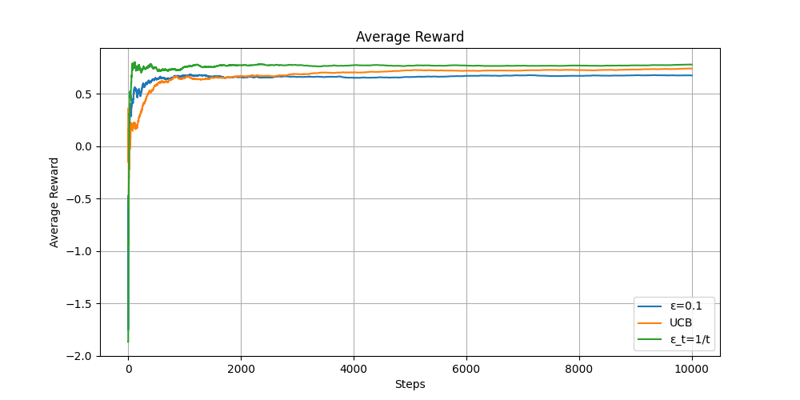{width=700px}

:::
:::

# Bayes' theorem

::: small
::: columns-4-6
::: platzhalter
::: definition
### [Bayes' theorem](https://en.wikipedia.org/wiki/Bayes%27_theorem):

[$$\begin{align*} 
p(A \cap B) &= p\agivenb{A}{B} p(B) \fragment{ = p\agivenb{B}{A} p(A) } \\ 
\Leftrightarrow \quad p\agivenb{B}{A} &= \frac{p\agivenb{A}{B} p(B)}{p(A)}.
\end{align*}$$]{.math-incremental}

[$$\text{"Posterior"} = \frac{\text{"Likelihood"} \times \text{"Prior"}}{\text{"Evidence"}}.$$]{.fragment}

::: incremental
  - Given new **evidence** $A$, 
  - we can update our **prior** estimate $p(B)$ 
  - to **posterior** estimate $p\agivenb{B}{A}$ 
  - using the **likelihood** of seeing the new evidence given $B$.
:::
:::
:::

::: fragment
### Example: Medical testing

::: incremental
- Imagine there is a rare disease that only $1\%$ of the population has. There is a test for it which is $90\%$ accurate.
- You take the test and it comes back positive. What are the chances you actually have the disease?
- Consider the two events $A=\mathsf{sick}$ and $B=\mathsf{positive~test}$:
$$ p(A) = 0.01, \quad p\agivenb{B}{A}=0.9. $$
- Total probability of the evidence (recall: $p(A) + p(\neg A)=1$): 
<!-- [$$\begin{align*} p(B) &= p\agivenb{B}{A}p(A) \fragment{ + p\agivenb{B}{\neg A}p(\neg A) } \\ 
&= 0.9 \cdot 0.01 + 0.1 \cdot 0.99 \fragment{ = 0.108. } \end{align*}$$]{.math-incremental} -->
$$ p(B) = \underbrace{p\agivenb{B}{A}}_{\fragment{=0.9}} \underbrace{p(A)}_{\fragment{=0.01}} \fragment{ + \underbrace{p\agivenb{B}{\neg A}}_{\fragment{ =0.1 }} \underbrace{p(\neg A)}_{\fragment{=0.99}} }  \fragment{ = 0.108. } $$
- Posterior probability (prob. of having the disease given a positive test):
$$p\agivenb{A}{B} = \frac{p\agivenb{B}{A} p(A)}{p(B)} \fragment{ = \frac{0.9 \cdot 0.01}{0.108} }\fragment{  = 0.0833 = 8.33\%. }$$
:::

:::
:::
:::

# Thompson sampling

::: small
The idea behind **Thompson sampling** (also known as **posterior sampling**) is essentially Bayes' theorem:

::: incremental
- Start with a prior distribution over expected rewards (e.g., a Gaussian $\Normal{\mu_{k}}{\sigma_{k}^2}$, $k=1,\ldots,K$).
- Draw samples from the prior distribution to determine the next action.
- Update to posterior distribution for the action that was selected and the reward that was observed.
:::

::: fragment
::: definition
### Thompson sampling algorithm

For each step $t = 1, 2, 3, \ldots$
  
1. **Sample**: For each arm $k$, draw a random number $\theta_k$ from its current posterior distribution: $\theta_k \sim \Normal{\mu_{k}}{\sigma_k^2}$.
2. **Act**: Select the arm with the highest sampled value: $a_t = \arg\max(\theta_k)$.
3. **Observe**: Pull that arm, receive reward $r_t$.
4. **Update**: Calculate the new $\mu_k$ and $\sigma_k^2$ for that specific arm.
:::
:::
:::


# Information gain and information-directed sampling

::: small
**Information gain**: "Which arm will give me the most valuable information to help me make better decisions in the future?"

::: columns-4-6
::: platzhalter
::: fragment
::: definition
### Entropy and information gain

::: incremental
- Let $a^*$ be the true optimal action. 
- Goal: reduce uncertainty about $a^*$.
- Pulling $a$ and observing $r$: gain information. 
- **Information gain** (or **mutual information**) $I$: expected *entropy* reduction of $a^*$:
$$I(a) = \Hc(a^*) - \ExpC{\Hc(a^*)}{r}.$$
  - $I(a)$: How much pulling arm $a$ will clarify which arm is truly the best.
  - If an arm’s reward distribution is highly uncertain, pulling yields a large information gain.
  - If we already know exactly what an arm does, pulling it yields zero information gain.
:::
:::
:::
:::

::: fragment
::: definition
### Information-directed sampling (IDS)

::: incremental
- Maximizing information gain would waste our time testing highly unpredictable arms that we already know have poor rewards. 
- We need to consider the immediate loss, which we call **regret** ($\Delta$).
  - The expected regret of pulling arm $a$ is the difference between the maximum possible expected reward and the expected reward of arm $a$:
  $$\Delta(a) = \mathbb{E}[R(A^*)] - \mathbb{E}[R(a)]$$
  - **Information-directed sampling** (**IDS**) defines the information ratio for each arm:
  $$\Psi(a) = \frac{\Delta(a)^2}{I(a)}$$
  - "Cost-to-benefit" ratio: regret is the cost, information gain is the benefit.
  - A low ratio means we are either getting a high reward (low regret $\Delta$) or learning a lot about the system (high information gain $I$), or both. 
- IDS objective: $a_t = \arg\min_{a\in\Ac}\Psi(a)$.
:::
:::
:::
:::
:::

::: fragment
::: footer
:bulb: Using the Gaussian assumption for the rewards and our beliefs, one can compute closed-form expressions for $\Delta(a)$ and $I(a)$.
:::
:::

------------------------------------------------------------------------------

# Exploration in continuous spaces

------------------------------------------------------------------------------


# Novelty-driven exploration: intrinsic motivation

::: small
::: incremental
- As we have seen before (e.g., the UCB in Eq. \eqref{eq:Exp_UCB}), a common theme for exploration to add some form of **bonus** $B$ to the reward signal that promotes exploration:
$$ \hat{r} = r + B(N(s)). $$
- This is a special case of the general concept of **intrinsic motivation**: [We modify the reward signal in such a way that the agent is *motivated* (i.e., rewarded) to explore unknown territory:
$$ \hat{r} = r + \beta B.$$]{.fragment}
:::


::: fragment
| Type of intrinsic motivation | Core question the agent asks | Key algorithms |
| :- | :- | :- |
| Novelty / information-theoretic | "Have I seen this specific state configuration before?" | Pseudo-counts (CTS, PixelCNN), count-based hashing |
| Knowledge gain / reduction of uncertainty | "How much does this experience improve my model of the world?" | RND (random network distillation), disagreement ensembles |
| Prediction error / surprise | "Can I predict what happens next if I take this action?" | ICM (intrinsic curiosity module) |
:::

:::

# The counting problem

::: small
::: columns-1-1-1
::: incremental
- As motivated in UCB (Eq. \eqref{eq:Exp_UCB}), we can add a bonus $B$ to the reward that shrinks with the number of times we have seem certain state $s$:
$$ \begin{align*} \hat{r} &= r + B(N(s)) \\ \text{with}\quad s'&>s \Rightarrow N(s')< N(s). \end{align*} $$
- But what does counting mean in continuous spaces?
:::

::: fragment
{width=400px}
:::

::: incremental
- Let's revisit the Montezuma's revenge example:
  - What if the key is placed slightly differently?
  - Or the spider?
  - Or some other minor detail?
:::
:::

::: fragment
::: columns-3-1

::: platzhalter
\

### The challenge in continuous $\Sc$

::: incremental
- We "never" see the same thing twice (i.e., with probability zero).
- However, some states are more similar than others.\
[$\Rightarrow$ back to function approximation.]{.fragment} 
:::
:::

{width=250px .controls .autoplay .muted }

:::
:::
:::


# Pseudo-counts

::: small
::: columns-6-5
::: incremental
- [@Bellemare2016countbased]: Fit a density model $p_\theta(s)$ (or $p_\theta(s,a)$).
- $p_\theta(s)$ may be high even for a new $s$ if $s$ is similar to previously seen states.
- For small MDPs, the true (i.e., *tabular*) probability **before** and **after** a state visit is:
[$$\begin{align*}
\text{Before:}\quad \underbrace{p(s)}_{\text{probability}\\ \text{/ density}} &= \underbrace{\overbrace{\frac{N(s)}{n}}}^{\text{count}}_{\text{total visits}} \\ \text{After:}\qquad p'(s) &= \frac{N(s)+1}{n+1}.
\end{align*}$$]{.math-incremental}
- Can we use $p_\theta(s)$ and $p_{\theta'}(s)$ to get a **pseudo-count** $\hat{N}(s)$?
- Bonus used by [@Bellemare2016countbased]: $B(\hat{N}(s)) = \sqrt{\frac{1}{\hat{N(s)}}}$.
- Various alternatives available.
:::

::: platzhalter
::: fragment
::: definition
### RL with pseudo-counts

- Fit model $p_\theta(s)$ to all states $\Dc$ seen so far.
- Take step $t$ and osberve $s_t$.
- Fit new model $p_{\theta'}(s)$ to $\Dc \cup s_t$.
- Set $\hat{r}_t = r_t + B(\hat{N}(s))$.
:::
:::

::: fragment
### Computing $\hat{N}(s)$
:::

[$$p_\theta(s_t) = \frac{\hat{N}(s_t)}{\hat{n}}, \qquad p_{\theta'}(s_t) = \frac{\hat{N}(s_t)+1}{\hat{n}+1}. $$]{.fragment}

[$\Rightarrow$ Tow equations for two unknowns ($\hat{N}$ and $\hat{n}$)!]{.fragment}

[$$\begin{align*} 
\hat{N}(s_t) &= \hat{n} p_\theta(s_t), \qquad \hat{n} = \frac{1-p_{\theta'}(s_t)}{p_{\theta'}(s_t)-p_{\theta}(s_t)},\\
\hat{N}(s_t) &= \frac{\cbracket{1-p_{\theta'}(s_t)}p_\theta(s_t)}{p_{\theta'}(s_t)-p_{\theta}(s_t)} .
\end{align*} $$]{.math-incremental}
:::
:::

:::

# Example: Count-based exploration in Atari games

![Exploration of rooms/levels in Montezuma's revenge [@Bellemare2016countbased].](images/13-exploration/count-based-results-montezuma.png){width=1200px}

\

::: fragment
![Performance on various Atari games [@Bellemare2016countbased].](images/13-exploration/count-based-results.png){width=1200px}
:::

# Ways to estimate the density

::: incremental
- There are numerous ways to estimate the state density $p_\theta(s)$ or state-action density $p_\theta(s,a)$.
  - Context tree switching (CTS) [@Bellemare2016countbased].
  - Neural networks (e.g., PixelCNN [@Ostrovski2017pixelcnn]).
  - "Exemplar models" [@Fu2017ex2].
  - Grouping via Hashing [@Tang2017hashexploration]: An autoencoder compresses states into a finite-size latent space (e.g., a binary code). Similar states are grouped together $\Rightarrow$ back to finite $\hat\Sc$!
  - ...
- Key takeaways: 
  - $p_\theta(s)$ does not need to produce great samples $s$.
  - It just needs to yield a good approximation of the state density distribution!
:::

# Curiosity-driven exploration

::: small
Instead of counting states, an **Intrinsic Curiosity Module** (**ICM**) [@Pathak2017curiosity] uses a predictive neural network model: 

::: columns-1-1
::: incremental
- The agent in state $s_t$ executes $a\sim\pi$ $\Longrightarrow$ $s_{t+1}$.
- $\pi$ is trained to maximize the sum of the *extrinsic reward* ($r^e_t$) by the environment $E$ and the *intrinsic reward* ($r^i_t$) generated by the ICM: $$r_t = r_t^e + r_t^i.$$
- ICM: The prediction error in feature space is used as the curiosity based intrinsic reward signal $r^i_t$.
  - The *forward model* takes as inputs $\phi(s_t)$ and $a_t$ and predicts the feature representation $\hat\phi(s_{t+1})$ of $s_{t+1}$. 
  - ICM encodes $s_t$, $s_{t+1}$ into the features $\phi(s_t)$, $\phi(s_{t+1})$ that are trained to predict $a_t$ (the *inverse dynamics model*). 
:::

![Intrinsic Curiosity Module [@Pathak2017curiosity].](images/13-exploration/ICM.png){width=700px}
:::

::: incremental
- "The inverse model helps learn a feature space that encodes information *relevant for predicting the agent’s actions only* and the forward model *makes this learned feature representation more predictable*." [@Pathak2017curiosity]
  - The inverse model only keeps track of things in the environment that the agent's actions can actually influence.
  - If a TV screen shows random noise, the network filters it out because the agent's actions didn't cause it. The agent won't feel "curious" about it.
:::

:::

# Example: VizDoom 3D "My way home" (1)

::: small
::: columns-1-1-2
::: incremental
- Inspired by the classic video game "Doom", avialable via [Gymnasium](https://vizdoom.farama.org/environments/default/).
- **Task**: Reach a goal\
$\Rightarrow$ very sparse reward.
- Pre-training using curiosity only!
:::

::: fragment
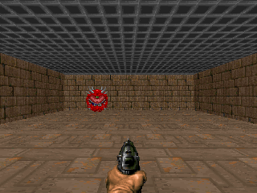{width=300px}
:::

::: fragment
![Source: [@Pathak2017curiosity].](images/13-exploration/VizDoomMyWayHome-Screenshots.png){width=450px}
:::
:::

::: columns-1-2
::: fragment
![Source: [@Pathak2017curiosity].](images/13-exploration/VizDoomMyWayHome-Maps.png){width=400px}
:::

::: incremental
- Comparison using the A3C algorithm [@Mnih2016asynchronous]: This is an extension of policy gradients with improved, asynchronous replay buffer and an actor for continuous actions (by now largely replaced by PPO).
  - **A3C**: the standard algorithm with $\epsilon$-greedy exploration
  - **ICM + A3C**: the ICM-enhanced version ()
  - *two variants of (ICM + A3C)* with some functionalities turned off (so-called *ablations* to assess the value of these parts)
    - **ICM (pixels) + A3C**: direct assessment of the pixels; no use of the backward model to identify the action-relevant pieces of the input.
    - **ICM (aenc) + A3C**: curiosity is computed using the features of pixel-based forward model.
:::
:::

:::

# Example: VizDoom 3D "My way home" (2)

::: columns-2-1
::: platzhalter
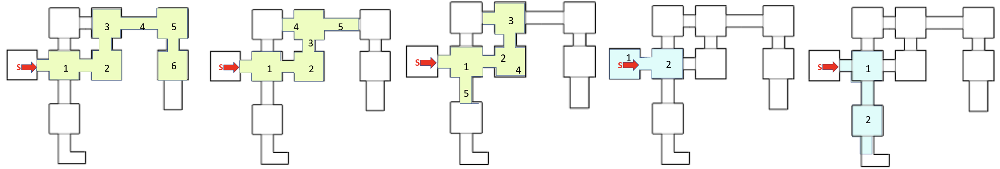{width=850px}
\
\

::: fragment
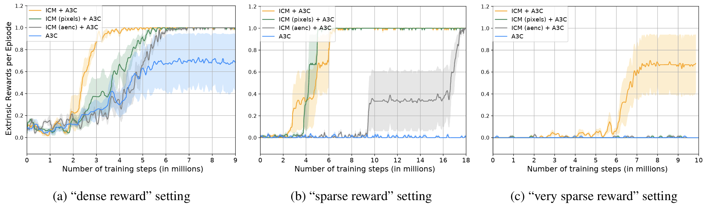{width=850px}
:::
:::

::: platzhalter
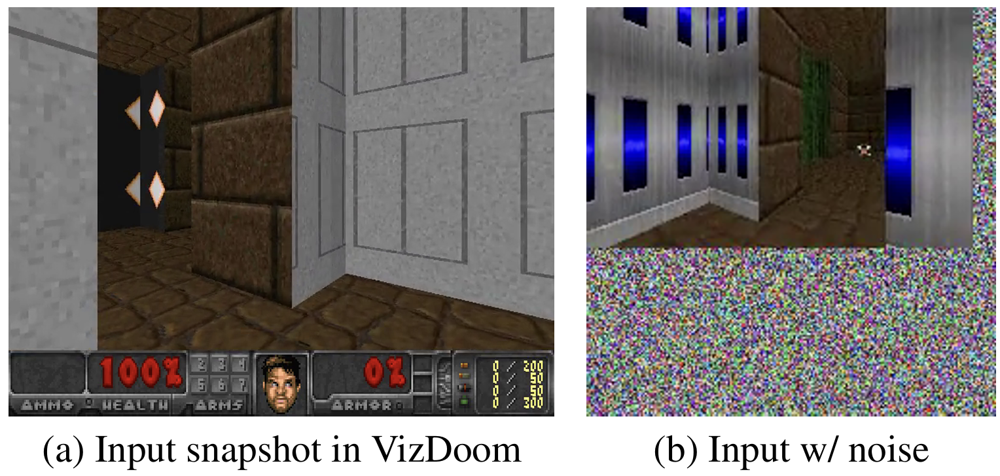{width=400px}

::: fragment
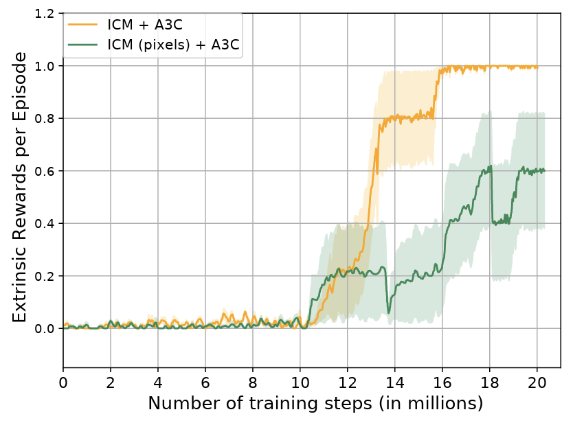{width=400px}
:::
:::
:::

::: footer
Source: [@Pathak2017curiosity].
:::


# Novelty vs. Curiosity

::: small
| Feature | Novelty methods (e.g., count-based) | Intrinsic curiosity (e.g., ICM) |
| :- | :- | :- |
| Core question | "Have I stood in this exact spot before?" | "Can I accurately predict what will happen if I push this button?" |
| Mechanism | Tracks visitation counts or state densities. | Measures the prediction error of a forward-dynamics neural network. |
| The "TV Screen" vulnerability | Vulnerable. A TV screen cycling random images represents infinite novel states. | Handled via feature encoding. It ignores randomness it cannot control. |
| Best suited for | Environments with static, clean states where visiting everything matters (e.g., Montezuma's Revenge). | Dynamic environments with visual noise where learning the "physics" of the world is required. |
:::

# Exploration via posterior sampling in DRL

::: small
**Bootstrapped DQN** [@Osband2016bootstrappeddqn]

::: columns-1-1
::: incremental
- Instead of training a single neural network, we train an ensemble of $K$ networks (typically $K=10$).
- We use standard boostrapping from supervised learning and random masking of individual samples to diversify between the different models. 
- During each episode, we randomly select one model and then follow this model to the end.
- How this solves the exploration-exploitation dilemma:
  - Disagreement between different models\
  $\Rightarrow$ High uncertainty\
  $\Rightarrow$ **Exploration** over various runs.
  - Agreement between different models\
  $\Rightarrow$ Low uncertainty\
  $\Rightarrow$ **Exploitaiton** of known good behavior.
:::

::: platzhalter
::: fragment
### The challenge: training multiple networks!
:::

[Approach: Single network with $K$ heads!]{.fragment}

::: fragment
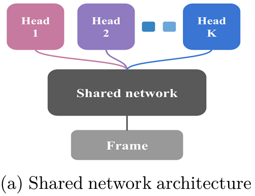{width=250px}
:::

::: fragment
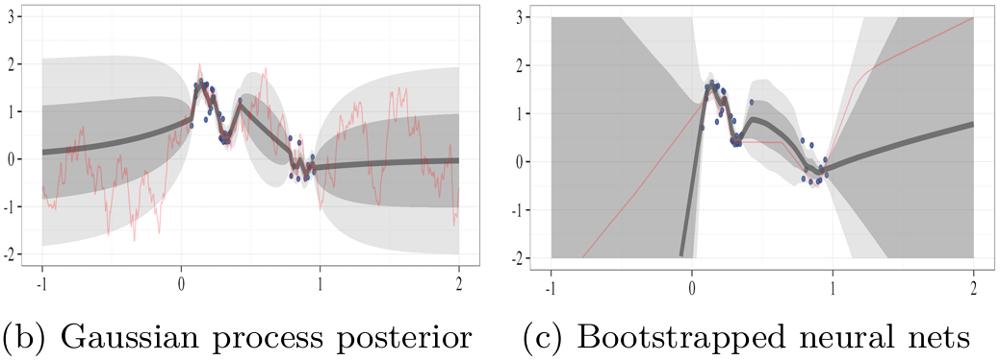{width=550px}
:::
:::

:::

:::

::: fragment
::: footer
$\textcolor{green}{\mathbf{+}\text{ No change to original reward function}}\quad\textcolor{red}{\mathbf{-}\text{ Good bonuses often do better.}}$
:::
:::

# Random network distillation

::: small

:::

# Relation between exploration and reward shaping

::: small
The fundamental difference between exploration and **reward shaping** lies in who defines the reward and why.

::: incremental
- Reward Shaping is a top-down approach where a human engineer hard-codes external hints into the environment.
- Model Curiosity is a bottom-up approach where the agent generates its own internal rewards based on its own surprise and ignorance.
:::

### Reward Shaping (The Human Guide)

Reward shaping is when a human designer manually injects extra, frequent rewards into the environment to gently guide the agent toward the ultimate goal. It is the RL equivalent of playing the "Hot or Cold" game with a child.

### How it works:
Instead of only giving the agent a reward of $+1$ when it reaches the end of a maze, the programmer adds an extra mathematical function that rewards the agent for getting closer to the exit.
For example, every step that reduces the straight-line distance to the goal might give the agent a tiny bonus of $+0.01$.

::: columns-4-1
::: platzhalter
### The Catch: The Perverse Incentive Problem
Reward shaping is incredibly notorious for causing unintended side effects if not done perfectly. Because humans are basically telling the agent how to solve the problem rather than just what the problem is, the agent will often find loopholes to maximize the shaped reward without ever solving the actual task.

*Famous Example*: In a [boat-racing video game](https://openai.com/index/faulty-reward-functions/), researchers shaped the reward by giving the boat points for hitting targets along the track. Instead of finishing the race, the AI learned to drive in circles, infinitely loops through a specific cluster of targets, and constantly set itself on fire because doing so yielded more points than winning the actual race.
:::

{width=400px}
:::
:::


# References

::: { #refs }
:::
