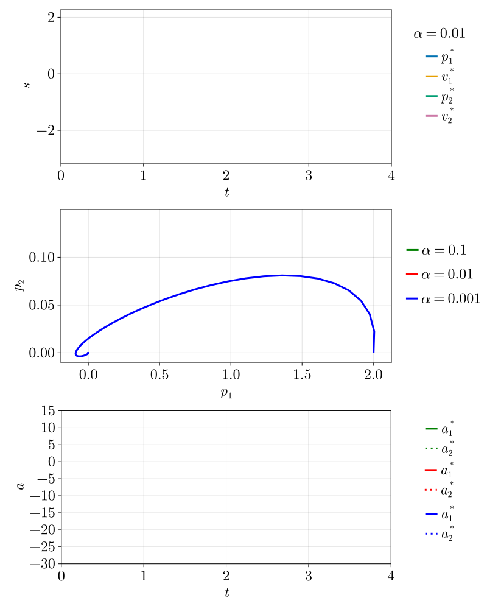
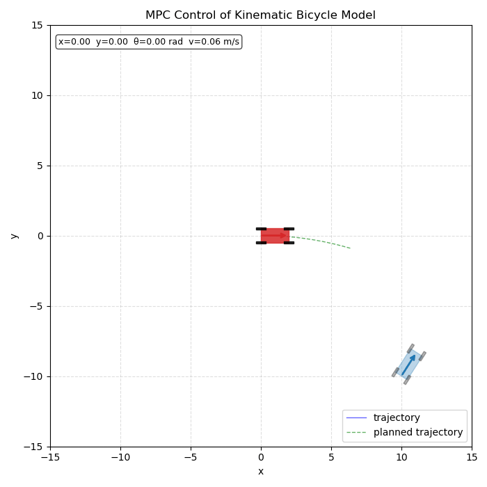
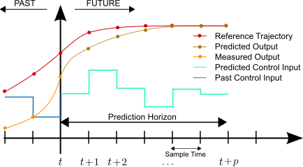

---
subtitle:    Optimal Control \& Feedback Control
chapter:     14
feedback:
  deck-id:  'deeprl-planning-control'
...

------------------------------------------------------------------------------

# Content

------------------------------------------------------------------------------

# Content

- Recap of model-free RL
- Open-loop optimal control
  - Trajectory planning
  - Solution approaches
  - Stochastic optimal control
  - The linear case
- Closed-loop control
  - Model Predictive Control (MPC)
  - Differentiable Predictive Control (DPC)

# Where are we?

::: small
| Chapter | Topic                                                        |                                  Content |
| :-----: | :----------------------------------------------------------- | :--------------------------------------- |
|         | **Basics \& tabular methods**                                |                                          |
| 1-5     | Bandits, MDPs, Dynamic Programming, Monte Carlo, TD Learning | RL basics in finite dimensions           |
|         | **Deep-learning-based methods**                              |                                          |
| 6-13    | DQN, policy gradients, actor-critic, PPO/SAC, exploration    | Deep RL from basics to modern algorithms |
|         | **Model-Based Control**                                      |                                          |
|  [14]{style="color: red;"}  | [ Optimal control \& feedback control ]{style="color: red;"} | [How to do control when we know the model]{style="color: red;"} | 
|         | Model-based reinforcement learning                           |                                          | 
|         | **Advanced Topics**                                          |                                          |

Table: Lecture contents
:::

# Recap: model-based and model-free RL

::: small
::: columns-1-1
::: incremental
- Until now, knowledge of a model only in the simplest RL approaches.
  - Dynamic Programming for tabular RL, e.g., policy or value iteration.
  - We need to know $\textcolor{red}{\psprimesa}$ to update our value estimate!
- All the advanced algorithms: **model-free RL**.
  - Collect experience by following the current policy $\pi$, 
  - then update our estimate of $V$, $Q$, $A$ or $\pi$ only from the data.
:::

::: platzhalter
::: {.definition}
### Algorithm: Value iteration for estimating $\pi\approx \pi^*$.

**while** ($\Delta > \theta$):\
$\quad$ $\Delta \gets 0$\
$\quad$ **for** $s \in \Sc$:\
$\quad\quad$ $V_{\mathsf{old}}(s) \gets V(s)$\
$\quad\quad$ $V(s) \gets \max_{a\in\Ac} \sum_{s'\in\Sc} \textcolor{red}{\psprimesa} \left[ r + \gamma V(s') \right]$\
$\quad\quad$ $\Delta \gets \max(\Delta, \abs{V_{\mathsf{old}}(s)-V(s)})$
:::
:::
:::

::: fragment
### Advantages / disadvantages of model-free RL
:::

::: columns-1-1
::: platzhalter
[$\textcolor{green}{\mathbf{+}\text{ No model knowledge required. All we need is access\\ ~~~~to the system / a black-box simulator.}}$]{.fragment}\
[$\textcolor{green}{\mathbf{+}\text{ No bias due to inaccurate model.}}$]{.fragment}\
:::

::: platzhalter
[$\textcolor{green}{\mathbf{+}\text{ Easier to implement.}}$]{.fragment}\
[$\textcolor{red}{\mathbf{-}\text{ Data-hungry! Can be very sample-inefficient.}}$]{.fragment}
[$\textcolor{red}{\mathbf{-}\text{ Ignorant of prior knowledge.}}$]{.fragment}
:::
:::
\

::: fragment
### Today: Can we do better if we know the dynamics?
:::

::: columns-4-5
::: platzhalter

[We often **know the dynamics**:]{.fragment}

::: incremental
- Games (e.g., Chess, Go, Atari games).
- Easily modeled systems (e.g., car navigation).
- Simulated environments (e.g., robotics, video games)
:::
:::

::: platzhalter
[Also, we can often **learn the dynamics**:]{.fragment}

::: incremental
- System identification: fit unknown parameters of a known model.
- Learning: fit a general purpose model to observed transition data.  
:::
:::
:::
:::

# What is a model?

::: small
::: columns-10-1-12
::: incremental
- Very generally, a **model** is an MDP tuple $(\Sc, \Ac, p, r, \gamma)$, just as we have seen before. Most notably, we have
  - the dynamics model $\psprimesa$,
  - the reward probability $r \sim \pC{\cdot}{s,a}$.
- The state and action spaces $\Sc$ and $\Ac$ are usually assumed to be known.
- The discount factor is given or can be chosen by an expert.
:::

::: platzhalter

:::

::: platzhalter
::: fragment
## Types of models

**1. Probabilistic vs. deterministic**
:::

::: incremental
- probabilistic: $$s' \sim \pC{\cdot}{s,a},\quad r \sim \pC{\cdot}{s,a}.$$
- deterministic (a special case of the former): $$s' = f(s,a), \quad r=\ell(s,a).$$
:::

[**2. Known vs. unknown**]{.fragment}

::: incremental
- **True MDP**: $p$ and $r$ (or $f$ and $\ell$) are perfectly known a priori.
- **Approximated MDP**: $p$ and $r$ (or $f$ and $\ell$) need to be learned, $$p_\theta \approx p,~ r_\phi \approx r \qquad \text{or} \qquad f_\theta\approx f,~ \ell_\phi \approx \ell. $$
:::

:::

:::
:::

::: fragment
::: footer
:bulb: The case of learning a model is covered extensively in the next lecture.
:::
:::

------------------------------------------------------------------------------

# Open-loop optimal control

------------------------------------------------------------------------------

# Planning \& optimal control

::: small
::: columns-1-1
::: incremental
- For now, we asumme that the model 
  - is known,
  - is fully deterministic. 
- In the episodic case ($T<\infty$), the RL problem becomes
$$\begin{equation}\begin{aligned} 
&\min_{a_0,\ldots,a_{T-1}} \sum_{t=0}^T \ell(s_t,a_t) = \min_{a_0,\ldots,a_{T-1}} L(a) \\ 
\text{subject to}\quad &s_{t+1}=f(s_t,a_t),~t=0,1,\ldots,T-1. 
\end{aligned}\label{eq:OC_ocp} 
\end{equation} $$
- Eq. \eqref{eq:OC_ocp} is referred to as an **optimal control problem** (**OCP**). 
  - $\ell$ is the *stage cost*.\
  [:bulb: Closely related to the negative reward $-r$!]{.fragment}
  - $L$ is the *cost* that we seek to *minimize*.\
  [:bulb: Closely related to value $V$!]{.fragment}
  - Optimal control is usually formulated as a *minimization problem*, e.g., the distance to a desired trajectory.
<!-- - In this setting, how do we determine the optimal sequence of actions $a_t$?\
$\Rightarrow$ two settings:
  - Open-loop / planning.
  - Closed-loop / feedback control. -->
- Generally, optimal control refers to the **open-loop** / **planning** setting.
:::

::: fragment
.](images/14-optimal-control/open-closed-loop.svg){.embed width=350px}
:::
:::
:::

# The deterministic vs. the stochastic case

::: small
::: columns-1-1
::: platzhalter
::: incremental
- In RL, we usually assume that we have a stochastic problem for various reasons:
  - stochastic dynamics,
  - stochastic actions/policies,
  - stochastic rewards.
- In the open-loop setting, stochastic optimal control is suboptimal!\
[$\Rightarrow$ Why?]{.fragment}
:::

::: fragment
### Stochastic dynamics

$$ \pC{s_0,\ldots,s_T}{a_0,\ldots,a_{T-1}} = p(s_0)\prod_{t=0}^{T-1}\pC{s_{t+1}}{s_t,a_t}.$$
:::

::: incremental
- The optimal action $a_1$ depends on $s_1$, which we cannot know for certain at $t=0$.
- The same is true for all following states and actions.
:::
:::

::: fragment
::: definition
### Some approaches for stochastic optimal control

::: incremental
- Certainty Equivalence (CE)
  - Simply replace all stochastic quantities by their expectations/mean values.\
  [$\textcolor{green}{\mathbf{+}\text{ Computationally cheap.}}$]{.fragment}\
  [$\textcolor{red}{\mathbf{-}\text{ Completely ignores variance.}}$]{.fragment}
- Mean-variance / risk-sensitive optimization
  - define loss function composed of mean and variance: $$\min_a \Exp{L} + \gamma\, \Var{L}.$$
  [$\textcolor{green}{\mathbf{+}\text{ Accounts for variance.}}$]{.fragment}\
  [$\textcolor{red}{\mathbf{-}\text{ Need additional compute to estimate $\Var{L}$.}}$]{.fragment}
- Sample-path optimization
  - Monte-Carlo estimate of expected loss by multiple simulations with different noise realizations $\omega_i$: $$ \min_a \frac{1}{N} \sum_{i=1}^N L(a,\omega_i).$$
  [$\textcolor{green}{\mathbf{+}\text{ Can estimate arbitrary distributions (beyond Guassian).}}$]{.fragment}\
  [$\textcolor{red}{\mathbf{-}\text{ Compute grows with }N.}$]{.fragment}
:::
:::
:::
:::

:::

# Solving the OCP: single shooting

::: small
$$\begin{equation}\begin{aligned} 
&\min_{a_0,\ldots,a_{T-1}} \underbrace{\sum_{t=0}^T \ell(s_t,a_t)}_{= L(a)} \quad 
\text{subject to}\quad &s_{t+1}=f(s_t,a_t),~t=0,1,\ldots,T-1. 
\end{aligned}\tag{\ref{eq:OC_ocp}}
\end{equation} $$

[A very common approach to solve the OCP \eqref{eq:OC_ocp} is via **single shooting**, where assume that the states $s_t$ are implicitly defined by choosing the actions $a_t$.]{.fragment}\
[:bulb: This holds for most systems of interest. The basis for this are existence-and-uniqueness theorems, e.g., by [Picard-Lindelöf](https://en.wikipedia.org/wiki/Picard%E2%80%93Lindel%C3%B6f_theorem).]{.fragment}

::: columns-12-1-6
::: fragment
::: definition
### Single shooting

*Initialize*: Initial state $s_0$, action sequence $\iterate{a}{0}=\cbracket{\iteratesub{a}{0}{0},\ldots,\iteratesub{a}{0}{T-1}}$.

**for** $j=0,1,2,\ldots$:\
[$\quad$ simulate the system following $\iterate{a}{j}$ to get $\iterate{s}{j}=\cbracket{\iteratesub{s}{j}{1},\ldots,\iteratesub{s}{j}{T}}$]{.fragment}\
[$\quad$ assess the performance by computing $L\cbracket{\iterate{a}{j}}$]{.fragment}\
[$\quad$ gradient descent to update our actions: $$\iterate{a}{j+1} = \iterate{a}{j} - \eta \nabla_a L\cbracket{\iterate{a}{j}} $$]{.fragment}
:::
:::

::: platzhalter

:::

::: fragment
\

### Remaining question:

How do we compute the gradient
$$\nabla_a L\cbracket{\iterate{a}{j}}?$$
:::
:::
:::

# Gradients in single shooting (1)

::: small

$$\begin{equation}\begin{aligned} 
&\min_{a_0,\ldots,a_{T-1}} \underbrace{\sum_{t=0}^T \ell(s_t,a_t)}_{= L(a)} \quad 
\text{subject to}\quad &s_{t+1}=f(s_t,a_t),~t=0,1,\ldots,T-1. 
\end{aligned}\tag{\ref{eq:OC_ocp}}
\end{equation} $$

The procedure of computing the gradient is closely related to the backpropagation algorithm!

::: incremental
1. Turn the constraint into an objective via the Lagrangian formalism, where $\lambda$ is the [**adjoint state**](https://en.wikipedia.org/wiki/Adjoint_state_method): 
[$$\begin{align*} \Lc(s,a,\lambda) = &\sum_{t=0}^T \ell(s_t,a_t) + \sum_{t=0}^{T-1} \lambda^\top_{t+1}\cbracket{f(s_t,a_t)- s_{t+1}} \\
=&\rbracket{\ell(s_0,a_0) + \lambda^\top_{1}f(s_0,a_0)} + \rbracket{\ell(s_1,a_1) + \lambda^\top_{2}f(s_1,a_1) -\lambda^\top_{1} s_1}  + \ldots + \\
&\rbracket{\ell(s_t,a_t) + \lambda^\top_{t+1}f(s_t,a_t) -\lambda^\top_{t} s_{t}} + \ldots + \rbracket{\ell(s_T,a_T) + \lambda^\top_{T} s_T}. \end{align*}$$]{.math-incremental}
1. Necessary condition for optimality: Total derivative of $\Lc$ has to be zero:
$$ \pdiff{\Lc}{\lambda_t} = 0,\quad \pdiff{\Lc}{s_t} = 0, \quad \pdiff{\Lc}{a_t} = 0. $$

:::
:::

# Gradients in single shooting (2)

::: small

$$\Lc(s,a,\lambda) = \sum_{t=0}^T \ell(s_t,a_t) + \sum_{t=0}^{T-1} \lambda^\top_{t+1}\cbracket{f(s_t,a_t)- s_{t+1}}$$

::: incremental
3. State equation:
$$\pdiff{\Lc}{\lambda_t} = s_{t} - f(s_{t-1},a_{t-1}) \stackrel{!}{=} 0 \fragment{ \quad \Leftrightarrow \quad s_{t+1} = f(s_t,a_t) \quad \text{for }t=0,\ldots,T-1. }$$
4. Adjoint equation:
$$\pdiff{\Lc}{s_t} = \pdiff{\ell}{s_t} + \cbracket{\pdiff{f}{s_t}}^\top\lambda_{t+1} - \lambda_t \stackrel{!}{=} 0 \fragment{ \quad \Leftrightarrow \quad \lambda_{t} = \pdiff{\ell}{s_t} + \cbracket{\pdiff{f}{s_t}}^\top\lambda_{t+1} \quad \text{for }t=0,\ldots,T-1. }$$
5. Final adjoint state ($t=T$): No influence on a future state, $\lambda_T = \pdiff{\ell}{s_T}$.
6. Action gradient:
$$\pdiff{\Lc}{a_t} = \pdiff{\ell}{a_t} + \cbracket{\pdiff{f}{a_t}}^\top\lambda_{t+1} \quad \text{for }t=0,\ldots,T-1. $$
:::
:::

# Gradients in single shooting (3)

::: small
::: columns-7-3
::: definition
### Gradient calculation in the single shooting method for solving \eqref{eq:OC_ocp}

Given: Initial state $s_0$, action sequence $a=\cbracket{a_0,\ldots,a_{T-1}}$.

::: incremental
- **Forward simulation** of the state equation: $$s_{t+1} = f(s_t,a_t), \qquad t=0,1,\ldots,T-1.$$
- "Initial condition" (i.e., at final time $T$) for the adjoint equation: $\lambda_T = \pdiff{\ell}{s_T}.$
- **Backward simulation** of the adjoint equation: $$\lambda_{t} = \pdiff{\ell}{s_t} + \cbracket{\pdiff{f}{s_t}}^\top\lambda_{t+1}, \qquad t=T-1,T-2,\ldots,1,0.$$
- **Gradient calculation** w.r.t. $a$: $$\pdiff{\Lc}{a_t} = \pdiff{\ell}{a_t} + \cbracket{\pdiff{f}{a_t}}^\top\lambda_{t+1}, \qquad t=0,1,\ldots,T-1.$$
:::
:::

::: fragment
### Notes

::: incremental
- The backward simulation is closely related to the backward pass in backpropagation.
- In modern packages such as PyTorch, JAX or TensorFlow, this procedure can be automated with autodiff, when appropriately implementing the forward pass.
:::
:::
:::
:::

# Solving the OCP: full discretization

::: small
::: incremental
- Alternative to forward-backward: the full discretization 
- Both $s$ and $a$ become optimization variables: $$ x=\rbracket{s_0^\top, a_0^\top,s_1^\top,a_1^\top,\ldots, a_{T-1}^\top,s_T^\top}^\top. $$
- Reformulation of the OCP \eqref{eq:OC_ocp}
$$\begin{equation} \min_{x} F(x) = \sum_{t=0}^T \ell(s_t,a_t) \quad\text{s.t.}\quad C(x) = \begin{bmatrix} f(s_0,a_0) - s_1 \\ f(s_1,a_1) - s_2 \\ \vdots \\ f(s_{T-1},a_{T-1}) - s_T \end{bmatrix}=0 \label{eq:OC_ocp_discretized} \end{equation} $$
- Total number of optimization variables when the state dimension is $n$ and the action dimension is $m$: $(T+1)n + Tm$.
- Solution via standard solvers for nonlinear, constrained optimization problems:
  - Requires the gradients $\nabla_x F(x)$ and $\nabla_x C(x)$.
  - The latter is a very large matrix, but it is fortunately very sparse.
:::

:::

# Comparison: Shooting vs. full discretization

::: small
| | Shooting \eqref{eq:OC_ocp} | Full discretization \eqref{eq:OC_ocp_discretized} |
| :- | :- | :- |
| Sensitivity to initialization | [Very **sensitive to poor initial guesses** $\iterate{a}{0}$.]{.fragment} | [Because we initialize the entire state trajectory $s$, the system doesn't have to be dynamically feasible during early solver iterations $\Rightarrow$ Significantly **more stable for unstable dynamics**.]{.fragment} |
| Computational cost vs. convergence | [**Fast iterations** (one forward and backward pass), but may take **many iterations** to converge.]{.fragment} | [**Iterations more expensive**, but standard [Sequential Quadratic Programming](https://en.wikipedia.org/wiki/Sequential_quadratic_programming) (SQP) or [Interior Point](https://en.wikipedia.org/wiki/Interior-point_method) methods achieve quadratic convergence near the solution, requiring far **fewer total iterations**.]{.fragment} |
| Constraint Handling | [Handling state constraints requires **challenging** penalty functions or barrier methods.]{.fragment} | [Limits on states like $s_{\mathsf{min}} \leq s_t \leq s_{\mathsf{max}}$ or actuations ($a_{\mathsf{min}} \leq a_t \leq a_{\mathsf{max}}$) **can be handled easily**. They are simply treated as bound constraints on elements of our vector $x$.]{.fragment} |
:::

------------------------------------------------------------------------------

# The linear-quadratic case

------------------------------------------------------------------------------

# The linear-quadratic case

::: small
Let's consider a special (yet very common) case

::: columns-8-5
::: platzhalter
::: incremental
- **Linear dynamics**: $$s_{t+1}=A s_t + B a_t, \quad\text{with }A\in\R^{n\times n}\text{ and }B\in\R^{n \times m}.$$
- **Quadratic losses**: $$L(s,a) = \cbracket{\sum_{t=0}^{T-1} s_t^\top Q s_t + a_t^\top R a_t} + s_T^\top Q_f s_T,$$
with matrices $Q,Q_f\in\R^{n\times n}$ penalizing the (terminal) state and\
$R\in\R^{m\times m}$ penalizing the control cost.
:::
:::
::: fragment
::: definition
### Additional conditions

::: incremental
- The matrix $Q$ is *positive semidefinite*: $$s^\top Q s \geq 0 ~\forall~s\in\R^n.$$
- The matrix $R$ is *positive definite*: $$a^\top R a > 0 ~\forall~a\in\R^m.$$
- These ensure existence and uniquenes of a minimizer $s^*,a^*$.
:::
:::
:::
:::

::: fragment
::: definition
### Linear-quadratic optimal control problem

$$\begin{equation} \begin{aligned} \min_{s,a} &\cbracket{\sum_{t=0}^{T-1} s_t^\top Q s_t + a_t^\top R a_t} + s_T^\top Q_f s_T \\
\text{subject to}\quad s_{t+1}&=A s_t + B a_t,~t=0,1,\ldots,T-1. \end{aligned} \label{eq:OC_ocp_linear} \end{equation}$$
:::
:::
:::

# Removing the constraints

::: small
Let's explicitly calculate $s_1,s_2,\ldots$:
[$$\begin{align*}
&s_1 = \textcolor{blue}{A s_0 + B a_0} \\
&s_2 = A s_1 + B a_1 \fragment{ = A (\textcolor{blue}{A s_0 + B a_0}) + B a_1 } \fragment{ = \textcolor{red}{A^2 s_0 + AB a_0 + B a_1} } \\
&s_3 = A s_2 + B a_2 \fragment{ = A (\textcolor{red}{A^2 s_0 + AB a_0 + B a_1}) + B a_2  }\fragment{ = A^3 s_0 + A^2B a_0 + ABa_1 + Ba_2 } \\
&\text{General rule:} \quad s_t = A^t s_0 + \sum_{i=0}^t A^{t-i-1}B a_i\\
&\text{Explicitly:} \quad \underbrace{\begin{bmatrix} s_0 \\ s_1 \\ s_2 \\ s_3 \\ \vdots \\ s_T \end{bmatrix}}_{\hat{s}\in\R^{(T+1)n}} = \underbrace{\begin{bmatrix} 0 & 0 & 0 & \ldots & B \\ 0 & 0 & 0 & \ldots & 0 \\ AB & B & 0 & \ldots & 0 \\ A^2B & AB & B & \ddots & 0 \\ \vdots & \vdots & \vdots & \ddots & \vdots \\ A^{T-1}B & A^{T-2}B & A^{T-3}B & \ldots & B \\ \end{bmatrix}}_{G\in\R^{(T+1)n\times Tm}} \underbrace{\begin{bmatrix} a_0 \\ a_1 \\ a_2 \\ a_3 \\ \vdots \\ a_{T-1} \end{bmatrix}}_{\hat{a}\in\R^{Tm}} + \underbrace{\begin{bmatrix} I \\ A \\ A^2 \\ A^3 \\ \vdots \\ A^T \end{bmatrix}}_{H\in\R^{(T+1)n}} s_0 \\
&\text{In short:}\quad \hat{s}=G\hat{a}+Hs_0
\end{align*}$$]{.math-incremental} 
:::

# Reformulating the cost function

::: small
::: incremental
- Next, we stack our penalty matrices such that they match the dimensions of $S$ and $U$:
$$ \hat{Q} = \begin{bmatrix} Q & & & \\ & \ddots & & \\ & & Q & \\ & & & Q_f \end{bmatrix}\in\R^{(T+1)n \times (T+1)n}, \qquad \hat{R} = \begin{bmatrix} R & & \\ & \ddots & \\ & & R \end{bmatrix}\in\R^{Τm\times Tm}. $$ 
- We can now insert this into the linear-quadratic OCP \eqref{eq:OC_ocp_linear}:
[$$\begin{align*} \min_{s,a} \cbracket{\sum_{t=0}^{T-1} s_t^\top Q s_t + a_t^\top R a_t} + s_T^\top Q_f s_T \quad
&\text{s.t.}\quad s_{t+1}=A s_t + B a_t,~t=0,1,\ldots,T-1 \\
\text{becomes}\qquad\qquad\qquad \min_{\hat{s},\hat{a}} \hat{s}^\top \hat{Q} \hat{s} + \hat{a}^\top \hat{R} \hat{a} \quad &\text{s.t.}\quad \hat{s} = G\hat{a} + Hs_0.
\end{align*}$$]{.math-incremental}
- **Question**: Do we have to consider $\hat{s}$ and $\hat{a}$ independently?\
[$\Rightarrow$ Let's simply insert the constraints!
$$\begin{equation} \boxed{\min_{\hat{a}} \cbracket{G\hat{a} + Hs_0}^\top \hat{Q} \cbracket{G\hat{a} + Hs_0} + \hat{a}^\top \hat{R} \hat{a} \label{eq:OC_ocp_linear2}} \end{equation}$$]{.fragment}
:::
:::

# Solving the linear OCP

::: small
::: columns-8-3
::: platzhalter
[$$\begin{align*} 
&\min_{\textcolor{red}{\hat{a}}} \cbracket{G\textcolor{red}{\hat{a}} + H\textcolor{blue}{s_0}}^\top \hat{Q} \cbracket{G\textcolor{red}{\hat{a}} + H\textcolor{blue}{s_0}} + \textcolor{red}{\hat{a}}^\top \hat{R} \textcolor{red}{\hat{a}} \\
=&\min_{\textcolor{red}{\hat{a}}} \cbracket{\textcolor{red}{\hat{a}}^\top G^\top + \textcolor{blue}{s_0}^\top H^\top} \hat{Q} \cbracket{G\textcolor{red}{\hat{a}} + H\textcolor{blue}{s_0}} + \textcolor{red}{\hat{a}}^\top \hat{R} \textcolor{red}{\hat{a}} \\
=&\min_{\textcolor{red}{\hat{a}}} \textcolor{red}{\hat{a}}^\top G^\top \hat{Q} G \textcolor{red}{\hat{a}} + 2 \textcolor{red}{\hat{a}}^\top G^\top \hat{Q} H \textcolor{blue}{s_0} + \textcolor{blue}{s_0}^\top H^\top \hat{Q} H \textcolor{blue}{s_0} + \textcolor{red}{\hat{a}}^\top \hat{R} \textcolor{red}{\hat{a}} \\
=&\min_{\textcolor{red}{\hat{a}}} \textcolor{red}{\hat{a}}^\top \cbracket{G^\top \hat{Q} G + \hat{R}} \textcolor{red}{\hat{a}} + 2 \textcolor{red}{\hat{a}}^\top G^\top \hat{Q} H \textcolor{blue}{s_0} + \textcolor{blue}{s_0}^\top H^\top \hat{Q} H \textcolor{blue}{s_0}
\end{align*}$$]{.math-incremental}
:::

::: platzhalter
::: definition
### Some linear algebra

$$\begin{align*} (G\hat{a})^\top &= \hat{a}^\top G^\top\\ s_0^\top H^\top \hat{Q} G \hat{a} &= \hat{a}^\top G^\top \hat{Q} H s_0 \end{align*} $$
:::
:::
:::

::: incremental
- This is a quadratic polynomial in $\textcolor{red}{\hat{a}}$!
- Since $Q$ and $R$ (and thus, $\hat{Q}$ and $\hat{R}$) are positive (semi-)definite, the loss function is strictly convex $\Rightarrow$ unique minimizer.
- Take the drivative with respect to $\textcolor{red}{\hat{a}}$:
$$ \diff{}{\textcolor{red}{\hat{a}}} \cbracket{\textcolor{red}{\hat{a}}^\top \cbracket{G^\top \hat{Q} G + \hat{R}} \textcolor{red}{\hat{a}} + 2 \textcolor{red}{\hat{a}}^\top G^\top \hat{Q} H \textcolor{blue}{s_0} + \textcolor{blue}{s_0}^\top H^\top \hat{Q} H \textcolor{blue}{s_0}} =  2\cbracket{G^\top \hat{Q} G + \hat{R}} \textcolor{red}{\hat{a}} + 2 G^\top \hat{Q} H \textcolor{blue}{s_0}.$$
- Setting the gradient to zero yields a linear system (depending on the initial condition $\textcolor{blue}{s_0}$):
$$ \begin{equation} \boxed{\cbracket{G^\top \hat{Q} G + \hat{R}} \textcolor{red}{\hat{a}} = - G^\top \hat{Q} H \textcolor{blue}{s_0}.} \label{eq:OC_ocp_linear_solution} \end{equation}$$
:::

:::

# Example: Control of a forklift (1)

::: small
::: columns-8-2
::: platzhalter
- Consider a simple vehicle driving on a plane (with mass $m$ and friction $d$):
$$ s = \begin{bmatrix} p_1 \\ v_1 \\ p_2 \\ v_2\end{bmatrix}, \quad \dot{s} = \diff{s}{t}(t) = A_c s(t) + B_c a(t) = \begin{bmatrix} 0 & 1 & 0 & 0 \\ 0 & -d/m & 0 & 0 \\ 0 & 0 & 0 & 1 \\ 0 & 0 & 0 & -d/m\end{bmatrix} s(t) +\begin{bmatrix} 0 & 0 \\ 1 & 0 \\ 0 & 0 \\ 0 & 1 \end{bmatrix} a(t). $$
:::

{width=200px}

:::

::: incremental
- This can be translated into a discrete-time system with time step $\Delta t$:
$$ A = \exp(A_c \Delta t), \quad B = \cbracket{\int_0^{\Delta t} \exp(A(\Delta t - \tau))\dint{\tau}}B_c \fragment{ \quad\Longrightarrow\quad s_{t+1}=A s_t + B a_t. }$$
- Control objective: Steer the forklift from $s_0=\rbracket{2~0~0~0}^\top$ to the origin with a small penalty on the control:
$$ \min_{s,a} \sum_{t=0}^T \norm{s_t}_2^2 + \alpha \norm{a_t}_2^2 \quad\text{s.t.}\quad s_{t+1}=A s_t + B a_t. $$
:::

:::

# Example: Control of a forklift (2)

::: small
::: columns-5-5
::: incremental
- Define individual control matrices: $$Q=\begin{bmatrix} 1 & & & \\ & 0 & & \\ & & 1 & \\ & & & 0 \end{bmatrix},\quad Q_f=10\cdot Q, \quad R=\begin{bmatrix}\alpha & \\ & \alpha\end{bmatrix}.$$
- Assemble the matrices $\hat{Q}$ and $\hat{R}$. [With $T=200$, we get $$\hat{Q}\in\R^{804 \times 804}\quad\text{and}\quad\hat{R}\in\R^{400 \times 400}.$$]{.fragment}
- Given the initial condition $s_0$, solve the linear system
$$ \begin{equation} \cbracket{G^\top \hat{Q} G + \hat{R}} \hat{a} = - G^\top \hat{Q} H s_0. \tag{\ref{eq:OC_ocp_linear_solution}} \end{equation}$$
- Simulate dynamics to get optimal trajectory $s^*$:
$$ s^*_{t+1}=A s_t^* + B a_t^* \qquad \text{or} \qquad \hat{s}^* = G\hat{a}^* + H s_0. $$
:::

::: fragment
{.embed width=480px}
:::

:::
:::

<!-- # Example: Control of a forklift (2)

::: small
::: columns-5-5
::: platzhalter
[1. Define individual control matrices: $$Q=\begin{bmatrix} 1 & & & \\ & 0 & & \\ & & 1 & \\ & & & 0 \end{bmatrix},\quad Q_f=10\cdot Q, \quad R=\begin{bmatrix}0.01 & \\ & 0.01\end{bmatrix}.$$]{.fragment data-fragment-index=1}
:::

::: platzhalter
[3. Given the initial condition $s_0$, solve the linear system
$$ \begin{equation} \cbracket{G^\top \hat{Q} G + \hat{R}} \hat{a} = - G^\top \hat{Q} H s_0. \tag{\ref{eq:OC_ocp_linear_solution}} \end{equation}$$]{.fragment data-fragment-index=4}
[4. Simulate dynamics to get optimal trajectory $s^*$:
$$ s^*_{t+1}=A s_t^* + B a_t^* \qquad \text{or} \qquad \hat{s}^* = G\hat{a}^* + H s_0. $$]{.fragment data-fragment-index=5}
:::
:::

[2. Assemble the matrices $\hat{Q}$ and $\hat{R}$.]{.fragment data-fragment-index=2} [With $T=200$, we get $\hat{Q}\in\R^{804 \times 804}$ and $\hat{R}\in\R^{400 \times 400}$.]{.fragment data-fragment-index=3}

::: fragment
{.embed width=1280px}
:::

::: -->

------------------------------------------------------------------------------

# Closed-loop control

------------------------------------------------------------------------------

# Model predicitve control (MPC)

::: small
::: columns-1-1
::: platzhalter
::: incremental
- Given a model, solving open-loop OCPs is a well-established field.
- But there are also **drawbacks** in the application to real systems.
  - Unforeseen events cannot be accounted for.
  - External disturbances/uncertainties are hard/impossible to include.
  - Smalles inaccuracies scale exponentially over time.
- **Question**: Can we close the loop around OCPs?
:::

::: fragment
### Model predictive control (MPC)
:::

::: incremental
- Let us solve the open-loop problem repeatedly on a shorter horizon $p \leq T$.
- The "feedback" is setting the initial condition of the OCP.
:::

:::

.](images/14-optimal-control/open-closed-loop.svg){width=350px}

:::
:::

# MPC scheme

::: small

$$\begin{equation}\text{OCP:}\quad\min_{a_0,\ldots,a_{T-1}} \sum_{t=0}^T \ell(s_t,a_t) = \min_{a_0,\ldots,a_{T-1}} L(a) \quad
\text{s.t.}\quad s_{t+1}=f(s_t,a_t),~t=0,1,\ldots,T-1. \tag{\ref{eq:OC_ocp}}\end{equation}$$

::: columns-1-1
.](images/14-optimal-control/MPC.svg){width=550px}

::: fragment
::: definition
### The MPC loop

::: incremental
1. Measure system state $s_t$ and use it as the initial state for the OCP \eqref{eq:OC_ocp}.
1. Solve \eqref{eq:OC_ocp} using a model of the real system over a prediction horzion of length $p$.
1. Apply first entry of $a^*$ (i.e., $a_0^*$) to the real system.
1. Advance real system by one time step.
1. Repeat.
:::
:::
:::
:::

::: fragment
### Pros and cons
:::

::: columns-1-1
::: platzhalter
[$\textcolor{green}{\mathbf{+}\text{ Very robust.}}$]{.fragment}\
[$\textcolor{green}{\mathbf{+}\text{ No offline learning phase (if model known).}}$]{.fragment}\
[$\textcolor{green}{\mathbf{+}\text{ Easy to include state constraints.}}$]{.fragment}\
[$\textcolor{green}{\mathbf{+}\text{ Lots of theory.}}$ (e.g., [@GP17])]{.fragment}\
:::
::: platzhalter
[$\textcolor{red}{\mathbf{-}\text{ Real-time capability (in particular for nonlinear models).}}$]{.fragment}
[$\textcolor{red}{\mathbf{-}\text{ Control performance depends on model quality.}}$]{.fragment}
:::
:::
:::

# Example: Autonomous driving

::: small
We want to plan the trajectory of an autonomous vehicle from an initial position towards a terminal position.

::: columns-7-5
::: platzhalter
::: incremental
- Dynamics: Simplified **kinematic bicycle model** [@Kong2015bicycle].\
:::

::: fragment
::: columns-3-2
.](images/14-optimal-control/Bicycle2.svg){width=370px}

::: platzhalter
$$\begin{align*}
s&=\begin{bmatrix} x \\ y \\ \theta \\ v \end{bmatrix},~ a=\begin{bmatrix} \mathsf{acc} \\ \delta \end{bmatrix}, \\
\dot{s} &=\begin{bmatrix} s_4 \cos s_3 \\ s_4 \sin s_3 \\ \frac{s_4}{L} \tan a_2 \\ a_1 - \lambda s_4 \end{bmatrix}.
\end{align*}$$
:::
:::
:::

::: incremental
- Objective: **terminal condition** to approach target location $$\min_{a_0,\ldots,a_{p-1}} \ell(s_p) = \norm{s_p - s_p^\mathsf{target}}_2^2\quad\text{s.t.}\quad \mathsf{bicycle~model}.$$
- Discretization: $\Delta t = 0.2$, $p=25$.
:::
:::

::: incremental
- MPC optimization: Adam ($\eta=0.1$); 10 steps.
- Results:\
{width=480px}
:::
:::
:::

# Using linearized models in MPC

::: small
::: columns-6-4
::: incremental
- Approach to avoid the large online cost in many MPC applications: use **linearized dynamics** instead!
  - :bulb: This is a very common approach in control theory, in particular linearization around the desired state $s^{\mathsf{target}}$.
- Approach via [Taylor series expansion](https://en.wikipedia.org/wiki/Taylor_series) around current state $\overline{s}_k, \overline{a}_k$.
- Introduce distance to current state:
$$\Delta s_t = s_t - \overline{s}_t, \quad  \Delta a_t = a_t - \overline{a}_t.$$
- First-order (i.e., **linear**) approximation in $\Delta s_t$ and $\Delta a_t$:
$$s_{t+1} \approx \underbrace{f(\overline{s}_t,\overline{a}_t)}_{\fragment{ =\overline{s}_{t+1} }} + \underbrace{\left. \pdiff{f}{s}\right|_{(\overline{s}_t,\overline{a}_t)}}_{\fragment{ =A }} \Delta s_t  + \underbrace{\left. \pdiff{f}{a}\right|_{(\overline{s}_t,\overline{a}_t)}}_{\fragment{ =B }} \Delta a_t + \Oc(\Delta s_t^2, \Delta a_t^2)$$
[$$\begin{equation} s_{t+1} - \overline{s}_{t+1} = \boxed{\Delta s_{t+1} \fragment{ \approx A \Delta s_t  + B \Delta a_t. }} \label{eq:OC_MPC_linearized} \end{equation}$$]{.fragment}
:::

::: fragment

::: platzhalter
{width=350px}
:::

::: definition
### MPC with linearized dynamics

**for** $t=0,1,2,\ldots$:\
[$\quad$ **Measure** the current state $\overline{s}_t,\overline{a}_t$\
$\qquad$ of the real (nonlinear system).]{.fragment}\
[$\quad$ **Linearize** the system dynamics\
$\qquad$ around $\overline{s}_t,\overline{a}_t$ $\Rightarrow$ \eqref{eq:OC_MPC_linearized}.]{.fragment}\
[$\quad$ **Assemble** matrices $\hat{Q}_t$ / $\hat{R}_t$ and $G_t$ / $H_t$.]{.fragment}\
[$\quad$ **Solve** linear problem \eqref{eq:OC_ocp_linear2}.]{.fragment}\
[$\quad$ **Apply** first entry to real system.]{.fragment}
:::
:::
:::
\

[$\qquad\qquad$**New bottlenecks**:$\qquad$]{.fragment}
[$\bullet$ The linearization around $\overline{s}_t,\overline{a}_t$ $\qquad$]{.fragment}
[$\bullet$  Assembly of $\hat{Q}_t$ / $\hat{R}_t$ and $G_t$ / $H_t$. ]{.fragment}

:::

# Relation to reinforcement learning

::: small
::: columns-6-4
{width=800px .embed}

::: platzhalter
::: fragment
### Trade-offs
:::

::: incremental
- Learning a policy offline vs. solving an OCP online.
- Expensive training vs. expensive inference.
:::

::: fragment
### Approaches in between
:::

::: incremental
- Explicit MPC.
- Differentiable predictive control (DPC).
- Monte-Carlo tree search (MCTS).
:::

:::
:::
:::

# Explicit MPC

::: small
::: columns-3-7
::: platzhalter
::: incremental
- MPC's main challenge: **large online cost**! 
- Can we avoid this? [$\Rightarrow$ Let's revisit the OCP formulation \eqref{eq:OC_ocp} in the MPC setting:
$$\begin{equation} \begin{aligned} &\min_{\tilde{a}} \sum_{\tau=0}^p \ell(\tilde{s}_\tau,\tilde{a}_\tau) \\
\text{s.t.}\quad &\tilde{s}_{\tau+1}=f(\tilde{s}_\tau,\tilde{a}_\tau),~\tilde{s}_0=\textcolor{blue}{s_t}. \end{aligned} \label{eq:OC_mpc} \end{equation}$$]{.fragment}
- This OCP is parameterized by the initial condition $\textcolor{blue}{s_0}$!
- If we solve it for every $s_0\in\Sc$ and explicitly store $a^*(s_0)$ in a library, we can quickly retrieve it in the online phase.
- But there are infinitely many $s_0$! :scream:
- Options:
  - Approximate by a finite number of $s_0$.
  - Special case: linearity.
:::
:::

::: fragment
::: definition
### The explicit linear-quadratic regulator [@Bemporad2002explicitlqr]

::: columns-6-4

::: platzhalter
::: incremental
- For linear models and quadratic costs, 
$$\begin{align*} f(s,a)&=As+Ba,\\ \ell(s,a) &= s^\top Q s + a^\top R a, \end{align*}$$ 
the solution space $a^*(s_0)$ for \eqref{eq:OC_mpc} is split into polygons on which the optimal feedback $a^*$ is an affine function of the initial condition $s_0$
:::
:::

::: platzhalter
\
{width=240px .embed}
:::
:::

::: incremental
- Finite number of polygons $\Rightarrow$ finite number of OCPs to solve!
- Algorithm for the **offline phase**:
  1. Split the space of initial conditions into polygons $i=1,\ldots,N_p$.
  1. Determine coefficients $W^i$ and $b_i$ for the affine feedback law (details in [@Bemporad2002explicitlqr]).
- Drawback: Exponential growth of polygons with state dimension $n$.
  - Workaround: Replace polygon by deep neural net [@Karg2020mpcdeep].
:::
:::
:::
:::
:::

# Differentiable predictive control (DPC)

::: small
::: columns-5-5

::: platzhalter
::: incremental
- Let's start with a policy network, just as in policy gradient methods: $a=\mu_\phi(s)$.
- Inserting into the right-hand side of our model yields an autonomous system:
$$s_{t+1}=f(s_t, \mu_\phi(s_t)).$$
- We can now formulate a closed-loop performance criterion:
$$L(\phi) = \sum_{t=1}^T \norm{s_t - s_t^\mathsf{target}} + \alpha\norm{\mu\phi(s_t)}. $$
:::
:::

::: platzhalter
![Differentiable predictive control framework [@Drgona2022].](images/14-optimal-control/DPC.png){width=750px}
:::

:::

::: incremental
- If the dynamics model $f$ (or a learned version $f_\theta$; see next lecture) is differentiable, then we can directly optimize the policy paramter $\phi$ via backpropagation and gradient descent: $$\phi \gets \phi - \eta\diff{L}{\phi}.$$
- This is known as **differentiable predictive control** (**DPC**).
:::
:::

# Summary / what we have learned

::: small
::: incremental
- Knowing a model of the system dynamics can be very useful, not only for tabular reinforcement learning methods.
- Open-loop = Planning: Given an initial condition $s_0$, find the optimal actions for an entire trajectory **once**.
- MPC: Repeated solution of open-loop optimal control problems. 
- Explicit MPC: Solving the open-loop problem in an offline phase in a parameterized fashion.
- Differentiable predictive control (DPC): Policy optimization via direct differentiation through the dynamics model.
:::
:::

# References

::: { #refs }
:::
