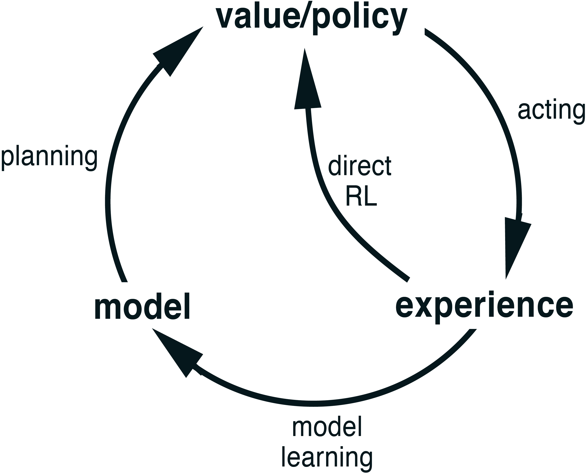
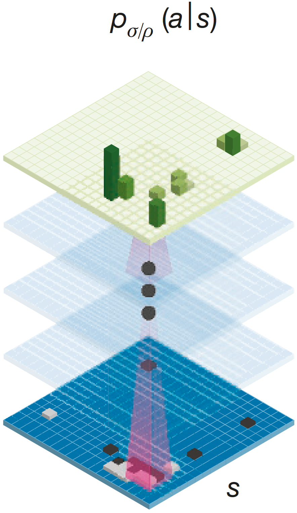
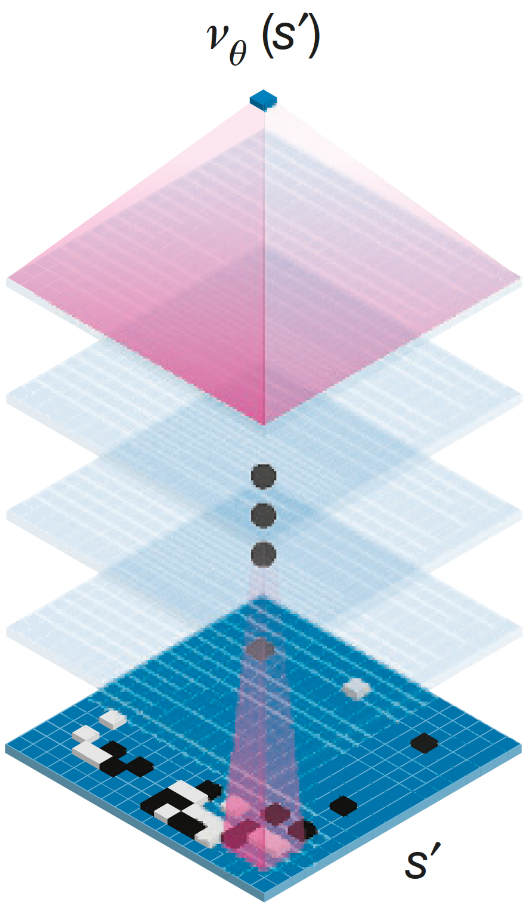
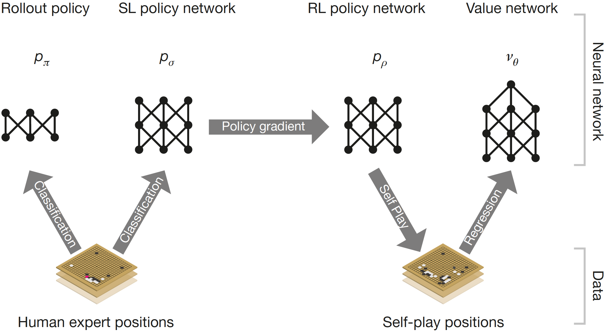
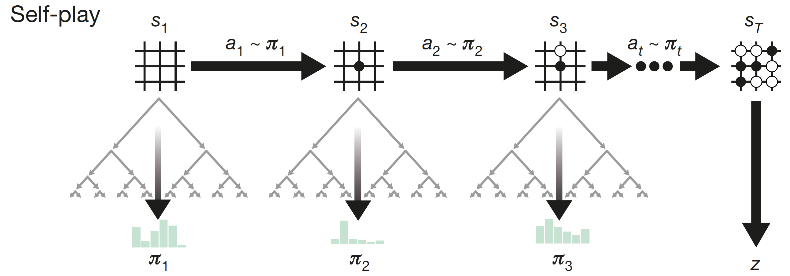
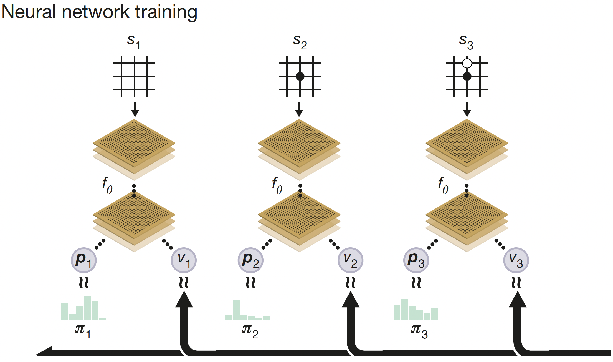
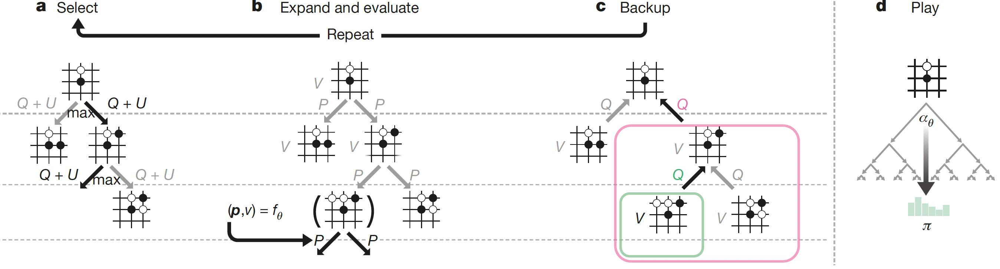

---
subtitle:    Model-based reinforcement learning
chapter:     15
feedback:
  deck-id:  'deeprl-model-based-RL'
...

------------------------------------------------------------------------------

# Content

------------------------------------------------------------------------------

# Content

- Revisiting the past: Dyna-style algorithms
  - Dyna-$Q$ and Dyna-$Q+$
  - Prioritized sweeping
- Looking into the future: Planning at decision time
  - Heuristic search
  - Rollouts
  - MCTS
- AlphaGo \& AlphaZero
- Learning a model
  - Dreamer architecture

# Where are we?

::: small
| Chapter | Topic                                                        |                                  Content |
| :-----: | :----------------------------------------------------------- | :--------------------------------------- |
|         | **Basics \& tabular methods**                                |                                          |
| 1-5     | Bandits, MDPs, Dynamic Programming, Monte Carlo, TD Learning | RL basics in finite dimensions           |
|         | **Deep-learning-based methods**                              |                                          |
| 6-13    | DQN, policy gradients, actor-critic, PPO/SAC, exploration    | Deep RL from basics to modern algorithms |
|         | **Model-Based Control**                                      |                                          |
|      14 | Optimal control \& feedback control                          | How to do control when we know the model | 
| [15]{style="color: red;"}  | [Model-based reinforcement learning]{style="color: red;"} | [RL with known and learned models]{style="color: red;"} |
|         | **Advanced Topics**                                          |                                          |

Table: Lecture contents
:::

# Learning vs. planning in the RL context

::: small
::: columns-5-2

::: incremental
- *Learning* and *planning* are closely related in RL [@Sutton1998].
- The key difference is the *origin of the training data*:
  - **Learning**: **real experience**,
  - **Planning**: **simulated experience**.
- Simplest example: $Q$-learning vs. $Q$-planning.
:::

{width=300px}

:::

::: columns-5-5

::: fragment
::: {.definition}
### Algorithm: $Q$-learning

**for** $t=0,1,2,\ldots$\
$\quad$ Sample action $a_t \sim \pi(s_t)$\
$\quad$ Observe $(r_t,s_{t+1})$ [from **environment**]{style="color: red;"}\
$\quad$ Update $Q$ given $(s_t,a_t,r_t,s_{t+1})$:
$$Q(s_t,a_t) \gets Q(s_t,a_t) + \alpha \left[r_t + \gamma \max_a Q(s_{t+1},a)- Q(s_t,a_t)\right]$$
$\quad$ Update policy $\pi = \epsilon$-greedy$(Q)$
:::
:::

::: fragment
::: {.definition}
### Algorithm: $Q$-planning

**for** $t=0,1,2,\ldots$\
$\quad$ Sample action $a_t \sim \pi(s_t)$\
$\quad$ [Use **model**]{style="color: red;"} to create sample $(r_t,s_{t+1})$\
$\quad$ Update $Q$ given $(s_t,a_t,r_t,s_{t+1})$:
$$Q(s_t,a_t) \gets Q(s_t,a_t) + \alpha \left[r_t + \gamma \max_a Q(s_{t+1},a)- Q(s_t,a_t)\right]$$
$\quad$ Update policy $\pi = \epsilon$-greedy$(Q)$
:::
:::

:::

::: fragment
**Unified view**: create experience using a model $\quad\Rightarrow\quad$
{width=700px}
:::
:::

------------------------------------------------------------------------------

# Revisiting the past: Dyna algorithms

------------------------------------------------------------------------------

# The Dyna-$Q$ concept {menu-title="The Dyna-Q concept"}

::: small

::: columns-7-3

::: platzhalter
Easiest way to create a model: Remember past $a$, $s\rightarrow s'$ and $r$.

::: fragment
::: {.definition}
### Algorithm: Dyna-$Q$ (Tabular RL)

**loop forever**:\
<!-- $\quad$ Sample action $a$ $\epsilon$-greedily using the current $Q$ estimate\ -->
$\quad$ Sample $a \sim \pi\agivenb{\cdot}{s,Q}$ (e.g. $\epsilon$-greedy)\
$\quad$ Take action $a$, observe reward $r$ and next state $s'$\
$\quad$ $Q(s,a) \gets Q(s,a) + \alpha \left[r + \gamma \max_{\hat a} Q(s',\hat a)- Q(s,a)\right]$\
$\quad$ Add transition to our $\mathsf{model}$ of previous experiences\
$\quad$ **for** $i=1,\ldots,n$:\
$\quad\quad$ $s \gets$ random previous state\
$\quad\quad$ $a \gets$ random previous action\
$\quad\quad$ $r,s' \gets$ $\mathsf{model}(s,a)$\
$\quad\quad$ $Q(s,a) \gets Q(s,a) + \alpha \left[r + \gamma \max_{\hat a} Q(s',\hat a)- Q(s,a)\right]$
:::
:::

[Why does this even make sense?]{.fragment} [Aren't we just doing the exact same calculation?]{.fragment}\
[$\Rightarrow$ our approximation of $Q(s,a)$ may be better later on!]{.fragment}\
[$\Rightarrow$ sparse rewards get "time to travel" through the environment!]{.fragment}

:::

::: platzhalter
![The general Dyna Architecture. Real experience, passing back and forth between the environment and the policy, affects policy and value functions in much the same way as does simulated experience generated by the model of the environment (Source: [@Sutton1998{}, Fig. 8.1]).](images/15-model-based-RL/Dyna.png){width=500px}
:::

:::

:::

# Example: Dyna Maze (1)

::: small
::: columns-7-5

::: platzhalter
![A simple maze (inset) and the average learning curves for Dyna-$Q$ agents varying in their number of planning steps ($n$) per real step. The task is to travel from $S$ to $G$ as quickly as possible (Source: [@Sutton1998{}, Fig. 8.2]).](images/15-model-based-RL/DynaMaze-1.png){width=700px}
:::

::: fragment
![Policies found by planning and nonplanning Dyna-Q agents halfway through the second episode. The arrows indicate the greedy action in each state; if no arrow is shown for a state, then all of its action values were equal. The black square indicates the location of the agent (Source: [@Sutton1998{}, Fig. 8.3]).](images/15-model-based-RL/DynaMaze-2.svg){.embed width=420px}
:::

:::
:::

# When the model is wrong

::: small
In the previous maze example, the environment was perfect and the transitions deterministic.

\

::: fragment
### Reasons for incorrect or inaccurate memories:
:::
  
::: incremental
- The environment is stochastic and only a **limited number of samples** have been observed.
- The model was learned using function approximation and has **generalized imperfectly**.
- The **environment has changed** and its new behavior has not yet been observed.
:::
\

::: fragment
### Can we recover from imperfect memories and adapt?
:::

[$\textcolor{green}{\mathbf{+}\text{ If the old model is optimistic, there is a good chance!}}$]{.fragment}\
[$\textcolor{red}{\mathbf{-}\text{ If the old model is pessimistic, it is very hard to find new opportunities!}}$]{.fragment}

::: incremental
- even with $\epsilon$-greedy, it is very unlikely to randomly sample a sequence that ends up finding the better solution.
- the old **exploration-exploitation dilemma**!
:::
:::

# Dyna-$Q+$ {menu-title="Dyna-Q+"}

::: small
::: columns-6-3

::: platzhalter
Two changes can help our simple Dyna-$Q$ algorithm to foster exploration.

::: fragment
### 1. For each state, *count* the time $\tau$ since it has been revisited last (where $\kappa>0$ is a hyperparameter) and augment the reward by a bonus: $$\hat r = r + \kappa \sqrt{\tau}.$$
:::

::: incremental
- The longer we have not revisited a state-action pair $s,a$, the larger the (boosted) reward for revisiting. 
:::

::: fragment
### 2. In the [planning phase]{style="color: blue;"}, we are allowed to try out new actions, even if we have not used them before.
:::

::: incremental
- Since we cannot know the next state $s'$ or the reward $r$ in such a case, the initial setting is $s' = s$ and $r=0$.
- Nevertheless, not trying out new actions results in them getting large $\tau$ and thus, large augmented rewards!
[$\Rightarrow$ Update towards higher $Q$ estimate.]{.fragment}
- Eventually, the [learning phase]{style="color: red;"} will actually explore the new action.
  - If it truly is better: $\tau\gets 0$, but confirmation by large $r$.
  - If it was optimistic: $\tau\gets 0$, and rejection due to small $r$.
:::
:::

::: platzhalter
::: {.definition}
### Algorithm: Dyna-$Q$ (Tabular RL)

**loop forever**:\
$\quad\qquad$ ([*Learning* / *Experience*]{style="color: red;"})\
$\quad$ Sample action $a$ $\epsilon$-greedily\
$\quad$ Take action $a$, observe $r$ and $s'$\
$\quad$ $Q(s,a) \gets Q(s,a) + \alpha \left[r + \gamma \max_{\hat a} Q(s',\hat a)- Q(s,a)\right]$\
$\quad$ Add transition to our $\mathsf{model}$\
$\quad\qquad\qquad$ ([*Planning*]{style="color: blue;"})\
$\quad$ **for** $i=1,\ldots,n$:\
$\quad\quad$ $s \gets$ random previous state\
$\quad\quad$ $a \gets$ random previous action\
$\quad\quad$ $\hat r,s' \gets$ $\mathsf{model}(s,a)$\
$\quad\quad$ $Q(s,a) \gets Q(s,a) + \alpha \left[\hat r + \gamma \max_{\hat a} Q(s',\hat a)- Q(s,a)\right]$
:::
:::

:::

:::

# Example: Dyna Maze (2)

::: small
::: columns-5-5

::: platzhalter
![Average performance of Dyna agents on a blocking task. The left environment was used for the first $1000$ steps, the right environment for the rest. Dyna-$Q+$ is Dyna-$Q$ with an exploration bonus that encourages exploration (Source: [@Sutton1998{}, Fig. 8.4]).](images/15-model-based-RL/DynaMaze-3.png){width=600px}
:::

::: fragment
![Average performance of Dyna agents on a shortcut task. The left environment was used for the first $3000$ steps, the right environment for the rest (Source: [@Sutton1998{}, Fig. 8.5]).](images/15-model-based-RL/DynaMaze-4.png){width=600px}
:::

:::
:::

# Prioritized sweeping

::: small
::: columns-6-4

::: platzhalter
::: {.definition}
### Algorithm: Prioritized sweeping
*initialize*: $Q(s,a)$, $\mathsf{model}(s,a)$ for all $s,a$,\
empty queue $\Qc$, threshold $\xi>0$.

**loop forever**:\
$\quad$ $a \sim \pi\agivenb{\cdot}{s,Q}$ (e.g. $\epsilon$-greedy)\
$\quad$ Take action $a$, observe reward $r$ and next state $s'$\
$\quad$ Add transition to our $\mathsf{model}$\
$\quad$ $P \gets \left[r + \gamma \max_{\hat a} Q(s',\hat a)- Q(s,a)\right]$\
$\quad$ **if** $P>\xi$ **then** insert $(s,a)$ into $\Qc$ with priority $P$\
$\quad$ **loop**: Repeat $n$ times while $\Qc$ is not empty\
$\quad\quad$ $(s,a) = \arg\max_P \Qc$\
$\quad\quad$ $r,s' \gets$ $\mathsf{model}(s,a)$\
$\quad\quad$ $Q(s,a) \gets Q(s,a) + \alpha \left[r + \gamma \max_{\hat a} Q(s',\hat a)- Q(s,a)\right]$\
$\quad\quad$ **for** $\forall(\bar s, \bar a)$ predicted to lead to s:\
$\quad\quad\quad$ $\bar r \gets$ predicted reward for $(\bar s, \bar a, s)$\
$\quad\quad\quad$ $P \gets \left[\bar r + \gamma \max_{\hat a} Q(s,\hat a)- Q(\bar s,\bar a)\right]$\
$\quad\quad\quad$ **if** $P>\xi$ **then** insert $(\bar s,\bar a)$ into $\Qc$ with priority $P$
:::
:::

::: platzhalter
::: incremental
- Dyna-$Q$ (randomly) samples from the memory buffer.
  - Many planning updates maybe pointless, e.g., zero-valued state updates during early training.
  - In large state-action spaces: inefficient search since transitions are chosen far away from optimal
  policies.
- Better: focus on important updates.
  - In episodic tasks: **backward focusing** starting from the goal state.
  - In continuing tasks: **prioritize** according to impact on value updates.
- Solution method is called **prioritized sweeping**.
  - Build up a queue of every state-action pair whose value estimate would change significantly.
  - Prioritize updates by the size of change.
  - Neglect state-action pairs with only minor impact.
:::
:::

:::
:::

# Example: Dyna Maze (3)

::: small
![Prioritized sweeping can dramatically increase the speed at which optimal solutions are found in maze tasks such as this one. These data are for a sequence of maze tasks of exactly the same structure as the first one where we studied varying $n$, except that they vary in the grid resolution. Both systems made at most $n = 5$ updates per environmental interaction (Source: [@Sutton1998{}, Example 8.4]).](images/15-model-based-RL/PrioritizedSweeping.png){width=600px}
:::

<!-- # What about probabilistic transitions?

::: small
Expected vs. sample updates
::: -->

------------------------------------------------------------------------------

# Looking into the future: Planning at decision time

------------------------------------------------------------------------------

# Planning at decision time

::: small

::: definition
### Background planning (what we have discussed so far)

::: incremental
- Gradually improves policy or value function if time is available.
- Backward view: re-apply gathered experience.
- Feasible for fast execution: policy or value estimate are available with low latency
(important, e.g., for real-time control). 
:::
:::

::: fragment
::: definition
### Alternative use of a model: Planning at decision time

::: incremental
- Select single next future action through planning.
- Forward view: predict future trajectories starting from current state.
- Typically discards previous planning outcomes (start from scratch after state transition).
- If multiple trajectories are independent: easy parallel implementation.
- Most useful if fast responses are not required (e.g., turn-based games or slow systems). 
:::
:::
:::

::: fragment
### Question: Have we already seen planning algorithms?
:::

::: incremental
- Yes! Optimal control and model predictive control (MPC) fall into this category.
- Now: How to use planning and learning at the same time.
- But first: planning in discrete settings.
:::

:::

# Heuristic search

::: small
::: columns-4-5

::: platzhalter
::: incremental
- If we have a model, we can explore all possible state-action sequences from our current state $s$.
- Challenge: the *curse of dimensionality*. With an increasing prediction horizon, the number of options increases exponentially!
  - For example, let's assume that we have $\abs{\Ac}=3$ choices in each step.
  - First prediction step: $3$ choices.
  - Second prediction step: $9$ choices.
  - Tenth prediction steps: $3^{10} = 59,049$ choices. 
:::

:::

::: fragment
![Similar to dynamic programming, Heuristic search can be implemented as a sequence of one-step updates (shown here outlined in blue) backing up values from the leaf nodes toward the root. The ordering shown here is for a selective depth-first search (Source: [@Sutton1998{}, Fig. 8.9]).](images/15-model-based-RL/HeuristicSearch.png){width=650px}
:::

:::

::: fragment
### Heuristic search:
:::

::: incremental
- Stop exploration of the tree at some point and replace neglected sequence by some hand crafted heuristic.
- The heuristic has to be very fast such that we can play assess many states and go deep into the tree.
- Drawback: Inaccurate if the heuristic is bad.
  - It can be very hard to find a good heuristic.
:::

:::

# Rollout algorithms

::: small
::: columns-5-5

::: platzhalter
### Alternative to a heuristic?

::: incremental
- If finding a heuristic is hard, we can instead use a so-called **rollout policy** $\pi^r$.
- $\pi^r$ the doesn't have to be very good, but fast to evaluate.
- Approach: take all possible actions $a$ in $s$, then for each, follow some rollout policy $\pi^r$ to the end many times.
- Theoretical argument: policy improvement theorem. 
  - If $\pi^r$ is the same for all experiments and the value for one action is higher than for another, then the policy is better according to the PIT.
:::
:::

::: fragment
![Simplified processing diagram of rollout algorithms (Adapted from [@Abdelwanis2026{}, Fig. 7.12]).](images/15-model-based-RL/Rollout.svg){width=600px}
:::

:::

::: fragment
### Question: Which function does the rollout serve?
:::

::: incremental
- We have seen a very similar structure in temporal difference learning: [The TD target is $y_t = r_t + \gamma V(s_{t+1})$.]{.fragment}
- The rollout yields a Monte-Carlo estimate of the value $V(s_{t+1})$ along the branches of the decision tree.
:::

:::

# Monte-Carlo Tree Search (MCTS)

::: small
::: incremental
- Let's explore MCTS in the special setting of playing games: $r=1$ if a game is won; $r=0$ otherwise.
  - We can rate an action by the winning chance (number of wins divided by number of games played with this starting action).
:::

::: fragment
::: columns-6-4

::: definition
### Monte-Carlo Tree Search (MCTS)

::: incremental
1. **Selection** Starting at the root $s$, navigate down the existing tree by choosing the *most promising* nodes.\
  [$\circ$ *Upper Confidence Bound* to balance exploration/exploitation.]{.fragment}\
  [$\circ$ Move down the tree until a node isn't fully expanded yet.]{.fragment}
2. **Expansion** Unless terminal, create new child node(s).
3. **Simulation** Fast *rollout* until win/loss $\Rightarrow$ $r=1$ / $r=0$.
4. **Backpropagation** Pass $r$ back through all nodes visited during selection phase and update node statistics ($\#$ wins / $\#$ visits).
:::
:::

![Monte Carlo Tree Search (Source: [@Sutton1998{}, Fig. 8.10]).](images/15-model-based-RL/MCTS.png){width=520px}

:::
:::

::: platzhalter
::: fragment
### Execution
:::

::: columns-5-5-4

::: incremental
- Many MCTS runs: tree becomes highly asymmetric. 
  - Deep exploration of paths that look promising.
  - Little time on paths that lead to quick losses.
:::

::: incremental
- When the *thinking time* is up: 
  - Compare immediate children of the root node.
  - Choose the one that was visited the most. 
  - Make that move in the real world.
:::

::: incremental
- After opponent move, start MCTS again from the new state. 
:::
:::

:::

:::

# Exploration vs. exploitation in MCTS

::: small

<!-- To guide exploration, MCTS uses techniques we have already seen in Multi-Armed Bandit problems. -->

::: incremental
- MCTS treats every choice as a **multi-armed bandit** problem and uses an **upper confidence bound** formula called UCB1:
$$\text{UCB1} = \frac{w_i}{n_i} + c \sqrt{\frac{\ln N_i}{n_i}}.$$
:::

::: columns-5-5

::: incremental
- The **exploitation** term ($\frac{w_i}{n_i}$):
  - $w_i$: number of wins (i.e., $r=1$) simulated through child node $i$ so far. 
  - $n_i$: number of times child node $i$ has been visited.
  - $\frac{w_i}{n_i}$: win rate (or average reward $\Exp{r}$) of the node.
  - The higher the win rate, the more attractive this node is.

:::

::: incremental
- The **exploration** term ($\sqrt{\frac{\ln N_i}{n_i}}$):
  - $N_i$ is the total number of times the parent node has been visited.
  - If we rarely visit a node, $n_i$ is very small, which makes the exploration term grow large.
:::

:::

::: incremental
- The exploration constant ($c$) is a parameter we can tune (in theory, it should be $\sqrt{2}$).
- How the balancing works in practice:
  - Imagine a node/move that looks bad at first (maybe it lost its first 2 simulations) $\Rightarrow$ exploitation score is $0$. 
  - MCTS will start ignoring it to focus on better moves. 
  - As the parent visit count $N_i$ grows while $n_i$ remains small, the exploration term steadily increases. 
  - Eventually, the exploration bonus becomes so high that it overrides the $0\%$ win rate.
  - If the move fails again ($r=0$) $\qquad\qquad\Rightarrow$ exploration shrinks ($n_i \uparrow$); exploitation stays low.
  - If it turns out to be a good move ($r=1$) $\Rightarrow$ exploration shrinks ($n_i \uparrow$); exploitation goes up $\Exp{r}\uparrow$.
:::
:::

# AlphaGo \& AlphaZero

# AlphaGo \& AlphaZero

::: small

::: columns-6-2

::: platzhalter
### The rules of Go (strongly simplified)

::: incremental
- Black and White place stones in turns on a $19 \times 19$ grid.
- If a stone (or a group of stones) is surrounded by the opponent: captured/removed.
- Score: number of captured stones plus number of surrounded fields on the board.
:::

::: fragment
### Complexity (see David Silver's NeurIPS 2017 [presentation](https://www.youtube.com/watch?v=Wujy7OzvdJk))
:::

::: incremental
- Estimated number of possible board positions: $10^{170}$.
- Approximate number of game sequences: $200^{200}$.
- **Conclusion**: Completely untractable for classical search methods!
:::
:::

::: platzhalter
)].](images/15-model-based-RL/Go150moves.gif){ width=300px }
:::

:::

::: fragment
::: columns-6-2

::: platzhalter
### AlphaGo \& AlphaZero

::: incremental
- AlphaGo was the first program to beat a professional player as well as a world champion.
  - Trained on a large basis of positions assessed by human experts.
  - Then fine-tuned via self-play.
- AlphaZero: Strongly simplified architecture, trained exclusively through self-play.
:::
:::

![AlphaGo [@Silver2016go] [[Source](https://www.bbc.com/news/technology-35785875)].](images/00-introduction/alphago.jpg){ width=300px }

:::
:::

:::

# AlphaGo -- Architecture

::: small
### The AlphaGo architecture consists of several networks

::: columns-8-4

::: incremental
1. Expert-trained policy network $p_\sigma\agivenb{a}{s}$.\
[$\circ$ supervised training on 30 million moves (from the KGS Go Server).]{.fragment}\
[$\circ$ Architecture:\
$\quad\bullet$ $19 \times 19 \times 48$ input features,\
$\quad\bullet$ $11$ hidden layers with $192$ channels, $3 \times 3$ conv. kernels, ReLU activation,\
$\quad\bullet$ $1\times 1$ convolution filter with softmax activation,]{.fragment}\
[$\Rightarrow$ probability distribution over $19 \times 19 + 1$ choices (including *pass*).]{.fragment}
1. Improved policy network $p_\rho\agivenb{a}{s}$ by self-play.\
[$\circ$ Same architecture as supervised learning policy.]{.fragment}
1. Value network $v_\theta(s')$\
[$\circ$ Predicts a scalar value $V\in[-1,1]$ for the probability of white winning from this position:\
$\quad\bullet$ $V=-1$: certain loss,\
$\quad\bullet$ $V=+1$: certain victory.]{.fragment}\
[$\circ$ Same architecture as the policies, except for different readout.]{.fragment}
1. Linear policy network $p_\pi$ for very fast rollouts. ($\approx 2\mu s$ vs. $\approx 3 ms$).
:::

::: platzhalter
::: columns-5-5

::: platzhalter
{width=200px}

::: center
Policy networks
:::
:::

::: platzhalter
{width=200px}

::: center
Value network
:::
:::
:::
\

::: center
Source: [@Silver2016go].
:::
:::

:::

:::

# AlphaGo -- Training

::: small
### Training procedure

::: columns-7-5

::: incremental
1. Train **SL policy** $p_\sigma\agivenb{a}{s}$ $\Rightarrow$ supervised with cross-entropy loss.\
[$\circ$ given an input-output pair $(s,a)$ from the dataset, make a one-hot encoding of $a$ and minimize the cross-entropy loss.]{.fragment}\
[$\circ$ $p_\sigma\agivenb{a}{s}$ achieved an accuracy of $57 \%$ for predicting players' moves.]{.fragment}
1. Train the **rollout policy** $p_\pi\agivenb{a}{s}$ in the same way as the SL policy.\
[$\circ$ $p_\pi\agivenb{a}{s}$ achieved an accuracy of $\approx 24 \%$ for predicting players' moves.]{.fragment}\
[$\circ$ For the purpose of rollouts, this is a reasonable performance.]{.fragment}\
[$\circ$ The more important factor is the very fast inference.]{.fragment}
:::

{width=500px}
:::

::: incremental
3. Train the **RL policy** $p_\rho\agivenb{a}{s}$ via REINFORCE (sample $\rightarrow$ policy gradient $\rightarrow$ gradient ascent) with initial guess $p_\sigma\agivenb{a}{s}$.\
[$\circ$ Monte-Carlo sampling over entire game trajectories.]{.fragment}\
[$\circ$ High-variance problem $\Rightarrow$ very large number of simulated games.]{.fragment}
3. Train the **value network** $v_\theta(s')$ in a supervised fashion via Monte-Carlo sampling.\
[$\circ$ Use the RL policy $p_\rho\agivenb{a}{s}$ to create a large dataset (30 million samples) of near-optimal games.]{.fragment}
:::

:::

# AlphaGo -- Execution/Play

::: small
::: columns-6-4

::: platzhalter
### The execution phase of AlphaGo is a version of MCTS

::: incremental
1. **Selection**: As in MCTS, but using *polynomial upper confidence trees*: $$ a_t = \arg\max_a \cbracket{Q(s, a) + U(s, a)}$$
1. **Expansion**: Generate the legal moves from the leaf position.
1. **Simulation**: Dual evaluation system:\
[$\circ$ The value network $v_\theta(s')$ estimates the chance of winning.]{.fragment}\
[$\circ$ The rollout policy $p_\pi\agivenb{a}{s}$ is used to play many games to the end.]{.fragment}\
[$\circ$ The assessed value is a mixture of the two (often 50/50).]{.fragment}
1. **Backup**: Update node visitation counts and winning percentages. 
:::

::: fragment
### Selecting the actual move
:::
::: incremental
- AlphaGo does **not** necessarily pick the move with the highest value. 
- It plays the move that was visited the most times during simulations. 
- This ensures that the chosen move is stable and has been thoroughly evaluated through multiple simulation paths. 
:::
:::

::: fragment
::: definition
### Polynomial upper confidence trees (PUCT)

::: incremental
- **Exploitation term** $Q(s,a)$: averaging the values of the leave states $s_L$ via $v_\theta(s_L)$ over the plays during the simulation step.
- **Exploration term** $U(s,a)$: a version of UCB, 
$$U(s, a) = c_{\text{puct}} \cdot P(s, a) \cdot \frac{\sqrt{\sum_b N(s, b)}}{1 + N(s, a)}.$$
  - $N(s, a)$ is the visit count.
  - $\sum_b N(s, b)$ is the total visit count of the parent node.
  - $c_{\text{puct}}$ is a hyperparameter.
  - $P(s, a)$ is the prior probability provided by the SL Policy Network $p_\sigma\agivenb{a}{s}$.
:::
:::
:::

:::

:::

# AlphaGo -- Exploitation-exploration mechanics

::: small
When AlphaGo looks at a new board state during a simulation, this is what happens dynamically:

::: columns-6-4

::: platzhalter
::: incremental
1. **Setting the prior**: The SL policy network $p_\sigma\agivenb{a}{s}$ outputs a probability distribution $P(s, a)$ for all legal moves.\
[$\circ$ "Expert" moves that look professional / human: large $P$ (e.g., $0.60$).]{.fragment}\
[$\circ$ Odd or sub-optimal moves: small $P$ (e.g., $0.001$).]{.fragment}\
[$\circ$ This $P(s, a)$ stays fixed for the rest of the search phase; it acts as a permanent multiplier for the exploration bonus.]{.fragment}
:::
:::

::: platzhalter
::: definition
$$ \begin{align*} a_t &= \arg\max_a \cbracket{Q(s, a) + U(s, a)}\\
U(s, a) &= c_{\text{puct}} \cdot P(s, a) \cdot \frac{\sqrt{\sum_b N(s, b)}}{1 + N(s, a)} \end{align*}$$
:::
:::

:::

::: incremental
2. **Early simulations (policy dominates)**:\
[$\circ$ At the start of the search, the visit counts $N(s, a)$ for all moves are 0.]{.fragment}\
[$\circ$ Because $Q$ is uninitialized or 0, selection is dominated by exploration $U(s, a)$ $\Rightarrow$ driven by the policy network's $P(s, a)$.]{.fragment}\
[$\circ$ As a result, AlphaGo's first few simulations will only explore the top moves suggested by the human SL policy.]{.fragment}
2. **Deep search (UCB dominates)**:\
[$\circ$ As a specific move $a$ is frequently selected, its visit count $N(s, a)$ grows.]{.fragment}\
[$\circ$ Exploration bonus $U(s, a)$ decays $\Rightarrow$ selection relies more on the actual win rate $Q(s, a)$ discovered by the simulations.]{.fragment}\
[$\circ$ Conversely, if a move has a decent prior probability $P(s, a)$ but AlphaGo has ignored it for a while, the numerator $\sqrt{\sum_b N(s, b)}$ keeps growing while its own $N(s, a)$ stays stagnant. This causes its exploration bonus to grow.]{.fragment}
:::
:::

# AlphaZero

::: small
The AlphaZero framework [@Silver2017alphagozero] beat AlphaGo 100-0 (!) **and** can play multiple games (Go, Chess, Shogi).

::: columns-6-4

::: platzhalter
::: fragment
### The main changes
:::

::: incremental
1. **Simpler architecture**. Single "two-headed" network:\
[$\circ$ Input: Raw board position, no features.]{.fragment}\
[$\circ$ Output: $(p,v) = f_\theta$ $\Rightarrow$ move probabilities (i.e., policy) and winning chance (i.e., value).]{.fragment}\
[$\circ$ Training: $$ \begin{equation} \min_\theta (z-v)^2 - \pi^\top \log p + c \norm{\theta}^2 \label{eq:MBRL_AlphaZero} \end{equation} $$]{.fragment}
[$\quad\bullet$ Value $v$ matches game outcome $z\in\set{-1,0,+1}$.]{.fragment}\
[$\quad\bullet$ Policy network $p$ matches MCTS probabilities $\pi$.]{.fragment}
1. **No human data**. Starts with random weights:\
[$\circ$ Learns entirely via RL self-play from game zero.]{.fragment}
1. **Pure MCTS without rollouts**.\
[$\circ$ The evaluation of a leaf node comes solely from the value head of the single neural network.]{.fragment}\
[$\circ$ MCTS is strictly used as a policy improvement operator.]{.fragment}
:::
:::

::: platzhalter
{width=550px}
\

{width=550px}
:::

:::
:::

# AlphaZero -- MCTS

::: small
{width=1200px}

### Over the course of training,
::: incremental
-  4.9 million games of self-play were generated,
- using 1,600 simulations for each MCTS, 
- which corresponds to approximately 0.4 s thinking time per move. 
:::
:::

::: fragment
::: footer
:bulb: $\alpha_\theta$ represents the final policy ($f_\theta$ plus MCTS) after training is complete.
:::
:::

# AlphaZero -- Training procedure

::: small
::: columns-7-3

::: platzhalter
::: incremental
1. **MCTS**: From the current actual board state $s$, run a few thousand MCTSs.
- The neural network's policy head provides prior probabilities to guide which branches of the tree to explore.
- The neural network's value head evaluates the leaf nodes without needing random rollouts.
2. **Extracting the search probabilities ($\pi$)**
- After the MCTS simulations are complete, the choices are aggregated. 
- Counts state visitations and convert into probability vector $\pi$.
  - $\pi$ represents a much stronger policy than the raw output of the neural network.
3. **Choosing the move** based on $\pi$.
- For the first several moves of a training game, select moves probabilistically proportional to $\pi$ to ensure deep exploration of the state space.
- For the rest of the game, greedily selects the most visited move.
4. **The game outcome**: $z = +1$ for a win, $z=0$ for a draw and $z=-1$ for a loss. 
:::
:::

::: fragment
### Generating the training data for $f_\theta$

::: incremental
- Every state $s$ encountered during a self-play game becomes a data point for the training buffer (e.g., if a game lasted 60 moves, it yields 60 distinct training samples).
- Each training sample is a triplet $(s, \pi, z)$
  - $s$: The board state (input).
  - $\pi$: The search probabilities calculated by MCTS for that state (target for the policy head).
  - $z$: The winner of that specific game (target for the value head).  
- Supervised learning of $f_\theta$ via \eqref{eq:MBRL_AlphaZero}!
:::
:::

:::

:::

------------------------------------------------------------------------------

# Learning a model

------------------------------------------------------------------------------

# Surrogate modeling / world models

::: small
If we do not have a model, but still want to use model-based RL, we can try to **learn a model from experience**.

::: columns-6-5
::: platzhalter
::: fragment
### Procedure:
:::

::: incremental
- Collect **sample sequences** follwing some policy $\pi$.
- Optional: Learn a compression into some **latent representation**.
- **Train predictor** for new (latent) states and rewards.
- Optional: **Decode** latent states to full states (or observations).
- We can then perform RL on this **world model**.
:::

::: fragment
::: definition
### Challenges \& questions

::: incremental
- Data acquisition
  - Which data should we use?
  - How much data?
  - Collected under which actions?
- The policy changes the state distribution: $\rho_\pi$.
- Intertwining RL and model learning? 
:::
:::
:::

:::

::: platzhalter
).](images/15-model-based-RL/Dreamer-worldmodel.gif){width=550px}
\

::: fragment
).](images/15-model-based-RL/Dreamer-prediction.png){width=550px}
:::
:::

:::

:::

::: fragment
::: footer
:bulb: In the mathematics / dynamical systems communities, world models have been studied for a very long time under the term **surrogate models**.
:::
:::

# Example: Rayleigh-Bénard convection (1)

::: small
::: columns-3-5-5

::: platzhalter
{width=330px}
:::

::: fragment
{width=500px}
:::

::: fragment
![Making use of symmetries, we can replace a single large agent by many identical, smaller ones. [Source: [@PSC+24]]](images/15-model-based-RL/RBC_MARL.png){width=450px}
:::

:::
\

::: fragment
### Multi-agent RL $\rightarrow$ merging of convection cells reduces the convective heat transport

\
<!-- { width=750px .controls .autoplay .muted } -->
{ width=1200px }
:::

:::

# Example: Rayleigh-Bénard convection (2)

::: small

::: columns-2-8
::: platzhalter
::: incremental
- World model: Autoencoder plus linear model in latent space.
- Intertwined world modeling and policy learning.
- Strictly required for ensuring model performance. 
  - Otherwise, prediction before / after cell merging is impossible to predict (see bottom left).
  - Policy-aware data collection strongly improves RL performance (bottom right).
:::
:::

::: platzhalter
::: columns-5-5
::: platzhalter
{width=500px}
:::

::: platzhalter
{width=380px}
:::
:::

::: fragment
::: columns-5-5
::: platzhalter
{width=520px}
:::

::: platzhalter
{width=400px}
:::
:::
:::
:::
:::

::: footer
Results from [@Plotzki2026koopmanRL]
:::

:::

# The dreamer architecture

::: small
::: columns-6-5

::: platzhalter
::: incremental
- Do we have to use some standard algorithm such as PPO or SAC with a learned world model?
- Such models are usually end-to-end differentiable via backpropagation.\
[$\Rightarrow$ Differentiable Predictive Control (DPC)!]{.fragment}
- That's the concept of Google's **Dreamer** architectures [@Hafner2020dreamer; @Hafner2021dreamer2; @Hafner2025dreamer3]:
  - Learn a world model.
  - Model rollout over a small number of steps (e.g., $p=15$) following the current policy $\pi_\phi$.
  - Backpropagation through time (BPTT) to determine the gradient of the policy parameters $\phi$ w.r.t. the closed-loop performance measure.
  - Execute policy on real environment and collect new experience.
  - Repeat.
:::
:::

::: platzhalter
::: fragment
.](images/15-model-based-RL/Dreamer-backprop.gif){width=550px}
\

::: fragment
.](images/15-model-based-RL/DreamerV1_mujoco.gif){width=550px}
:::
:::
:::
:::
:::

# Data-driven MPC

::: small
Similar to DPC, we can also use world models in the MPC context:

::: columns-6-5

::: platzhalter
::: incremental
- Learn a dynamics model from sampled sequences.
- Use the model in an online open-loop optimal control problem.
- Close the loop via MPC feedback (initialize the OCP with the measured state $s_t$).
:::

::: fragment
### Advantage: Real-time capability if the world model is fast
:::
:::

::: platzhalter
.](images/14-optimal-control/MPC.svg){width=550px}
:::

:::

:::

<!-- # Uncertainty estimation

::: small

:::

# Ensembles

::: small

::: -->

# Summary / what we have learned

::: small
- Revisiting the past: Dyna-style algorithms 
  - Dyna-$Q$ and Dyna-$Q+$ revisit past state transitions
  - With newer $Q$ approximations, we can learn from the same experience multiple times
  - Prioritized sweeping allows us to revisit more important updates more frequently
- Looking into the future: Planning at decision time using predictive models
  - Heuristic search, rollouts and MCTS to obtain MC estimates of the value function at a given state
- AlphaGo \& AlphaZero
- Learning a model
  - World models / surrogate models from sampled trajectories
  - Interplay between modeling and RL is very important
  - Dreamer architecture = DPC with world models
:::

# References

::: { #refs }
:::
