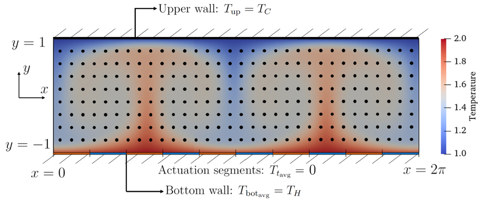
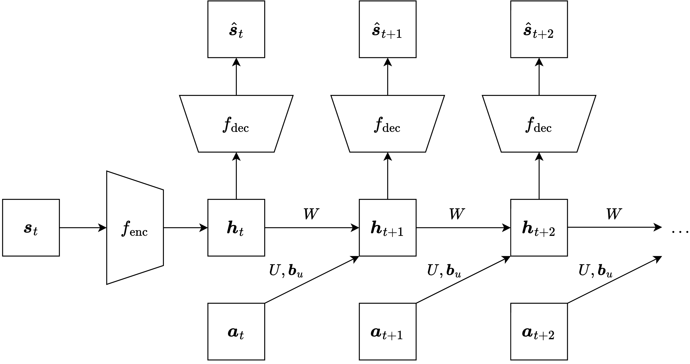
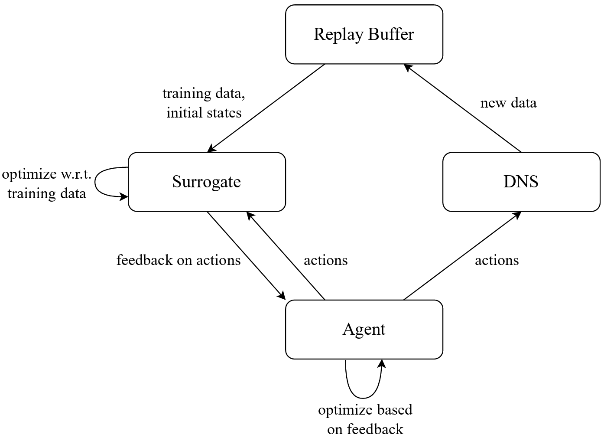
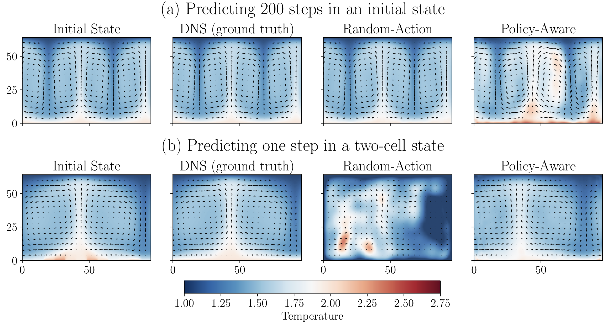
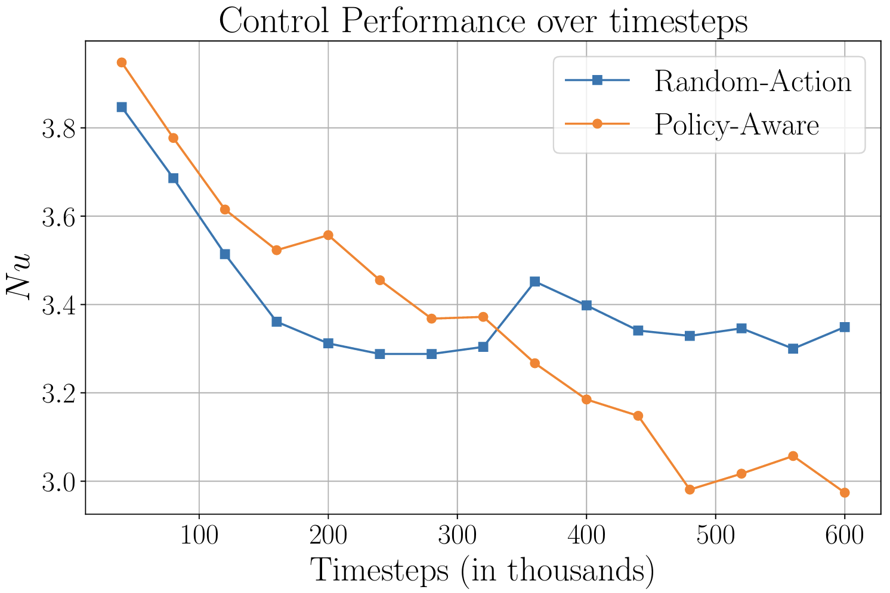

### Step 1: Self-Play and "Thinking Time"

AlphaZero plays millions of games against itself. For every single move in a game, it pauses and runs an MCTS search.

Let’s say the neural network is currently a bit weak. It looks at the board and thinks, *"Move A looks okay, maybe a 50% chance of winning."* However, MCTS doesn't just rely on the network's initial reaction. It runs thousands of simulations, looks several moves ahead, and discovers a hidden tactical blunder. After the search finishes, MCTS concludes, *"Actually, Move A is terrible. Move B is much better."*

---

### Step 2: The Tree as a Teacher (Policy Improvement)

Because MCTS actually "thought" about the future, its final decision is much smarter than the neural network's initial guess. MCTS has essentially upgraded the agent's knowledge.

We can represent the MCTS results as a probability distribution based on how many times each move was visited. Let's call this target distribution **$\pi$** (pi).

* The neural network initially guessed: `[Move A: 70%, Move B: 30%]`
* After searching, MCTS visited: `[Move A: 10%, Move B: 90%]` ($\pi$)

We save this board state along with the MCTS recommendation ($\pi$) into a massive data bank of training examples.

---

### Step 3: The Game Outcome (Value Estimation)

The agent keeps playing using MCTS until the game naturally ends. Let's say the agent eventually wins. We go back to every single board state visited during that game and label it with the final outcome: **$z = +1$** (a win).

Now, we have a perfect training dataset for our neural network consisting of three things:

1. The raw board state.
2. The smart MCTS move recommendations ($\pi$).
3. The actual, final game outcome ($z$).

---

### Step 4: Updating the Brain (The Loss Function)

At the end of the day, we take the neural network and train it on this dataset. The network outputs two things for any board state: a move probability vector $p$, and a predicted win value $v$.

We force the network to change its internal weights using a dual-purpose loss function:

$$\text{Loss} = (z - v)^2 - \pi \log p + c||\theta||^2$$

Let’s break down what this math is forcing the network to learn:

* **$(z - v)^2$ (The Value Loss):** This minimizes the difference between the network's prediction ($v$) and who actually won the game ($z$). It teaches the network to look at a board and accurately predict, *"Am I winning or losing?"*
* **$- \pi \log p$ (The Policy Loss):** This forces the network's raw intuition ($p$) to match the smart, deeply calculated MCTS search results ($\pi$). It teaches the network, *"Next time you see a similar board, don't waste time thinking about Move A. Make your initial guess look more like Move B."*
* **$c||\theta||^2$ (Regularization):** A standard machine learning penalty to prevent the network from overfitting or memorizing specific games.

---

### The Result: Exponential Growth

Once the network is updated, you start the self-play process over again.

Because the network’s raw intuition is now smarter, the next round of MCTS searches can start from a much higher baseline, allowing it to search even deeper and discover even more complex strategies. Through this continuous cycle of self-improvement, the system rapidly evolves from playing completely random moves to achieving superhuman grandmaster status without ever looking at a human game.
:::

------------------------------------------------------------------------------

# Learning a model

------------------------------------------------------------------------------

# Surrogate modeling

::: small
aka World models
:::

# Challenges \& questions regarding world modeling

::: small
- Data acquisition
  - Which data should we use?
  - How much data?
  - Collected under which actions?
- The policy changes the state distribution: $\rho_\pi$.
- Intertwining RL and model learning?
:::

# Example: Rayleigh-Bénard convection (1)

::: small
::: columns-3-5-5

::: platzhalter
{width=330px}
:::

::: fragment
{width=500px}
:::

::: fragment
![Making use of symmetries, we can replace a single large agent by many identical, smaller ones. [Source: [@PSC+24]]](images/15-model-based-RL/RBC_MARL.png){width=450px}
:::

:::
\

::: fragment
### Multi-agent RL $\rightarrow$ merging of convection cells reduces the convective heat transport

\
<!-- { width=750px .controls .autoplay .muted } -->
{ width=1200px }
:::

:::

# Example: Rayleigh-Bénard convection (2)

::: small

::: columns-2-8
::: platzhalter
::: incremental
- World model: Autoencoder plus linear model in latent space.
- Intertwined world modeling and policy learning.
- Strictly required for ensuring model performance. 
  - Otherwise, prediction before / after cell merging is impossible to predict (see bottom left).
  - Policy-aware data collection strongly improves RL performance (bottom right).
:::
:::

::: platzhalter
::: columns-5-5
::: platzhalter
{width=500px}
:::

::: platzhalter
{width=380px}
:::
:::

::: fragment
::: columns-5-5
::: platzhalter
{width=520px}
:::

::: platzhalter
{width=400px}
:::
:::
:::
:::
:::

::: footer
Results from [@Plotzki2026koopmanRL]
:::

:::

# The dreamer architecture

::: small

:::

# Data-driven MPC

::: small

:::

# Uncertainty estimation

::: small

:::

# Ensembles

::: small

:::

# References

::: { #refs }
:::
