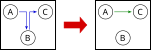
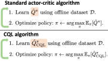

---
subtitle:    Offline Reinforcement Learning
chapter:     16
feedback:
  deck-id:  'deeprl-offline-RL'
...

------------------------------------------------------------------------------

# Content

------------------------------------------------------------------------------

# Content

::: small
- Learning policies from datasets
- Offline reinforcement learning
  - Distributional shifts
  - Overestimation bias
  - Relation to imitation learning
  - Algorithmic evolution of methods
- Policy constraint methods
  - Forward and backward KL divergence
  - RL + BC (behavior cloning)
  - advantage-weighted regression
  - Batch-constrained $Q$-learning
- Implicit $Q$-learning
- Conservative $Q$-learning
- Offline-to-online RL
- Model-based offline RL
:::

# Where are we?

::: small
| Chapter | Topic                                                        |                                  Content |
| :-----: | :----------------------------------------------------------- | :--------------------------------------- |
|         | **Basics \& tabular methods**                                |                                          |
| 1-5     | Bandits, MDPs, Dynamic Programming, Monte Carlo, TD Learning | RL basics in finite dimensions           |
|         | **Deep-learning-based methods**                              |                                          |
| 6-13    | DQN, policy gradients, actor-critic, PPO/SAC, exploration    | Deep RL from basics to modern algorithms |
|         | **Model-Based Control**                                      |                                          |
|  14-15  | Optimal \& feedback control, MPC, planning, model-based RL   | Planning \& control when we know the model | 
|         | **Advanced Topics**                                          |                                          |
|   [16]{style="color: red;"}    | [Offline reinforcement learning]{style="color: red;"}                       | [RL with a static, given dataset]{style="color: red;"} |

Table: Lecture contents
:::

------------------------------------------------------------------------------

# Learning policies from datasets

------------------------------------------------------------------------------

# Imitation learning

::: small
::: incremental
- Two of the biggest challenges in RL: 
  1. Long waiting times until we find a policy that does not fail completely.
  1. Designing good reward functions that actually make the agent do what we want it to do.
- What can we do to circumvent this?\
$\Rightarrow$ "Let's just show the agent how it's done?": learn from an expert! 
- The concept behind this is **imitation learning**.
  - Given examples from a human expert, try to derive a policy that mimicks this behavior as closely as possible ...
  - ... while generalizing to previously unseen scenarios.
:::

::: fragment
.](images/16-offline-RL/Imitation-learning.png){height=300px}
.](images/16-offline-RL/imitation-learning-hand.jpg){height=300px}
:::

:::

# Some developments in imitation learning (1)

::: small
::: columns-5-5

::: platzhalter
::: definition
### Behavior cloning (BC)

::: incremental
- Treats imitation as **supervised learning**. Inputs: expert states; Outputs/Labels: expert actions as labels
- Ignores the underlying MDP.
:::

[$\pluspoint$ [Simple to implement.]{style="color: green;"}]{.fragment}

[$\pluspoint$ [No environment interaction during training.]{style="color: green;"}]{.fragment}

[$\pluspoint$ [Very fast.]{style="color: green;"}]{.fragment}

[$\minuspoint$ [Compounding errors / covariate shift: A small error at step one puts the agent in a state it has never seen before, causing increasingly poor decisions.]{style="color: red;"}]{.fragment}

[$\minuspoint$ [Assumes i.i.d. data distribution, which is false in sequential environments.]{style="color: red;"}]{.fragment}

:::
:::

::: fragment
::: definition
### Inverse reinforcement learning (IRL)

::: incremental
- Instead of copying the actions, IRL tries to **figure out the intent** by assuming that the expert is optimizing an unobserved reward function.
- Extracts hidden reward function from the demonstrations and then runs standard RL on top.
:::

[$\pluspoint$ [Robust to compounding errors.]{style="color: green;"}]{.fragment}

[$\pluspoint$ [Reward function can transfer well even if the environment changes slightly.]{style="color: green;"}]{.fragment}

[$\minuspoint$ [Expensive inner-loop problem: RL training in each iteration.]{style="color: red;"}]{.fragment}

[$\minuspoint$ [Mathematically underdetermined (many different reward functions can explain the same expert behavior).]{style="color: red;"}]{.fragment}

:::
:::
:::
:::

# Some developments in imitation learning (2)

::: small
::: columns-4-6

::: platzhalter
::: definition
### Interactive / Human-in-the-Loop IL

::: incremental
- To fix BC's compounding errors without the cost of IRL, methods like *Dataset Aggregation* (DAgger, [@Ross2011dagger]) were introduced.
  - Runs current policy in the environment. 
  - When it makes a mistake and goes off-track, an expert intercepts and provides the correct action labels for those erroneous states. 
  - This data is added back into the training set.
:::

[$\pluspoint$ [Directly fixes covariate shift.]{style="color: green;"}]{.fragment}

[$\pluspoint$ [Forces the agent to learn how to recover from its own mistakes.]{style="color: green;"}]{.fragment}

[$\minuspoint$ [Requires an expert to be constantly available and online during training to label data.]{style="color: red;"}]{.fragment}

[$\minuspoint$ [Exhausting for humans and frequently impossible for complex setups.]{style="color: red;"}]{.fragment}

:::
:::

::: fragment
::: definition
### Generative advarsarial imitation learning (GAIL) [@Ho2016gail]

::: columns-5-5

::: incremental
- Two-player game: 
  - Generator: the agent trying to mimic the expert policy.
  - Discriminator: classifier trying to distinguish between agent and expert trajectories. 
:::

::: platzhalter
{width=430px}
:::

:::

::: incremental
- The discriminator penalizes the agent when it does not create expert-like trajectories.
:::

[$\pluspoint$ [Mimicks entire trajectories, not just single transitions as BC.]{style="color: green;"}]{.fragment}

[$\pluspoint$ [No expensive inner loop as in IRL.]{style="color: green;"}]{.fragment}

[$\pluspoint$ [Does not require an interactive expert like DAgger.]{style="color: green;"}]{.fragment}

[$\minuspoint$ [Inherits GAN instabilities (mode collapse, highly sensitive hyperparameters).]{style="color: red;"}]{.fragment}

[$\minuspoint$ [Very data hungry.]{style="color: red;"}]{.fragment}

:::
:::
:::
:::

# What if we want to do better than the data?

::: small

| Algorithm (class) | Key concept |
| :- | :- |
| Behavior cloning (BC) | Copy data (i.e., "expert" as closely as possible).
| Inverse RL (IRL) | Identify reward from data $\Rightarrow$ then standard RL.
| Dataset aggregation (DAgger) | Expert corrects faulty behavior (meaning there is an online component).
| Generative advarsarial imitation learning (GAIL) | The generative version of BC mimicking trajectories.

Table: The key ideas in imitation learning

\

::: fragment
**BUT: What if we cannot get new data, but we still want to be better than the performance of the dataset?**
:::

[Maybe the data came from]{.fragment}

::: incremental
- Experts,
- semi-experts,
- one or more past RL policies,
- a mixture of the above?
:::

::: fragment
**$\Rightarrow$ Offline reinforcement learning!**
:::
:::

------------------------------------------------------------------------------

# Offline Reinforcement Learning

------------------------------------------------------------------------------

# What is offline RL?

::: small
![Inspired by [@Levine2020offlinerltutorial].](images/16-offline-RL/Concept.svg){width=1200px .embed}

::: fragment
### Offline RL is closely related to supervised learning / data-driven AI!
:::

::: columns-5-5

::: incremental
- Data-driven AI is about learning from large datasets.\
[$\textcolor{green}{\mathbf{+}\text{ Learns about the real world from data.}}$]{.fragment}\
[$\textcolor{red}{\mathbf{-}\text{ Doesn’t try to do better than the data.}}$]{.fragment}
:::

::: incremental
- Reinforcement learning is about optimization.\
[$\textcolor{green}{\mathbf{+}\text{ Optimizes a goal with emergent behavior.}}$]{.fragment}\
[$\textcolor{red}{\mathbf{-}\text{ Doesn’t make use of real-world data.}}$]{.fragment}
:::

:::

[$\Rightarrow$ Data without optimization doesn’t allow us to solve new problems in new ways.]{.fragment}\
[$\Rightarrow$ Optimization without data is hard to apply to the real world outside of simulators.]{.fragment}\

::: fragment
::: center
**Offline reinforcement learning**: Use *prior data* for RL training, *without any interactions* with the environment!\
[**Goal**: Given a dataset $\Dc$, learn the best possible policy $\piphi$ that is *supported by the dataset*.]{.fragment}
:::
:::
:::

# Can offline RL work?

::: small

::: columns-3-2
::: incremental
1. **Find the "good stuff"** in a dataset full of good and bad behaviors.\
[**Example**, consider a dataset of various drivers:]{.fragment}\
[$\circ$ with imitation learning, we would find the average performance :thumbsdown:]{.fragment}\
[$\circ$ with offline RL, we hope to extract a policy mimicking the best driver's performance *in each situation* :thumbsup:]{.fragment}
2. **Generalization**: good behavior in one place may suggest good behavior in another place.\
[**Driving example**: we improve upon the best driver by generalizing to unseen situations.]{.fragment}
3. **“Stitching”**: parts of good behaviors can be recombined.
:::

::: platzhalter
::: fragment
::: columns-1-1

{width=150px}

::: fragment
{width=150px}
:::

:::
::: center
Generalization (Source: [D4RL](https://sites.google.com/view/d4rl-anonymous/)).
:::
\
 
:::

::: fragment
{width=400px .embed}

Stitching (Source: Sergey Levine's [CS285 lecture](https://rail.eecs.berkeley.edu/deeprlcourse/)).
:::

:::
:::

[**Takeaway**: It's not just imitation learning!]{.fragment}\
[**Intuition**: Get order from chaos.]{.fragment}

::: incremental
- On micro scales (e.g., a "straight path" from a bunch of wiggly trajectories).
- On macro scales (e.g., $A\to B \to C$ $\Rightarrow$ $A\to C$).
:::

:::

# Why is offline RL so hard?

::: small
**Fundamental problem**: counterfactual queries

::: columns-5-5-2

::: fragment
{width=500px}
:::

::: fragment
{width=500px}
:::

::: incremental
- Is this good or bad?
- How can we know if we have never seen it?
:::

[Inspired by Sergey Levine's [CS285 lecture](https://rail.eecs.berkeley.edu/deeprlcourse/).]{.footer}

:::

::: columns-5-5

::: incremental
- **Online RL** algorithms don’t have to handle this.
  - They can simply try this action and see what happens.
- **Offline RL** methods have to account for these unseen (*OOD*: "*out of distribution*") actions, 
  - ideally in a safe way ...
  - while still making use of generalization to come up with behaviors that are better than the best thing seen in the data!
:::

::: fragment
::: definition
### Example: Q-learning / Bellman update

$$ Q_\theta \gets r + \gamma \E_{s'\sim \psprimesa}\Big[\underbrace{\max_{a'\in\Ac} Q_{\bar{\theta}}(s',a')}_{\textbf{can go OOD}}\Big]  $$
:::
:::

:::

::: fragment
::: definition
### :bulb: *out of distribution* vs. *out of sample*.

::: incremental
- Out of sample $\Rightarrow$ generalization: Evaluation outside the training dataset, but on data **from the same distribution**.
- Out of distribution $\Rightarrow$ Evaluation on unseen **data from a different distribution**. [This is much harder!]{.fragment}
:::
:::
:::
:::

# Distributional shifts (1)

::: small
::: columns-5-1-5

![Inspired by [@Levine2020offlinerltutorial].](images/16-offline-RL/offline-RL.svg){width=500px}

::: platzhalter
 
:::

::: fragment
**Formally**:
[$$\begin{align*} 
\Dc &= \set{(s_i,a_i,s'_i,r_i)}_{i=1}^N \\
s &\sim \rho_\beta(s) \\
a &\sim \pi_\beta\agivenb{a}{s} \quad \fragment{ \text{(generally unknown)} } \\
s' &\sim \psprimesa
\end{align*}$$]{.math-incremental}
:::

:::

::: fragment
::: columns-5-5
.](images/16-offline-RL/Concept-wo-sampling.svg){width=320px .embed}

::: fragment
$$\text{RL objective:}\quad \max_\phi \sum_{t=0}^T \Expsub{\gamma^t r_t}{s\sim\rho_\phi, a\sim \piphi\agivenb{\cdot}{s}}$$

::: incremental
- "Model" is valid under $\pi_\beta$...
- **not** under $\piphi$!
  - "Model" could be the $Q$-function $Q_{\piphi}$,
  - or the dynamics $p_\phi\agivenb{s'}{s,a}$.
:::
:::

:::
:::

:::

# Distributional shifts (2)

::: small
::: columns-6-4

::: platzhalter
### Example: Empirical risk minimization (maximum likelihood)

$$\theta = \arg\min_{\hat\theta} \Expsub{\cbracket{f_{\hat{\theta}}(x) - y}^2}{x\sim p(x), y\sim p\agivenb{y}{x}}$$

[**Question**: Given some $x^*$, is $f(x^*)$ correct?]{.fragment}

::: incremental
- $$\Expsub{\cbracket{f_{\hat{\theta}}(x) - y}^2}{x\sim p(x), y\sim p\agivenb{y}{x}} \quad \text{is low}$$
[$\Rightarrow$ probably yes.]{.fragment}
- $$\Expsub{\cbracket{f_{\hat{\theta}}(x) - y}^2}{x\sim \bar{p}(x), y\sim p\agivenb{y}{x}} \quad \text{is generally not, if} ~ \bar{p}(x) \neq p(x)$$
[$\Rightarrow$ probably no.]{.fragment}
- What if $x^* \sim p(x)$?
  - Not necessarily... 
  - but neural networks tend to generalize well!
:::

:::

::: platzhalter
::: fragment
::: definition

### What if we pick the maximizing $x^*$?

[$$ x^* = \arg\max_x f_\theta(x) $$]{.fragment}

::: fragment
![Inspired by [@Levine2020offlinerltutorial].](images/16-offline-RL/argmax-distribution.svg){width=400px .embed}
:::
:::
:::

::: fragment
:bulb: This is exactly what we're exploiting in adversarial learning!

![Adversarial example [@Goodfellow2015adversarial].](images/16-offline-RL/adversarial-panda.png){width=400px}

:::
:::
:::
:::

# Overestimation bias in offline RL

::: small
::: columns-6-4

::: platzhalter
### $Q$-learning and $Q$-function actor-critic

[$$\begin{align*} 
\phi &= \arg\min_{\hat{\theta}} \Expsub{\norm{Q_\theta(s,a)-y}^2}{s\sim\rho_\beta,a\sim \textcolor{red}{\pi_\beta\agivenb{\cdot}{s}}}, \\
y_i &= r_i + \gamma \Expsub{Q_\theta(s'_i,a')}{s'_i\sim\rho_\beta,a'\sim \textcolor{blue}{\piphi\agivenb{\cdot}{s'_i}}}
\end{align*}$$]{.math-incremental}

::: incremental
- Trying to find the best policy: **we want** $\textcolor{blue}{\piphi\agivenb{a}{s}} \neq \textcolor{red}{\pi_\beta\agivenb{a}{s}}$! 
- But we only have $s'_i$ for $s_i, a_i$ from our offline dataset.
- **Even worse**: We're actually picking an *adversarial example*, $$\phi = \arg\max_{\hat{\phi}} \Expsub{Q_\theta(s,a)}{a\sim \pi_{\hat\phi}\agivenb{\cdot}{s}}.$$
:::
:::

::: fragment
::: platzhalter
::: definition
### Example: SAC offline RL [@Kumar2019stabilizing]

::: columns-1-1

{width=250px}

::: fragment
{width=250px}
:::

:::

:::
:::
:::
:::

::: columns-6-4

::: platzhalter
::: fragment
### Model-based RL
:::

::: fragment
$$f = \arg\min_{\hat f} \Expsub{\norm{f(s,a)-s'}_2^2}{s\sim\rho_\beta,a\sim\textcolor{red}{\pi_\beta\agivenb{\cdot}{s}}, s'\sim \psprimesa} $$
:::

::: incremental
- Probably large: $\Expsub{\norm{f(s,a)-s'}_2^2}{s\sim\rho_\beta,a\sim\textcolor{blue}{\pi_\phi\agivenb{\cdot}{s}}, s'\sim \psprimesa}.$
- **Even worse**: Pick $\piphi$ to *maximize the reward* under $f$!
:::
:::

![Adversarial example [@Goodfellow2015adversarial].](images/16-offline-RL/adversarial-panda.png){width=400px}

:::
:::

# Algorithmic evolution of methods

::: small
The following strategies (or classes of approaches) are the most common ones today:

1. **Policy constraint methods**: Stay close to the data, e.g.,
$$ \KLdiv{\piphi\agivenb{\cdot}{s}}{\pi_\beta\agivenb{\cdot}{s}}\leq \epsilon. $$

::: fragment
2. **Implicit $Q$-learning**: Implicitly define constraints to avoid behavior policy $\pi_\beta$. 
:::

::: fragment
3. **Value-regularization \& pessimism**: Go anywhere, but assume what you haven't seen is dangerous $\Rightarrow$ avoid overestimation.

![Inspired by [@Levine2020offlinerltutorial].](images/16-offline-RL/argmax-distribution.svg){width=400px}
:::
\

::: fragment
::: center
**Common theme: "Maximize return while staying close to the dataset.**
:::
:::
:::

------------------------------------------------------------------------------

# Policy constraint methods

------------------------------------------------------------------------------

# Adding constraints

::: small
::: incremental
- Simplest approach to avoid overestimation: constrain the distance between behavior policy $\pi_\beta$ and the learned policy $\piphi$.
- Remember the KL divergence?
$$ \KLdiv{\pi_\beta\agivenb{\cdot}{s}}{\pi_\phi\agivenb{\cdot}{s}} = \Expsub{\log\frac{\pi_\beta\agivenb{a}{s}}{\pi_\phi\agivenb{a}{s}}}{a\sim\pi_\beta\agivenb{\cdot}{s}} \fragment{ = \Expsub{\log\pi_\beta\agivenb{a}{s} - \log\pi_\phi\agivenb{a}{s} }{a\sim\pi_\beta\agivenb{\cdot}{s}}. } $$
- Constraining the distance yields a constrained optimization problem:
$$\begin{equation} \phi \gets \arg\max_\phi \Expsub{Q(s,a)}{s\sim\Dc,a\sim\pi\agivenb{\cdot}{s}} \qquad\text{s.t.}\qquad \KLdiv{\pi_\beta\agivenb{\cdot}{s}}{\pi_\phi\agivenb{\cdot}{s}}\leq \epsilon. \label{eq:OFF_constrained_policy} \end{equation}$$
  - Where have we seen this before? [$\Rightarrow$ Natural policy gradient!]{.fragment}
:::

::: columns-6-5

::: incremental
- Via [Lagrange multipliers](https://en.wikipedia.org/wiki/Lagrange_multiplier): additional term in the actor loss function:
$$\phi \gets \arg\max_\phi \Expsub{\Expsub{Q(s,a)}{a\sim\pi_\beta\agivenb{\cdot}{s}} - \lambda \KLdiv{\pi_\beta\agivenb{\cdot}{s}}{\pi_\phi\agivenb{\cdot}{s}}}{s\sim\Dc}$$
[$$\begin{equation} \Rightarrow\quad \phi \gets \arg\max_\phi \Expsub{Q(s,a) + \lambda \log\piphi\agivenb{a}{s} + \mathsf{const}}{s\sim\Dc,a\sim\pi_\beta\agivenb{\cdot}{s}}. \label{eq:OFF_ACBC} \end{equation}$$]{.fragment}
  - To solve \eqref{eq:OFF_constrained_policy}, we need to solve for both $\phi$ **and** the Lagrange multiplier $\lambda$.
  - Alternative: treat $\lambda$ as a hyperparameter.
:::

::: fragment
::: definition
### AC + BC methods

Methods of the type \eqref{eq:OFF_ACBC} are often termed "AC + BC":\
*actor-critic plus [behavior cloning](https://en.wikipedia.org/wiki/Imitation_learning#Behavior_Cloning),*\
as the term $\log\piphi\agivenb{a}{s}$ is typical in BC methods. Popular examples:\
$\bullet$ TD3 + BC, $\quad\bullet$ DDPG + BC,\
$\bullet$ SAC + BC.
:::
:::

:::

:::

# Forward KL versus reverse KL

::: small
::: incremental
- Remember: the KL divergence is not a real [metric](https://en.wikipedia.org/wiki/Metric_space#Definition). [In particular, it violates the symmetry condition, i.e.,
$$\begin{align*} 
\KLdiv{\piphi\agivenb{\cdot}{s}}{\pi_\beta\agivenb{\cdot}{s}} = \Expsub{\log\frac{\piphi\agivenb{a}{s}}{\pi_\beta\agivenb{a}{s}}}{a\sim\piphi\agivenb{\cdot}{s}} \neq \Expsub{\log\frac{\pi_\beta\agivenb{a}{s}}{\piphi\agivenb{a}{s}}}{a\sim\pi_\beta\agivenb{\cdot}{s}} = \KLdiv{\pi_\beta\agivenb{\cdot}{s}}{\pi_\phi\agivenb{\cdot}{s}}.
\end{align*}$$]{.fragment}
:::

::: columns-7-5

::: incremental
- **Forward KL** a.k.a. "mode covering":
$$\begin{align*}
\KLdiv{\pi_\beta\agivenb{\cdot}{s}}{\piphi\agivenb{\cdot}{s}} = \Expsub{\log\pi_\beta\agivenb{a}{s} - \log\piphi\agivenb{a}{s} }{a\sim\pi_\beta\agivenb{\cdot}{s}}.
\end{align*}$$
- **Reverse KL** a.k.a. "mode seeking":
$$\begin{align*}
\KLdiv{\piphi\agivenb{\cdot}{s}}{\pi_\beta\agivenb{\cdot}{s}} &= \Expsub{\log\piphi\agivenb{a}{s} - \log\pi_\beta\agivenb{a}{s} }{a\sim\piphi\agivenb{\cdot}{s}}\\
&=-\Expsub{\log\pi_\beta\agivenb{a}{s} }{a\sim\piphi\agivenb{\cdot}{s}} - \Hc(\piphi\agivenb{\cdot}{s}).
\end{align*}$$
:::

::: fragment
\
).](images/16-offline-RL/KL-mode-seeking-covering.svg){width=450px .embed}
:::

:::

::: columns-5-5

::: incremental
- Mode covering: What happens if for some $(s,a)$,\
[Mode covering:]{style="color: white;"} $\pi_\phi\agivenb{a}{s}=0$ while $\pi_\beta\agivenb{a}{s}>0$?
  - KL divergence :boom: [$\Rightarrow$ Need to cover everything from the dataset!]{.fragment}
- Mode covering: What happens if for some $(s,a)$,\
[Mode covering:]{style="color: white;"} $\pi_\beta\agivenb{a}{s}=0$ while $\pi_\phi\agivenb{a}{s}>0$?
  - KL divergence :boom: [$\Rightarrow$ Need to ensure $\pi_\phi$ stays within a subset of $\pi_\beta$.]{.fragment}
:::

::: fragment
::: definition
### Which one is desirable?

::: incremental
- Mode seeking is what we actually want.
- Extract the best behavior from a dataset.
- However, it is harder to realize, which is why we often use mode covering in practice, see *AC + BC*.
:::
:::
:::

:::

:::

# How to learn $\pi_\beta$ if we don't know it {menu-title="How to learn the behavior policy if we don't know it"}

::: small
::: incremental
- Constraining the KL divergence requires knowledge of the behavior policy $\pi_\beta$.
- What can we do if we don't know it? [$\Rightarrow$ extract it from the dataset!]{.fragment}
:::

::: fragment
::: definition
### Behavior cloning.

::: incremental
- Given a dataset $\Dc=\set{(s_i,a_i)}_{i=1}^N$, we have a probabilistic supervised learning problem.
- Find the probability distribution $\pi_\psi\agivenb{a}{s}$ giving rise to $\Dc$.
- In other words maximize the likelihood of $a_i$ given $s_i$ over $\Dc$.
- Approaches:
:::

::: fragment
::: columns-1-20-25

::: platzhalter
 
:::

::: fragment
$\circ$ Variational autoencoder (VAE) [@Kingma2013vae]:\
.](images/16-offline-RL/VAE.png){width=400px}
:::

::: platzhalter
$\circ$ Gaussian policy: $\pi_\psi\agivenb{a}{s} = \Nc(\mu_\psi(s), \sigma^2_\psi(s))$.

::: fragment
$\circ$ Generative modeling\
<!--  / [Steven Gong's blog](https://stevengong.co/notes/Flow-Matching).](images/16-offline-RL/Diffusion.png){width=600px} -->
.](images/16-offline-RL/Diffusion2.png){width=600px}

:::
:::

:::
:::
:::
:::
:::

# Alternative to KL divergence

::: small

::: incremental
- The KL divergence is a natural choice for the policy constraint, but not necessarily the best one:\
:::

::: columns-1-25-20

::: platzhalter
 
:::

::: platzhalter
[$\pluspoint$ [Mathematically tractable / closed-form solutions.]{style="color: green;"}]{.fragment}\
[$\pluspoint$ [Direct penalization of OOD actions.]{style="color: green;"}]{.fragment}\
[$\pluspoint$ [Smooth/soft regularization with tunable hyperparameter $\lambda$.]{style="color: green;"}]{.fragment}\
:::

::: platzhalter
[$\minuspoint$ [Asymmetry (forward KL vs. reverse KL).]{style="color: red;"}]{.fragment}\
[$\minuspoint$ [Overly conservative in unseen regions.]{style="color: red;"}]{.fragment}\
[$\minuspoint$ [Sensitive to behavior policy estimation.]{style="color: red;"}]{.fragment}
:::

:::

::: incremental
- More generally, **we do not even want the two distributions to match**!
- We just want to find the best behavior supported by the dataset.
- Alternative: Minimizing [Maximum Mean Discrepancy (MMD)](https://en.wikipedia.org/wiki/Kernel_embedding_of_distributions#Measuring_distance_between_distributions), see [@Kumar2019stabilizing]:
$$MMD^2(\pi, \beta) = \Exp{k(a_\pi, a_\pi')} - 2\Exp{k(a_\pi, a_\beta)} + \Exp{k(a_\beta, a_\beta')}.$$
  - $k$ is a kernel function for implicitly evaluating inner products between feature vectors: $k(a_\pi, a_\beta) = \psi(a_\pi)^\top \psi(a_\beta)$.
  - $\mathbb{E}[k(a_\pi, a_\pi')]$: How close to each other are the actions generated by our policy?
  - $- 2\mathbb{E}[k(a_\pi, a_\beta)]$: How close are our actions to the dataset actions?
  - $\mathbb{E}[k(a_\beta, a_\beta')]$: The internal variance of the dataset actions (a constant baseline).
:::

::: columns-1-20-25

::: platzhalter
 
:::

::: platzhalter
[$\pluspoint$ [Bypasses densitiy estimation / works on samples .]{style="color: green;"}]{.fragment}\
[$\pluspoint$ [No infinite penalty on unsupported actions.]{style="color: green;"}]{.fragment}\
[$\pluspoint$ [Allows for multimodel generalization.]{style="color: green;"}]{.fragment}\
:::

::: platzhalter
[$\minuspoint$ [Computationally expensive.]{style="color: red;"}]{.fragment}\
[$\minuspoint$ [High sample variance / hard to tune the kernel bandwidth.]{style="color: red;"}]{.fragment}\
[$\minuspoint$ [Curse of dimensionality.]{style="color: red;"}]{.fragment}
:::

:::

:::

# The BRAC framework

::: small
::: definition
### Unification of various approaches in the BRAC framework

In [@Wu2019brac], the authors present the *Behavior Regularized Actor-Critic (BRAC)*. 

::: incremental
- This can be seen as a unification of many methods.
- The constraint can be enforced in two different ways
  - In the policy approximation (*policy regularization*)
  - In the value or $Q$ function approximation (*value regularization*, coming up next)
- The constraint is defined as a general distance metric.
  - The KL divergence and MMD are then special cases.
- Additional design choice: How to approximate the expectation.
:::
:::
:::

------------------------------------------------------------------------------

# Value-regularization \& pessimism

------------------------------------------------------------------------------

# Conservative $Q$-learning {menu-title="Conservative Q-learning"}

::: small
::: incremental
- We have seen that overestimation of $Q$-values outside the offline dataset $\Dc$ is the main source of failure for offline RL.
- *Policy constraint methods* (previously): Penalize deviations of the policy from the behavior policy $\pi_\beta$.
- Alternative: Penalize the $Q$-function outside $\Dc$ [$\Rightarrow$ **value regularization**!]{.fragment}
- This is what **conservative $Q$-learning** (CQL, [@Kumar2020conservativeqlearning]) does:\
[$\Rightarrow$ introduce a lower bound (a pessimistic approximation) of the actual $Q$-function.]{.fragment}
- We can then simply use the pessimistic $Q$-function in $Q$-learning or Actor-Critic methods.
:::

::: fragment
::: columns-7-3

.](images/16-offline-RL/CQL-conservative.png){width=700px}

::: fragment
{width=300px}
:::
:::
:::

::: fragment
### Question: How can we achieve this?
:::
:::

# The idea behind CQL

::: small
::: columns-5-5
::: incremental
- How do we reduce the $Q$-function estimate outside our dataset?
  - Just reduce $Q$ *everywhere*...
  - then increase it again in the *region supported by the dataset*!
- The $Q$-learning step with TD($0$): [:bulb: We here use an on-policy estimator, as is used in continuous control algorithms such as SAC. A $Q$-learning version were we maximize over actions in the target $y$ is equally possible [@Kumar2020conservativeqlearning].]{.footer .fragment}
$$\theta \gets \arg\min_\theta \frac{1}{2}\E_{s,a,r,s'\sim\Dc} \Big[\Big(\underbrace{r + \gamma \Expsub{Q_{\bar{\theta}}(s,a)}{a'\sim\pi_\phi\agivenb{\cdot}{s'}}}_{y} - Q_\theta(s,a)\Big)^2\Big].$$
- Extend target $y$ by a conservative penalty term:
$$ \hat{y} = y + \alpha \Expsub{\max_\mu \Expsub{Q_\theta(s,a)}{a\sim\mu\agivenb{\cdot}{s}}}{s\sim\Dc}. $$
  - We need to find a policy $\mu$ that maximally reduces the estimate of $Q_\theta$.
  - Resulting $Q$-function lower-bounds the true $Q$-function point-wise.
- This raises two issues:
  1. We don't want a reduction on the parts supported by $\Dc$.
  2. Computation of $\mu$ is an expensive optimization problem in itself!
:::

::: fragment
::: definition
### The CQL($H$) framework [@Kumar2020conservativeqlearning]

::: incremental
- Reduce $Q$ everywhere, boost it on the dataset:
$$ \begin{align*} \hat{y} = y + \alpha \E_{s\sim\Dc} \Big[&\max_\mu \Expsub{Q_\theta(s,a)}{a\sim\mu\agivenb{\cdot}{s}}\\
&- \Expsub{Q_\theta(s,a)}{a\sim\pi_\beta\agivenb{\cdot}{s}}\Big]. \end{align*} $$
- Add KL-divergence regularizer to $\Rightarrow$ closed-form solution (similar to SAC):
$$ \begin{align*} \hat{y} = y + \alpha \E_{s\sim\Dc} \Big[&\log \cbracket{\int \exp(Q_\theta(s, a)) \dint{a}}\\
&- \Expsub{Q_\theta(s,a)}{a\sim\pi_\beta\agivenb{\cdot}{s}}\Big]. \end{align*} $$
<!-- $$\hat{y} = y +  \alpha \cdot \Expsub{\log \cbracket{\int \exp(Q_\theta(s, a)) \dint{a}} - \Expsub{Q_\theta(s, a)}{a \sim \mathcal{D}}}{s \sim \mathcal{D}}.$$ -->
- Lower bound on expected value: $$ \Expsub{Q_\theta(s,a)}{a \sim \pi} \le V^\pi(s).$$
:::

:::
:::
:::
:::

# Algorithmic implementation of CQL($H$) {menu-title="Algorithmic implementation of CQL(H)"}

::: small
::: incremental
- Penalty term on our $Q$-function approximation:
$$ \hat{y} = y + \alpha \Expsub{\log \cbracket{\int \exp(Q_\theta(s, a)) \dint{a}} - \Expsub{Q_\theta(s,a)}{a\sim\pi_\beta\agivenb{\cdot}{s}}}{s\sim\Dc}. $$ 
- Challenge: Monte Carlo sampling of the integral over $\Ac$!
- Uniform sampling will likely miss the large-$Q$ sections [$\Rightarrow$ We need a suitable approximation from data.]{.fragment}
- Proposal in [@Kumar2020conservativeqlearning]: A mixture of three sets
  1. **Uniform actions ($a \sim U(\Ac)$)**: ensures exploratino of the entire action space; reduces overestimation peaks in distant regions of the action space.
  2. **Current policy actions ($a \sim \pi_\phi\agivenb{\cdot}{s}$)**: exploits the highest peaks in the current $Q$-function $\Rightarrow$ directly targets overestimations $\pi_\phi$ is trying to exploit.
  3. **Next-state policy actions ($a \sim \pi_\phi\agivenb{\cdot}{s'}$)**: In the Bellman equation, the target value is calculated using the policy's action at the next state ($a' \sim \pi(s')$). If $Q(s', a')$ is overestimated, that error propagates back to $Q(s, a)$ via the TD update.
- We would have to perform importance sampling to go from $\int \exp(Q_\theta(s, a)) \dint{a} \approx \frac{1}{N} \sum_{i=1}^N \exp(Q_\theta(s, a_i))$ to this sum of three terms. [However, we ignore this in practice:]{.fragment}
[$$ \begin{align*} I(s) &= \log\cbracket{\frac{1}{3}\cbracket{\Expsub{\exp{Q_\theta(s, a)}}{a \sim U(\Ac)} + \Expsub{\exp{Q_\theta(s, a)}}{a \sim \pi_\phi\agivenb{\cdot}{s}} + \Expsub{\exp{Q_\theta(s, a)}}{a \sim \pi_\phi\agivenb{\cdot}{s'}}}}, \\
\hat{y} &= y + \alpha \Expsub{I(s) - \Expsub{Q_\theta(s,a)}{a\sim\pi_\beta\agivenb{\cdot}{s}}}{s,s'\sim\Dc}. \end{align*} $$]{.math-incremental} 
:::
:::

# Example: Complex gripping tasks

::: small
.](https://bair.berkeley.edu/blog/2020/12/07/offline/){ width=1200px height=550px .print .iframe }
<!-- .](websites/BAIR_OfflineRL.html){ width=1200px height=550px .print .iframe } -->
:::

------------------------------------------------------------------------------

# Implicit $Q$-learning {menu-title="Implicit Q-learning"}

------------------------------------------------------------------------------

# Advantage-weighted regression

::: small
[@Peng2019advantageweightedregression]
:::

# Implicit $Q$-learning (IQL)

::: small

:::

<!-- ------------------------------------------------------------------------------

# Model-based offline RL

------------------------------------------------------------------------------

# Learning a model, then RL

::: small

::: -->

<!-- ------------------------------------------------------------------------------

# Offline-to-online RL

------------------------------------------------------------------------------

# A straightforward engineering approach

::: small
[@Ball2023offlineRL]
::: -->

<!-- ------------------------------------------------------------------------------

# Benchmarking

------------------------------------------------------------------------------

# The D4RL benchmark

::: small
[https://sites.google.com/view/d4rl-anonymous/](https://sites.google.com/view/d4rl-anonymous/).
::: -->

# Summary / what we have learned

::: small
- Offline RL: Learn policies from a fixed, unchangeable dataset $\Dc$
- Main challenges:
  - Distribution shift between learned policy $\pi$ and dataset policy $\pi_\beta$
  - Overestimation of $Q$ outisde the dataset $\Dc$
- Approaches to address this:
  - Constrain the policy $\Rightarrow$ Explicit policy constraint methods (e.g., AC + BC)
  - Pessimistically modify the $Q$-function outside $\Dc$ $\Rightarrow$ Conservative $Q$-learning
  - Avoid out-of-distribution actions altogether $\Rightarrow$ Implicit $Q$-learning
:::

# References

::: { #refs }
:::
