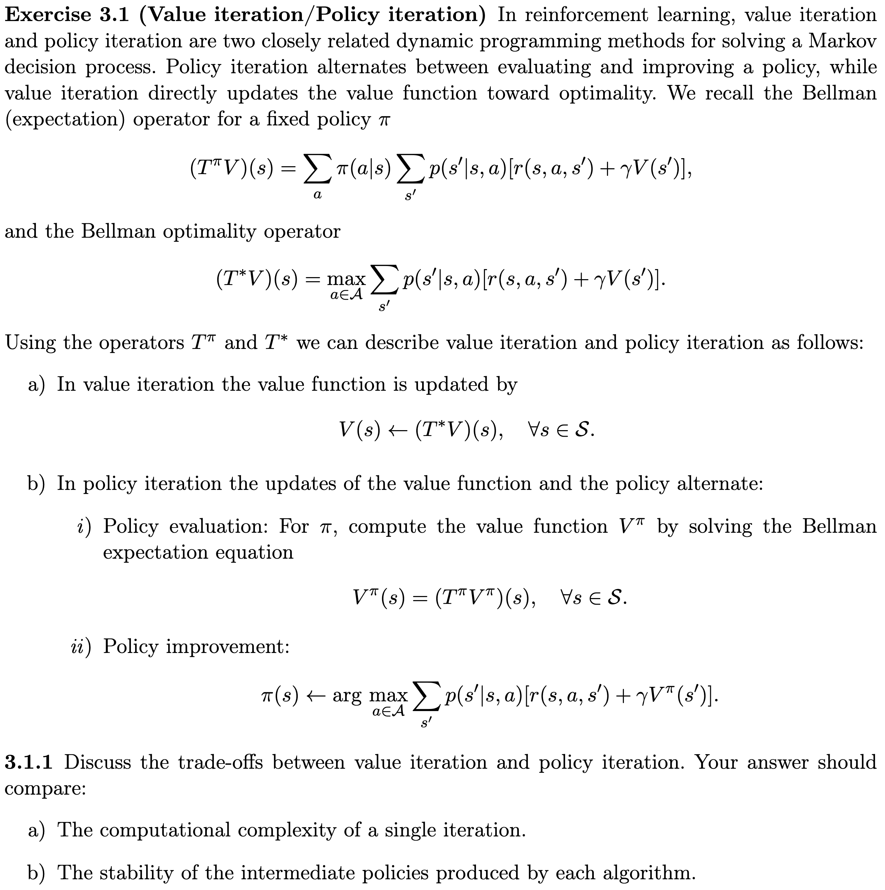

---
subtitle:    Exam preparation
chapter:     90
feedback:
  deck-id:  'deeprl-exam'
...

# Timing and grading

::: small
::: columns-5-5

::: platzhalter
::: definition
### Duration: 25 minutes

::: incremental
- 20 minutes for Lecture and Exercises.
    - Divided roughly 50-50.
    - Slightly larger weight on the lecture than on the exercises.
- 5 minutes related to your programming exercises. 
:::
:::

::: fragment
::: definition
### Timing will be strictly enforced

::: incremental
- We start with questions right away.
- The number of questions may vary slightly,
    - Goal: 8-12 questions during the first 20 minutes,
    - plus **at least** 2 questions regarding the programming tasks.
- We stop after exactly 25 minutes.
- 5 minutes of internal discussion and grading.
:::
:::
:::

::: definition
### What can I bring to the exam?

[**No** additional material allowed!]{style="color: red;"}
:::

:::

::: fragment
::: definition
### Grading criteria

::: incremental
- The quality of the answers.
- How much support was required from our side.
- How quickly you were able to answer.
    - It's not a contest for speed, 
    - but if you need to think about a question for several minutes, this reduces the grade. 
:::

::: fragment
**Questions regarding the programming tasks:**
:::

::: incremental
- Goal: find out whether you understand what you did.
- We will ask you for reasons why you solved certain parts in the way you did.
- If it is clear that you know the code and know what is going on, everything is great!
- If you created the code using an LLM without further thinking about it, you will likely have trouble answering these questions.
:::

:::
:::

:::

:::

# Sample questions related to the lecture

::: small
::: incremental
1. Name the central quantities of interest in RL. ([*General*]{style="color: blue;"})
1. What are the core ingredients of an MDP? ([*MDPs*]{style="color: blue;"})
1. What is the policy evaluation step/algorithm in DP? ([*Dynamic Programming*]{style="color: blue;"})
1. How does the policy evaluation procedure work for Monte Carlo sampling (in the tabular case)? ([*Monte Carlo methods*]{style="color: blue;"})
1. Explain the SARSA algorithm. ([*TD learning / $Q$-learning*]{style="color: blue;"})
1. When using bootstrapping / TD learning in value function approximation, where does the notion of semi-gradients come from? ([*Value function approximation \& deep $Q$-learning*]{style="color: blue;"})
1. What’s the additional term that shows up in the expectation when we
compute the policy gradient? ([*Policy gradients*]{style="color: blue;"})
1. How can you interpret the policy gradient with the advantage function as baseline? What do the two terms $\nabla \log \pi(a|s)$ and $A(s,a)$ represent? ([*Policy gradients*]{style="color: blue;"})
1. What are the challenges in TRPO and how does PPO solve them? ([*Adv. algorithms*]{style="color: blue;"})
1. Which methods to enhance exploration do you know? Can you explain the core mechanics? ([*Exploration*]{style="color: blue;"})
1. How does model predictive control (MPC) work? What is its relation to RL? ([*Model-based control*]{style="color: blue;"})
1. Explain the core ideas of Monte Carlo Tree Search (MCTS). ([*Model-based control*]{style="color: blue;"})
1. What is the general working principle behind conservative $Q$-learning? ([*Offline RL*]{style="color: blue;"})
:::
:::

# Sample question related to the exercises

::: small
{width=400px}
:::

# Sample questions related to the programming tasks

::: small
The following are rather generic, but you can expect questions related to your submissions along these lines:

::: incremental
1. How did you select the hyperparameters of your implementation?
1. In terms of computations, what is the bottleneck in the code?
:::
\

::: fragment
::: definition
### Can I bring my code / do I have to know my code?

- You are not allowed to bring anything to the exam!
- You do not have to know your code. We will have a laptop to present it to you during the exam, if required.
:::
:::

:::

